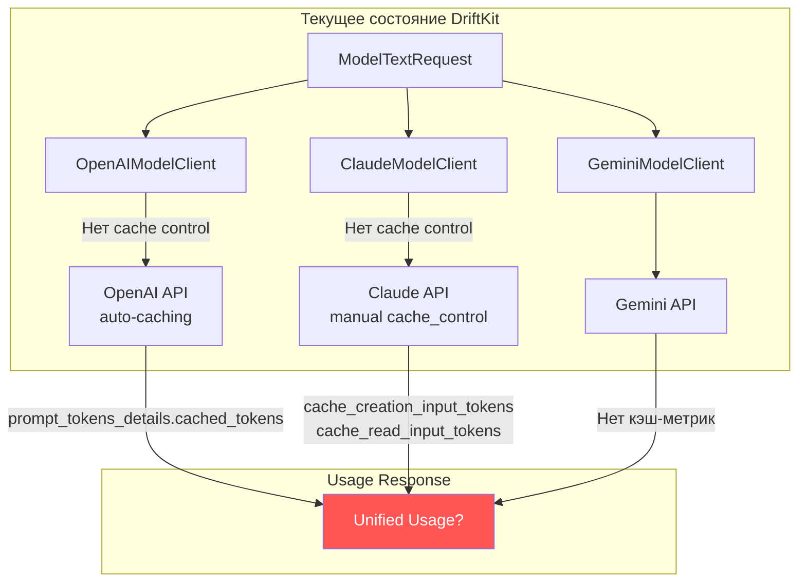
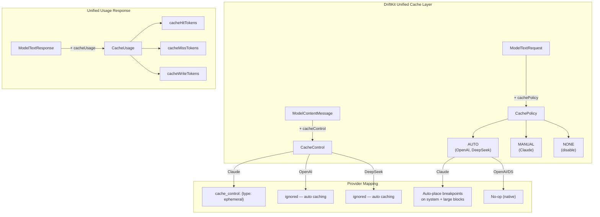
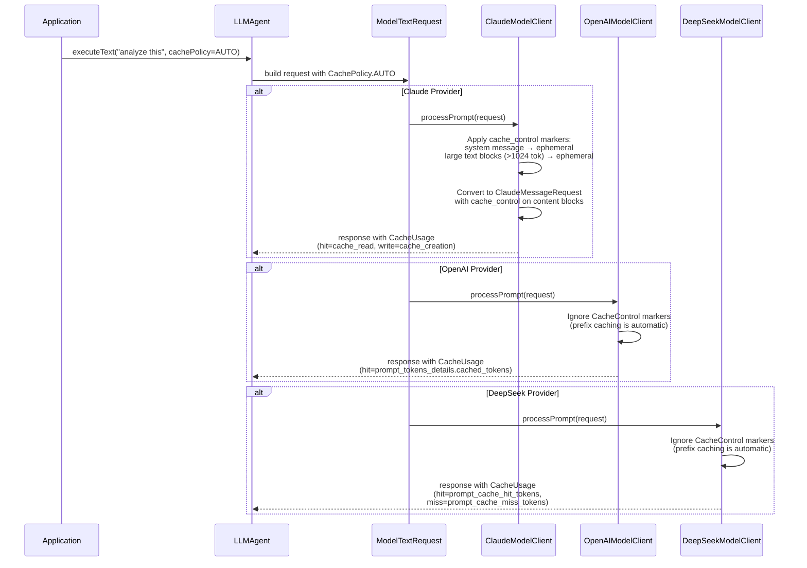
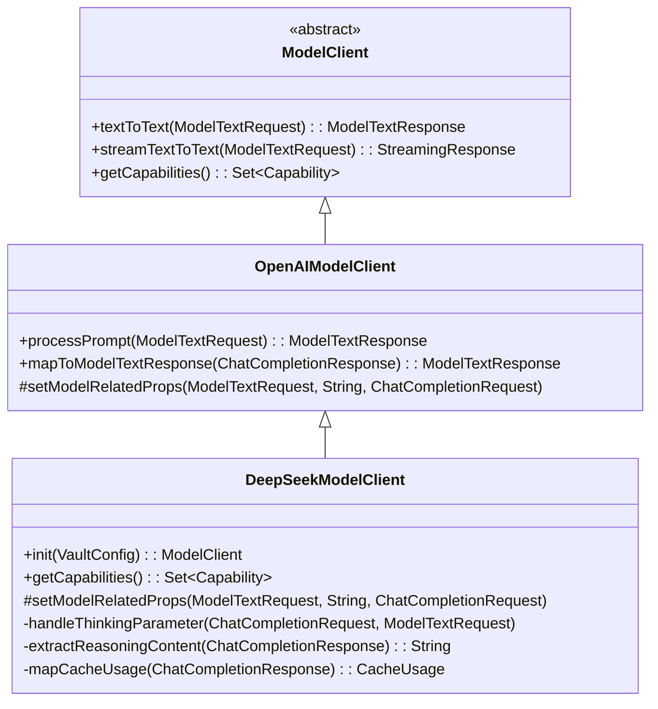
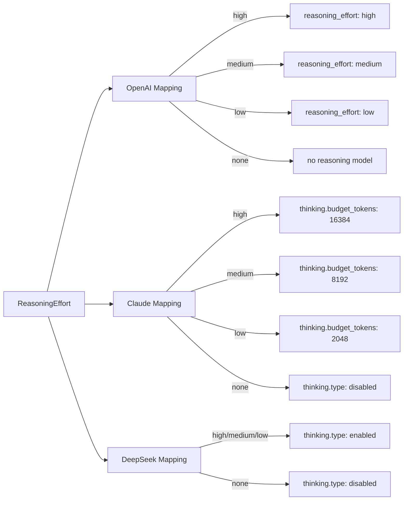
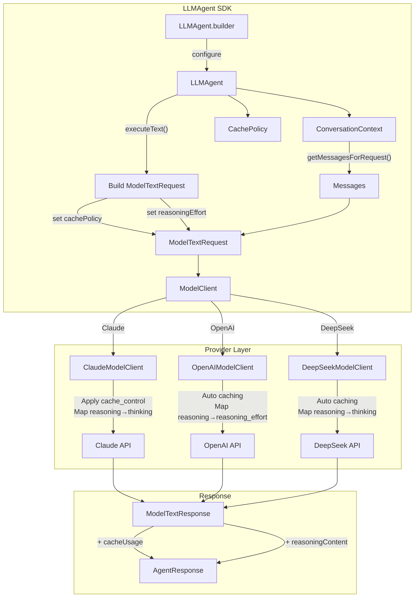

# DeepSeek API & Unified Cache Control Analysis

> Анализ DeepSeek API (V3.2 / Reasoner), управления reasoning, совместимости с OpenAI клиентом, и проектирование унифицированного кэширования сообщений для Claude, GPT и DeepSeek в рамках DriftKit LLMAgent SDK.

---

## 1. DeepSeek API Overview (V3.2, актуально на апрель 2026)

### 1.1 Модели

| API Model Name | Underlying Model | Режим | Контекст | Max Output |
|---|---|---|---|---|
| `deepseek-chat` | DeepSeek-V3.2 | Non-thinking | 128K | 8K (4K default) |
| `deepseek-reasoner` | DeepSeek-V3.2 | Thinking (CoT) | 128K | 64K (32K default) |

Обе модели — один и тот же V3.2, отличается только режим reasoning.

### 1.2 API Совместимость с OpenAI

DeepSeek полностью совместим с OpenAI API форматом. Различия минимальны:

| Параметр | OpenAI | DeepSeek |
|---|---|---|
| Base URL | `https://api.openai.com/v1` | `https://api.deepseek.com` |
| Auth header | `Authorization: Bearer <key>` | `Authorization: Bearer <key>` (идентично) |
| Endpoint | `POST /v1/chat/completions` | `POST /chat/completions` (или `/v1/chat/completions`) |
| Models | `gpt-4o`, `o3-mini`, etc. | `deepseek-chat`, `deepseek-reasoner` |
| Reasoning output | `message.content` | `message.reasoning_content` (отдельное поле) |
| Cache tracking | `prompt_tokens_details.cached_tokens` | `usage.prompt_cache_hit_tokens` + `prompt_cache_miss_tokens` |
| Thinking control | `reasoning_effort` | `thinking: {"type": "enabled"/"disabled"}` |

**Вывод**: Текущий `OpenAIModelClient` из DriftKit может работать с DeepSeek "из коробки" при смене `baseUrl` и `model`. Нужны доработки только для reasoning и кэш-метрик.

### 1.3 Управление Reasoning

#### Включение через модель:
```json
{
  "model": "deepseek-reasoner",
  "messages": [{"role": "user", "content": "Solve: 9.11 vs 9.8"}]
}
```

#### Включение через параметр thinking:
```json
{
  "model": "deepseek-chat",
  "messages": [...],
  "thinking": {"type": "enabled"}
}
```

#### Формат ответа с reasoning:
```json
{
  "choices": [{
    "message": {
      "role": "assistant",
      "reasoning_content": "Let me compare... 9.8 > 9.11",
      "content": "9.8 is greater than 9.11."
    }
  }],
  "usage": {
    "prompt_tokens": 15,
    "completion_tokens": 120,
    "total_tokens": 135,
    "prompt_cache_hit_tokens": 0,
    "prompt_cache_miss_tokens": 15,
    "completion_tokens_details": {
      "reasoning_tokens": 85
    }
  }
}
```

#### Ограничения в Thinking Mode:
- `temperature`, `top_p`, `presence_penalty`, `frequency_penalty` — **игнорируются**
- `logprobs` — вызывает ошибку
- `reasoning_content` **НЕЛЬЗЯ** включать в multi-turn messages — вернёт 400

#### Сравнение Reasoning Control:

| Провайдер | Механизм | Budget Control |
|---|---|---|
| **OpenAI** (o3/o4-mini) | `reasoning_effort: "low"/"medium"/"high"` | Да |
| **Claude** | `thinking: {"type": "enabled", "budget_tokens": N}` | Да, точный |
| **DeepSeek** | `thinking: {"type": "enabled"/"disabled"}` | Нет (только `max_tokens`) |

### 1.4 Prefix Caching (DeepSeek)

- **Включён по умолчанию** — никаких маркеров не нужно
- Disk-based KV cache, работает по совпадению **префикса** запроса
- Минимум 64 токенов для кэширования
- Best-effort — не гарантирует 100% hit rate

**Tracking в ответе:**
```json
{
  "usage": {
    "prompt_tokens": 1500,
    "prompt_cache_hit_tokens": 1280,
    "prompt_cache_miss_tokens": 220
  }
}
```

### 1.5 Ценообразование

| Model | Input (Cache Hit) | Input (Cache Miss) | Output |
|---|---|---|---|
| `deepseek-chat` | $0.07/M | $0.27/M | $1.10/M |
| `deepseek-reasoner` | $0.14/M | $0.55/M | $2.19/M |

Cache hit = **~75% дешевле** miss.

---

## 2. Кэширование сообщений: сравнение провайдеров

### 2.1 Архитектурная диаграмма текущего состояния



### 2.2 Claude: Ручное управление кэшем

Claude требует **явных маркеров** `cache_control` на контент-блоках:

```json
{
  "model": "claude-sonnet-4-20250514",
  "max_tokens": 1024,
  "system": [
    {
      "type": "text",
      "text": "You are a helpful assistant...",
      "cache_control": {"type": "ephemeral"}
    }
  ],
  "messages": [
    {
      "role": "user",
      "content": [
        {
          "type": "text",
          "text": "<large document...>",
          "cache_control": {"type": "ephemeral"}
        },
        {
          "type": "text",
          "text": "Summarize the above."
        }
      ]
    }
  ]
}
```

**Особенности:**
- `cache_control: {"type": "ephemeral"}` — единственный тип, TTL 5 минут
- Минимум 1024 токенов (Sonnet/Opus), 2048 (Haiku)
- Cache write: +25% к стоимости input
- Cache read: -90% от стоимости input
- Поддерживает несколько breakpoints

**Usage:**
```json
{
  "usage": {
    "input_tokens": 50,
    "cache_creation_input_tokens": 5000,
    "cache_read_input_tokens": 0,
    "output_tokens": 200
  }
}
```

### 2.3 OpenAI: Автоматическое кэширование

- **Полностью автоматическое** — никаких параметров
- Кэшируются **префиксы от 1024+ токенов**
- Cache read: -50% (vs Claude -90%)
- Cache write: бесплатно (vs Claude +25%)

**Usage:**
```json
{
  "usage": {
    "prompt_tokens": 1500,
    "completion_tokens": 200,
    "prompt_tokens_details": {
      "cached_tokens": 1024
    }
  }
}
```

### 2.4 DeepSeek: Автоматическое кэширование

- **Автоматическое**, аналогично OpenAI
- Кэшируются **префиксы от 64+ токенов**
- Cache read: -75% от стоимости

**Usage:**
```json
{
  "usage": {
    "prompt_tokens": 1500,
    "prompt_cache_hit_tokens": 1280,
    "prompt_cache_miss_tokens": 220
  }
}
```

### 2.5 Сводная таблица кэширования

| Характеристика | Claude | OpenAI | DeepSeek |
|---|---|---|---|
| Управление | Ручное (`cache_control`) | Автоматическое | Автоматическое |
| Min токенов | 1024-2048 | 1024 | 64 |
| TTL | 5 мин (refresh on hit) | ~5-10 мин | ? |
| Cache write cost | +25% | 0% | 0% |
| Cache read discount | -90% | -50% | -75% |
| Usage field (hit) | `cache_read_input_tokens` | `prompt_tokens_details.cached_tokens` | `prompt_cache_hit_tokens` |
| Usage field (write) | `cache_creation_input_tokens` | - | - |
| Usage field (miss) | - | - | `prompt_cache_miss_tokens` |

---

## 3. Проектирование: Унифицированное кэширование в DriftKit

### 3.1 Общая архитектура доработок



### 3.2 Новые доменные объекты

#### CacheControl — маркер кэширования на уровне контент-блока

```java
@Data
@Builder
@NoArgsConstructor
@AllArgsConstructor
public class CacheControl {
    /**
     * Cache breakpoint type.
     * Currently only "ephemeral" is supported (Claude).
     * For OpenAI/DeepSeek this is a hint for auto-placement optimization.
     */
    private CacheType type;
    
    public enum CacheType {
        EPHEMERAL,  // Claude: explicit breakpoint, TTL 5 min
        AUTO        // Provider decides (OpenAI/DeepSeek prefix matching)
    }
    
    public static CacheControl ephemeral() {
        return new CacheControl(CacheType.EPHEMERAL);
    }
}
```

#### CachePolicy — стратегия кэширования на уровне запроса

```java
public enum CachePolicy {
    /**
     * No caching hints. Provider may still cache automatically.
     */
    NONE,
    
    /**
     * Automatic caching. For Claude: auto-place breakpoints on system
     * messages and large content blocks. For OpenAI/DeepSeek: no-op (native).
     */
    AUTO,
    
    /**
     * Manual caching. Use CacheControl markers on individual content blocks.
     * Only effective for Claude. OpenAI/DeepSeek ignore.
     */
    MANUAL
}
```

#### CacheUsage — унифицированные метрики кэша

```java
@Data
@Builder
@NoArgsConstructor
@AllArgsConstructor
public class CacheUsage {
    /** Tokens served from cache (cheap) */
    private Integer cacheHitTokens;
    
    /** Tokens NOT found in cache (full price) */
    private Integer cacheMissTokens;
    
    /** Tokens written to cache (Claude: +25% cost) */
    private Integer cacheWriteTokens;
    
    /** Cache hit ratio (0.0 - 1.0) */
    public double getHitRatio() {
        int total = (cacheHitTokens != null ? cacheHitTokens : 0) 
                  + (cacheMissTokens != null ? cacheMissTokens : 0);
        return total > 0 ? (double) cacheHitTokens / total : 0.0;
    }
}
```

### 3.3 Изменения в существующих классах

#### ModelContentMessage — добавить CacheControl

```java
@Data
public class ModelContentMessage {
    private List<ModelContentElement> content;
    private Role role;
    private String name;
    
    @Data
    public static class ModelContentElement {
        private MessageType type;
        private ImageData image;
        private String text;
        
        // NEW: Cache control marker for this content block
        private CacheControl cacheControl;
    }
}
```

#### ModelTextRequest — добавить CachePolicy

```java
@Data
public class ModelTextRequest {
    private List<ModelContentMessage> messages;
    private Double temperature;
    private String model;
    private ReasoningEffort reasoningEffort;
    // ...existing fields...
    
    // NEW: Cache policy for this request
    private CachePolicy cachePolicy;
}
```

#### ModelTextResponse.Usage — расширить кэш-метриками

```java
@Data
public static class Usage {
    private Integer promptTokens;
    private Integer completionTokens;
    private Integer totalTokens;
    
    // NEW: Unified cache metrics
    private CacheUsage cacheUsage;
    
    // NEW: Reasoning token details
    private Integer reasoningTokens;
}
```

### 3.4 Маппинг по провайдерам



---

## 4. DeepSeek клиент: стратегия реализации

### 4.1 Вариант A: Наследование от OpenAIModelClient

Поскольку API DeepSeek совместим с OpenAI, самый эффективный путь — наследовать `OpenAIModelClient`:



### 4.2 Ключевые доработки DeepSeekModelClient

```java
public class DeepSeekModelClient extends OpenAIModelClient {
    
    public static final String DEEPSEEK_CHAT = "deepseek-chat";
    public static final String DEEPSEEK_REASONER = "deepseek-reasoner";
    public static final String DEEPSEEK_PREFIX = "deepseek";
    
    private static final String DEFAULT_BASE_URL = "https://api.deepseek.com";
    
    @Override
    public ModelClient init(VaultConfig config) {
        // Override base URL default to DeepSeek
        if (config.getBaseUrl() == null) {
            config.setBaseUrl(DEFAULT_BASE_URL);
        }
        return super.init(config);
    }
    
    @Override
    protected void setModelRelatedProps(ModelTextRequest prompt, 
                                        String model, 
                                        ChatCompletionRequest req) {
        // DeepSeek thinking control via "thinking" parameter
        // instead of OpenAI's "reasoning_effort"
        if (prompt.getReasoningEffort() != null 
            && prompt.getReasoningEffort() != ReasoningEffort.none) {
            // Enable thinking mode
            req.setThinking(new ThinkingConfig("enabled"));
            req.setTemperature(null); // ignored in thinking mode
            req.setReasoningEffort(null); // not used by DeepSeek
        }
    }
}
```

### 4.3 Расширение ChatCompletionResponse для DeepSeek

```java
// Добавить в ChatCompletionResponse.Message:
@JsonProperty("reasoning_content")
private String reasoningContent;

// Добавить в Usage или создать DeepSeekUsage:
@JsonProperty("prompt_cache_hit_tokens")
private Integer promptCacheHitTokens;

@JsonProperty("prompt_cache_miss_tokens")
private Integer promptCacheMissTokens;

@JsonProperty("completion_tokens_details")
private CompletionTokensDetails completionTokensDetails;

@Data
public static class CompletionTokensDetails {
    @JsonProperty("reasoning_tokens")
    private Integer reasoningTokens;
}
```

---

## 5. Reasoning: унифицированное управление

### 5.1 Текущее состояние в DriftKit

```java
// ModelTextRequest.java — уже есть:
public enum ReasoningEffort {
    medium, high, low, none, minimal, dynamic
}
```

Используется только в `OpenAIModelClient.setModelRelatedProps()` для o-моделей.

### 5.2 Расширение для всех провайдеров



#### Маппинг ReasoningEffort → Provider-specific:

| ReasoningEffort | OpenAI (o3/o4-mini) | Claude | DeepSeek |
|---|---|---|---|
| `none` | Обычная модель | `thinking: disabled` | `thinking: disabled` |
| `minimal` | `reasoning_effort: "low"` | `budget_tokens: 1024` | `thinking: enabled` |
| `low` | `reasoning_effort: "low"` | `budget_tokens: 2048` | `thinking: enabled` |
| `medium` | `reasoning_effort: "medium"` | `budget_tokens: 8192` | `thinking: enabled` |
| `high` | `reasoning_effort: "high"` | `budget_tokens: 16384` | `thinking: enabled` |
| `dynamic` | `reasoning_effort: "high"` | `budget_tokens: 32768` | `thinking: enabled` |

### 5.3 Расширение ModelTextResponse для reasoning

```java
@Data
public class ModelMessage {
    private Role role;
    private String content;
    private List<ToolCall> toolCalls;
    
    // NEW: Reasoning/thinking content (DeepSeek, Claude extended thinking)
    private String reasoningContent;
}
```

---

## 6. Интеграция в LLMAgent SDK

### 6.1 Расширение Builder API

```java
LLMAgent agent = LLMAgent.builder()
    .modelClient(deepSeekClient)
    .name("AnalysisAgent")
    .systemMessage("You are an expert analyst...")
    .reasoningEffort(ReasoningEffort.high)      // уже есть
    .cachePolicy(CachePolicy.AUTO)               // NEW
    .build();

AgentResponse<String> response = agent.executeText("Analyze this dataset...");

// Доступ к reasoning и cache metrics:
response.getReasoningContent();    // CoT если есть
response.getCacheUsage();          // hit/miss/write tokens
response.getCacheUsage().getHitRatio(); // 0.0-1.0
```

### 6.2 Архитектура LLMAgent с кэшированием



### 6.3 AgentResponse — расширение

```java
@Data
@Builder
public class AgentResponse<T> {
    private T result;
    private ModelTextResponse rawResponse;
    
    // NEW
    private String reasoningContent;
    private CacheUsage cacheUsage;
    private Integer reasoningTokens;
    
    // Convenience
    public boolean hasReasoning() {
        return StringUtils.isNotBlank(reasoningContent);
    }
    
    public boolean hasCacheHit() {
        return cacheUsage != null 
            && cacheUsage.getCacheHitTokens() != null 
            && cacheUsage.getCacheHitTokens() > 0;
    }
}
```

### 6.4 Пример использования с multi-turn и кэшированием

```java
// Создание агента с ручным кэш-контролем (Claude)
LLMAgent agent = LLMAgent.builder()
    .modelClient(claudeClient)
    .systemMessage("You are a code reviewer. Be thorough.")
    .cachePolicy(CachePolicy.MANUAL)
    .build();

// Первый запрос: большой документ с маркером кэширования
ModelContentMessage docMessage = ModelContentMessage.builder()
    .role(Role.user)
    .content(List.of(
        ModelContentElement.builder()
            .type(MessageType.text)
            .text(largeCodebase)  // 50K tokens
            .cacheControl(CacheControl.ephemeral())  // Cache this!
            .build(),
        ModelContentElement.builder()
            .type(MessageType.text)
            .text("Review this code for security issues.")
            .build()
    ))
    .build();

AgentResponse<String> review = agent.executeWithMessages(List.of(docMessage));
// cache_creation_input_tokens: 50000 (first call)

// Второй запрос: тот же документ, другой вопрос
// cache_read_input_tokens: 50000 (90% cheaper!)
AgentResponse<String> review2 = agent.executeWithMessages(List.of(
    docMessage,  // Same doc → cache hit
    ModelContentMessage.user("Now check for performance issues.")
));
```

---

## 7. Реализация Claude Cache Control в ClaudeModelClient

### 7.1 Изменения в ClaudeContent

```java
@Data
@Builder
public class ClaudeContent {
    private String type;
    private String text;
    private ImageSource source;
    // ... existing fields ...
    
    // NEW: Cache control breakpoint
    @JsonProperty("cache_control")
    private Map<String, String> cacheControl;
    
    public static ClaudeContent textWithCache(String text) {
        return ClaudeContent.builder()
            .type("text")
            .text(text)
            .cacheControl(Map.of("type", "ephemeral"))
            .build();
    }
}
```

### 7.2 Изменения в ClaudeMessageRequest

Для поддержки `cache_control` на system message, `system` меняется с `String` на массив контент-блоков:

```java
@Data
public class ClaudeMessageRequest {
    // CHANGE: system from String to List<ClaudeContent>
    @JsonProperty("system")
    private Object system;  // String или List<ClaudeContent>
    
    // Helper для system с кэшированием
    public void setSystemWithCache(String systemPrompt) {
        this.system = List.of(
            ClaudeContent.builder()
                .type("text")
                .text(systemPrompt)
                .cacheControl(Map.of("type", "ephemeral"))
                .build()
        );
    }
}
```

### 7.3 Auto-placement алгоритм для Claude (CachePolicy.AUTO)

```java
private void applyCacheBreakpoints(ClaudeMessageRequest request) {
    // 1. Always cache system message if present and > 1024 tokens
    if (request.getSystem() instanceof String systemText) {
        if (estimateTokens(systemText) >= 1024) {
            request.setSystemWithCache(systemText);
        }
    }
    
    // 2. Cache the last large text block in messages (> 1024 tokens)
    //    This enables prefix caching for multi-turn conversations
    List<ClaudeMessage> messages = request.getMessages();
    for (int i = messages.size() - 1; i >= 0; i--) {
        ClaudeMessage msg = messages.get(i);
        for (ClaudeContent content : msg.getContent()) {
            if ("text".equals(content.getType()) 
                && estimateTokens(content.getText()) >= 1024
                && content.getCacheControl() == null) {
                content.setCacheControl(Map.of("type", "ephemeral"));
                return; // Only one auto-breakpoint
            }
        }
    }
}
```

---

## 8. Полная диаграмма доработок

### 8.1 Новые и изменённые классы

```mermaid
classDiagram
    direction TB
    
    class CacheControl {
        <<NEW>>
        -CacheType type
        +ephemeral(): CacheControl
    }
    
    class CachePolicy {
        <<NEW enum>>
        NONE
        AUTO
        MANUAL
    }
    
    class CacheUsage {
        <<NEW>>
        -Integer cacheHitTokens
        -Integer cacheMissTokens
        -Integer cacheWriteTokens
        +getHitRatio(): double
    }
    
    class ModelContentElement {
        <<MODIFIED>>
        -MessageType type
        -String text
        -ImageData image
        -CacheControl cacheControl %%NEW%%
    }
    
    class ModelTextRequest {
        <<MODIFIED>>
        -List~ModelContentMessage~ messages
        -ReasoningEffort reasoningEffort
        -CachePolicy cachePolicy %%NEW%%
    }
    
    class Usage {
        <<MODIFIED>>
        -Integer promptTokens
        -Integer completionTokens
        -Integer totalTokens
        -CacheUsage cacheUsage %%NEW%%
        -Integer reasoningTokens %%NEW%%
    }
    
    class ModelMessage {
        <<MODIFIED>>
        -Role role
        -String content
        -List~ToolCall~ toolCalls
        -String reasoningContent %%NEW%%
    }
    
    class DeepSeekModelClient {
        <<NEW>>
        +init(VaultConfig): ModelClient
        #setModelRelatedProps()
        -mapCacheUsage(): CacheUsage
        -extractReasoningContent(): String
    }
    
    class AgentResponse {
        <<MODIFIED>>
        -T result
        -String reasoningContent %%NEW%%
        -CacheUsage cacheUsage %%NEW%%
    }
    
    class ClaudeContent {
        <<MODIFIED>>
        -Map cacheControl %%NEW%%
        +textWithCache(String): ClaudeContent
    }
    
    ModelTextRequest --> CachePolicy
    ModelContentElement --> CacheControl
    Usage --> CacheUsage
    AgentResponse --> CacheUsage
    DeepSeekModelClient --|> OpenAIModelClient
```



### 8.2 Модульная структура

```
driftkit-common/
  domain/client/
    CacheControl.java          # NEW
    CachePolicy.java           # NEW  
    CacheUsage.java            # NEW
    ModelContentMessage.java   # MODIFY: +cacheControl на элементе
    ModelTextRequest.java      # MODIFY: +cachePolicy
    ModelTextResponse.java     # MODIFY: Usage+cacheUsage, +reasoningTokens
    ModelMessage.java          # MODIFY: +reasoningContent

driftkit-clients/
  driftkit-clients-openai/
    domain/
      ChatCompletionResponse.java  # MODIFY: +reasoning_content, +cache fields
    client/
      OpenAIModelClient.java       # MODIFY: map CacheUsage from response
  
  driftkit-clients-claude/
    domain/
      ClaudeContent.java           # MODIFY: +cache_control
      ClaudeMessageRequest.java    # MODIFY: system→Object for array support
    client/
      ClaudeModelClient.java       # MODIFY: apply cache breakpoints
  
  driftkit-clients-deepseek/       # NEW MODULE
    domain/
      DeepSeekThinkingConfig.java
    client/
      DeepSeekModelClient.java
      DeepSeekClientFactory.java

driftkit-workflows/
  driftkit-workflow-engine-agents/
    agent/
      LLMAgent.java                # MODIFY: +cachePolicy, pass to request
      AgentResponse.java           # MODIFY: +reasoningContent, +cacheUsage
```

---

## 9. План реализации

### Фаза 1: Core Domain (driftkit-common)
1. Создать `CacheControl`, `CachePolicy`, `CacheUsage`
2. Расширить `ModelContentElement` + `cacheControl`
3. Расширить `ModelTextRequest` + `cachePolicy`
4. Расширить `Usage` + `cacheUsage`, `reasoningTokens`
5. Расширить `ModelMessage` + `reasoningContent`

### Фаза 2: Claude Cache Support (driftkit-clients-claude)
1. Добавить `cache_control` в `ClaudeContent`
2. Изменить `ClaudeMessageRequest.system` для поддержки массива
3. Реализовать auto-placement алгоритм в `ClaudeModelClient`
4. Маппинг `CacheUsage` из `ClaudeUsage`

### Фаза 3: DeepSeek Client (driftkit-clients-deepseek)
1. Создать модуль `driftkit-clients-deepseek`
2. `DeepSeekModelClient extends OpenAIModelClient`
3. Override для `thinking` parameter вместо `reasoning_effort`
4. Маппинг `reasoning_content` и кэш-метрик
5. Обработка multi-turn (strip `reasoning_content`)

### Фаза 4: OpenAI Cache Metrics
1. Расширить `ChatCompletionResponse` для `prompt_tokens_details`
2. Маппинг `cached_tokens` → `CacheUsage`

### Фаза 5: LLMAgent SDK
1. Добавить `cachePolicy` в builder
2. Пробрасывать в `ModelTextRequest`
3. Расширить `AgentResponse` + `reasoningContent`, `cacheUsage`

---

## 10. Выводы

1. **DeepSeek V3.2 полностью совместим с OpenAI API** — можно реализовать через наследование `OpenAIModelClient` с минимальными override-ами для `thinking` и кэш-метрик.

2. **Кэширование принципиально различается**: Claude требует явных маркеров (`cache_control`), OpenAI и DeepSeek кэшируют автоматически. Унификация через `CachePolicy` + `CacheControl` покрывает оба сценария.

3. **Reasoning управление различается**: OpenAI использует `reasoning_effort`, Claude — `thinking.budget_tokens`, DeepSeek — `thinking.type` (без budget control). Существующий `ReasoningEffort` enum уже покрывает это, нужен только маппинг по провайдерам.

4. **Минимальные изменения в core**: 3 новых класса + 5 модификаций существующих. Обратная совместимость полная — все новые поля nullable.

5. **Оптимизация затрат**: При правильном кэшировании system prompts и больших контекстов экономия может составлять 50-90% на input tokens в зависимости от провайдера.
