# DriftKit Context Engineering Platform — Architecture, Analysis & Roadmap

## Table of Contents

**Part I — Current State**
1. [System Architecture](#1-system-architecture)
2. [Data Model](#2-data-model)
3. [Key Flows](#3-key-flows)
4. [Testing & Evaluation System](#4-testing--evaluation-system)
5. [Agent & Workflow Engine](#5-agent--workflow-engine)
6. [Client Caching System](#6-client-caching-system)
7. [Tracing & Analytics](#7-tracing--analytics)

**Part II — Analysis**
8. [Industry Comparison](#8-industry-comparison)
9. [Problems & Gap Analysis](#9-problems--gap-analysis)

**Part III — Target Architecture**
10. [Prompt Lifecycle & Testing Pipeline](#10-prompt-lifecycle--testing-pipeline)
11. [Agent Pipeline Testing](#11-agent-pipeline-testing)
12. [Prompt Playground & Experimentation](#12-prompt-playground--experimentation)
13. [Environments & Deployment](#13-environments--deployment)
14. [Observability & Cost Tracking](#14-observability--cost-tracking)
15. [Enhanced Data Model](#15-enhanced-data-model)
16. [API Design](#16-api-design)
17. [UI/UX Design](#17-uiux-design)

**Part IV — Implementation**
18. [Implementation Roadmap](#18-implementation-roadmap)

---

# Part I — Current State

## 1. System Architecture

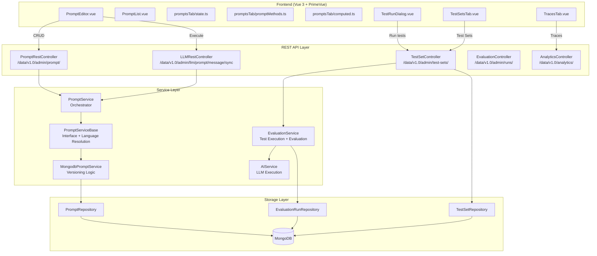
```mermaid
graph TB
    subgraph Frontend["Frontend (Vue 3 + PrimeVue)"]
        UI[PromptEditor.vue]
        List[PromptList.vue]
        State[promptsTab/state.ts]
        Methods[promptsTab/promptMethods.ts]
        Computed[promptsTab/computed.ts]
        TestRunUI[TestRunDialog.vue]
        TracesUI[TracesTab.vue]
        TestSetsUI[TestSetsTab.vue]
    end

    subgraph API["REST API Layer"]
        PC[PromptRestController<br>/data/v1.0/admin/prompt/]
        LC[LLMRestController<br>/data/v1.0/admin/llm/prompt/message/sync]
        TC[TestSetController<br>/data/v1.0/admin/test-sets/]
        EC[EvaluationController<br>/data/v1.0/admin/runs/]
        AC[AnalyticsController<br>/data/v1.0/analytics/]
    end

    subgraph Service["Service Layer"]
        PS[PromptService<br>Orchestrator]
        PSB[PromptServiceBase<br>Interface + Language Resolution]
        MPS[MongodbPromptService<br>Versioning Logic]
        ES[EvaluationService<br>Test Execution + Evaluation]
        AIS[AIService<br>LLM Execution]
    end

    subgraph Storage["Storage Layer"]
        PR[PromptRepository]
        TSR[TestSetRepository]
        ERR[EvaluationRunRepository]
        DB[(MongoDB)]
    end

    UI -->|"CRUD"| PC
    UI -->|"Execute"| LC
    TestRunUI -->|"Run tests"| TC
    TracesUI -->|"Traces"| AC
    TestSetsUI -->|"Test Sets"| TC

    PC --> PS --> PSB --> MPS --> PR --> DB
    LC --> PS
    TC --> ES --> AIS
    ES --> ERR --> DB
    TC --> TSR --> DB
```

### Component Responsibilities

| Component | File | Role |
|-----------|------|------|
| PromptEditor | `PromptEditor.vue` | Form: edit message, system message, variables, settings |
| PromptList | `PromptList.vue` | Table: virtual folders, search, bulk operations |
| TestRunDialog | `TestRunDialog.vue` | Modal: create test run from current prompt |
| PromptRestController | `PromptRestController.java` | REST endpoints for prompt CRUD |
| LLMRestController | `LLMRestController.java` | Prompt execution endpoint |
| EvaluationService | `EvaluationService.java` | Test set execution, evaluation, result tracking |
| PromptServiceBase | `PromptServiceBase.java` | Interface + language resolution default methods |
| MongodbPromptService | `MongodbPromptService.java` | MongoDB CRUD + versioning state machine |

---

## 2. Data Model

### Prompt Entity

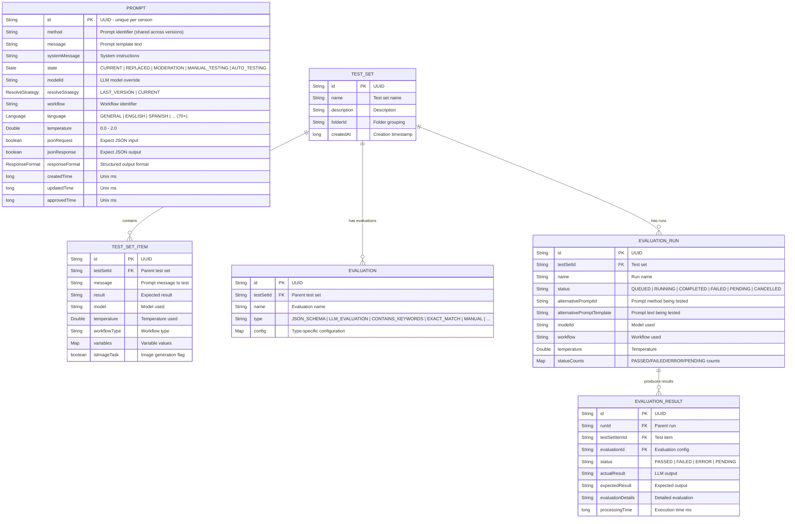
```mermaid
erDiagram
    PROMPT {
        String id PK "UUID - unique per version"
        String method "Prompt identifier (shared across versions)"
        String message "Prompt template text"
        String systemMessage "System instructions"
        State state "CURRENT | REPLACED | MODERATION | MANUAL_TESTING | AUTO_TESTING"
        String modelId "LLM model override"
        ResolveStrategy resolveStrategy "LAST_VERSION | CURRENT"
        String workflow "Workflow identifier"
        Language language "GENERAL | ENGLISH | SPANISH | ... (70+)"
        Double temperature "0.0 - 2.0"
        boolean jsonRequest "Expect JSON input"
        boolean jsonResponse "Expect JSON output"
        ResponseFormat responseFormat "Structured output format"
        long createdTime "Unix ms"
        long updatedTime "Unix ms"
        long approvedTime "Unix ms"
    }

    TEST_SET {
        String id PK "UUID"
        String name "Test set name"
        String description "Description"
        String folderId "Folder grouping"
        long createdAt "Creation timestamp"
    }

    TEST_SET_ITEM {
        String id PK "UUID"
        String testSetId FK "Parent test set"
        String message "Prompt message to test"
        String result "Expected result"
        String model "Model used"
        Double temperature "Temperature used"
        String workflowType "Workflow type"
        Map variables "Variable values"
        boolean isImageTask "Image generation flag"
    }

    EVALUATION {
        String id PK "UUID"
        String testSetId FK "Parent test set"
        String name "Evaluation name"
        String type "JSON_SCHEMA | LLM_EVALUATION | CONTAINS_KEYWORDS | EXACT_MATCH | MANUAL | ..."
        Map config "Type-specific configuration"
    }

    EVALUATION_RUN {
        String id PK "UUID"
        String testSetId FK "Test set"
        String name "Run name"
        String status "QUEUED | RUNNING | COMPLETED | FAILED | PENDING | CANCELLED"
        String alternativePromptId "Prompt method being tested"
        String alternativePromptTemplate "Prompt text being tested"
        String modelId "Model used"
        String workflow "Workflow used"
        Double temperature "Temperature"
        Map statusCounts "PASSED/FAILED/ERROR/PENDING counts"
    }

    EVALUATION_RESULT {
        String id PK "UUID"
        String runId FK "Parent run"
        String testSetItemId FK "Test item"
        String evaluationId FK "Evaluation config"
        String status "PASSED | FAILED | ERROR | PENDING"
        String actualResult "LLM output"
        String expectedResult "Expected output"
        String evaluationDetails "Detailed evaluation"
        long processingTime "Execution time ms"
    }

    TEST_SET ||--o{ TEST_SET_ITEM : "contains"
    TEST_SET ||--o{ EVALUATION : "has evaluations"
    TEST_SET ||--o{ EVALUATION_RUN : "has runs"
    EVALUATION_RUN ||--o{ EVALUATION_RESULT : "produces results"
```

### Naming: method vs promptId vs id

| Where | Field | Meaning | Example |
|-------|-------|---------|---------|
| Backend `Prompt.java` | `method` | Logical identifier (all versions) | `reports/sales/monthly` |
| Backend `Prompt.java` | `id` | UUID of specific version | `a1b2c3d4-uuid` |
| Frontend form | `promptId` | Same as `method` | `reports/sales/monthly` |
| API `DELETE /prompt/{id}` | UUID, not method | `a1b2c3d4-uuid` |

**`method`** = canonical name shared across all versions and languages.

### Versioning

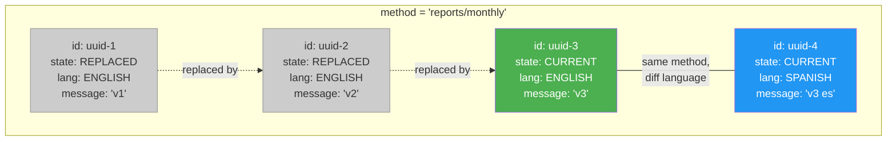
```mermaid
graph TD
    subgraph "method = 'reports/monthly'"
        V1["id: uuid-1<br>state: REPLACED<br>lang: ENGLISH<br>message: 'v1'"]
        V2["id: uuid-2<br>state: REPLACED<br>lang: ENGLISH<br>message: 'v2'"]
        V3["id: uuid-3<br>state: CURRENT<br>lang: ENGLISH<br>message: 'v3'"]
        V4["id: uuid-4<br>state: CURRENT<br>lang: SPANISH<br>message: 'v3 es'"]
    end

    V1 -.->|"replaced by"| V2 -.->|"replaced by"| V3
    V3 ---|"same method,<br>diff language"| V4

    style V1 fill:#ccc,stroke:#999
    style V2 fill:#ccc,stroke:#999
    style V3 fill:#4CAF50,color:white
    style V4 fill:#2196F3,color:white
```

One `CURRENT` per `(method, language)` pair. Old versions become `REPLACED`. No version numbers — only timestamps.

### Virtual Folders

Folders are **NOT entities**. Computed from `/` in `method`: `reports/sales/monthly` → folder `reports` → folder `sales` → prompt `monthly`. No folder CRUD.

---

## 3. Key Flows

### Save Flow

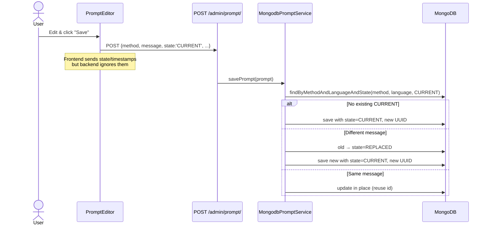
```mermaid
sequenceDiagram
    actor User
    participant Editor as PromptEditor
    participant API as POST /admin/prompt/
    participant Service as MongodbPromptService
    participant DB as MongoDB

    User->>Editor: Edit & click "Save"
    Editor->>API: POST {method, message, state:'CURRENT', ...}

    Note over Editor: Frontend sends state/timestamps<br>but backend ignores them

    API->>Service: savePrompt(prompt)
    Service->>DB: findByMethodAndLanguageAndState(method, language, CURRENT)

    alt No existing CURRENT
        Service->>DB: save with state=CURRENT, new UUID
    else Different message
        Service->>DB: old → state=REPLACED
        Service->>DB: save new with state=CURRENT, new UUID
    else Same message
        Service->>DB: update in place (reuse id)
    end
```

### Execute Flow

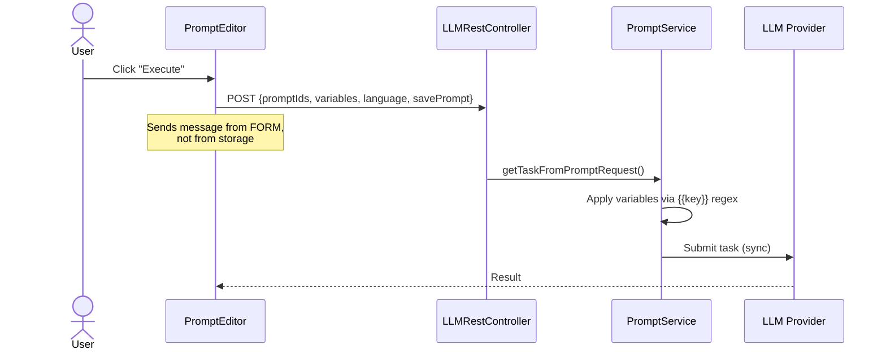
```mermaid
sequenceDiagram
    actor User
    participant Editor as PromptEditor
    participant API as LLMRestController
    participant PS as PromptService
    participant LLM as LLM Provider

    User->>Editor: Click "Execute"
    Editor->>API: POST {promptIds, variables, language, savePrompt}

    Note over Editor: Sends message from FORM,<br>not from storage

    API->>PS: getTaskFromPromptRequest()
    PS->>PS: Apply variables via {{key}} regex
    PS->>LLM: Submit task (sync)
    LLM-->>Editor: Result
```

### Language Resolution

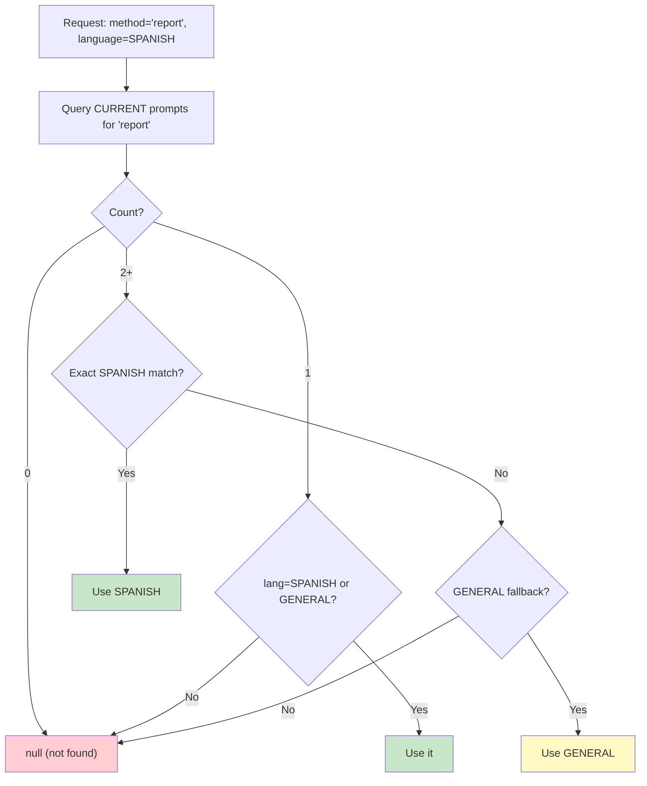
```mermaid
flowchart TD
    START["Request: method='report', language=SPANISH"]
    QUERY["Query CURRENT prompts for 'report'"]
    START --> QUERY --> CHECK{"Count?"}

    CHECK -->|"0"| NULL["null (not found)"]
    CHECK -->|"1"| ONE{"lang=SPANISH or GENERAL?"}
    ONE -->|"Yes"| USE["Use it"]
    ONE -->|"No"| NULL
    CHECK -->|"2+"| EXACT{"Exact SPANISH match?"}
    EXACT -->|"Yes"| USE_EX["Use SPANISH"]
    EXACT -->|"No"| FALL{"GENERAL fallback?"}
    FALL -->|"Yes"| USE_GEN["Use GENERAL"]
    FALL -->|"No"| NULL

    style NULL fill:#FFCDD2
    style USE fill:#C8E6C9
    style USE_EX fill:#C8E6C9
    style USE_GEN fill:#FFF9C4
```

---

## 4. Testing & Evaluation System

### What Exists (Fully Implemented)

| Component | Status | Details |
|-----------|--------|---------|
| Test Sets CRUD | Implemented | Create, edit, delete with folders |
| Test Set Items | Implemented | Prompt + variables + expected result |
| Evaluations | Implemented | 9 types configured per test set |
| Test Run Execution | Implemented | Background execution against LLM |
| Result Tracking | Implemented | Per-item PASSED/FAILED/ERROR/PENDING |

### 9 Evaluation Types

| Type | Description |
|------|-------------|
| `JSON_SCHEMA` | Validate response against JSON schema |
| `CONTAINS_KEYWORDS` | Check for keyword presence |
| `EXACT_MATCH` | Exact string comparison |
| `LLM_EVALUATION` | Use another LLM to judge quality |
| `WORD_COUNT` | Word frequency analysis |
| `ARRAY_LENGTH` | Check array sizes in JSON |
| `FIELD_VALUE_CHECK` | Validate specific JSON fields |
| `REGEX_MATCH` | Pattern matching |
| `MANUAL_EVALUATION` | Human review (sets PENDING status) |

### Test Run Flow

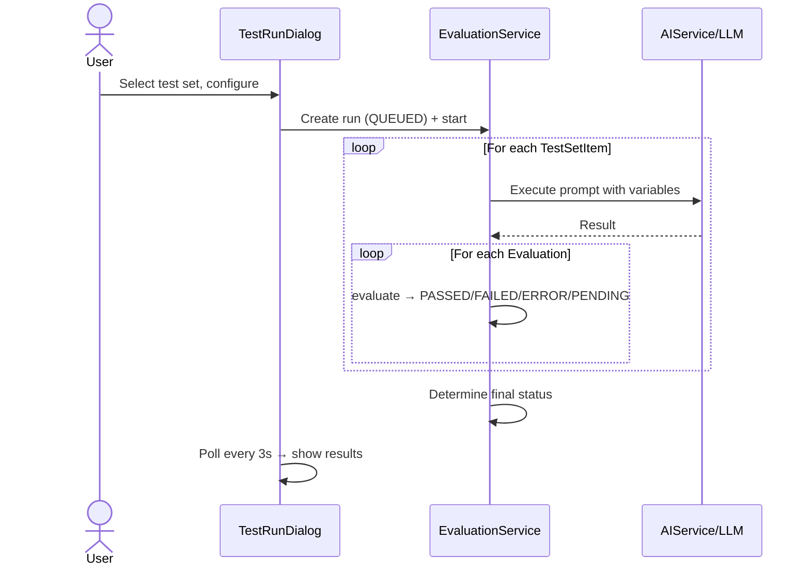
```mermaid
sequenceDiagram
    actor User
    participant Dialog as TestRunDialog
    participant ES as EvaluationService
    participant AI as AIService/LLM

    User->>Dialog: Select test set, configure
    Dialog->>ES: Create run (QUEUED) + start

    loop For each TestSetItem
        ES->>AI: Execute prompt with variables
        AI-->>ES: Result
        loop For each Evaluation
            ES->>ES: evaluate → PASSED/FAILED/ERROR/PENDING
        end
    end

    ES->>ES: Determine final status
    Dialog->>Dialog: Poll every 3s → show results
```

### Critical Gap: Testing DISCONNECTED from Prompt Lifecycle

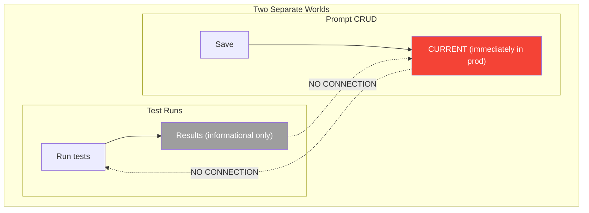
```mermaid
graph TB
    subgraph "Two Separate Worlds"
        subgraph "Prompt CRUD"
            SAVE["Save"] --> CURRENT["CURRENT (immediately in prod)"]
        end
        subgraph "Test Runs"
            RUN["Run tests"] --> RESULTS["Results (informational only)"]
        end
    end

    CURRENT -.->|"NO CONNECTION"| RUN
    RESULTS -.->|"NO CONNECTION"| CURRENT

    style CURRENT fill:#F44336,color:white
    style RESULTS fill:#9E9E9E,color:white
```

---

## 5. Agent & Workflow Engine

### Agent Types

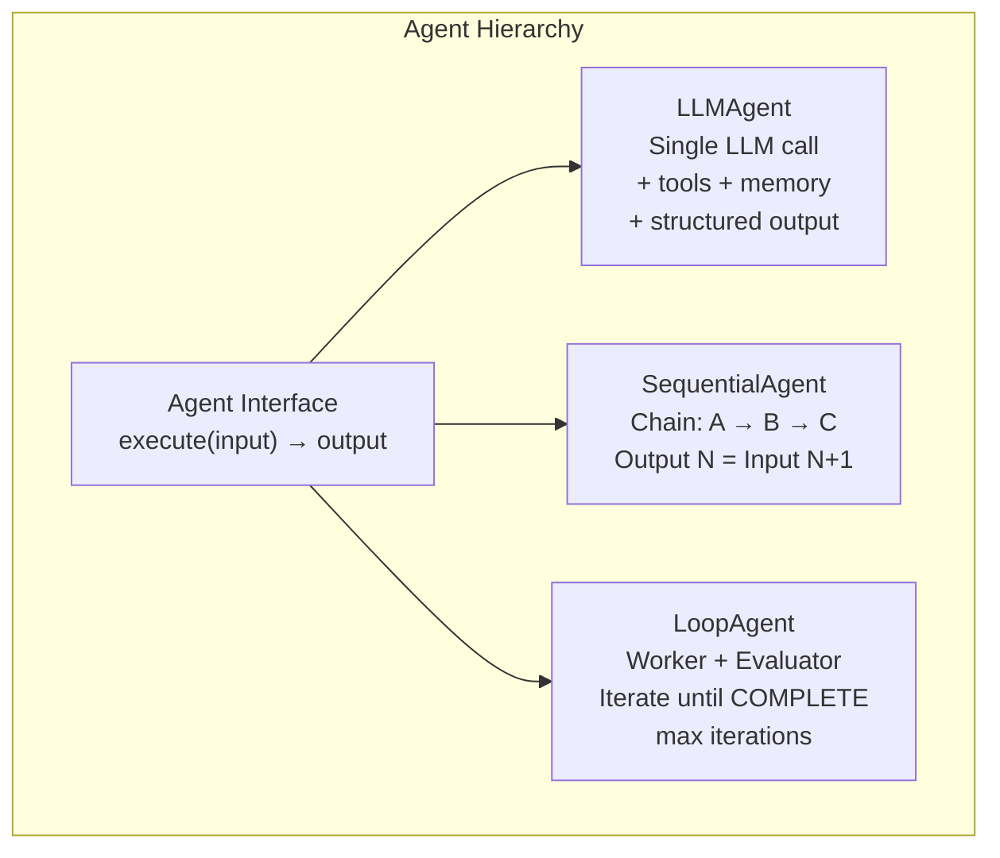
```mermaid
graph TD
    subgraph "Agent Hierarchy"
        AGENT["Agent Interface<br>execute(input) → output"]
        LLM_AGENT["LLMAgent<br>Single LLM call<br>+ tools + memory<br>+ structured output"]
        SEQ_AGENT["SequentialAgent<br>Chain: A → B → C<br>Output N = Input N+1"]
        LOOP_AGENT["LoopAgent<br>Worker + Evaluator<br>Iterate until COMPLETE<br>max iterations"]

        AGENT --> LLM_AGENT
        AGENT --> SEQ_AGENT
        AGENT --> LOOP_AGENT
    end
```

### WorkflowEngine

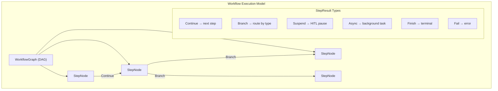
```mermaid
graph TD
    subgraph "Workflow Execution Model"
        WF["WorkflowGraph (DAG)"]
        WF --> STEP1["StepNode"]
        WF --> STEP2["StepNode"]
        WF --> STEP3["StepNode"]

        STEP1 -->|"Continue"| STEP2
        STEP2 -->|"Branch"| STEP3
        STEP2 -->|"Branch"| STEP4["StepNode"]

        subgraph "StepResult Types"
            CONT["Continue<T> → next step"]
            BRANCH["Branch<T> → route by type"]
            SUSPEND["Suspend<T> → HITL pause"]
            ASYNC["Async<T> → background task"]
            FINISH["Finish<R> → terminal"]
            FAIL["Fail<T> → error"]
        end
    end
```

**Key features:**
- **DAG execution** with type-based routing
- **@Workflow / @Step annotations** or **fluent Builder API**
- **Human-in-the-Loop** via `Suspend` + `SuspensionDataRepository`
- **Async steps** with progress tracking
- **Retry policies** with configurable backoff
- **Tool calling** via `ToolRegistry` + `AgentAsTool`

### How Prompts Connect to Workflows

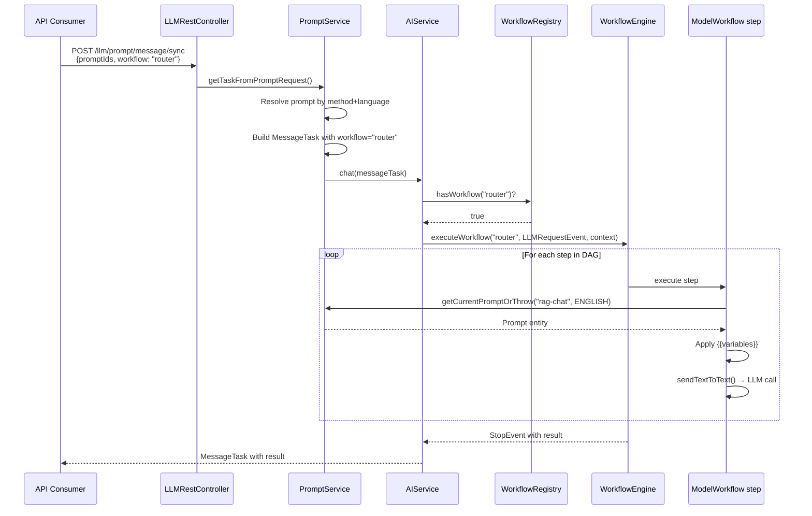
```mermaid
sequenceDiagram
    participant Client as API Consumer
    participant LLM_CTRL as LLMRestController
    participant PS as PromptService
    participant AI as AIService
    participant WR as WorkflowRegistry
    participant WF as WorkflowEngine
    participant MW as ModelWorkflow step

    Client->>LLM_CTRL: POST /llm/prompt/message/sync<br>{promptIds, workflow: "router"}
    LLM_CTRL->>PS: getTaskFromPromptRequest()
    PS->>PS: Resolve prompt by method+language
    PS->>PS: Build MessageTask with workflow="router"
    PS->>AI: chat(messageTask)

    AI->>WR: hasWorkflow("router")?
    WR-->>AI: true

    AI->>WF: executeWorkflow("router", LLMRequestEvent, context)

    loop For each step in DAG
        WF->>MW: execute step
        MW->>PS: getCurrentPromptOrThrow("rag-chat", ENGLISH)
        PS-->>MW: Prompt entity
        MW->>MW: Apply {{variables}}
        MW->>MW: sendTextToText() → LLM call
    end

    WF-->>AI: StopEvent with result
    AI-->>Client: MessageTask with result
```

**Three connection patterns (current):**

| Pattern | How it works | Used by |
|---------|-------------|---------|
| `MessageTask.workflow` | Client explicitly sets workflow ID in request. `AIService` checks `WorkflowRegistry` and executes. | LLMRestController, API consumers |
| `ModelWorkflow.sendTextToText(promptId)` | Workflow step loads prompt by method from `PromptService` at runtime. | ChatWorkflow, RouterWorkflow, RAGSearchWorkflow |
| `Prompt.workflow` field | Metadata field on Prompt entity. **Stored but NOT actively used** for execution. | Unused in practice |

### Pipelines are Code, Not Entities

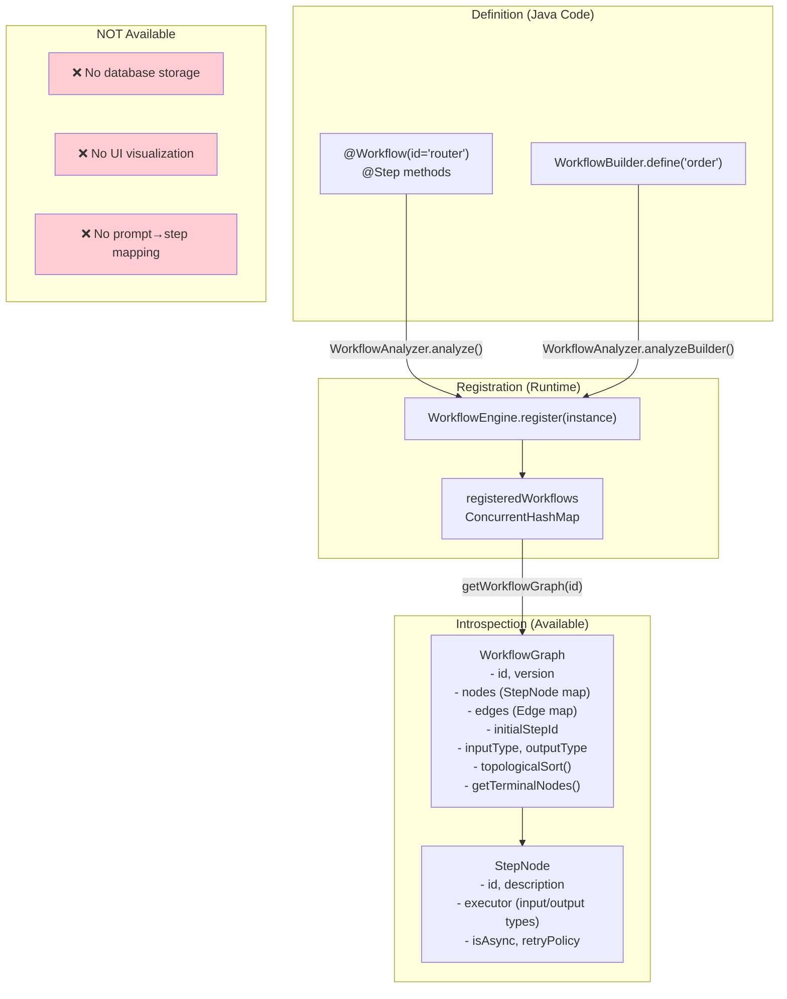
```mermaid
graph TD
    subgraph "Definition (Java Code)"
        ANN["@Workflow(id='router')<br>@Step methods"]
        BUILD["WorkflowBuilder.define('order')"]
    end

    subgraph "Registration (Runtime)"
        ENGINE["WorkflowEngine.register(instance)"]
        MAP["registeredWorkflows<br>ConcurrentHashMap<String, WorkflowGraph>"]
    end

    subgraph "Introspection (Available)"
        GRAPH["WorkflowGraph<br>- id, version<br>- nodes (StepNode map)<br>- edges (Edge map)<br>- initialStepId<br>- inputType, outputType<br>- topologicalSort()<br>- getTerminalNodes()"]
        NODE["StepNode<br>- id, description<br>- executor (input/output types)<br>- isAsync, retryPolicy"]
    end

    ANN -->|"WorkflowAnalyzer.analyze()"| ENGINE
    BUILD -->|"WorkflowAnalyzer.analyzeBuilder()"| ENGINE
    ENGINE --> MAP
    MAP -->|"getWorkflowGraph(id)"| GRAPH
    GRAPH --> NODE

    subgraph "NOT Available"
        NO_DB["❌ No database storage"]
        NO_UI["❌ No UI visualization"]
        NO_PROMPT_MAP["❌ No prompt→step mapping"]
    end

    style NO_DB fill:#FFCDD2
    style NO_UI fill:#FFCDD2
    style NO_PROMPT_MAP fill:#FFCDD2
```

**Key insight for pipeline testing:** `WorkflowGraph` already exposes all DAG metadata (nodes, edges, types, execution order). We can serialize this to build Pipeline Definition entities and pipeline visualizations without changing the workflow engine. The gap is:
1. No persistence — pipelines exist only in memory
2. No prompt mapping — steps use prompts at runtime via `promptService.getCurrentPrompt()`, not declared in metadata
3. No UI — no way to visualize or inspect registered workflows

---

## 6. Client Caching System

### Cache Architecture

DriftKit provides unified caching across all LLM providers:

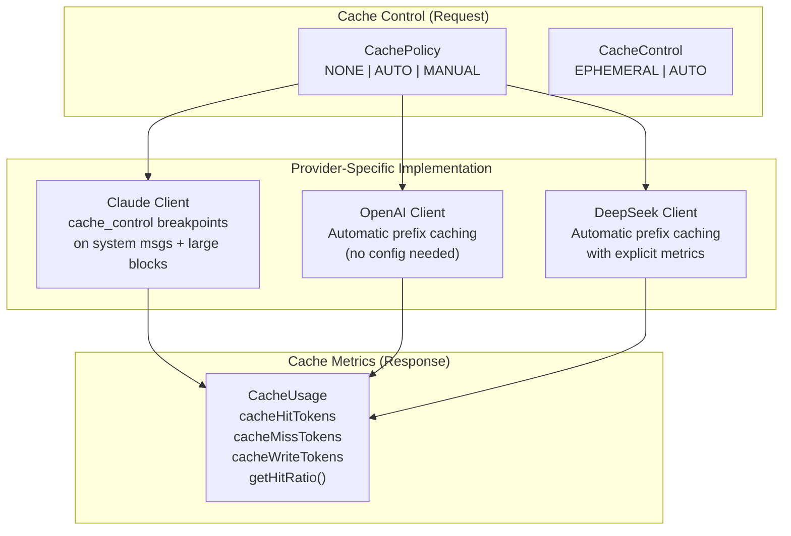
```mermaid
graph TD
    subgraph "Cache Control (Request)"
        CP["CachePolicy<br>NONE | AUTO | MANUAL"]
        CC["CacheControl<br>EPHEMERAL | AUTO"]
    end

    subgraph "Provider-Specific Implementation"
        CLAUDE["Claude Client<br>cache_control breakpoints<br>on system msgs + large blocks"]
        OPENAI["OpenAI Client<br>Automatic prefix caching<br>(no config needed)"]
        DEEPSEEK["DeepSeek Client<br>Automatic prefix caching<br>with explicit metrics"]
    end

    subgraph "Cache Metrics (Response)"
        CU["CacheUsage<br>cacheHitTokens<br>cacheMissTokens<br>cacheWriteTokens<br>getHitRatio()"]
    end

    CP --> CLAUDE & OPENAI & DEEPSEEK
    CLAUDE --> CU
    OPENAI --> CU
    DEEPSEEK --> CU
```

### CacheUsage Fields

| Field | Description | Claude | OpenAI | DeepSeek |
|-------|-------------|--------|--------|----------|
| `cacheHitTokens` | Tokens served from cache (discounted) | `cacheReadInputTokens` | `promptTokensDetails.cachedTokens` | `promptCacheHitTokens` |
| `cacheMissTokens` | Tokens not in cache (full price) | calculated | calculated | `promptCacheMissTokens` |
| `cacheWriteTokens` | Tokens written to cache (+25% surcharge) | `cacheCreationInputTokens` | N/A (auto) | N/A (auto) |

### Cache Data Flow — Where It Gets Lost

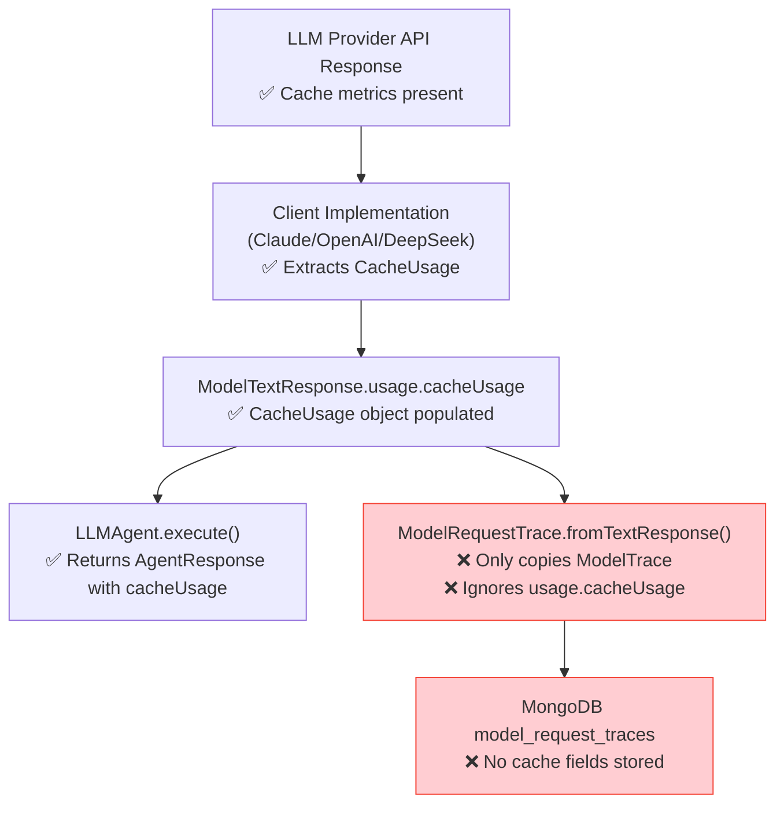
```mermaid
graph TD
    A["LLM Provider API Response<br>✅ Cache metrics present"] 
    --> B["Client Implementation<br>(Claude/OpenAI/DeepSeek)<br>✅ Extracts CacheUsage"]
    --> C["ModelTextResponse.usage.cacheUsage<br>✅ CacheUsage object populated"]
    --> D["LLMAgent.execute()<br>✅ Returns AgentResponse with cacheUsage"]
    
    C --> E["ModelRequestTrace.fromTextResponse()<br>❌ Only copies ModelTrace<br>❌ Ignores usage.cacheUsage"]
    --> F["MongoDB model_request_traces<br>❌ No cache fields stored"]

    style E fill:#FFCDD2,stroke:#F44336
    style F fill:#FFCDD2,stroke:#F44336
```

**Root cause:** `ModelTrace.java` has no cache fields:

```java
// Current ModelTrace — missing cache data
public class ModelTrace {
    long executionTimeMs;
    boolean hasError;
    String errorMessage;
    int promptTokens;
    int completionTokens;
    String model;
    Double temperature;
    String responseFormat;
    // ❌ NO CacheUsage field
}
```

### Fix Required

**`ModelTrace.java`** — add cache fields:
```java
// Add to ModelTrace
private CacheUsage cacheUsage;  // or individual fields:
private int cacheHitTokens;
private int cacheMissTokens;
private int cacheWriteTokens;
```

**`TraceableModelClient`** — copy cache data to trace:
```java
// In enhanceTraceFromTextResponse()
if (response.getUsage() != null && response.getUsage().getCacheUsage() != null) {
    trace.setCacheUsage(response.getUsage().getCacheUsage());
}
```

**`ModelRequestTrace.fromTextResponse()`** — extract cache from response usage.

**Impact:** Without this fix, cost tracking (proposed in target architecture) cannot calculate cache savings. Cache hit ratios, per-prompt cache efficiency, and cache cost optimization are all impossible.

---

## 7. Tracing & Analytics (Current)

### Trace Model

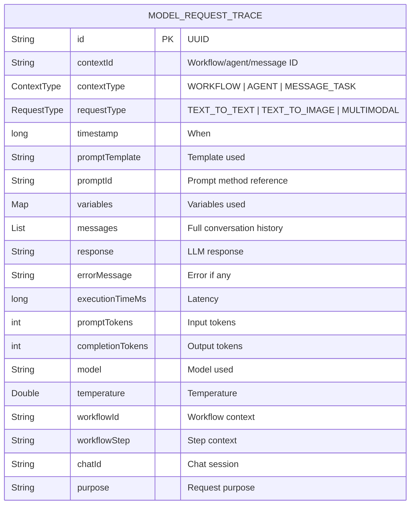
```mermaid
erDiagram
    MODEL_REQUEST_TRACE {
        String id PK "UUID"
        String contextId "Workflow/agent/message ID"
        ContextType contextType "WORKFLOW | AGENT | MESSAGE_TASK"
        RequestType requestType "TEXT_TO_TEXT | TEXT_TO_IMAGE | MULTIMODAL"
        long timestamp "When"
        String promptTemplate "Template used"
        String promptId "Prompt method reference"
        Map variables "Variables used"
        List messages "Full conversation history"
        String response "LLM response"
        String errorMessage "Error if any"
        long executionTimeMs "Latency"
        int promptTokens "Input tokens"
        int completionTokens "Output tokens"
        String model "Model used"
        Double temperature "Temperature"
        String workflowId "Workflow context"
        String workflowStep "Step context"
        String chatId "Chat session"
        String purpose "Request purpose"
    }
```

**What works:** Per-LLM-call traces with workflow/step context, token usage, latency, full message history.

**What's missing:** No connected pipeline view, no aggregated pipeline cost, no step-level failure visualization.

---

# Part II — Analysis

## 8. Industry Comparison

| Capability | Langfuse | Humanloop | Braintrust | LangSmith | **DriftKit** |
|------------|----------|-----------|-----------|-----------|-------------|
| Prompt versioning | Version numbers + deploy labels | Git-like commits | Dataset-linked | Hub versioning | CURRENT/REPLACED only |
| A/B testing | Via experiments | Built-in | Experiments | — | Not implemented |
| Playground | Multi-model side-by-side | Interactive | Eval playground | Playground | Single execute |
| Agent tracing | LangChain integration | — | — | Full agent traces | Per-call traces |
| Pipeline visualization | DAG view | — | — | Graph view | Not implemented |
| Evaluation framework | Custom scorers | Model-graded | Scorers + datasets | Custom evaluators | 9 eval types |
| Cost tracking | Per-trace costs | Per-request | Per-eval | Per-run | Token counts only |
| Environments | Production/staging | Environments | — | — | Not implemented |

### Key Industry Insights

1. **Prompts are code** — version, review, test, deploy
2. **Agent pipelines need step-level observability** — not just final result
3. **Playground is essential** — side-by-side comparison before commit
4. **Datasets feed from production** — traces become test cases
5. **Environments** — dev/staging/prod with promotion workflow

---

## 9. Problems & Gap Analysis

### 9.1 No Prompt Approval Pipeline

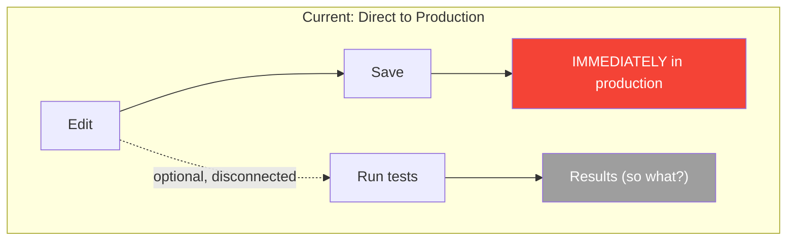
```mermaid
graph TD
    subgraph "Current: Direct to Production"
        EDIT["Edit"] --> SAVE["Save"] --> PROD["IMMEDIATELY in production"]
        EDIT -.->|"optional, disconnected"| TEST["Run tests"] --> RESULTS["Results (so what?)"]
    end

    style PROD fill:#F44336,color:white
    style RESULTS fill:#9E9E9E,color:white
```

States `MODERATION`, `MANUAL_TESTING`, `AUTO_TESTING` exist in enum but are **never set**.

### 9.2 Cannot Test Agent Pipelines

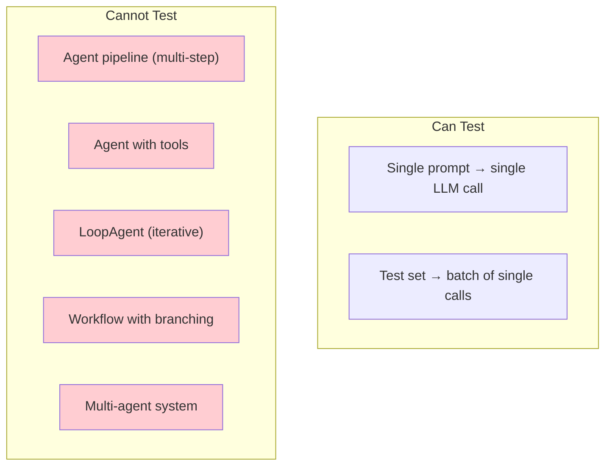
```mermaid
graph TD
    subgraph "Can Test"
        T1["Single prompt → single LLM call"]
        T2["Test set → batch of single calls"]
    end
    subgraph "Cannot Test"
        T3["Agent pipeline (multi-step)"]
        T4["Agent with tools"]
        T5["LoopAgent (iterative)"]
        T6["Workflow with branching"]
        T7["Multi-agent system"]
    end
    style T3 fill:#FFCDD2
    style T4 fill:#FFCDD2
    style T5 fill:#FFCDD2
    style T6 fill:#FFCDD2
    style T7 fill:#FFCDD2
```

### 9.3 Two Disconnected Execution Systems

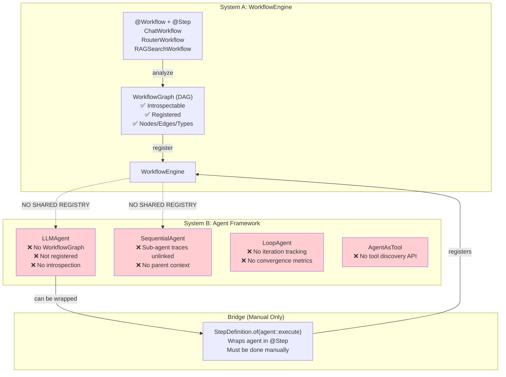
```mermaid
graph TD
    subgraph "System A: WorkflowEngine"
        WE["WorkflowEngine"]
        WG["WorkflowGraph (DAG)<br>✅ Introspectable<br>✅ Registered<br>✅ Nodes/Edges/Types"]
        WF_EX["@Workflow + @Step<br>ChatWorkflow<br>RouterWorkflow<br>RAGSearchWorkflow"]

        WF_EX -->|"analyze"| WG -->|"register"| WE
    end

    subgraph "System B: Agent Framework"
        LLM["LLMAgent<br>❌ No WorkflowGraph<br>❌ Not registered<br>❌ No introspection"]
        SEQ["SequentialAgent<br>❌ Sub-agent traces unlinked<br>❌ No parent context"]
        LOOP["LoopAgent<br>❌ No iteration tracking<br>❌ No convergence metrics"]
        TOOLS["AgentAsTool<br>❌ No tool discovery API"]
    end

    WE -.->|"NO SHARED REGISTRY"| LLM
    WE -.->|"NO SHARED REGISTRY"| SEQ

    subgraph "Bridge (Manual Only)"
        BRIDGE["StepDefinition.of(agent::execute)<br>Wraps agent in @Step<br>Must be done manually"]
    end

    LLM -->|"can be wrapped"| BRIDGE -->|"registers"| WE

    style LLM fill:#FFCDD2
    style SEQ fill:#FFCDD2
    style LOOP fill:#FFCDD2
    style TOOLS fill:#FFCDD2
```

**Impact on Pipeline Testing:**
- `WorkflowGraph` introspection covers only `@Workflow` pipelines
- `SequentialAgent(A, B, C)` — no way to discover steps, no linked traces
- `LoopAgent(worker, evaluator)` — no iteration count in traces, no convergence tracking
- To test agent pipelines, need a **unified registry** that covers both systems

### 9.4 Agent Tracing Gaps

| Scenario | Current Behavior | Problem |
|----------|-----------------|---------|
| SequentialAgent with 3 sub-agents | Each sub-agent writes trace with its own `contextId` | Traces appear as 3 unrelated calls — no parent linking |
| LoopAgent with 5 iterations | Each iteration is a separate trace | No iteration number, no convergence tracking, no loop-level aggregate |
| Agent used inside @Step | Agent sets its own `agentId` as contextId | Trace doesn't reference the workflow step that invoked it |
| AgentAsTool called by master agent | Tool execution traced under master agent's contextId | Sub-agent's internal calls not linked to tool invocation |

### 9.5 Other Problems

| Problem | Impact |
|---------|--------|
| **Naming:** `promptId` (FE) ≠ `method` (BE) ≠ `id` (UUID) | Developer confusion |
| **Execute vs Save desync:** form message can differ from saved | Silent errors |
| **No version numbers** | Can't diff, can't rollback |
| **No dirty state indicator** | Users don't know form differs from saved |
| **No variable validation** | Empty vars → broken prompts |
| **Virtual folders: read-only** | Can't move/rename/delete |
| **No audit trail** | Who changed what when? |
| **No environments** | Can't test in staging |
| **No pipeline visualization** | Can't see agent flow |
| **No cost tracking** | Can't optimize spend |
| **Frontend sends unused data** | state/timestamps ignored by backend |

---

# Part III — Target Architecture

## 10. Prompt Lifecycle & Testing Pipeline

### State Machine

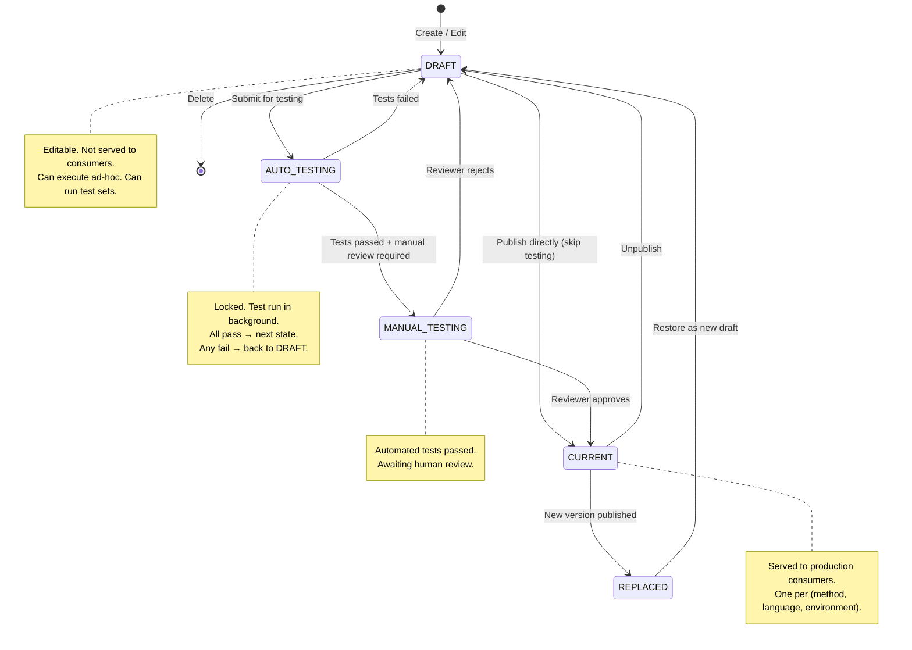
```mermaid
stateDiagram-v2
    [*] --> DRAFT: Create / Edit

    DRAFT --> AUTO_TESTING: Submit for testing
    DRAFT --> CURRENT: Publish directly (skip testing)
    DRAFT --> [*]: Delete

    AUTO_TESTING --> MANUAL_TESTING: Tests passed + manual review required
    AUTO_TESTING --> DRAFT: Tests failed

    MANUAL_TESTING --> CURRENT: Reviewer approves
    MANUAL_TESTING --> DRAFT: Reviewer rejects

    CURRENT --> REPLACED: New version published
    CURRENT --> DRAFT: Unpublish

    REPLACED --> DRAFT: Restore as new draft

    note right of DRAFT
        Editable. Not served to consumers.
        Can execute ad-hoc. Can run test sets.
    end note

    note right of AUTO_TESTING
        Locked. Test run in background.
        All pass → next state.
        Any fail → back to DRAFT.
    end note

    note right of MANUAL_TESTING
        Automated tests passed.
        Awaiting human review.
    end note

    note right of CURRENT
        Served to production consumers.
        One per (method, language, environment).
    end note
```

### End-to-End Pipeline Flow

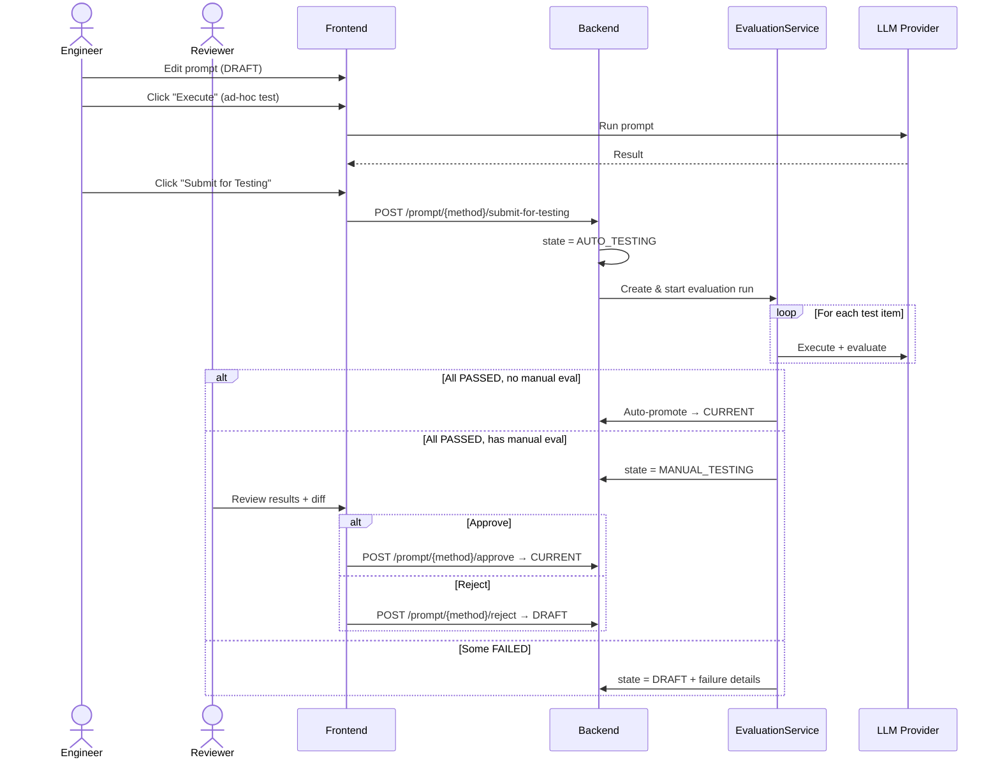
```mermaid
sequenceDiagram
    actor Engineer
    actor Reviewer
    participant UI as Frontend
    participant API as Backend
    participant ES as EvaluationService
    participant LLM as LLM Provider

    Engineer->>UI: Edit prompt (DRAFT)
    Engineer->>UI: Click "Execute" (ad-hoc test)
    UI->>LLM: Run prompt
    LLM-->>UI: Result

    Engineer->>UI: Click "Submit for Testing"
    UI->>API: POST /prompt/{method}/submit-for-testing

    API->>API: state = AUTO_TESTING
    API->>ES: Create & start evaluation run

    loop For each test item
        ES->>LLM: Execute + evaluate
    end

    alt All PASSED, no manual eval
        ES->>API: Auto-promote → CURRENT
    else All PASSED, has manual eval
        ES->>API: state = MANUAL_TESTING
        Reviewer->>UI: Review results + diff
        alt Approve
            UI->>API: POST /prompt/{method}/approve → CURRENT
        else Reject
            UI->>API: POST /prompt/{method}/reject → DRAFT
        end
    else Some FAILED
        ES->>API: state = DRAFT + failure details
    end
```

### Per-Method Configuration

```mermaid
erDiagram
    PROMPT_METHOD_CONFIG {
        String method PK "Prompt method"
        boolean requireTesting "Must pass tests before publish"
        boolean requireManualReview "Needs human approval"
        String defaultTestSetId "Auto-run test set"
        int minPassRate "Minimum pass % (default 100)"
    }
    PROMPT_METHOD_CONFIG ||--o{ PROMPT : "governs"
    PROMPT_METHOD_CONFIG ||--o| TEST_SET : "auto-runs"
```

---

## 11. Agent Pipeline Testing

### Core Concept: Everything is a Pipeline

```mermaid
graph TD
    subgraph "Atomic: Prompt"
        P["Prompt (method + version + language)"]
    end
    subgraph "Composition: Agent"
        A["Agent (prompt + model + tools + memory)"]
    end
    subgraph "Orchestration: Pipeline"
        PL["Pipeline (agents + workflows + routing)"]
    end

    P -->|"used by"| A -->|"composed into"| PL

    subgraph "Three Testing Levels"
        T1["Unit: single prompt"]
        T2["Integration: single agent"]
        T3["E2E: full pipeline"]
    end
    P -.-> T1
    A -.-> T2
    PL -.-> T3
```

### Unified Pipeline Registry (Bridging Both Systems)

The core problem: `@Workflow` pipelines have `WorkflowGraph` (introspectable), but `SequentialAgent`/`LoopAgent` pipelines don't. The solution: **a unified registry that understands both**.

```mermaid
graph TD
    subgraph "Unified Pipeline Registry"
        REG["PipelineRegistry<br>register(PipelineDefinition)<br>get(id) → PipelineDefinition<br>list() → all pipelines"]
    end

    subgraph "Source A: WorkflowEngine"
        WE["WorkflowEngine.getRegisteredWorkflows()"]
        WG["WorkflowGraph → serialize nodes/edges"]
        WE --> WG -->|"auto-register"| REG
    end

    subgraph "Source B: Agent Builder"
        SB["SequentialAgent.builder()<br>.name('content-pipeline')<br>.agent(classifier)<br>.agent(extractor)<br>.agent(responder)<br>.register(registry)"]
        LB["LoopAgent.builder()<br>.name('quality-loop')<br>.worker(writer)<br>.evaluator(reviewer)<br>.register(registry)"]
        SB -->|"register"| REG
        LB -->|"register"| REG
    end

    subgraph "Consumers"
        UI["Pipeline Visualizer UI"]
        TEST["Pipeline Test Runner"]
        TRACE["Trace Linker"]
    end

    REG --> UI & TEST & TRACE

    style REG fill:#C8E6C9,stroke:#4CAF50
```

### Current Agent Builder State

| Agent | `name` field | `agentId` field | Registration |
|-------|-------------|-----------------|--------------|
| **LLMAgent** | `.name("classifier")` in builder | `.agentId("uuid")` in builder, auto-generated if not set | Has both — can use `name` for registry |
| **SequentialAgent** | Hardcoded `"SequentialAgent"` | No field | **Needs `.name()` in builder** |
| **LoopAgent** | Hardcoded `"LoopAgent"` | No field | **Needs `.name()` in builder** |

### Implementation: Auto-Registration via Name

**Rule: if user set `.name()` → auto-register. No name → anonymous, no registration.**

All registration is internal. User only adds `.name("...")` (which they often already do for LLMAgent). No explicit `.register()` call needed.

```java
// SequentialAgent.builder() — add .name() support
SequentialAgent pipeline = SequentialAgent.builder()
    .name("content-pipeline")      // ← user sets name
    .agent(classifier)             //    LLMAgent with name="classifier"
    .agent(extractor)              //    LLMAgent with name="extractor"  
    .agent(responder)              //    LLMAgent with name="responder"
    .build();
// build() internally: if name != null → PipelineRegistry.register(this)

// LoopAgent.builder() — same pattern
LoopAgent loop = LoopAgent.builder()
    .name("quality-loop")          // ← user sets name
    .worker(writer)
    .evaluator(reviewer)
    .maxIterations(5)
    .build();
// build() internally: if name != null → PipelineRegistry.register(this)

// Anonymous agent — no registration, works as before
SequentialAgent temp = SequentialAgent.builder()
    .agent(a).agent(b).build();    // ← no name, not registered
```

**Auto-generated PipelineDefinition from composition:**

```java
// SequentialAgent.build() creates:
PipelineDefinition {
  id: "content-pipeline",
  type: SEQUENTIAL_AGENT,
  steps: [
    { stepId: "classifier", order: 0, agentName: "classifier", promptMethod: "classify" },
    { stepId: "extractor", order: 1, agentName: "extractor", promptMethod: "extract-entities" },
    { stepId: "responder", order: 2, agentName: "responder", promptMethod: "generate-response" }
  ]
}

// LoopAgent auto-generates PipelineDefinition:
PipelineDefinition {
  id: "quality-loop",
  type: LOOP_AGENT,
  steps: [
    { stepId: "worker", order: 0, agentName: "writer", promptMethod: "write-content" },
    { stepId: "evaluator", order: 1, agentName: "reviewer", promptMethod: "evaluate-quality" }
  ],
  config: { maxIterations: 5, stopCondition: "COMPLETE" }
}
```

### Hierarchical Trace Context

Fix the disconnected tracing by propagating parent context through existing fields.

```mermaid
graph TD
    subgraph "Current: Disconnected Traces"
        T1["Trace: classifier-uuid<br>workflowId: null<br>workflowStep: null"]
        T2["Trace: extractor-uuid<br>workflowId: null<br>workflowStep: null"]
        T3["Trace: responder-uuid<br>workflowId: null<br>workflowStep: null"]
    end

    subgraph "Proposed: Linked via workflowId/workflowStep"
        PT1["Trace: classifier-uuid<br>workflowId: content-pipeline<br>workflowStep: step-0-classifier"]
        PT2["Trace: extractor-uuid<br>workflowId: content-pipeline<br>workflowStep: step-1-extractor"]
        PT3["Trace: responder-uuid<br>workflowId: content-pipeline<br>workflowStep: step-2-responder"]
    end

    style T1 fill:#FFCDD2
    style T2 fill:#FFCDD2
    style T3 fill:#FFCDD2
    style PT1 fill:#E3F2FD
    style PT2 fill:#E3F2FD
    style PT3 fill:#E3F2FD
```

**Technical constraint:** `LLMAgent` already has `workflowId`, `workflowType`, `workflowStep` fields — they're written into every trace via `buildTraceContext()`. But they are `final` (set in constructor). `SequentialAgent` can't change them after sub-agent is built.

**Two implementation options:**

#### Option A: Make trace context fields mutable (simple)

```java
// LLMAgent — change from final to mutable
private String workflowId;    // was: private final String workflowId;
private String workflowStep;  // was: private final String workflowStep;

// Add setters (or package-private for agent framework)
void setWorkflowContext(String workflowId, String workflowStep) {
    this.workflowId = workflowId;
    this.workflowStep = workflowStep;
}

// SequentialAgent.runSequence() — inject context before each call
private String runSequence(String input, Map<String, Object> variables) {
    for (int i = 0; i < agents.size(); i++) {
        Agent agent = agents.get(i);
        
        // Inject pipeline context into sub-agents
        if (agent instanceof LLMAgent llmAgent) {
            llmAgent.setWorkflowContext(
                this.name,                                    // "content-pipeline"
                "step-" + i + "-" + llmAgent.getName()        // "step-0-classifier"
            );
        }
        
        result = agent.execute(result);
    }
}
```

#### Option B: Thread-local trace context (zero changes to LLMAgent)

```java
// TraceContext — thread-local propagation
public class TraceContext {
    private static final ThreadLocal<TraceContext> CURRENT = new ThreadLocal<>();
    
    private String pipelineId;
    private String stepId;
    private int stepIndex;
    
    public static void set(String pipelineId, String stepId, int stepIndex) { ... }
    public static TraceContext current() { return CURRENT.get(); }
    public static void clear() { CURRENT.remove(); }
}

// SequentialAgent — sets thread-local before each agent call
for (int i = 0; i < agents.size(); i++) {
    TraceContext.set(this.name, agents.get(i).getName(), i);
    result = agents.get(i).execute(result);
    TraceContext.clear();
}

// LLMAgent.buildTraceContext() — picks up thread-local if own fields are null
.workflowId(workflowId != null ? workflowId : 
    TraceContext.current() != null ? TraceContext.current().getPipelineId() : null)
.workflowStep(workflowStep != null ? workflowStep : 
    TraceContext.current() != null ? TraceContext.current().getStepId() : null)
```

**Recommendation:** Option A is simpler and more explicit. Option B is more elegant but adds complexity with ThreadLocal lifecycle management. Both work for LoopAgent too — set `workflowStep = "worker-iter-N"` / `"evaluator-iter-N"`.

**Query to find linked traces:**
```
// MongoDB: find all traces for a pipeline execution
db.model_request_traces.find({ "workflowInfo.workflowId": "content-pipeline" })
  .sort({ timestamp: 1 })

// Group by step
db.model_request_traces.aggregate([
  { $match: { "workflowInfo.workflowId": "content-pipeline" } },
  { $group: { _id: "$workflowInfo.workflowStep", count: { $sum: 1 }, avgLatency: { $avg: "$trace.executionTimeMs" } } }
])
```

### Pipeline Definition (Updated with Agent Support)

```mermaid
erDiagram
    PIPELINE_DEFINITION {
        String id PK "UUID"
        String name "Human-readable name"
        String description "What this pipeline does"
        String sourceId "WorkflowEngine ID or agent name"
        PipelineType type "WORKFLOW | SEQUENTIAL_AGENT | LOOP_AGENT | CUSTOM"
        String version "Pipeline version"
        Map config "Type-specific config (maxIterations, stopCondition, etc.)"
    }

    PIPELINE_STEP {
        String id PK "UUID"
        String pipelineId FK "Parent pipeline"
        String stepId "Step/agent name"
        String promptMethod "Prompt used (if known)"
        int order "Execution order"
        StepType type "LLM_CALL | TOOL_CALL | BRANCH | MERGE | HUMAN_INPUT | LOOP_WORKER | LOOP_EVALUATOR"
        String agentId "Agent UUID (for agent-based steps)"
        Map config "Step-specific configuration"
    }

    PIPELINE_DEFINITION ||--o{ PIPELINE_STEP : "has steps"
    PIPELINE_STEP }o--o| PROMPT : "may use prompt"
```

### Pipeline Test with Prompt Override

**Key use case:** "I changed prompt 'classifier' — does the pipeline still work?"

```mermaid
sequenceDiagram
    actor Engineer
    participant UI as Prompt Editor
    participant API as Backend

    Engineer->>UI: Edit prompt "classifier" (v3 → v4 draft)
    Engineer->>UI: Click "Test in Pipeline"
    UI->>UI: Show pipelines using this prompt
    Engineer->>UI: Select "content-moderation" pipeline

    UI->>API: POST /pipeline-tests/run<br>{pipelineId, promptOverrides: {"classifier": v4 text}, datasetId}

    Note over API: Pipeline runs normally<br>EXCEPT "classifier" step uses override

    API-->>UI: Results:<br>v3 (prod): 95% pass<br>v4 (draft): 92% pass<br>3 regressions
```

### Pipeline Test Data Model

```mermaid
erDiagram
    PIPELINE_TEST_RUN {
        String id PK "UUID"
        String pipelineId FK "Pipeline"
        String datasetId FK "Dataset"
        Map promptOverrides "method → override text"
        String status "RUNNING | COMPLETED | FAILED"
        int passedCases "Pass count"
        int failedCases "Fail count"
        double avgLatencyMs "Avg latency"
        int totalTokens "Total tokens"
        double estimatedCost "Est. USD"
    }

    PIPELINE_TEST_RESULT {
        String id PK "UUID"
        String runId FK "Parent run"
        String status "PASSED | FAILED | ERROR"
        String input "Test input"
        String actualOutput "Actual result"
        int totalSteps "Steps executed"
        int totalLLMCalls "LLM calls"
        double latencyMs "Pipeline latency"
        double estimatedCost "Cost"
    }

    PIPELINE_STEP_TRACE {
        String id PK "UUID"
        String resultId FK "Parent result"
        String stepId "Step identifier"
        String promptMethod "Prompt used"
        int promptVersion "Version used"
        String input "Step input"
        String output "Step output"
        int tokens "Tokens"
        double latencyMs "Latency"
        String status "SUCCESS | ERROR | SKIPPED"
        int loopIteration "For LoopAgent"
    }

    PIPELINE_TEST_RUN ||--o{ PIPELINE_TEST_RESULT : "contains"
    PIPELINE_TEST_RESULT ||--o{ PIPELINE_STEP_TRACE : "has traces"
```

### Agent-Specific Test Types

| Agent Type | Tests |
|------------|-------|
| **LoopAgent** | Convergence (terminates in N iterations?), quality improvement (each iteration better?), evaluator accuracy |
| **SequentialAgent** | Pipeline integrity (output N valid for step N+1?), error propagation |
| **Tool-Using Agent** | Tool selection, tool result handling, fallback on failure |
| **Workflow** | Branch coverage, HITL mock, async completion |

---

## 12. Prompt Playground & Experimentation

### Four Modes

```mermaid
graph TD
    subgraph "Mode 1: Single Prompt"
        S1["Edit → Set vars → Execute against 1+ models → Compare"]
    end
    subgraph "Mode 2: A/B Comparison"
        A1["Prompt v3 (prod) vs v4 (draft) → same input → side-by-side"]
    end
    subgraph "Mode 3: Dataset Sweep"
        D1["Prompt + dataset → run all → aggregate pass rate"]
    end
    subgraph "Mode 4: Pipeline Playground"
        P1["Select pipeline → override step's prompt → execute → inspect each step"]
    end
```

### Side-by-Side UI

```
┌─────────────────────────────────────────────────────────────┐
│  Playground                              [Prompt v3 vs v4]  │
├──────────────────────────┬──────────────────────────────────┤
│  Prompt A (production)   │  Prompt B (draft)                │
│  ┌────────────────────┐  │  ┌────────────────────────────┐  │
│  │ Generate a {{type}} │  │  │ You are an expert analyst. │  │
│  │ report for          │  │  │ Generate a detailed        │  │
│  │ {{company}}         │  │  │ {{type}} report for        │  │
│  └────────────────────┘  │  │ {{company}} with insights  │  │
│                          │  └────────────────────────────┘  │
├──────────────────────────┼──────────────────────────────────┤
│  Output A                │  Output B                        │
│  Tokens: 1,234           │  Tokens: 1,891                   │
│  Latency: 2.1s           │  Latency: 3.4s                   │
│  Cost: $0.024            │  Cost: $0.038                    │
├──────────────────────────┴──────────────────────────────────┤
│  Evaluations:    A: 3/4 passed    B: 4/4 passed            │
│  [Promote B to staging] [Save B as draft] [Discard]        │
└─────────────────────────────────────────────────────────────┘
```

---

## 13. Environments & Deployment

### Deployment Labels

```mermaid
graph LR
    subgraph "method = 'reports/monthly' (ENGLISH)"
        V1["v1"] --- V2["v2"] --- V3["v3"] --- V4["v4"] --- V5["v5"]
    end

    subgraph "Labels"
        DEV["dev → v5"]
        STAGING["staging → v4"]
        PROD["production → v3"]
    end

    V5 --- DEV
    V4 --- STAGING
    V3 --- PROD

    style DEV fill:#FFF9C4,stroke:#FFC107
    style STAGING fill:#E3F2FD,stroke:#2196F3
    style PROD fill:#C8E6C9,stroke:#4CAF50
    style V1 fill:#eee
    style V2 fill:#eee
```

- `method + language + environment` → resolves to specific version
- Default: `production` (backward compatible with current CURRENT)
- Promote: `dev → staging → production`

```mermaid
erDiagram
    PROMPT_ENVIRONMENT {
        String method "Prompt method"
        Language language "Language"
        String environment "dev | staging | production"
        int version "Points to version number"
        String updatedBy "Who"
        long updatedAt "When"
    }
```

---

## 14. Observability & Cost Tracking

### Pipeline Trace View

```mermaid
graph LR
    subgraph "Pipeline: content-moderation"
        direction TB
        S1["classify-input<br>prompt: classifier<br>450 tok | 1.2s | ✅"]
        S2["extract-entities<br>380 tok | 0.9s | ✅"]
        S3{"route"}
        S4["generate-response<br>890 tok | 2.1s | ✅"]
        S5["quality-review<br>320 tok | 0.8s | ❌ iter 1"]
        S6["revise<br>950 tok | 2.3s | ✅"]
        S7["quality-review<br>✅ iter 2"]

        S1 --> S2 --> S3
        S3 -->|"safe"| S4
        S3 -->|"flagged"| BLOCK["block"]
        S4 --> S5 -->|"REVISE"| S6 --> S7 -->|"COMPLETE"| DONE["finish"]
    end
```

Click any step → full prompt, variables, messages, response, tokens, cost.

### Cost Model

```mermaid
erDiagram
    COST_RECORD {
        String traceId FK "Trace"
        String pipelineId "Pipeline"
        String stepId "Step"
        String promptMethod "Prompt"
        String model "Model"
        int promptTokens "Input"
        int completionTokens "Output"
        int cachedTokens "Cached"
        double totalCostUSD "Cost"
    }
```

Dashboards: cost per pipeline, cost per prompt, cost per model, budget alerts, token waste.

### Regression Detection

```mermaid
sequenceDiagram
    participant CRON as Scheduled Job
    participant API as Backend
    participant ALERT as Alert System

    CRON->>API: Run regression tests (nightly)
    API->>API: Execute all pipeline tests

    alt Pass rate dropped
        API->>ALERT: "Pipeline pass rate 98% → 91%"
    end
    alt Cost increased
        API->>ALERT: "Cost $0.12 → $0.19 (+58%)"
    end
```

---

## 15. Enhanced Data Model

### Prompt v2 Entity

```mermaid
erDiagram
    PROMPT_V2 {
        String id PK "UUID"
        String method "Logical identifier"
        int version "Auto-incremented per method+language"
        String message "Template"
        String systemMessage "System instructions"
        State state "DRAFT | AUTO_TESTING | MANUAL_TESTING | CURRENT | REPLACED"
        Language language "Language"
        String modelId "Model"
        String workflow "Workflow"
        Double temperature "Temperature"
        boolean jsonRequest "JSON input"
        boolean jsonResponse "JSON output"
        ResponseFormat responseFormat "Structured output"
        String changedBy "Who"
        String changeReason "Why"
        String linkedRunId "Test run that tested this"
        long createdTime "Created"
        long updatedTime "Updated"
    }

    PROMPT_V2 ||--o{ VARIABLE_SCHEMA : "defines"

    VARIABLE_SCHEMA {
        String name PK "Variable name"
        String type "string | number | json | text"
        boolean required "Required?"
        String defaultValue "Default"
        String description "Help text"
        String example "Example"
    }

    PROMPT_AUDIT {
        String id PK "UUID"
        String promptMethod "Method"
        Language language "Language"
        int fromVersion "From"
        int toVersion "To"
        String action "CREATED | SAVED | SUBMITTED | APPROVED | REJECTED | PUBLISHED | RESTORED | DELETED"
        String performedBy "Who"
        String reason "Why"
        String linkedRunId "Test run"
        long timestamp "When"
    }
```

---

## 16. API Design

### Existing (Updated)

| Method | Path | Change |
|--------|------|--------|
| `POST` | `/prompt/` | Save as DRAFT. Remove client timestamps/state |
| `DELETE` | `/prompt/{id}` | Promote latest REPLACED to CURRENT |

### New: Lifecycle

| Method | Path | Description |
|--------|------|-------------|
| `POST` | `/prompt/{method}/publish` | DRAFT → CURRENT (skip testing) |
| `POST` | `/prompt/{method}/submit-for-testing` | DRAFT → AUTO_TESTING |
| `POST` | `/prompt/{method}/approve` | MANUAL_TESTING → CURRENT |
| `POST` | `/prompt/{method}/reject` | MANUAL_TESTING → DRAFT |

### New: Versioning

| Method | Path | Description |
|--------|------|-------------|
| `GET` | `/prompt/{method}/versions` | Version history |
| `POST` | `/prompt/{method}/restore` | Restore old version as DRAFT |
| `GET` | `/prompt/{method}/diff` | Compare two versions |

### New: Folders

| Method | Path | Description |
|--------|------|-------------|
| `POST` | `/prompt/move` | Change method path |
| `POST` | `/prompt/rename-folder` | Bulk rename prefix |
| `DELETE` | `/prompt/folder/{prefix}` | Delete all with prefix |

### New: Pipelines

| Method | Path | Description |
|--------|------|-------------|
| `GET` | `/pipelines/` | List pipeline definitions |
| `POST` | `/pipeline-tests/run` | Run pipeline test with optional prompt overrides |
| `GET` | `/pipeline-tests/{runId}` | Get pipeline test results |
| `GET` | `/pipeline-tests/{runId}/steps` | Step-level traces |

### New: Environments

| Method | Path | Description |
|--------|------|-------------|
| `GET` | `/prompt/{method}/environments` | Get environment labels |
| `POST` | `/prompt/{method}/promote` | Move label to version |

### New: Audit

| Method | Path | Description |
|--------|------|-------------|
| `GET` | `/prompt/audit/{method}` | Audit history |
| `GET` | `/prompt/config/{method}` | Testing requirements |
| `PUT` | `/prompt/config/{method}` | Set testing requirements |

---

## 17. UI/UX Design

### Navigation

```
┌──────────────┐
│  DriftKit    │
│              │
│  ◉ Dashboard │  Overall metrics, cost, alerts
│  ◎ Prompts   │  CRUD + lifecycle + versions + environments
│  ◎ Pipelines │  Definitions + DAG visualization        [NEW]
│  ◎ Playground│  Interactive testing + A/B comparison    [NEW]
│  ◎ Test Suite│  Datasets + unit/integration/E2E tests
│  ◎ Traces    │  Production traces + pipeline traces
│  ◎ Chat      │  Interactive chat testing
│  ◎ Indexes   │  RAG index management
│  ─────────── │
│  ◎ Settings  │  Environments, cost config, alerts      [NEW]
└──────────────┘
```

### Enhanced Prompt Manager

```
┌──────────────────────────────────────────────────────────────────┐
│  Prompts  ›  reports  ›  monthly                                 │
├──────────────────────────────────────────────────────────────────┤
│  ┌─ Prompt Editor ─────────────────────────────────────────────┐ │
│  │  Method: reports/monthly                                     │ │
│  │  [DRAFT v5]  [STAGING v4]  [PRODUCTION v3]                  │ │
│  │  System Message: [___________________________________]       │ │
│  │  Template:       [___________________________________]       │ │
│  │  Variables:  type: [_________]  company: [_________]         │ │
│  │  Model: [gpt-4 ▼]  Temp: [0.7]  Language: [ENGLISH ▼]     │ │
│  │  [▶ Execute] [💾 Save Draft] [🧪 Test in Pipeline]          │ │
│  │  [📊 Compare with Production] [🚀 Promote to Staging]       │ │
│  └──────────────────────────────────────────────────────────────┘ │
│  ┌─ Version History ───────────────────────────────────────────┐ │
│  │  v5 DRAFT      "Added expert persona"       2min ago        │ │
│  │  v4 STAGING    "Improved structure"          2 days ago      │ │
│  │  v3 PRODUCTION "Initial release"             1 week ago      │ │
│  │                                         [Show diff v3↔v5]   │ │
│  └──────────────────────────────────────────────────────────────┘ │
│  ┌─ Used in Pipelines ─────────────────────────────────────────┐ │
│  │  📐 content-moderation (step: generate-response)            │ │
│  │  ⚠️ Changing this prompt affects 2 pipelines               │ │
│  └──────────────────────────────────────────────────────────────┘ │
│  ┌─ Test Results ──────────────────────────────────────────────┐ │
│  │  ✅ Unit: 24/25 (96%)  ✅ Pipeline "content-mod": 18/18    │ │
│  │  ⚠️ Pipeline "report-gen": 14/15 (1 regression)           │ │
│  └──────────────────────────────────────────────────────────────┘ │
└──────────────────────────────────────────────────────────────────┘
```

### Pipeline Visualizer

```
┌────────────────────────────────────────────────────────────────┐
│  Pipeline: content-moderation v2.1                             │
│  [▶ Run Test] [📊 Last Run: 98% pass] [⚙️ Edit]              │
├────────────────────────────────────────────────────────────────┤
│   ┌──────────┐    ┌──────────┐    ┌──────┐                    │
│   │ classify │───▶│ extract  │───▶│route │                    │
│   │ ✅ 1.2s  │    │ ✅ 0.9s  │    │      │                    │
│   │ $0.008   │    │ $0.006   │    └──┬───┘                    │
│   └──────────┘    └──────────┘   safe│  │flagged              │
│                              ┌────────┐ ┌───────┐             │
│                              │generate│ │ block │             │
│                              │ ✅ 2.1s │ └───────┘             │
│                              └───┬────┘                        │
│                           ┌────────────┐                      │
│                           │ loop:      │                      │
│                           │ quality    │──▶ ✅ finish         │
│                           │ 2 iters    │                      │
│                           └────────────┘                      │
│  Total: 7.3s | $0.042 | 2,990 tokens                         │
│  ┌─ Step Inspector ───────────────────────────────────────────┐│
│  │  Step: classify-input | Prompt: classifier (v3, prod)      ││
│  │  Input: "Review this comment: ..."                         ││
│  │  Output: {"category": "safe", "confidence": 0.95}          ││
│  │  [View trace] [Override prompt for testing]                 ││
│  └────────────────────────────────────────────────────────────┘│
└────────────────────────────────────────────────────────────────┘
```

---

# Part IV — Implementation

## 18. Implementation Roadmap

Each phase ends with a verifiable checkpoint: compilation, tests, or UI check.

---

### Phase 1: Cache Tracing Fix
**Scope:** Backend only (`driftkit-common`, `driftkit-clients-core`, `driftkit-workflows-spring-boot-starter`)

| Step | File | Change |
|------|------|--------|
| 1.1 | `ModelTrace.java` | Add `CacheUsage cacheUsage` field with getter/setter |
| 1.2 | `TraceableModelClient.java` | In `enhanceTraceFromTextResponse()`: copy `response.getUsage().getCacheUsage()` to `ModelTrace` |
| 1.3 | `ModelRequestTrace.fromTextResponse()` | Extract `CacheUsage` from `response.getUsage()` and set on trace |
| 1.4 | `ModelRequestService.buildTextTrace()` | Ensure cache data propagated |

**Checkpoint:** `mvn clean compile -pl driftkit-common,driftkit-clients/driftkit-clients-core,driftkit-workflows/driftkit-workflows-spring-boot-starter -am`. Run existing tests. Verify cache fields in MongoDB trace document.

---

### Phase 2: Naming Cleanup
**Scope:** Backend (`driftkit-common`) + Frontend (`promptsTab/`)

| Step | File | Change |
|------|------|--------|
| 2.1 | `PromptIdRequest.java` | Add `String method` field. `getMethod()` returns `method != null ? method : promptId` |
| 2.2 | `PromptService.getTaskFromPromptRequest()` | Read `method` with fallback to `promptId` |
| 2.3 | Frontend `types.ts` | Rename `PromptForm.promptId` → `PromptForm.method` |
| 2.4 | Frontend `state.ts` | Update `promptForm.promptId` → `promptForm.method` |
| 2.5 | Frontend `promptMethods.ts` | Update all `promptForm.value.promptId` → `.method` |
| 2.6 | Frontend `computed.ts` | Update references |
| 2.7 | Frontend `PromptEditor.vue` | Change label "Prompt ID" → "Method" |
| 2.8 | Frontend `PromptsPage.vue` | Update prop bindings |

**Checkpoint:** `mvn clean compile -pl driftkit-common -am` + `cd frontend && npx vite build`. All existing functionality unchanged.

---

### Phase 3: Version Numbers
**Scope:** Backend (`driftkit-common`, `driftkit-context-engineering-services`)

| Step | File | Change |
|------|------|--------|
| 3.1 | `Prompt.java` | Add `int version` field, default 0 |
| 3.2 | `MongodbPromptService.savePrompt()` | Query max version for `(method, language)`, increment. Set on new prompt. |
| 3.3 | `PromptRestController.java` | Add `GET /prompt/{method}/versions?language=` — returns all versions sorted |
| 3.4 | `MongodbPromptService` | Fix delete: when CURRENT deleted, promote latest REPLACED to CURRENT |
| 3.5 | `PromptRepository.java` | Add `findByMethodAndLanguageOrderByVersionDesc()` |

**Checkpoint:** `mvn clean install -pl driftkit-context-engineering/driftkit-context-engineering-services,driftkit-context-engineering/driftkit-context-engineering-spring-boot-starter -am`. Verify version auto-increment via REST API call.

---

### Phase 4: Prompt Lifecycle — State Machine
**Scope:** Backend (`driftkit-context-engineering`)

| Step | File | Change |
|------|------|--------|
| 4.1 | `Prompt.State` enum | Keep all 5 states: DRAFT, AUTO_TESTING, MANUAL_TESTING, CURRENT, REPLACED. Remove MODERATION (unused concept). |
| 4.2 | `MongodbPromptService.savePrompt()` | Save creates DRAFT (not CURRENT) |
| 4.3 | `PromptRestController` | Add `POST /prompt/{method}/publish` — DRAFT→CURRENT, mark old CURRENT as REPLACED |
| 4.4 | `PromptRestController` | Add `POST /prompt/{method}/submit-for-testing` — DRAFT→AUTO_TESTING, create+start EvaluationRun |
| 4.5 | `PromptRestController` | Add `POST /prompt/{method}/approve` — MANUAL_TESTING→CURRENT |
| 4.6 | `PromptRestController` | Add `POST /prompt/{method}/reject` — MANUAL_TESTING→DRAFT |
| 4.7 | `PromptRestController` | Add `POST /prompt/{method}/restore` — create new DRAFT from old REPLACED version |
| 4.8 | `PromptServiceBase.getCurrentPrompt()` | Keep resolving only CURRENT prompts (no change needed) |

**Checkpoint:** `mvn clean install -pl driftkit-context-engineering -am`. Test: save prompt → verify DRAFT. Publish → verify CURRENT. Save again → old becomes REPLACED, new is DRAFT.

---

### Phase 5: Connect Testing to Lifecycle
**Scope:** Backend (`driftkit-context-engineering`)

| Step | File | Change |
|------|------|--------|
| 5.1 | `EvaluationRun.java` | Add `String linkedPromptId` (UUID of prompt version being tested) |
| 5.2 | `PromptMethodConfig.java` | New entity: `method, requireTesting, requireManualReview, defaultTestSetId, minPassRate` |
| 5.3 | `PromptMethodConfigRepository.java` | New Spring Data repository |
| 5.4 | `EvaluationService.onRunComplete()` | After run completes: if linked prompt → check pass rate → set CURRENT or MANUAL_TESTING or DRAFT |
| 5.5 | `PromptRestController` | `submit-for-testing` reads `PromptMethodConfig`, uses `defaultTestSetId` |
| 5.6 | `PromptRestController` | Add `GET/PUT /prompt/config/{method}` for testing requirements |

**Checkpoint:** `mvn clean install`. Test: configure test set for method → submit for testing → run completes → prompt auto-promotes to CURRENT.

---

### Phase 6: Agent Hierarchical Tracing
**Scope:** Backend (`driftkit-workflow-engine-agents`)

| Step | File | Change |
|------|------|--------|
| 6.1 | `LLMAgent.java` | Make `workflowId`, `workflowStep` non-final. Add `setWorkflowContext(id, step)` |
| 6.2 | `SequentialAgent.java` | In `runSequence()`: before each sub-agent call, inject `setWorkflowContext(this.name, "step-N-agentName")` |
| 6.3 | `LoopAgent.java` | Same: set `workflowStep = "worker-iter-N"` / `"evaluator-iter-N"` |
| 6.4 | `SequentialAgent.java` | Add `.name()` support in builder (replace hardcoded default) |
| 6.5 | `LoopAgent.java` | Add `.name()` support in builder |

**Checkpoint:** `mvn clean install -pl driftkit-workflows/driftkit-workflow-engine-agents -am`. Run agent tests. Verify traces have linked `workflowId`/`workflowStep`.

---

### Phase 7: Pipeline Registry
**Scope:** Backend (new module or in `driftkit-workflow-engine-core`)

| Step | File | Change |
|------|------|--------|
| 7.1 | `PipelineDefinition.java` | New entity: id, name, type (WORKFLOW/SEQUENTIAL_AGENT/LOOP_AGENT), config |
| 7.2 | `PipelineStep.java` | New entity: stepId, promptMethod, order, type, agentId |
| 7.3 | `PipelineRegistry.java` | New service: register, get, list. In-memory store. |
| 7.4 | `WorkflowEngine.register()` | After registering WorkflowGraph → auto-create PipelineDefinition from graph metadata |
| 7.5 | `SequentialAgent.build()` | If `name != null` → register in PipelineRegistry |
| 7.6 | `LoopAgent.build()` | Same |
| 7.7 | `PipelineController.java` | New REST: `GET /pipelines/`, `GET /pipelines/{id}` |

**Checkpoint:** `mvn clean install`. Start app, call `GET /pipelines/` → see registered @Workflow pipelines and named agents.

---

### Phase 8: Pipeline Test Runner
**Scope:** Backend (`driftkit-context-engineering`)

| Step | File | Change |
|------|------|--------|
| 8.1 | `PipelineTestRun.java` | New entity: pipelineId, datasetId, promptOverrides, status, results |
| 8.2 | `PipelineTestResult.java` | New entity: per-test-case results with step traces |
| 8.3 | `PipelineStepTrace.java` | New entity: per-step input/output/tokens/latency |
| 8.4 | `PipelineTestService.java` | New service: execute pipeline for each dataset item, capture step traces, run evaluations |
| 8.5 | Prompt override mechanism | When executing pipeline, intercept `PromptService.getCurrentPrompt()` to return override text instead |
| 8.6 | `PipelineTestController.java` | New REST: `POST /pipeline-tests/run`, `GET /pipeline-tests/{runId}`, `GET /pipeline-tests/{runId}/steps` |

**Checkpoint:** `mvn clean install`. Test: create pipeline test run with prompt override → verify step-level traces and evaluation results.

---

### Phase 9: Frontend — Lifecycle UI
**Scope:** Frontend only

| Step | File | Change |
|------|------|--------|
| 9.1 | `PromptList.vue` | Add state badges (DRAFT=gray, TESTING=blue, REVIEW=yellow, CURRENT=green) |
| 9.2 | `PromptEditor.vue` | Replace "Save" with "Save Draft". Add "Publish Directly" and "Submit for Testing" buttons |
| 9.3 | `PromptEditor.vue` | Add dirty state indicator (compare form with saved snapshot) |
| 9.4 | `VersionHistory.vue` | New component: version list, diff viewer, restore button |
| 9.5 | `PromptsPage.vue` | Integrate VersionHistory below editor |
| 9.6 | `TestRunDialog.vue` | Add "Approve" / "Reject" buttons when viewing results of linked prompt test |

**Checkpoint:** `npx vite build`. Verify: save creates DRAFT badge, publish makes CURRENT, version history shows versions.

---

### Phase 10: Frontend — Pipeline Visualizer
**Scope:** Frontend only

| Step | File | Change |
|------|------|--------|
| 10.1 | `PipelinesPage.vue` | New page: list all pipelines from `GET /pipelines/` |
| 10.2 | `PipelineGraph.vue` | New component: render DAG from pipeline definition (nodes + edges) |
| 10.3 | `PipelineStepInspector.vue` | New component: click step → show prompt, variables, last trace |
| 10.4 | `PipelineTestRunner.vue` | New component: select dataset, set prompt overrides, run test, view results |
| 10.5 | `AdminLayout.vue` sidebar | Add "Pipelines" nav item |
| 10.6 | `router/index.ts` | Add `/pipelines` and `/pipelines/:id` routes |

**Checkpoint:** `npx vite build`. Navigate to Pipelines page, see registered pipelines, click one → see DAG visualization.

---

### Phase 11: Environments
**Scope:** Backend + Frontend

| Step | File | Change |
|------|------|--------|
| 11.1 | `PromptEnvironment.java` | New entity: method, language, environment, version, updatedBy, updatedAt |
| 11.2 | `PromptEnvironmentRepository.java` | New repository |
| 11.3 | `PromptServiceBase.getCurrentPrompt()` | Accept optional `environment` parameter. Default = "production" |
| 11.4 | `PromptRestController` | Add `GET /prompt/{method}/environments`, `POST /prompt/{method}/promote` |
| 11.5 | Frontend `PromptEditor.vue` | Show environment badges (DRAFT v5, STAGING v4, PRODUCTION v3) |
| 11.6 | Frontend `PromptEditor.vue` | Add "Promote to Staging" / "Promote to Production" buttons |

**Checkpoint:** `mvn clean install` + `npx vite build`. Test: promote v4 to staging → verify environment resolution returns correct version.

---

### Phase 12: Playground
**Scope:** Frontend + minor backend

| Step | File | Change |
|------|------|--------|
| 12.1 | `PlaygroundPage.vue` | New page: single prompt execution with model/temp controls |
| 12.2 | `PlaygroundComparison.vue` | New component: A/B side-by-side with shared variables |
| 12.3 | Backend: `POST /prompt/execute-comparison` | New endpoint: execute same variables with two different prompt texts, return both results |
| 12.4 | `AdminLayout.vue` sidebar | Add "Playground" nav item |
| 12.5 | `router/index.ts` | Add `/playground` route |

**Checkpoint:** `npx vite build` + `mvn clean install`. Open Playground, execute prompt, compare two versions side-by-side.

---

### Phase 13: Observability & Cost
**Scope:** Backend + Frontend

| Step | File | Change |
|------|------|--------|
| 13.1 | `CostCalculator.java` | New service: model pricing table, calculate cost from tokens + cache usage |
| 13.2 | `ModelRequestTrace` | Add `estimatedCostUSD` field, populated on trace creation |
| 13.3 | Dashboard metrics API | Add cost aggregation endpoints |
| 13.4 | Frontend `DashboardPage.vue` | Add cost widgets: per-pipeline, per-prompt, per-model |
| 13.5 | Frontend `TracesPage.vue` (future) | Pipeline trace view: connected steps with cost per step |

**Checkpoint:** `mvn clean install` + `npx vite build`. Dashboard shows cost data. Traces include cost estimate.

---

### Phase 14: Polish
**Scope:** Backend + Frontend

| Step | File | Change |
|------|------|--------|
| 14.1 | Variable schema | `VariableSchema` entity + API + UI for required/optional/defaults |
| 14.2 | Folder operations | Backend: `POST /prompt/move`, `POST /prompt/rename-folder`, `DELETE /prompt/folder/{prefix}` |
| 14.3 | Folder operations UI | Context menu on folders in PromptList |
| 14.4 | Audit log | `PromptAudit` entity + `AuditService` + `GET /prompt/audit/{method}` |
| 14.5 | Audit UI | `AuditLog.vue` component in prompt detail view |
| 14.6 | Regression detection | Scheduled job: run all pipeline tests nightly, compare with previous run, alert on regression |

**Checkpoint:** `mvn clean install` + `npx vite build`. Full end-to-end test of all features.

---

### Phase Summary

```mermaid
gantt
    title Implementation Phases
    dateFormat X
    axisFormat %s

    section Backend Core
    Phase 1 Cache Tracing Fix            :p1, 0, 1
    Phase 2 Naming Cleanup               :p2, 1, 2
    Phase 3 Version Numbers              :p3, 2, 4

    section Lifecycle
    Phase 4 State Machine                :p4, 4, 6
    Phase 5 Connect Tests to Lifecycle   :p5, 6, 8

    section Agent Infra
    Phase 6 Hierarchical Tracing         :p6, 8, 9
    Phase 7 Pipeline Registry            :p7, 9, 11
    Phase 8 Pipeline Test Runner         :p8, 11, 14

    section Frontend
    Phase 9 Lifecycle UI                 :p9, 14, 17
    Phase 10 Pipeline Visualizer         :p10, 17, 20

    section Platform
    Phase 11 Environments                :p11, 20, 22
    Phase 12 Playground                  :p12, 22, 24
    Phase 13 Observability + Cost        :p13, 24, 26
    Phase 14 Polish                      :p14, 26, 30
```

| Phase | What | Modules Touched | Checkpoint |
|-------|------|----------------|------------|
| **1** | Cache tracing fix | `driftkit-common`, `driftkit-clients-core`, `workflows-spring-boot-starter` | `mvn compile` + verify MongoDB trace |
| **2** | Naming cleanup | `driftkit-common`, frontend `promptsTab/` | `mvn compile` + `vite build` |
| **3** | Version numbers | `driftkit-common`, `context-engineering-services` | `mvn install` + REST API test |
| **4** | Prompt state machine | `context-engineering` | `mvn install` + state transition test |
| **5** | Tests → lifecycle | `context-engineering` | `mvn install` + auto-promote test |
| **6** | Agent tracing | `workflow-engine-agents` | `mvn install` + verify linked traces |
| **7** | Pipeline registry | `workflow-engine-core`, `workflow-engine-agents` | `mvn install` + `GET /pipelines/` |
| **8** | Pipeline test runner | `context-engineering` | `mvn install` + pipeline test with override |
| **9** | Lifecycle UI | frontend | `vite build` + visual check |
| **10** | Pipeline visualizer | frontend | `vite build` + visual check |
| **11** | Environments | backend + frontend | `mvn install` + `vite build` + promote test |
| **12** | Playground | backend + frontend | `mvn install` + `vite build` + A/B test |
| **13** | Observability + cost | backend + frontend | `mvn install` + `vite build` + cost dashboard |
| **14** | Polish (variables, folders, audit, regression) | backend + frontend | Full E2E test |

---

## Summary

```
BEFORE:  Prompts → [save] → Production (hope for the best)
          Tests  → [run]  → Results (informational only)
          Agents → [use prompts] → (no pipeline testing)
          Traces → [per-call] → (no pipeline view, no cache data)

AFTER:   Prompts → [draft] → [test in pipeline] → [evaluate] → [approve] → Production
          Agents  → [register pipeline] → [test E2E with overrides] → [visualize DAG] → [monitor]
          All     → [environments] → [playground A/B] → [cost tracking] → [regression alerts]
```
