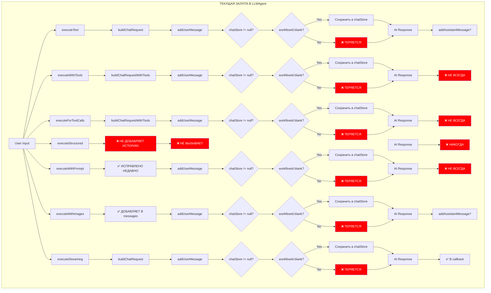
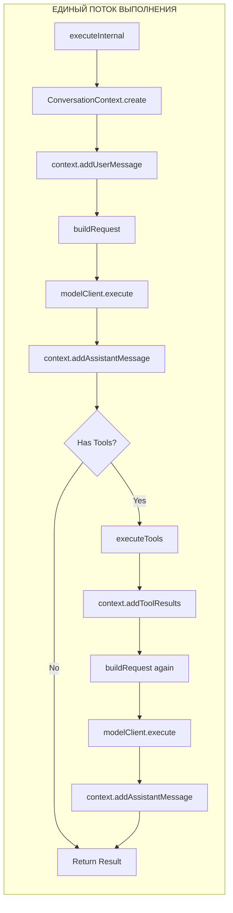

# 🔥 ПОЛНЫЙ АНАЛИЗ И ПЛАН РЕФАКТОРИНГА LLMAgent

## 📊 ТЕКУЩЕЕ СОСТОЯНИЕ - ПОЛНЫЙ ПИЗДЕЦ

### Схема текущего хаоса в управлении историей



## 🔴 ГЛАВНЫЕ ПРОБЛЕМЫ

### 1. МЕТОДЫ РАБОТАЮТ ПО-РАЗНОМУ

| Метод | Добавляет user в messages? | Сохраняет user в chatStore? | Добавляет историю? | Сохраняет response? |
|-------|---------------------------|----------------------------|-------------------|-------------------|
| executeText | ✅ Через buildChatRequest | ⚠️ Если условие | ✅ | ⚠️ Если условие |
| executeWithTools | ✅ | ⚠️ Если условие | ✅ | ❌ НЕ ВСЕГДА |
| executeForToolCalls | ✅ | ⚠️ Если условие | ✅ | ❌ НЕТ |
| executeStructured | ✅ ТЕПЕРЬ | ✅ ТЕПЕРЬ | ✅ ТЕПЕРЬ | ❌ НЕТ |
| executeWithPrompt | ✅ ТЕПЕРЬ | ⚠️ Если условие | ✅ | ⚠️ Если условие |
| executeWithImages | ✅ | ⚠️ Если условие | ❌ НЕТ | ⚠️ Если условие |
| executeStreaming | ✅ | ⚠️ Если условие | ✅ | ✅ В callback |

### 2. УСЛОВИЯ СОХРАНЕНИЯ В ИСТОРИЮ - ЕБАНЫЙ АД

```java
// ЭТО ПИЗДЕЦ - РАБОТАЕТ ТОЛЬКО ПРИ ДВУХ УСЛОВИЯХ
if (chatStore != null && StringUtils.isBlank(workflowId)) {
    chatStore.add(chatId, content, MessageType.USER);
}
// ИНАЧЕ - НАХУЙ, ТЕРЯЕМ ВСЁ
```

### 3. ДУБЛИРОВАНИЕ КОДА

- **7 разных execute методов** - каждый со своей логикой
- **3 разных buildChatRequest** метода
- **2 метода add*Message** которые работают через жопу
- **Логика работы с tools** продублирована в разных местах

## 🎯 ЦЕЛЕВАЯ АРХИТЕКТУРА - КАК ДОЛЖНО БЫТЬ

### Правильная схема работы с историей

```mermaid
graph TB
    subgraph "ПРАВИЛЬНАЯ АРХИТЕКТУРА"
        Input[User Input + Variables] --> Context[ConversationContext]
        
        Context --> Mode{Режим истории?}
        
        Mode -->|"chatStore != null && workflowId == null"| HistoryMode[РЕЖИМ С ИСТОРИЕЙ]
        Mode -->|"Иначе"| StatelessMode[РЕЖИМ БЕЗ ИСТОРИИ]
        
        subgraph "РЕЖИМ С ИСТОРИЕЙ"
            HistoryMode --> H1[Загрузить историю из chatStore]
            H1 --> H2[Добавить system message]
            H2 --> H3[Добавить все из истории]
            H3 --> H4[Добавить user message]
            H4 --> H5[Сохранить user в chatStore]
            H5 --> H6[Выполнить запрос]
            H6 --> H7[Сохранить response в chatStore]
            H7 --> H8{Есть tools?}
            H8 -->|Yes| H9[Сохранить tool results]
            H8 -->|No| H10[Вернуть результат]
            H9 --> H10
        end
        
        subgraph "РЕЖИМ БЕЗ ИСТОРИИ"
            StatelessMode --> S1[Создать пустой контекст]
            S1 --> S2[Добавить system message]
            S2 --> S3[Добавить user message в messages]
            S3 --> S4[Выполнить запрос]
            S4 --> S5{Есть tools?}
            S5 -->|Yes| S6[Добавить tool results в messages]
            S5 -->|No| S7[Вернуть результат]
            S6 --> S7
        end
        
        H10 --> Result[Единый результат]
        S7 --> Result
    end
    
    style HistoryMode fill:#00ff00,color:#000
    style StatelessMode fill:#0099ff,color:#fff
```



### Схема унифицированного выполнения



## 📝 ДЕТАЛЬНЫЙ ПЛАН РЕФАКТОРИНГА

### ЭТАП 1: Создать единый ConversationContext

```java
/**
 * Единый контекст управления историей разговора
 * РЕШАЕТ ВСЕ ПРОБЛЕМЫ С ИСТОРИЕЙ В ОДНОМ МЕСТЕ
 */
private class ConversationContext {
    private final List<ModelContentMessage> messages;
    private final boolean historyModeEnabled;
    private final ChatStore store;
    private final String conversationId;
    
    ConversationContext() {
        this.messages = new ArrayList<>();
        this.store = chatStore;
        this.conversationId = chatId;
        
        // ОПРЕДЕЛЯЕМ РЕЖИМ РАЗ И НАВСЕГДА
        this.historyModeEnabled = (store != null && StringUtils.isBlank(workflowId));
        
        // Добавляем system message
        if (StringUtils.isNotBlank(systemMessage)) {
            messages.add(ModelContentMessage.create(Role.system, systemMessage));
        }
        
        // Загружаем историю ТОЛЬКО в режиме с историей
        if (historyModeEnabled) {
            loadHistory();
        }
    }
    
    private void loadHistory() {
        List<ChatMessage> history = store.getRecent(conversationId);
        for (ChatMessage msg : history) {
            messages.add(convertToModelMessage(msg));
        }
    }
    
    /**
     * ВСЕГДА добавляет в messages
     * В режиме с историей ТАКЖЕ сохраняет в store
     */
    void addUserMessage(String content) {
        // ВСЕГДА добавляем в текущий контекст
        messages.add(ModelContentMessage.create(Role.user, content));
        
        // Сохраняем в историю ТОЛЬКО если режим с историей
        if (historyModeEnabled) {
            store.add(conversationId, content, MessageType.USER);
        }
    }
    
    /**
     * ВСЕГДА добавляет в messages
     * В режиме с историей ТАКЖЕ сохраняет в store
     */
    void addAssistantMessage(String content) {
        // ВСЕГДА добавляем в текущий контекст
        messages.add(ModelContentMessage.create(Role.assistant, content));
        
        // Сохраняем в историю ТОЛЬКО если режим с историей
        if (historyModeEnabled) {
            store.add(conversationId, content, MessageType.AI);
        }
    }
    
    /**
     * Добавляет результаты выполнения инструментов
     */
    void addToolResults(List<ToolExecutionResult> results) {
        StringBuilder combined = new StringBuilder();
        for (ToolExecutionResult result : results) {
            String msg = result.isSuccess() ?
                String.format("[Tool: %s]\nResult: %s\n", result.getToolName(), result.getResult()) :
                String.format("[Tool: %s]\nError: %s\n", result.getToolName(), result.getError());
            combined.append(msg);
        }
        
        // Добавляем как user message (это ответ от инструментов)
        addUserMessage(combined.toString());
    }
    
    List<ModelContentMessage> getMessages() {
        return new ArrayList<>(messages);
    }
    
    boolean isHistoryMode() {
        return historyModeEnabled;
    }
}
```

### ЭТАП 2: Создать единый метод выполнения с учётом разных режимов

```java
/**
 * Режимы выполнения запроса
 */
enum ExecutionMode {
    TEXT_TO_TEXT,       // обычный текстовый запрос
    TEXT_TO_IMAGE,      // генерация изображения
    IMAGE_TO_TEXT,      // анализ изображения
    STREAMING,          // стриминг
    MULTIMODAL         // текст + изображения
}

/**
 * ЕДИНСТВЕННЫЙ метод выполнения запросов
 * Поддерживает ВСЕ режимы работы modelClient
 */
private <T> T executeInternal(
    String userMessage,
    Map<String, Object> variables,
    ExecutionConfig config,
    ResponseProcessor<T> processor
) {
    try {
        // 1. СОЗДАЁМ ЕДИНЫЙ КОНТЕКСТ
        ConversationContext context = new ConversationContext();
        
        // 2. ОБРАБАТЫВАЕМ ВХОДНЫЕ ДАННЫЕ
        String processed = processMessageWithVariables(userMessage, variables);
        
        // 3. ДОБАВЛЯЕМ В КОНТЕКСТ в зависимости от режима
        switch (config.getMode()) {
            case TEXT_TO_TEXT:
            case TEXT_TO_IMAGE:
            case STREAMING:
                context.addUserMessage(processed);
                break;
                
            case IMAGE_TO_TEXT:
            case MULTIMODAL:
                // Для multimodal создаём специальный message
                if (config.getImageData() != null) {
                    ModelContentMessage multimodal = createMultimodalMessage(processed, config.getImageData());
                    context.messages.add(multimodal);
                    // Сохраняем текстовую версию в историю
                    if (context.historyModeEnabled) {
                        context.store.add(context.conversationId, processed, MessageType.USER);
                    }
                } else {
                    context.addUserMessage(processed);
                }
                break;
        }
        
        // 4. СТРОИМ ЗАПРОС
        ModelTextRequest request = buildUnifiedRequest(context, config);
        
        // 5. ТРЕЙСИНГ
        if (tracingProvider != null) {
            traceRequest(request, config, variables);
        }
        
        // 6. ВЫПОЛНЯЕМ ЗАПРОС В ЗАВИСИМОСТИ ОТ РЕЖИМА
        Object response = executeByMode(request, config);
        
        // 7. ОБРАБАТЫВАЕМ ОТВЕТ
        if (config.getMode() == ExecutionMode.STREAMING) {
            // Для стриминга особая обработка
            return handleStreamingResponse(response, context, processor);
        }
        
        if (config.getMode() == ExecutionMode.TEXT_TO_IMAGE) {
            // Для генерации изображений
            return handleImageGenerationResponse(response, processor);
        }
        
        // Для текстовых ответов
        ModelTextResponse textResponse = (ModelTextResponse) response;
        String responseText = extractResponseText(textResponse);
        context.addAssistantMessage(responseText);
        
        // 8. ОБРАБАТЫВАЕМ TOOLS ЕСЛИ ЕСТЬ
        if (config.isToolsEnabled() && hasToolCalls(textResponse)) {
            return handleToolExecution(textResponse, context, config, processor);
        }
        
        // 9. ВОЗВРАЩАЕМ РЕЗУЛЬТАТ
        return processor.process(textResponse, null);
        
    } catch (Exception e) {
        log.error("Execution failed for mode: " + config.getMode(), e);
        throw new RuntimeException("Execution failed", e);
    }
}

/**
 * Выполняет запрос в зависимости от режима
 */
private Object executeByMode(ModelTextRequest request, ExecutionConfig config) {
    switch (config.getMode()) {
        case TEXT_TO_TEXT:
            return modelClient.textToText(request);
            
        case IMAGE_TO_TEXT:
        case MULTIMODAL:
            return modelClient.imageToText(request);
            
        case TEXT_TO_IMAGE:
            // Для генерации изображений нужен другой request
            ModelImageRequest imageRequest = ModelImageRequest.builder()
                .prompt(extractUserMessage(request))
                .model(config.getImageModel() != null ? config.getImageModel() : imageModel)
                .build();
            return modelClient.textToImage(imageRequest);
            
        case STREAMING:
            return modelClient.streamTextToText(request);
            
        default:
            throw new IllegalArgumentException("Unknown execution mode: " + config.getMode());
    }
}

/**
 * Обработка tool execution
 */
private <T> T handleToolExecution(
    ModelTextResponse response,
    ConversationContext context,
    ExecutionConfig config,
    ResponseProcessor<T> processor
) {
    List<ToolExecutionResult> toolResults = executeToolCalls(response);
    context.addToolResults(toolResults);
    
    // Follow-up запрос для получения финального ответа
    ModelTextRequest followUp = buildUnifiedRequest(context, 
        ExecutionConfig.simple().withMode(ExecutionMode.TEXT_TO_TEXT));
    ModelTextResponse finalResponse = modelClient.textToText(followUp);
    
    String finalText = extractResponseText(finalResponse);
    context.addAssistantMessage(finalText);
    
    return processor.process(finalResponse, toolResults);
}

/**
 * Обработка streaming ответа
 */
private <T> T handleStreamingResponse(
    Object streamingResponse,
    ConversationContext context,
    ResponseProcessor<T> processor
) {
    // Специальная логика для streaming
    StreamingResponse<String> stream = (StreamingResponse<String>) streamingResponse;
    StringBuilder fullResponse = new StringBuilder();
    
    CompletableFuture<T> future = new CompletableFuture<>();
    
    stream.subscribe(new StreamingCallback<String>() {
        @Override
        public void onNext(String chunk) {
            fullResponse.append(chunk);
            // Можно добавить callback для передачи chunk'ов
            if (processor instanceof StreamingProcessor) {
                ((StreamingProcessor<T>) processor).onChunk(chunk);
            }
        }
        
        @Override
        public void onComplete() {
            String finalText = fullResponse.toString();
            context.addAssistantMessage(finalText);
            
            // Создаём synthetic response для processor
            ModelTextResponse syntheticResponse = createSyntheticResponse(finalText);
            T result = processor.process(syntheticResponse, null);
            future.complete(result);
        }
        
        @Override
        public void onError(Throwable error) {
            future.completeExceptionally(error);
        }
    });
    
    try {
        return future.get(); // Или возвращаем future для async обработки
    } catch (Exception e) {
        throw new RuntimeException("Streaming failed", e);
    }
}

/**
 * Обработка ответа генерации изображения
 */
private <T> T handleImageGenerationResponse(
    Object response,
    ResponseProcessor<T> processor
) {
    ModelImageResponse imageResponse = (ModelImageResponse) response;
    
    // Не добавляем в историю, так как это изображение
    // Но можно сохранить метаданные если нужно
    
    return processor.processImage(imageResponse);
}
```

### ЭТАП 3: Создать единый билдер запросов

```java
/**
 * ОДИН билдер для ВСЕХ типов запросов
 */
private ModelTextRequest buildUnifiedRequest(ConversationContext context, ExecutionConfig config) {
    ModelTextRequest.Builder builder = ModelTextRequest.builder()
        .model(getEffectiveModel())
        .temperature(config.getTemperature() != null ? config.getTemperature() : temperature)
        .messages(context.getMessages());
    
    // Добавляем tools если нужно
    if (config.isToolsEnabled() && toolRegistry != null) {
        ModelClient.Tool[] tools = toolRegistry.getTools();
        if (tools.length > 0) {
            builder.tools(Arrays.asList(tools));
        }
    }
    
    // Добавляем response format если нужно
    if (config.getResponseFormat() != null) {
        builder.responseFormat(config.getResponseFormat());
    }
    
    // Max tokens если указано
    if (config.getMaxTokens() != null) {
        builder.maxTokens(config.getMaxTokens());
    }
    
    return builder.build();
}
```

### ЭТАП 4: Конфигурация выполнения

```java
/**
 * Конфигурация для разных типов выполнения
 */
@Data
@Builder
private static class ExecutionConfig {
    private ExecutionMode mode;           // режим выполнения
    private boolean toolsEnabled;         // включены ли tools
    private boolean executeTools;         // выполнять ли tools автоматически
    private ResponseFormat responseFormat; // формат ответа для structured
    private Double temperature;           // температура
    private Integer maxTokens;            // макс токенов
    private String tracingType;          // тип трейсинга
    private Prompt prompt;                // prompt template
    private List<byte[]> imageData;      // данные изображений для multimodal
    private String imageModel;           // модель для генерации изображений
    private StreamingCallback callback;   // callback для streaming
    
    // Фабричные методы для разных режимов
    
    static ExecutionConfig simple() {
        return ExecutionConfig.builder()
            .mode(ExecutionMode.TEXT_TO_TEXT)
            .toolsEnabled(false)
            .executeTools(false)
            .tracingType("TEXT")
            .build();
    }
    
    static ExecutionConfig withTools() {
        return ExecutionConfig.builder()
            .mode(ExecutionMode.TEXT_TO_TEXT)
            .toolsEnabled(true)
            .executeTools(false)
            .tracingType("TOOL_CALLS")
            .build();
    }
    
    static ExecutionConfig withToolsAndExecution() {
        return ExecutionConfig.builder()
            .mode(ExecutionMode.TEXT_TO_TEXT)
            .toolsEnabled(true)
            .executeTools(true)
            .tracingType("TOOLS_EXEC")
            .build();
    }
    
    static ExecutionConfig structured(Class<?> targetClass) {
        return ExecutionConfig.builder()
            .mode(ExecutionMode.TEXT_TO_TEXT)
            .toolsEnabled(false)
            .executeTools(false)
            .responseFormat(ResponseFormat.jsonSchema(targetClass))
            .tracingType("STRUCTURED")
            .temperature(0.1)
            .build();
    }
    
    static ExecutionConfig withPrompt(Prompt prompt) {
        return ExecutionConfig.builder()
            .mode(ExecutionMode.TEXT_TO_TEXT)
            .toolsEnabled(false)
            .executeTools(false)
            .prompt(prompt)
            .temperature(prompt.getTemperature())
            .tracingType("PROMPT")
            .build();
    }
    
    static ExecutionConfig imageGeneration(String imageModel) {
        return ExecutionConfig.builder()
            .mode(ExecutionMode.TEXT_TO_IMAGE)
            .imageModel(imageModel)
            .tracingType("IMAGE_GEN")
            .build();
    }
    
    static ExecutionConfig imageAnalysis(List<byte[]> imageData) {
        return ExecutionConfig.builder()
            .mode(ExecutionMode.IMAGE_TO_TEXT)
            .imageData(imageData)
            .tracingType("IMAGE_ANALYSIS")
            .build();
    }
    
    static ExecutionConfig multimodal(List<byte[]> imageData) {
        return ExecutionConfig.builder()
            .mode(ExecutionMode.MULTIMODAL)
            .imageData(imageData)
            .tracingType("MULTIMODAL")
            .build();
    }
    
    static ExecutionConfig streaming(StreamingCallback callback) {
        return ExecutionConfig.builder()
            .mode(ExecutionMode.STREAMING)
            .callback(callback)
            .tracingType("STREAMING")
            .build();
    }
    
    // Helper метод для изменения режима
    ExecutionConfig withMode(ExecutionMode newMode) {
        this.mode = newMode;
        return this;
    }
}

/**
 * Процессор результатов - базовый интерфейс
 */
interface ResponseProcessor<T> {
    T process(ModelTextResponse response, List<ToolExecutionResult> toolResults);
    
    // Дополнительные методы для разных типов ответов
    default T processImage(ModelImageResponse response) {
        throw new UnsupportedOperationException("Image processing not supported");
    }
    
    default T processStream(String finalText) {
        // По умолчанию создаём synthetic response
        ModelTextResponse synthetic = createSyntheticResponse(finalText);
        return process(synthetic, null);
    }
}

/**
 * Расширенный процессор для streaming
 */
interface StreamingProcessor<T> extends ResponseProcessor<T> {
    void onChunk(String chunk);
    void onError(Throwable error);
    void onComplete();
}
```

### ЭТАП 5: Переписать все public методы как обёртки

```java
public AgentResponse<String> executeText(String message, Map<String, Object> variables) {
    return executeInternal(
        message,
        variables,
        ExecutionConfig.simple(),
        (response, tools) -> AgentResponse.text(extractResponseText(response))
    );
}

public AgentResponse<List<ToolCall>> executeForToolCalls(String message, Map<String, Object> variables) {
    return executeInternal(
        message,
        variables,
        ExecutionConfig.withTools(),
        (response, tools) -> AgentResponse.toolCalls(extractToolCalls(response))
    );
}

public AgentResponse<List<ToolExecutionResult>> executeWithTools(String message, Map<String, Object> variables) {
    return executeInternal(
        message,
        variables,
        ExecutionConfig.withToolsAndExecution(),
        (response, tools) -> AgentResponse.toolResults(tools != null ? tools : Collections.emptyList())
    );
}

public <T> AgentResponse<T> executeStructured(String message, Class<T> targetClass) {
    return executeInternal(
        message,
        Collections.emptyMap(),
        ExecutionConfig.structured(targetClass),
        (response, tools) -> {
            String json = extractResponseText(response);
            T result = JsonUtils.fromJson(json, targetClass);
            return AgentResponse.structured(result);
        }
    );
}

public AgentResponse<String> executeWithPrompt(String promptId, Map<String, Object> variables) {
    // Загружаем prompt
    Prompt prompt = loadPrompt(promptId);
    String message = PromptUtils.applyVariables(prompt.getMessage(), variables);
    
    return executeInternal(
        message,
        variables,
        ExecutionConfig.withPrompt(prompt),
        (response, tools) -> AgentResponse.text(extractResponseText(response))
    );
}

public AgentResponse<String> executeWithImages(String text, List<byte[]> imageDataList, Map<String, Object> variables) {
    // Особый случай - multimodal
    ConversationContext context = new ConversationContext();
    
    String processedText = processMessageWithVariables(text, variables);
    
    // Создаём multimodal content
    List<ModelContentElement> content = buildMultimodalContent(processedText, imageDataList);
    ModelContentMessage multimodalMessage = ModelContentMessage.builder()
        .role(Role.user)
        .content(content)
        .build();
    
    // Добавляем в контекст
    context.messages.add(multimodalMessage);
    if (context.historyModeEnabled) {
        context.store.add(context.conversationId, processedText, MessageType.USER);
    }
    
    // Выполняем
    ModelTextRequest request = buildUnifiedRequest(context, ExecutionConfig.simple());
    ModelTextResponse response = modelClient.imageToText(request);
    
    String responseText = extractResponseText(response);
    context.addAssistantMessage(responseText);
    
    return AgentResponse.text(responseText);
}

public CompletableFuture<String> executeStreaming(String input, Map<String, Object> variables, StreamingCallback<String> callback) {
    CompletableFuture<String> future = new CompletableFuture<>();
    
    try {
        ConversationContext context = new ConversationContext();
        String processed = processMessageWithVariables(input, variables);
        context.addUserMessage(processed);
        
        ModelTextRequest request = buildUnifiedRequest(context, ExecutionConfig.simple());
        StreamingResponse<String> streamingResponse = modelClient.streamTextToText(request);
        
        final StringBuilder fullResponse = new StringBuilder();
        
        streamingResponse.subscribe(new StreamingCallback<String>() {
            @Override
            public void onNext(String item) {
                fullResponse.append(item);
                callback.onNext(item);
            }
            
            @Override
            public void onError(Throwable error) {
                callback.onError(error);
                future.completeExceptionally(error);
            }
            
            @Override
            public void onComplete() {
                String finalResponse = fullResponse.toString();
                context.addAssistantMessage(finalResponse);
                callback.onComplete();
                future.complete(finalResponse);
            }
        });
        
    } catch (Exception e) {
        callback.onError(e);
        future.completeExceptionally(e);
    }
    
    return future;
}
```

## 🗑️ ЧТО УДАЛИТЬ

### Методы для удаления:
1. ❌ `addUserMessage(String)` - заменён на ConversationContext
2. ❌ `addAssistantMessage(String)` - заменён на ConversationContext
3. ❌ `buildChatRequest(String)` - заменён на buildUnifiedRequest
4. ❌ `buildChatRequestWithTools()` - заменён на buildUnifiedRequest
5. ❌ `buildChatRequestWithTools(String)` - заменён на buildUnifiedRequest
6. ❌ `convertMemoryToMessages()` - логика в ConversationContext
7. ❌ `buildBaseMessages()` - логика в ConversationContext
8. ❌ `executeToolsAndGetResults()` - логика в executeInternal

## 📊 МЕТРИКИ РЕЗУЛЬТАТА

### БЫЛО:
- **1285 строк** говнокода
- **7+ execute методов** с разной логикой
- **3+ build методов**
- **Дублирование** везде
- **Баги** из-за несогласованности
- **Невозможно** поддерживать

### СТАНЕТ:
- **~500 строк** чистого кода
- **1 executeInternal** метод
- **1 ConversationContext** класс
- **1 buildUnifiedRequest** метод
- **Единообразная** логика
- **Легко** поддерживать
- **Нет багов** с историей

## ✅ ПРОВЕРОЧНЫЙ ЧЕКЛИСТ

После рефакторинга ОБЯЗАТЕЛЬНО проверить:

### Режим С историей (chatStore != null && workflowId == null):
- [ ] User messages сохраняются в chatStore
- [ ] Assistant responses сохраняются в chatStore
- [ ] Tool results сохраняются в chatStore
- [ ] История загружается при следующем запросе
- [ ] Последовательные запросы видят предыдущие
  
### Режим БЕЗ истории (chatStore == null || workflowId != null):
- [ ] Весь контекст в messages текущего запроса
- [ ] Ничего не теряется между tool calls
- [ ] Follow-up запросы содержат полный контекст
- [ ] Tool results включены в контекст

### Все execute методы:
- [ ] executeText работает
- [ ] executeWithTools работает с инструментами
- [ ] executeStructured возвращает типизированный результат
- [ ] executeWithPrompt использует шаблоны
- [ ] executeWithImages работает с картинками
- [ ] executeStreaming стримит правильно
- [ ] executeForToolCalls возвращает tool calls

### Edge cases:
- [ ] chatStore = null - всё работает
- [ ] workflowId != null - история не сохраняется
- [ ] Пустой systemMessage - не крашится
- [ ] Нет tools - не крашится
- [ ] Ошибки в tool execution - обрабатываются

## 🚨 КРИТИЧЕСКИ ВАЖНО

1. **ВСЁ должно идти через ConversationContext** - никаких прямых вызовов chatStore
2. **executeInternal - единая точка выполнения** - никакой логики в публичных методах
3. **Два режима чётко разделены** - с историей и без
4. **Никакого дублирования** - DRY принцип везде
5. **Тестировать оба режима** - с chatStore и без

## 🔨 КАК ПРОВЕСТИ РЕФАКТОРИНГ

### Шаг 1: Создать новые классы
```bash
# Создать ConversationContext как внутренний класс
# Создать ExecutionConfig 
# Создать ResponseProcessor интерфейс
```

### Шаг 2: Имплементировать executeInternal
```bash
# Написать executeInternal метод
# Написать buildUnifiedRequest метод
# Убедиться что компилируется
```

### Шаг 3: Переписать один метод для теста
```bash
# Переписать executeText через executeInternal
# Протестировать что работает
# Убедиться что история сохраняется
```

### Шаг 4: Переписать остальные методы
```bash
# По одному переписать все execute методы
# После каждого - тестировать
```

### Шаг 5: Удалить старый код
```bash
# Удалить старые build методы
# Удалить add*Message методы
# Удалить convertMemoryToMessages
# Удалить buildBaseMessages
```

### Шаг 6: Финальное тестирование
```bash
# Прогнать все тесты
# Проверить оба режима
# Проверить edge cases
```

---

# ВЫВОД: ТЕКУЩИЙ КОД - ПОЛНОЕ ГОВНО, НУЖЕН ТОТАЛЬНЫЙ РЕФАКТОРИНГ!

## Ожидаемый результат:
- Код станет в 2.5 раза короче
- Исчезнут все баги с историей
- Будет легко добавлять новые фичи
- Можно будет спокойно поддерживать

## Срок выполнения:
- 1-2 дня на полный рефакторинг
- 1 день на тестирование
- Итого: 3 дня на полное исправление

---

*Документ создан: 2025-09-27*
*Автор: AI Assistant*
*Статус: ТРЕБУЕТСЯ НЕМЕДЛЕННЫЙ РЕФАКТОРИНГ*