# Model Comparison Testing & Automated Dataset Creation

## Техническая спецификация

> Расширение модуля `driftkit-context-engineering` для A/B-тестирования LLM-моделей и автоматизированного создания тестовых датасетов из трейсов.

### Контекст: параллельный Frontend Refactoring

Одновременно с этой спецификацией ведётся рефакторинг фронтенда по `FRONTEND_CODE_REVIEW.md`. Новые компоненты **должны** следовать новым паттернам:

| Аспект | Старый подход (legacy) | Новый подход (target) |
|--------|----------------------|----------------------|
| Build tool | Vue CLI 5.0 | **Vite** |
| UI library | Raw Bootstrap 5 | **PrimeVue / Naive UI** |
| Navigation | Вложенные tabs | **Sidebar + top-level routes** |
| Types | `any` повсюду | **Строгие TypeScript interfaces** |
| State | Смешанные паттерны | **Modular composition (как PromptsTab)** |
| Auth headers | Дублированные в каждом вызове | **Axios interceptor** |
| Error handling | `alert()` / `console.error()` | **Toast notifications** |
| Logging | `console.log` с эмодзи | **Structured logger с уровнями** |

Все новые Vue-компоненты (ComparisonTab, DatasetGenerationWizard) создаются сразу по новым стандартам. Если рефакторинг навигации не завершён к моменту реализации — компоненты создаются как самостоятельные route views, готовые к подключению в sidebar.

---

## Часть 1: A/B-сравнение моделей (Model Comparison)

### 1.1 Концепция

Задача — на одном и том же наборе запросов (TestSet) выполнить inference двумя моделями, собрать результаты, прогнать через единый набор Evaluation-ов и получить side-by-side сравнение. Одна модель назначается **Reference** (эталон), вторая — **Challenger**.

**Ключевые принципы:**
- Повторное использование существующих `TestSet`, `Evaluation`, `EvaluationConfig`
- Поддержка как single-turn запросов, так и multi-turn chat-диалогов
- Три режима оценки: rule-based (существующие Evaluation), LLM-as-a-Judge, гибридный
- Сравнение не только "pass/fail", но и относительного качества (win/tie/loss)

### 1.2 Архитектура верхнего уровня

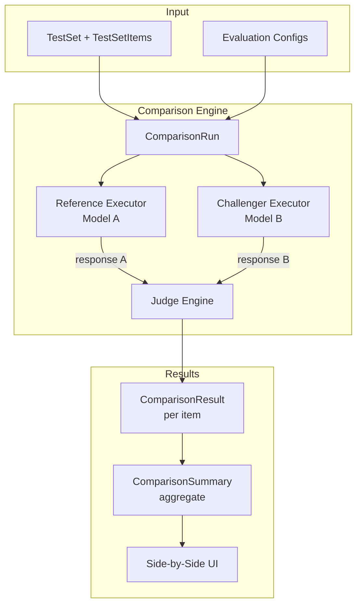

### 1.3 Доменные модели

#### ComparisonRun

Расширяет концепцию `EvaluationRun` для парного выполнения.

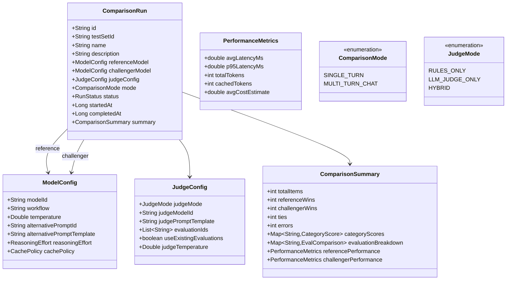

#### ComparisonResult

Хранит результат сравнения для каждого элемента тестового набора.

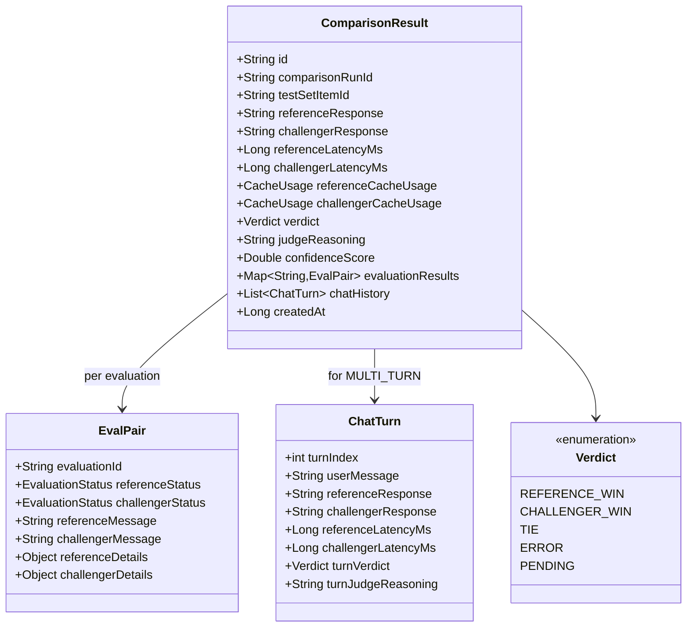

### 1.4 Single-turn flow

Для одиночных запросов — параллельное выполнение обоих моделей с последующей оценкой.

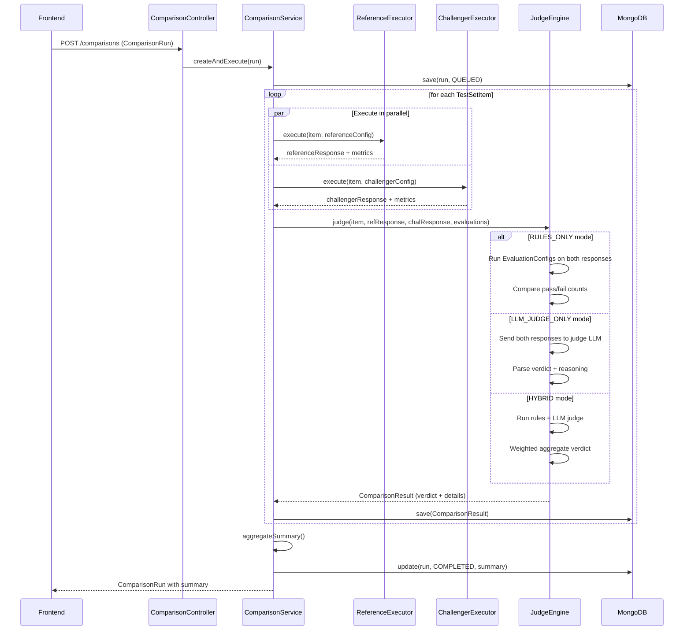

### 1.5 Multi-turn chat flow

Для чат-диалогов нужно прогонять **всю цепочку** сообщений последовательно, чтобы каждый следующий ответ модели зависел от её же предыдущего ответа, а не от ответа другой модели.

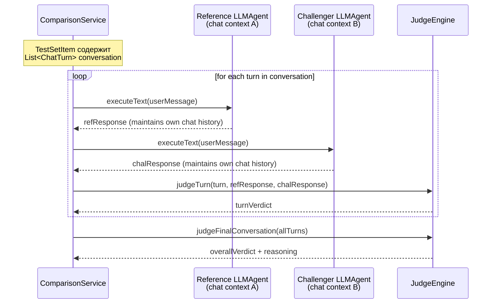

**Важно:** Каждая модель ведет свой собственный контекст диалога через `LLMAgent` с отдельным `chatId`. Пользовательские сообщения одинаковые для обеих, но ответы моделей и, соответственно, chat history — разные.

#### Расширение TestSetItem для multi-turn

```java
// Новое поле в TestSetItem для поддержки диалогов
public interface ChatTestSetItem extends TestSetItem {
    List<ConversationTurn> getConversation();
    String getSystemMessage(); // общий system prompt
}

@Data
public class ConversationTurn {
    private int turnIndex;
    private String userMessage;             // что отправляет "пользователь"
    private String expectedResponse;        // опциональный эталонный ответ
    private Map<String, Object> variables;  // переменные для подстановки
    private List<String> turnEvaluationIds; // оценки для конкретного хода
}
```

### 1.6 LLM-as-a-Judge

Модуль использует существующий `LlmEvalConfig` как основу, но расширяет его для **сравнительной** оценки.

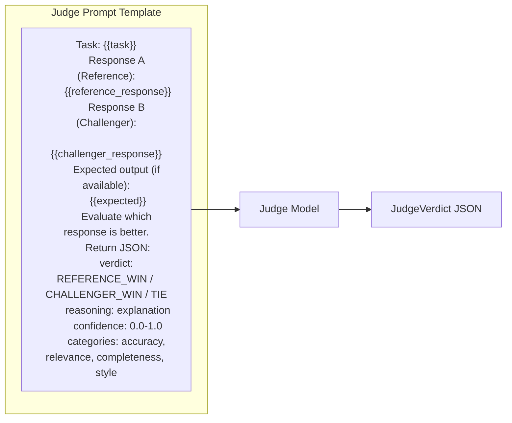

#### Структурированный ответ Judge

```java
@Data
public class JudgeVerdict {
    private Verdict verdict;           // REFERENCE_WIN, CHALLENGER_WIN, TIE
    private String reasoning;          // Почему такой вердикт
    private double confidence;         // 0.0-1.0
    private Map<String, CategoryScore> categories; // По категориям
}

@Data
public class CategoryScore {
    private String category;    // accuracy, relevance, completeness, style, safety
    private Verdict winner;
    private int referenceScore; // 1-5
    private int challengerScore; // 1-5
    private String explanation;
}
```

Для получения структурированного ответа от Judge используется `LLMAgent.executeStructured(prompt, JudgeVerdict.class)` — это уже поддерживается фреймворком через `ResponseFormat.jsonSchema()`.

### 1.7 Hybrid judging — объединение правил и LLM

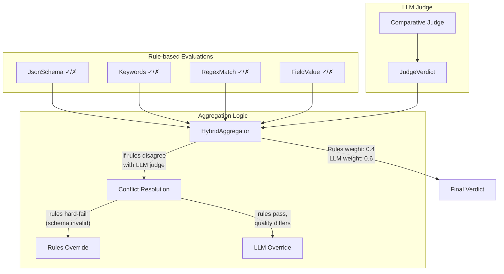

**Логика агрегации:**
1. Если одна модель не прошла hard-constraint (JSON schema, обязательные поля) — она проигрывает независимо от LLM-оценки
2. Если обе модели прошли/не прошли hard-constraints — LLM judge определяет победителя по качеству
3. Confidence score LLM judge учитывается при пограничных случаях

### 1.8 API Endpoints

```
POST   /data/v1.0/admin/comparisons                          — Создать ComparisonRun
GET    /data/v1.0/admin/comparisons                          — Все ComparisonRun
GET    /data/v1.0/admin/comparisons/{id}                     — Получить ComparisonRun + summary
POST   /data/v1.0/admin/comparisons/{id}/execute             — Запустить сравнение
DELETE /data/v1.0/admin/comparisons/{id}                     — Удалить
GET    /data/v1.0/admin/comparisons/{id}/results             — Результаты по items
GET    /data/v1.0/admin/comparisons/{id}/results/{itemId}    — Детали по конкретному item
POST   /data/v1.0/admin/comparisons/{id}/results/{resultId}/override — Ручное переопределение verdict
GET    /data/v1.0/admin/comparisons/{id}/export              — Экспорт в CSV/JSON
```

### 1.9 Интеграция с существующими сущностями

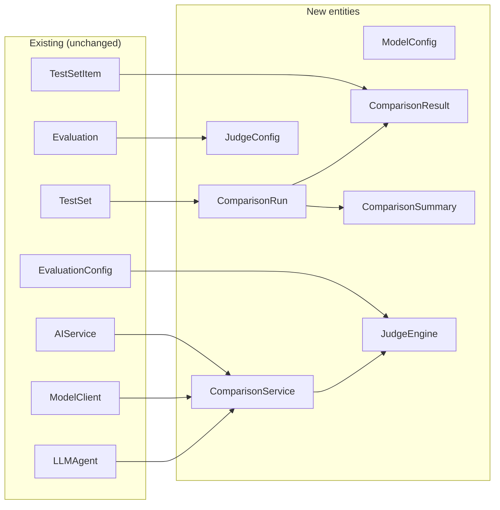

**Что не меняется:**
- `TestSet`, `TestSetItem` — используются как есть
- `Evaluation`, `EvaluationConfig` — применяются к обоим ответам
- `AIService` — используется для выполнения запросов
- `ModelClient` — абстракция провайдеров остается

**Что добавляется:**
- `ComparisonRun`, `ComparisonResult`, `ComparisonSummary` — новые доменные объекты
- `ComparisonService` — оркестрирует выполнение
- `JudgeEngine` — сравнительная оценка
- `ComparisonController` — REST API
- Новые Vue-компоненты

### 1.10 Frontend — Side-by-Side Comparison UI

> **Важно:** Все компоненты ниже создаются по стандартам из `FRONTEND_CODE_REVIEW.md` — PrimeVue/Naive UI, строгие TypeScript interfaces, modular composition, Vite, toast notifications вместо `alert()`.

#### Routing (top-level в sidebar)

Comparison становится top-level route, а не вложенной вкладкой:

```
/comparisons                → ComparisonListView.vue
/comparisons/new            → ComparisonCreateView.vue
/comparisons/:id            → ComparisonResultsView.vue
/comparisons/:id/items/:iid → ComparisonDetailView.vue
```

#### Компонентная структура

```
views/
  comparisons/
    ComparisonListView.vue          — список всех ComparisonRun
    ComparisonCreateView.vue        — wizard создания сравнения
    ComparisonResultsView.vue       — dashboard + side-by-side table
    ComparisonDetailView.vue        — детали по конкретному item
    
components/
  comparisons/
    types.ts                        — строгие TS interfaces (не any!)
    api.ts                          — API calls (без ручных auth headers)
    useComparisons.ts               — composable: CRUD, execution
    useComparisonResults.ts         — composable: results, filters, sorting
    ComparisonSummaryCards.vue      — dashboard карточки (PrimeVue Card)
    ComparisonChart.vue             — pie/bar charts (Chart.js или PrimeVue Chart)
    SideBySideTable.vue             — DataTable с двумя колонками ответов
    VerdictBadge.vue                — цветовой badge: win/loss/tie
    ComparisonDiffView.vue          — diff view для текстовых различий
    ChatHistoryTimeline.vue         — timeline для multi-turn диалогов
    ModelConfigForm.vue             — форма конфигурации модели (reusable)
    JudgeConfigForm.vue             — настройки judge
```

```mermaid
graph TB
    subgraph "ComparisonCreateView (stepper wizard)"
        STEP1[Step 1: Выбор TestSet<br/>PrimeVue Dropdown + search]
        STEP2[Step 2: Reference Model<br/>ModelConfigForm.vue]
        STEP3[Step 3: Challenger Model<br/>ModelConfigForm.vue]
        STEP4[Step 4: Judge Settings<br/>JudgeConfigForm.vue]
        STEP5[Step 5: Review & Launch]
    end

    subgraph "ComparisonResultsView"
        SUMMARY[ComparisonSummaryCards<br/>4 карточки: wins, metrics, cost, latency]
        CHART[ComparisonChart<br/>Pie: wins/losses/ties<br/>Bar: by category]
        
        subgraph "SideBySideTable (PrimeVue DataTable)"
            FILTERS[Verdict filter chips + search + sort]
            HDR[Item | Reference | Challenger | Verdict | Confidence]
            ROW1[item1 | response A | response B | VerdictBadge ✓Ref]
            ROW2[item2 | response A | response B | VerdictBadge ✓Chal]
            ROW3[item3 | response A | response B | VerdictBadge ≈Tie]
        end
    end

    subgraph "ComparisonDetailView (expandable panel)"
        TABS[PrimeVue TabView]
        TAB1[Responses → ComparisonDiffView]
        TAB2[Evaluations → side-by-side eval results]
        TAB3[Judge → reasoning + confidence]
        TAB4[Metrics → latency/tokens/cost bars]
        TAB5[Chat → ChatHistoryTimeline]
        OVERRIDE[Override verdict button → toast confirmation]
    end

    STEP1 --> STEP2 --> STEP3 --> STEP4 --> STEP5
    STEP5 -->|launch| SUMMARY
    SUMMARY --> CHART
    CHART --> FILTERS --> HDR
    ROW1 -->|click| TABS
```

#### TypeScript interfaces (строгие, не `any`)

```typescript
// components/comparisons/types.ts

export interface ComparisonRun {
  id: string;
  testSetId: string;
  name: string;
  description: string;
  referenceModel: ModelConfig;
  challengerModel: ModelConfig;
  judgeConfig: JudgeConfig;
  mode: 'SINGLE_TURN' | 'MULTI_TURN_CHAT';
  status: RunStatus;
  startedAt: number | null;
  completedAt: number | null;
  summary: ComparisonSummary | null;
}

export interface ModelConfig {
  modelId: string;
  workflow?: string;
  temperature: number;
  alternativePromptId?: string;
  alternativePromptTemplate?: string;
  reasoningEffort?: string;
  cachePolicy?: string;
}

export interface JudgeConfig {
  judgeMode: 'RULES_ONLY' | 'LLM_JUDGE_ONLY' | 'HYBRID';
  judgeModelId?: string;
  judgePromptTemplate?: string;
  evaluationIds: string[];
  useExistingEvaluations: boolean;
  judgeTemperature: number;
}

export interface ComparisonResult {
  id: string;
  comparisonRunId: string;
  testSetItemId: string;
  referenceResponse: string;
  challengerResponse: string;
  referenceLatencyMs: number;
  challengerLatencyMs: number;
  verdict: Verdict;
  judgeReasoning: string;
  confidenceScore: number;
  evaluationResults: Record<string, EvalPair>;
  chatHistory?: ChatTurn[];
}

export type Verdict = 'REFERENCE_WIN' | 'CHALLENGER_WIN' | 'TIE' | 'ERROR' | 'PENDING';
export type RunStatus = 'QUEUED' | 'RUNNING' | 'COMPLETED' | 'FAILED' | 'CANCELLED';

export interface ComparisonSummary {
  totalItems: number;
  referenceWins: number;
  challengerWins: number;
  ties: number;
  errors: number;
  categoryScores: Record<string, CategoryScore>;
  referencePerformance: PerformanceMetrics;
  challengerPerformance: PerformanceMetrics;
}

export interface EvalPair {
  evaluationId: string;
  referenceStatus: string;
  challengerStatus: string;
  referenceMessage: string;
  challengerMessage: string;
}

export interface ChatTurn {
  turnIndex: number;
  userMessage: string;
  referenceResponse: string;
  challengerResponse: string;
  referenceLatencyMs: number;
  challengerLatencyMs: number;
  turnVerdict: Verdict;
  turnJudgeReasoning: string;
}

export interface CategoryScore {
  category: string;
  winner: Verdict;
  referenceScore: number;
  challengerScore: number;
  explanation: string;
}

export interface PerformanceMetrics {
  avgLatencyMs: number;
  p95LatencyMs: number;
  totalTokens: number;
  cachedTokens: number;
  avgCostEstimate: number;
}
```

#### Ключевые элементы UI:

1. **Dashboard карточки (PrimeVue Card):**
   - Pie chart: Reference wins / Challenger wins / Ties
   - Bar chart: wins по категориям (accuracy, relevance, completeness)
   - Latency comparison (avg, p95) — горизонтальные бары
   - Token usage comparison
   - Estimated cost comparison

2. **Side-by-Side таблица (PrimeVue DataTable):**
   - Две колонки с ответами моделей, truncated с expand
   - `VerdictBadge.vue` — цветовая маркировка: зеленый/красный/серый
   - Filter chips: "Reference wins", "Challenger wins", "Ties", "Errors"
   - Column sorting по confidence score, latency, verdict
   - Row expansion для inline preview

3. **Detail panel (PrimeVue TabView):**
   - Tab "Responses": `ComparisonDiffView` — diff с подсветкой различий
   - Tab "Evaluations": две колонки eval results с status badges
   - Tab "Judge": reasoning текст + confidence meter
   - Tab "Metrics": bar chart latency/tokens/cost
   - Tab "Chat": `ChatHistoryTimeline` для multi-turn (вертикальный timeline с ходами)
   - "Override verdict" → PrimeVue ConfirmDialog → toast notification

---

## Часть 2: Автоматизированное создание тестовых датасетов

### 2.1 Концепция

Вместо ручного создания тест-кейсов — использовать накопленные трейсы (`ModelRequestTrace`) как источник данных. AI анализирует трейсы, предлагает фильтры для отбора релевантных записей, пользователь ревьюит и approve/decline каждую запись на удобном экране.

**Пайплайн:**

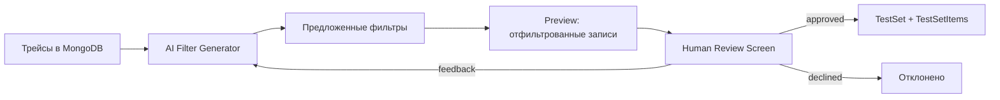

### 2.2 Архитектура — Fixed Pipeline, а не Agent

В соответствии с best practices для предсказуемости и контроля качества, используется **фиксированный LLM pipeline** из последовательных шагов, а не свободный агент.

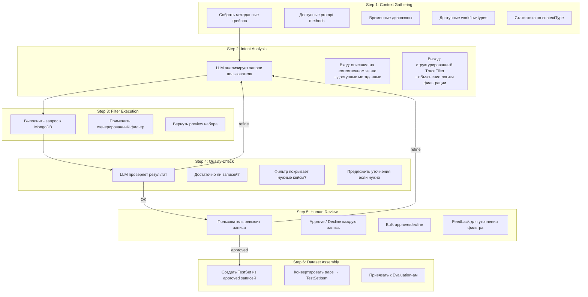

### 2.3 Доменные модели

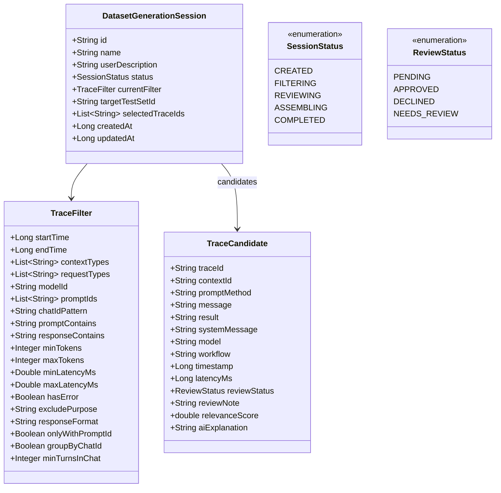

### 2.4 Fixed LLM Pipeline — Step-by-step

#### Step 1: Context Gathering (без LLM)

Собираем метаданные для подсказок AI.

```java
@Data
public class TraceMetadata {
    private List<String> availablePromptMethods;
    private List<String> availableWorkflowTypes;
    private List<String> availableContextTypes;
    private List<String> availableModels;
    private Map<String, Long> promptMethodCounts;
    private long totalTraceCount;
    private Long earliestTraceTimestamp;
    private Long latestTraceTimestamp;
}
```

#### Step 2: Intent Analysis (LLM call #1)

```mermaid
graph LR
    subgraph Input
        UD[User Description<br/>"Хочу собрать все запросы<br/>к промпту classify_sentiment<br/>за последнюю неделю,<br/>где модель вернула JSON"]
        TM[TraceMetadata]
    end

    subgraph "LLM (structured output)"
        LLM[LLMAgent.executeStructured<br/>→ FilterSuggestion.class]
    end

    subgraph Output
        FS[FilterSuggestion]
        FS1["filter: TraceFilter"]
        FS2["explanation: String"]
        FS3["expectedCount: int"]
        FS4["coverageNotes: String"]
    end

    UD --> LLM
    TM --> LLM
    LLM --> FS
```

System prompt для этого шага:

```
You are a test dataset curator for an LLM evaluation platform.
Given a user's description of what kind of test data they need, 
and the available trace metadata, generate a TraceFilter that 
will select the most relevant traces.

Available prompt methods: {{availablePromptMethods}}
Available workflows: {{availableWorkflowTypes}}
Available models: {{availableModels}}
Date range: {{earliestTrace}} to {{latestTrace}}
Total traces: {{totalTraceCount}}

Return a structured TraceFilter with explanation.
```

#### Step 3: Filter Execution (без LLM)

Фильтр строится на основе реальной структуры трейсов (коллекция `model_request_traces`):

```
Реальная структура трейса (из API /analytics/traces):
{
  "id": "e73472bb-...",
  "contextId": "a2400847-...",
  "chatId": "riley-aa49592e-...",          ← идентификатор чат-сессии
  "contextType": "CUSTOM",                 ← CUSTOM | WORKFLOW | AGENT
  "requestType": "TEXT_TO_TEXT",            ← TEXT_TO_TEXT | IMAGE_TO_TEXT
  "modelId": "claude-sonnet-4-5-20250929",
  "promptId": "blog/blog-content-gen...",   ← null если не через PromptService
  "promptTemplate": "[ModelContent...]",    ← полный промпт
  "variables": {"KEY": "value"},            ← null если не через PromptService
  "response": "{\"message\":\"...\"}",      ← ответ модели (часто JSON Schema)
  "responseId": "msg_01937p...",
  "purpose": null,                          ← "qa_test_pipeline" для тестов
  "timestamp": 1776028019261,
  "trace": {
    "executionTimeMs": 3953,
    "promptTokens": 3370,
    "completionTokens": 84,
    "model": "claude-sonnet-4-5-20250929",
    "temperature": 0.0,
    "responseFormat": "json_schema",
    "hasError": false,
    "errorMessage": null
  },
  "workflowInfo": null                      ← объект с workflow metadata
}
```

```java
// Конвертация TraceFilter → MongoDB query
public Page<ModelRequestTrace> executeFilter(TraceFilter filter, Pageable pageable) {
    Query query = new Query();
    
    if (filter.getStartTime() != null)
        query.addCriteria(Criteria.where("timestamp").gte(filter.getStartTime()));
    if (filter.getEndTime() != null)
        query.addCriteria(Criteria.where("timestamp").lte(filter.getEndTime()));
    if (filter.getContextTypes() != null && !filter.getContextTypes().isEmpty())
        query.addCriteria(Criteria.where("contextType").in(filter.getContextTypes()));
    if (filter.getRequestTypes() != null && !filter.getRequestTypes().isEmpty())
        query.addCriteria(Criteria.where("requestType").in(filter.getRequestTypes()));
    if (filter.getModelId() != null)
        query.addCriteria(Criteria.where("modelId").is(filter.getModelId()));
    if (filter.getPromptIds() != null && !filter.getPromptIds().isEmpty())
        query.addCriteria(Criteria.where("promptId").in(filter.getPromptIds()));
    if (filter.getChatIdPattern() != null)
        query.addCriteria(Criteria.where("chatId").regex(filter.getChatIdPattern()));
    if (filter.getPromptContains() != null)
        query.addCriteria(Criteria.where("promptTemplate").regex(filter.getPromptContains(), "i"));
    if (filter.getResponseContains() != null)
        query.addCriteria(Criteria.where("response").regex(filter.getResponseContains(), "i"));
    if (filter.getMinTokens() != null)
        query.addCriteria(Criteria.where("trace.promptTokens").gte(filter.getMinTokens()));
    if (filter.getMaxLatencyMs() != null)
        query.addCriteria(Criteria.where("trace.executionTimeMs").lte(filter.getMaxLatencyMs()));
    if (filter.getResponseFormat() != null)
        query.addCriteria(Criteria.where("trace.responseFormat").is(filter.getResponseFormat()));
    if (Boolean.TRUE.equals(filter.getHasError()))
        query.addCriteria(Criteria.where("trace.hasError").is(true));
    if (filter.getExcludePurpose() != null)
        query.addCriteria(Criteria.where("purpose").ne(filter.getExcludePurpose()));
    if (Boolean.TRUE.equals(filter.getOnlyWithPromptId()))
        query.addCriteria(Criteria.where("promptId").ne(null));
    
    return mongoTemplate.find(query.with(pageable), ModelRequestTrace.class);
}
```

#### Step 4: Quality Check (LLM call #2)

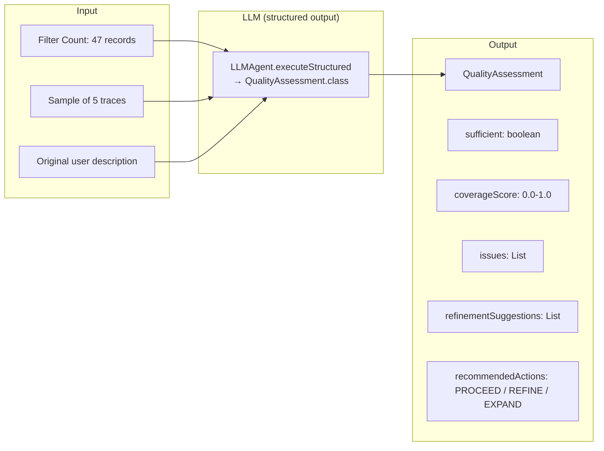

#### Step 5: Human Review (без LLM)

Это ключевой шаг — пользователь контролирует финальный отбор.

#### Step 6: Dataset Assembly (без LLM)

Конвертация approved traces в TestSetItem-ы. Маппинг основан на реальной структуре трейса:

```java
public TestSetItem traceToTestSetItem(ModelRequestTrace trace, String testSetId) {
    // Реальные поля трейса:
    // promptTemplate → message (полный промпт)
    // response → result (ожидаемый ответ, часто JSON)
    // modelId → model
    // trace.temperature → temperature
    // trace.responseFormat → jsonResponse (если "json_schema" или "json_object")
    // variables → variablesAsObjectMap (null если не через PromptService)
    // promptId → привязка к промпту

    boolean isJsonResponse = "json_schema".equals(trace.getTrace().getResponseFormat())
                          || "json_object".equals(trace.getTrace().getResponseFormat());

    return TestSetItemImpl.builder()
        .testSetId(testSetId)
        .message(trace.getPromptTemplate())           // полный промпт
        .result(trace.getResponse())                   // expected output (ответ модели)
        .model(trace.getModelId())                     // e.g. "claude-sonnet-4-5-20250929"
        .temperature(trace.getTrace().getTemperature())
        .jsonResponse(isJsonResponse)
        .jsonRequest(false)
        .variables(trace.getVariables())               // null для chat-трейсов без PromptService
        .createdAt(System.currentTimeMillis())
        .build();
}
```

**Для multi-turn чатов** конвертация группирует трейсы по `chatId`:

```java
public ChatTestSetItem chatTracesToTestSetItem(
        String chatId, List<ModelRequestTrace> chatTraces, String testSetId) {
    
    // Сортировка по timestamp
    List<ModelRequestTrace> sorted = chatTraces.stream()
        .sorted(Comparator.comparingLong(ModelRequestTrace::getTimestamp))
        .toList();
    
    List<ConversationTurn> turns = new ArrayList<>();
    for (int i = 0; i < sorted.size(); i++) {
        ModelRequestTrace trace = sorted.get(i);
        turns.add(ConversationTurn.builder()
            .turnIndex(i)
            .userMessage(extractUserMessage(trace.getPromptTemplate()))
            .expectedResponse(trace.getResponse())
            .build());
    }
    
    return ChatTestSetItem.builder()
        .testSetId(testSetId)
        .message("Chat: " + chatId)               // summary
        .model(sorted.get(0).getModelId())
        .conversation(turns)
        .createdAt(System.currentTimeMillis())
        .build();
}
```

### 2.5 Multi-turn Chat Dataset Creation

Для чат-диалогов нужно собирать **группы трейсов** по `chatId` / `contextId`.

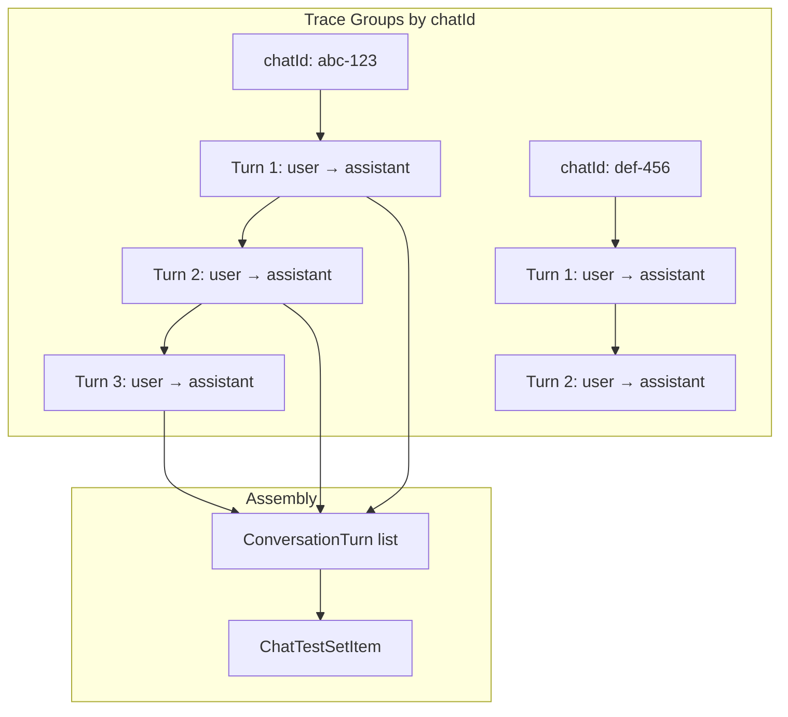

### 2.6 API Endpoints

```
POST   /data/v1.0/admin/dataset-generation/sessions                — Создать сессию
GET    /data/v1.0/admin/dataset-generation/sessions                — Все сессии
GET    /data/v1.0/admin/dataset-generation/sessions/{id}           — Получить сессию
DELETE /data/v1.0/admin/dataset-generation/sessions/{id}           — Удалить

POST   /data/v1.0/admin/dataset-generation/sessions/{id}/generate-filter — AI: сгенерировать фильтр
POST   /data/v1.0/admin/dataset-generation/sessions/{id}/execute-filter  — Выполнить фильтр
POST   /data/v1.0/admin/dataset-generation/sessions/{id}/quality-check   — AI: проверить качество
POST   /data/v1.0/admin/dataset-generation/sessions/{id}/refine-filter   — AI: уточнить фильтр с feedback

GET    /data/v1.0/admin/dataset-generation/sessions/{id}/candidates      — Список кандидатов (paginated)
POST   /data/v1.0/admin/dataset-generation/sessions/{id}/candidates/review — Batch approve/decline
POST   /data/v1.0/admin/dataset-generation/sessions/{id}/assemble        — Собрать TestSet

GET    /data/v1.0/admin/dataset-generation/trace-metadata               — Метаданные трейсов
```

### 2.7 Frontend — Dataset Generation UI

> **Важно:** Все компоненты создаются по стандартам из `FRONTEND_CODE_REVIEW.md` — PrimeVue/Naive UI, строгие TS interfaces, modular composition, toast notifications.

#### Routing (top-level в sidebar, секция "Test Sets")

```
/dataset-generation              → DatasetGenerationListView.vue
/dataset-generation/new          → DatasetGenerationWizardView.vue
/dataset-generation/:id          → DatasetGenerationSessionView.vue
/dataset-generation/:id/review   → DatasetReviewView.vue
```

#### Компонентная структура

```
views/
  dataset-generation/
    DatasetGenerationListView.vue    — список сессий генерации
    DatasetGenerationWizardView.vue  — stepper wizard
    DatasetReviewView.vue            — полноэкранный review кандидатов

components/
  dataset-generation/
    types.ts                         — строгие TS interfaces
    api.ts                           — API calls (через interceptor, без ручных headers)
    useDatasetGeneration.ts          — composable: session CRUD, pipeline steps
    useReviewCandidates.ts           — composable: approve/decline, filters, batch ops
    DescribeStep.vue                 — textarea + metadata hints
    FilterPreviewStep.vue            — фильтр chips + stats + quality badge  
    ReviewStep.vue                   — таблица кандидатов с bulk operations
    AssembleStep.vue                 — финальное подтверждение
    CandidateRow.vue                 — expandable row кандидата
    FilterChips.vue                  — визуализация фильтра как chips
    QualityBadge.vue                 — badge качества покрытия
    ReviewProgressBar.vue            — прогресс ревью
```

#### TypeScript interfaces

```typescript
// components/dataset-generation/types.ts

export type SessionStatus = 'CREATED' | 'FILTERING' | 'REVIEWING' | 'ASSEMBLING' | 'COMPLETED';
export type ReviewStatus = 'PENDING' | 'APPROVED' | 'DECLINED' | 'NEEDS_REVIEW';

export interface DatasetGenerationSession {
  id: string;
  name: string;
  userDescription: string;
  status: SessionStatus;
  currentFilter: TraceFilter | null;
  targetTestSetId: string | null;
  candidateCount: number;
  approvedCount: number;
  declinedCount: number;
  createdAt: number;
  updatedAt: number;
}

export interface TraceFilter {
  startTime: number | null;
  endTime: number | null;
  contextTypes: string[];        // CUSTOM, WORKFLOW, AGENT
  requestTypes: string[];        // TEXT_TO_TEXT, IMAGE_TO_TEXT
  modelId: string | null;        // e.g. "claude-sonnet-4-5-20250929"
  promptIds: string[];           // e.g. "blog/blog-content-generation-system"
  chatIdPattern: string | null;  // regex, e.g. "riley-.*" for specific persona
  promptContains: string | null; // regex search in promptTemplate
  responseContains: string | null; // regex search in response
  minTokens: number | null;      // trace.promptTokens
  maxTokens: number | null;
  minLatencyMs: number | null;   // trace.executionTimeMs
  maxLatencyMs: number | null;
  hasError: boolean | null;      // trace.hasError
  excludePurpose: string | null; // exclude "qa_test_pipeline" etc.
  responseFormat: string | null; // "json_schema", "json_object", "text"
  onlyWithPromptId: boolean | null; // only traces routed through PromptService
  groupByChatId: boolean;        // group traces into conversations
  minTurnsInChat: number | null; // min turns when grouping by chatId
}

export interface TraceCandidate {
  id: string;
  traceId: string;
  contextId: string;
  promptMethod: string;
  message: string;
  result: string;
  systemMessage: string | null;
  model: string;
  workflow: string | null;
  timestamp: number;
  latencyMs: number;
  reviewStatus: ReviewStatus;
  reviewNote: string | null;
  relevanceScore: number;
  aiExplanation: string;
}

export interface TraceMetadata {
  availablePromptMethods: string[];
  availableWorkflowTypes: string[];
  availableContextTypes: string[];
  availableModels: string[];
  promptMethodCounts: Record<string, number>;
  totalTraceCount: number;
  earliestTraceTimestamp: number;
  latestTraceTimestamp: number;
}

export interface FilterSuggestion {
  filter: TraceFilter;
  explanation: string;
  expectedCount: number;
  coverageNotes: string;
}

export interface QualityAssessment {
  sufficient: boolean;
  coverageScore: number;
  issues: string[];
  refinementSuggestions: string[];
  recommendedAction: 'PROCEED' | 'REFINE' | 'EXPAND';
}

export interface ReviewBatchRequest {
  candidateIds: string[];
  status: ReviewStatus;
  note?: string;
}
```

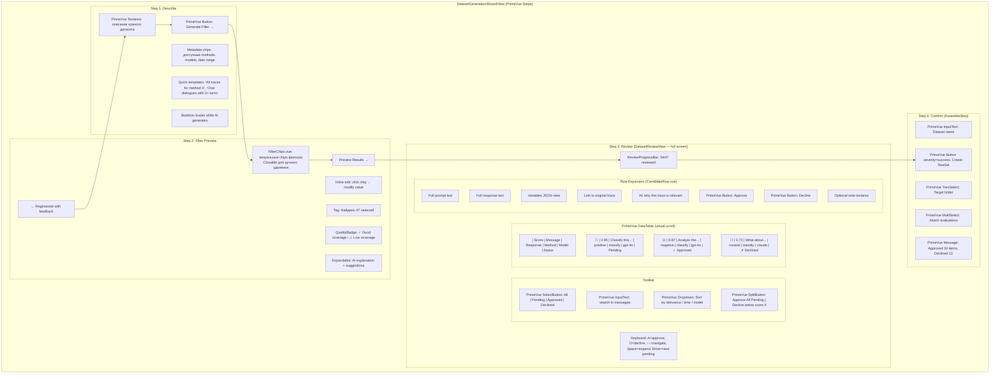

#### Ключевые UX-решения:

1. **Review экран — full screen:** Открывается как отдельный route (`/dataset-generation/:id/review`) с максимальным пространством для данных, не в модальном окне
2. **Virtual scroll:** PrimeVue DataTable с virtual scrolling для 1000+ кандидатов без потери производительности
3. **Keyboard-first UX:** `A`/`D` approve/decline, `↑↓` навигация, `Space` expand, `Enter` jump to next pending — всё через `@keydown` на уровне view
4. **Batch operations:** PrimeVue SplitButton с вариантами: "Approve all pending", "Approve score > 0.8", "Decline all with model X"
5. **Progress tracking:** `ReviewProgressBar` показывает reviewed/total + auto-advance к следующему pending item
6. **Toast notifications:** Каждое approve/decline → краткий PrimeVue Toast (не `alert()`), с undo action
7. **AI-подсказки:** `relevanceScore` (0-1) как цветной ProgressBar в колонке, `aiExplanation` в expansion panel

---

## Часть 3: Интеграция с существующими модулями

### 3.1 Зависимости между модулями

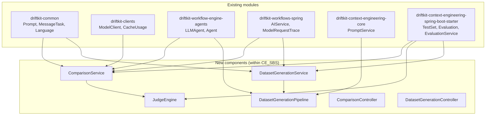

### 3.2 Использование LLMAgent для Judge и Pipeline

```java
// Judge Engine использует LLMAgent для сравнительной оценки
@Service
public class JudgeEngine {
    
    private LLMAgent createJudgeAgent(JudgeConfig config) {
        return LLMAgent.builder()
            .name("comparison-judge")
            .modelClient(getModelClient(config.getJudgeModelId()))
            .systemMessage(JUDGE_SYSTEM_PROMPT)
            .temperature(config.getJudgeTemperature() != null 
                ? config.getJudgeTemperature() : 0.1)
            .build();
    }
    
    public JudgeVerdict judge(
            TestSetItem item,
            String referenceResponse,
            String challengerResponse,
            JudgeConfig config) {
        
        LLMAgent judge = createJudgeAgent(config);
        
        Map<String, Object> variables = Map.of(
            "task", item.getMessage(),
            "reference_response", referenceResponse,
            "challenger_response", challengerResponse,
            "expected", Optional.ofNullable(item.getResult()).orElse("N/A")
        );
        
        AgentResponse<JudgeVerdict> response = judge.executeStructured(
            config.getJudgePromptTemplate(),
            variables,
            JudgeVerdict.class
        );
        
        return response.getStructuredData();
    }
}
```

```java
// Dataset Generation Pipeline использует LLMAgent для анализа
@Service
public class DatasetGenerationPipeline {
    
    private LLMAgent createAnalysisAgent() {
        return LLMAgent.builder()
            .name("dataset-filter-generator")
            .modelClient(defaultModelClient)
            .systemMessage(FILTER_GENERATION_SYSTEM_PROMPT)
            .temperature(0.2)
            .build();
    }
    
    public FilterSuggestion generateFilter(
            String userDescription, 
            TraceMetadata metadata) {
        
        LLMAgent agent = createAnalysisAgent();
        
        Map<String, Object> variables = Map.of(
            "userDescription", userDescription,
            "availablePromptMethods", metadata.getAvailablePromptMethods(),
            "availableWorkflowTypes", metadata.getAvailableWorkflowTypes(),
            "totalTraceCount", metadata.getTotalTraceCount(),
            "dateRange", formatDateRange(metadata)
        );
        
        AgentResponse<FilterSuggestion> response = agent.executeStructured(
            FILTER_GENERATION_PROMPT,
            variables,
            FilterSuggestion.class
        );
        
        return response.getStructuredData();
    }
}
```

### 3.3 MongoDB коллекции (новые)

```
comparison_runs          — ComparisonRun
comparison_results       — ComparisonResult  
dataset_generation_sessions — DatasetGenerationSession
trace_candidates         — TraceCandidate
```

---

## Часть 4: План реализации

> **Зависимость от Frontend Refactoring:** Phase 2 и 4 зависят от завершения Phase 1 рефакторинга из `FRONTEND_CODE_REVIEW.md` (Vite migration, PrimeVue setup, sidebar layout). Phase 1 и 3 (backend) можно начинать сразу и параллельно с frontend рефакторингом.

### Phase 0: Frontend Foundation (prerequisite, из FRONTEND_CODE_REVIEW.md)

Минимум, необходимый для Phase 2 и 4:

```
0.1 ✅ Vite migration (замена Vue CLI)
0.2 ✅ PrimeVue / Naive UI установлен и настроен
0.3 ✅ Sidebar layout с route groups
0.4 ✅ Axios interceptor для auth (убраны ручные headers)
0.5 ✅ Toast notification system (PrimeVue Toast)
0.6 ✅ Базовые shared types в types/ directory
```

### Phase 1: Model Comparison — Backend (можно начинать сразу)

```
1.1 Доменные модели (в testsuite/domain/)
    ├── ComparisonRun.java          @Document("comparison_runs")
    ├── ComparisonResult.java       @Document("comparison_results")
    ├── ComparisonSummary.java      (embedded в ComparisonRun)
    ├── ModelConfig.java            (embedded)
    ├── JudgeConfig.java            (embedded)
    ├── JudgeVerdict.java           (structured output class)
    ├── CategoryScore.java          (embedded)
    ├── ChatTurn.java               (embedded в ComparisonResult)
    └── PerformanceMetrics.java     (embedded)

1.2 Repositories (в testsuite/repository/)
    ├── ComparisonRunRepository.java
    └── ComparisonResultRepository.java

1.3 Services (в testsuite/service/)
    ├── ComparisonService.java       — оркестрация (parallel execution, aggregation)
    ├── JudgeEngine.java             — сравнительная оценка (rules + LLM)
    ├── ComparisonExecutor.java      — выполнение запросов к моделям
    └── ComparisonExportService.java — CSV/JSON экспорт

1.4 Controller (в controller/)
    └── ComparisonController.java

1.5 Промпты для Judge (загружаются через PromptService)
    ├── comparison.judge.system      — system prompt для judge
    ├── comparison.judge.evaluate    — comparative evaluation template
    └── comparison.judge.chat.final  — final verdict для multi-turn
```

### Phase 2: Model Comparison — Frontend (после Phase 0)

```
2.1 types.ts — все interfaces из секции 1.10
2.2 api.ts — API client (через Axios interceptor)
2.3 useComparisons.ts — composable для CRUD и execution
2.4 useComparisonResults.ts — composable для results, filters

2.5 Views:
    ├── ComparisonListView.vue         — PrimeVue DataTable + create button
    ├── ComparisonCreateView.vue       — PrimeVue Steps wizard
    └── ComparisonResultsView.vue      — dashboard + side-by-side

2.6 Components:
    ├── ModelConfigForm.vue            — reusable model config form
    ├── JudgeConfigForm.vue            — judge settings form
    ├── ComparisonSummaryCards.vue      — 4 metric cards
    ├── ComparisonChart.vue            — PrimeVue Chart (pie + bar)
    ├── SideBySideTable.vue            — DataTable с verdict badges
    ├── VerdictBadge.vue               — colored verdict indicator
    ├── ComparisonDiffView.vue         — text diff visualization
    └── ChatHistoryTimeline.vue        — multi-turn timeline

2.7 Router entries + sidebar item
```

### Phase 3: Dataset Generation — Backend (можно начинать сразу)

```
3.1 Доменные модели (в testsuite/domain/)
    ├── DatasetGenerationSession.java  @Document("dataset_generation_sessions")
    ├── TraceFilter.java               (embedded)
    ├── TraceCandidate.java            @Document("trace_candidates")
    ├── FilterSuggestion.java          (structured output class)
    └── QualityAssessment.java         (structured output class)

3.2 Repositories (в testsuite/repository/)
    ├── DatasetGenerationSessionRepository.java
    └── TraceCandidateRepository.java

3.3 Services (в testsuite/service/)
    ├── DatasetGenerationService.java   — оркестрация сессий
    ├── DatasetGenerationPipeline.java  — LLM шаги (filter gen + quality check)
    └── TraceFilterExecutor.java        — MongoDB query builder из TraceFilter

3.4 Controller (в controller/)
    └── DatasetGenerationController.java

3.5 Промпты (через PromptService)
    ├── dataset.filter.generate         — генерация фильтра из описания
    ├── dataset.quality.check           — проверка качества выборки
    └── dataset.filter.refine           — уточнение по feedback
```

### Phase 4: Dataset Generation — Frontend (после Phase 0)

```
4.1 types.ts — все interfaces из секции 2.7
4.2 api.ts — API client
4.3 useDatasetGeneration.ts — composable: session lifecycle
4.4 useReviewCandidates.ts — composable: review operations

4.5 Views:
    ├── DatasetGenerationListView.vue     — список сессий
    ├── DatasetGenerationWizardView.vue   — PrimeVue Steps wizard
    └── DatasetReviewView.vue             — full-screen review

4.6 Components:
    ├── DescribeStep.vue                  — description + metadata hints
    ├── FilterPreviewStep.vue             — filter chips + quality badge
    ├── ReviewStep.vue                    — DataTable с virtual scroll
    ├── AssembleStep.vue                  — confirm + create
    ├── CandidateRow.vue                  — expandable row detail
    ├── FilterChips.vue                   — visual filter representation
    ├── QualityBadge.vue                  — coverage indicator
    └── ReviewProgressBar.vue             — progress tracker

4.7 Router entries + sidebar item (в секции "Test Sets")
4.8 Keyboard shortcuts handler
```

### Phase 5: Multi-turn Chat Support (зависит от Phase 1 + 3)

```
5.1 ChatTestSetItem / ConversationTurn — расширение TestSetItem модели
5.2 Chat grouping logic в TraceFilterExecutor (group by chatId)
5.3 Multi-turn execution в ComparisonService (separate LLMAgent per model)
5.4 ChatHistoryTimeline.vue component
5.5 Chat dataset assembly (trace groups → ChatTestSetItem)
5.6 Multi-turn review UX (conversation view в DatasetReviewView)
```

### Параллелизация

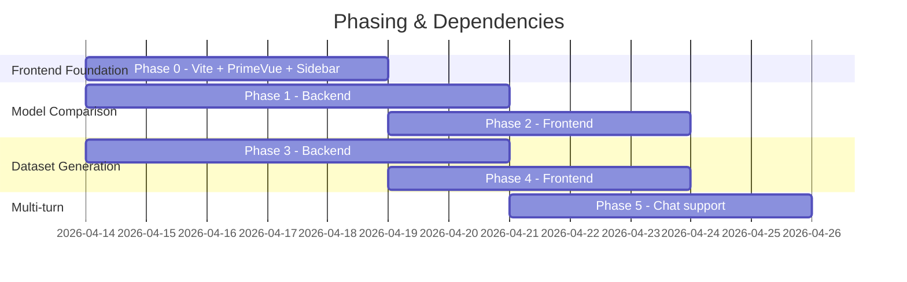

Phase 1 и Phase 3 стартуют **параллельно** и независимо друг от друга. Phase 2 и 4 ждут Phase 0 (frontend foundation). Phase 5 ждёт завершения обоих бэкенд-фаз.

---

## Часть 5: Ключевые технические решения

### 5.1 Почему Fixed Pipeline, а не Agent

| Критерий | Fixed Pipeline | Free Agent |
|----------|---------------|------------|
| Предсказуемость | ✅ Каждый шаг определен | ❌ Может уйти в сторону |
| Стоимость | ✅ Фиксированное число LLM calls | ❌ Неограниченное |
| Отладка | ✅ Каждый шаг логируется | ❌ Сложно воспроизвести |
| Latency | ✅ Предсказуемый | ❌ Может зацикливаться |
| Гибкость | ❌ Нужно добавлять новые шаги | ✅ Адаптируется сам |
| Контроль | ✅ Human-in-the-loop на каждом шаге | ❌ Может пропустить |

Для задачи создания тестовых датасетов **предсказуемость и контроль важнее гибкости** — ошибка в тестовом датасете будет влиять на все последующие оценки.

### 5.2 Стратегия устранения position bias в LLM-as-a-Judge

LLM-судья может предпочитать ответ, стоящий первым в промпте. Решение:

```java
public JudgeVerdict judgeWithDebiasing(TestSetItem item, String refResponse, String chalResponse) {
    // Run 1: Reference first
    JudgeVerdict v1 = judge(item, refResponse, chalResponse);
    
    // Run 2: Challenger first (swap positions)
    JudgeVerdict v2 = judge(item, chalResponse, refResponse);
    // Flip v2 verdict back
    v2 = flipVerdict(v2);
    
    // Agree? Use that verdict. Disagree? Mark as TIE with low confidence.
    if (v1.getVerdict() == v2.getVerdict()) {
        return v1; // consistent verdict
    } else {
        return JudgeVerdict.builder()
            .verdict(Verdict.TIE)
            .confidence(0.3)
            .reasoning("Position bias detected: verdicts differed when response order was swapped")
            .build();
    }
}
```

### 5.3 Cost control

Для дорогих операций (LLM judge на каждый item × 2 для debiasing):

- **Sampling mode:** Оценивать только N% items LLM-судьей, остальные — только rules
- **Tiered judging:** Сначала дешевая модель (Haiku), при расхождении с rules — дорогая (Opus)
- **Cache-aware:** Использовать `CachePolicy.AUTO` для повторяющихся system prompts

### 5.4 Versioning и воспроизводимость

Каждый `ComparisonRun` хранит полный snapshot конфигурации обеих моделей, judge settings, и ссылку на конкретные Evaluation-ы. Это позволяет:
- Воспроизвести сравнение с точно такими же параметрами
- Отслеживать regression при обновлении промптов
- Сравнивать разные версии промптов на одной модели

---

## Часть 6: Примеры использования

### Пример 1: Сравнение Claude vs DeepSeek на задаче классификации

```
1. Выбрать TestSet "Sentiment Classification v2" (200 items)
2. Reference: Claude Sonnet 4, temperature 0.2
3. Challenger: DeepSeek Chat, temperature 0.2
4. Judge: Claude Opus (LLM judge) + JSON Schema eval (rule)
5. Mode: HYBRID

Результат:
- Claude wins: 120 (60%)
- DeepSeek wins: 45 (22.5%)
- Ties: 35 (17.5%)
- По accuracy: Claude +15%
- По latency: DeepSeek -40% (быстрее)
- По cost: DeepSeek -70% (дешевле)
```

### Пример 2: Автоматическое создание датасета из трейсов (реальный сценарий)

Основано на реальных данных: 145 трейсов за неделю, 21 чат-сессия с AI-персонажами (Riley, Alex), Claude Sonnet 4.5 + Haiku 4.5, все ответы в `json_schema` формате.

```
1. Описание: "Собери все чат-диалоги с персоной Riley за последнюю неделю,
   где было минимум 5 ходов диалога"
   
2. AI генерирует фильтр:
   - chatIdPattern: "riley-.*"
   - startTime: 2026-04-06, endTime: 2026-04-13
   - requestType: ["TEXT_TO_TEXT"]
   - responseFormat: "json_schema"
   - groupByChatId: true
   - minTurnsInChat: 5
   - excludePurpose: "qa_test_pipeline"

3. Найдено: 6 диалогов (из 21 чатов, 6 имеют 5+ ходов)
   - riley-1c6c91cf: 15 turns
   - riley-be606166: 14 turns  
   - riley-aa49592e: 7 turns
   - riley-...: 6 turns
   - riley-...: 5 turns
   - riley-...: 5 turns

4. Quality check: "Good coverage for Riley persona. 
   Note: 2 chats include IMAGE_TO_TEXT turns (screenshot analysis) 
   which may need separate handling."

5. Review: Approve 5 диалогов, Decline 1 (слишком короткие ответы, тестовый)

6. Создан TestSet "Riley Multi-turn Chats April 2026" с 5 ChatTestSetItems
```

### Пример 3: Создание датасета из промпт-трейсов (blog generation)

```
1. Описание: "Собери все запросы к блог-генератору через PromptService"

2. AI генерирует фильтр:
   - onlyWithPromptId: true
   - promptIds: ["blog/blog-content-generation-system"]
   - startTime: 2026-04-06, endTime: 2026-04-13

3. Найдено: 9 трейсов (все с variables: CHARACTER_COUNT, LANGUAGE, PERSONA_NAME, TONE, etc.)

4. Review: Approve 8, Decline 1 (ошибочный запрос)

5. Создан TestSet "Blog Generation v1" с 8 items, 
   каждый с variables и expected JSON response
```

### Пример 4: Сравнение моделей в режиме multi-turn чата

```
1. TestSet "Riley Multi-turn Chats April 2026" (5 chat dialogues, 47 turns total)
2. Reference: Claude Sonnet 4.5 (текущая production модель)
3. Challenger: DeepSeek Chat (кандидат — дешевле в 5x)
4. Judge: HYBRID
   - Rules: JSON Schema validation (ответ должен быть {"message": "...", "emotionalTone": "..."})
   - LLM Judge: Claude Opus — оценка эмпатии, персонажности, follow-up quality
5. Mode: MULTI_TURN_CHAT

Для каждого диалога:
- Оба LLMAgent получают одинаковый system prompt (персона Riley)
- Одинаковые user messages отправляются последовательно
- Каждая модель отвечает из своего контекста (разные chatId)
- Judge оценивает каждый ход + финальное качество диалога

Результат:
- JSON Schema compliance: Claude 100%, DeepSeek 93% (2 сломанных JSON)
- По отдельным ходам: Claude 58%, DeepSeek 22%, Tie 20%
- По целым диалогам: Claude 4/5, DeepSeek 1/5
- Claude лучше в: emotional consistency, persona adherence, deep follow-ups
- DeepSeek лучше в: response speed (2x), cost (5x cheaper)
- Вердикт: DeepSeek не готов для замены в chat-персонах, 
  но может работать для blog generation (single-turn, менее чувствительно к персоне)
```
