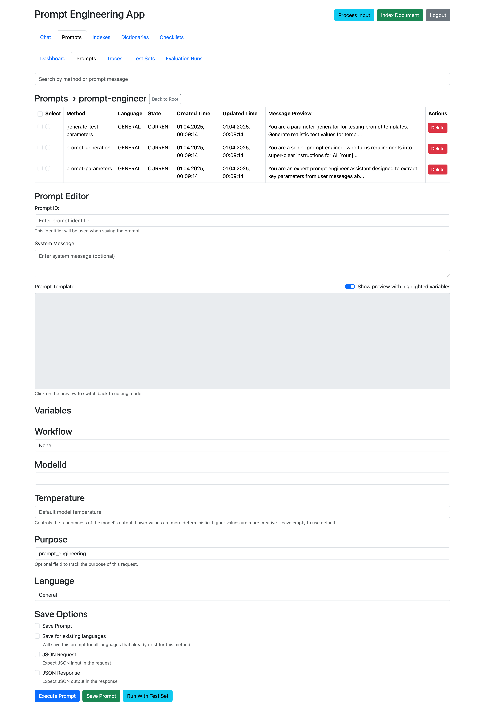
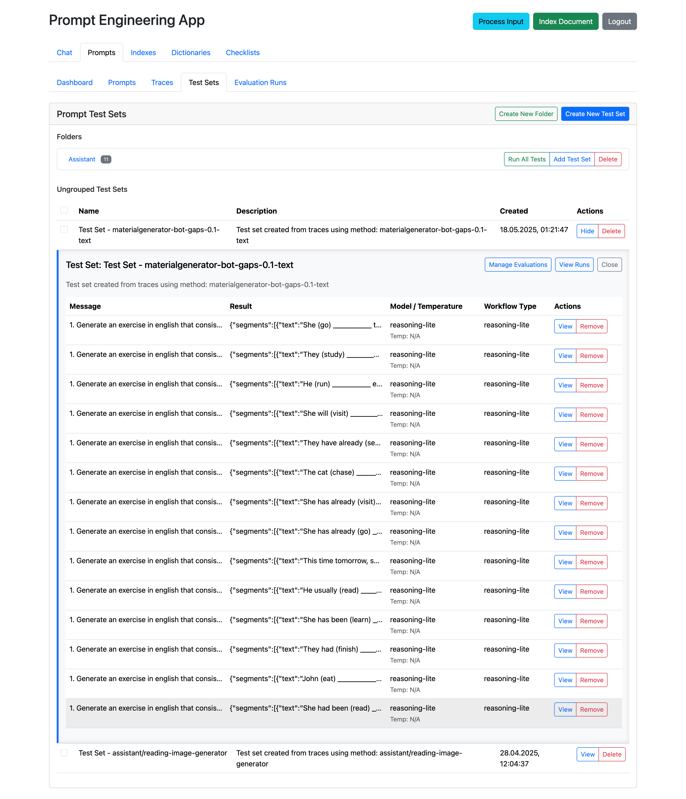

# DriftKit Framework

**Production-ready AI framework for Java** - Complete prompt lifecycle management from development to production

## 🚀 Why choose DriftKit?

### Framework comparison

| Feature | DriftKit                                                                         | Spring AI                       | LangChain4j                     | [Google ADK](https://github.com/google/adk-java) |
|---------|----------------------------------------------------------------------------------|---------------------------------|---------------------------------|-------------------------------------------------|
| **Text embedding** | ✅ Multiple providers                                                             | ✅ Multiple providers            | ✅ Multiple providers            | ❌                            |
| **Vector storage** | ✅ In-memory, File, Pinecone, Spring AI (all providers)                           | ✅ In-memory, Chroma, PGVector etc | ✅ In-memory, Pinecone, Chroma etc | ❌                                               |
| **Structured output** | ✅ Java Pojo/Json based                                                           | ✅                    | ✅                   | ✅                                               |
| **Tool calling** | ✅ Type-safe with auto/manual-execution: function calling, tools, agents as tools | ✅               | ✅               | ✅                      |
| **Prompt lifecycle management** | ✅ Dev→Test→Prod + Tracing                                                        | ❌                               | ❌                               | ❌                                               |
| **Visual prompt IDE** | ✅ Full web platform                                                              | ❌ Code only                     | ❌ Code only                     | ❌                                               |
| **Production prompt testing** | ✅ Test sets + evaluation                                                         | ❌                               | ❌                               | ❌                                               |
| **Prompt versioning** | ✅ Built-in                                                                       | ❌ Manual                        | ❌ Manual                        | ❌                                               |
| **A/B testing** | ✅ Native                                                                         | ❌                               | ❌                               | ❌                                               |
| **Test automation** | ✅ Comprehensive                                                                  | ❌                               | ⚠️ Basic                        | ❌                                               |
| **Multi-agent patterns** | ✅ Loop, Sequential, Hierarchical, Graph, Cross-graph calls                       | ❌                               | ⚠️ Limited                      | ✅ Built-in                                      |
| **Workflow as graph** | ✅ Full graph with cross-workflow calls                                           | ❌                               | ⚠️ Chain only                   | ⚠️ Basic                                        |
| **Simplified LLM SDK** | ✅ High-level Agent API                                                           | ⚠️ Low-level                    | ⚠️ Complex                      | ✅ Good                                          |
| **Model hot-swap** | ✅ Config change only                                                             | ✅ Config change                 | ❌ Code rewrite                  | ⚠️ Limited                                      |
| **Audio processing** | ✅ VAD + Transcription                                                            | ❌                               | ❌                               | ❌                                               |
| **Text-to-speech** | ❌ Not supported                                                                  | ✅ Multiple providers            | ❌                               | ❌                                               |
| **Spring AI integration** | ✅ Full bidirectional integration                                                 | Native                           | ❌                               | ❌                                               |

### 🎯 Unique features

1. **Complete prompt lifecycle platform** - The ONLY framework with full Dev→Test→Prod workflow
   
   - Version control and A/B testing
   - Test sets with multiple evaluation methods
   - Production tracing and monitoring
   - Real-world scenario testing
   
2. **Enterprise prompt management** - What competitors lack:
   
   - Automated prompt testing against production data
   - Multiple evaluation strategies
   - Performance tracking and optimization
   - No other Java framework offers this!

3. **Workflow as maintainable graph** - Build complex agents with cross-workflow composition
4. **Simplified LLM SDK** - High-level Agent API for quick prototyping and production
5. **Hot-swap AI models** - Change models via config without code changes or recompilation
6. **Type-safe AI integration** - Direct Java objects, no JSON parsing needed
7. **Multi-agent orchestration** - Loop, Sequential, and Hierarchical patterns
8. **Built-in audio processing** - VAD, transcription, and streaming capabilities
9. **Spring AI integration** - Use DriftKit prompts with Spring AI ChatClient, full tracing support

## 🏆 Business solutions

### Customer support automation
**Problem:** Support teams overwhelmed with repetitive inquiries, inconsistent responses, high costs  
**Solution:** DriftKit automates 80% of common requests while maintaining brand voice

**Technical Implementation:**
- **driftkit-context-engineering**: Create and A/B test response templates for different customer scenarios
- **driftkit-workflows**: Intelligent routing - simple questions to AI, complex issues to specialists
- **driftkit-vector**: Knowledge base search for accurate, up-to-date information
- **driftkit-clients**: Multi-model support (GPT-4/Gemini 2.5 Pro/Claude Opus 4 for complex, GPT-4o-mini/Gemini 2.5 Flash/Claude Haiku for simple queries)
- **driftkit-common**: Conversation memory to maintain context across multiple interactions

**Business Impact:** 60% reduction in response time, 40% cost savings, 95% customer satisfaction

### Financial document processing  
**Problem:** Manual processing of contracts, invoices, compliance documents - slow, error-prone, expensive  
**Solution:** Intelligent document analysis with 99%+ accuracy and structured data extraction

**Technical Implementation:**
- **driftkit-clients**: Multi-modal AI (GPT-4 Vision/Gemini 2.5/Claude with vision) for processing PDFs, images, scanned documents
- **driftkit-embedding**: Document similarity for duplicate detection and categorization  
- **driftkit-vector**: Store processed documents for quick retrieval and compliance auditing
- **driftkit-workflows**: Multi-step validation workflows with human-in-the-loop for critical decisions
- **driftkit-common**: Structured output extraction directly into your ERP/accounting systems

**Business Impact:** 90% faster processing, 95% error reduction, full compliance automation

### E-commerce personalization engine
**Problem:** Generic product recommendations, poor conversion rates, high customer acquisition costs  
**Solution:** AI-powered product matching and hyper-personalized customer journeys

**Technical Implementation:**
- **driftkit-vector**: Product catalog embeddings for intelligent similarity matching
- **driftkit-embedding**: Customer behavior analysis and preference modeling
- **driftkit-context-engineering**: Dynamic product description templates for different customer segments
- **driftkit-workflows**: Real-time recommendation pipelines with A/B testing
- **driftkit-clients**: Multi-model optimization (fast models like GPT-4o-mini/Gemini Flash/Claude Haiku for real-time, advanced models like GPT-4/Gemini Pro/Claude Opus for deep analysis)

**Business Impact:** 35% increase in conversion rates, 50% higher average order value, 60% improved customer lifetime value

### Content marketing at scale
**Problem:** Consistent content creation across multiple channels, languages, and brand voices  
**Solution:** Automated content generation maintaining brand consistency across all touchpoints

**Technical Implementation:**
- **driftkit-context-engineering**: Brand voice templates with automated testing against brand guidelines
- **driftkit-workflows**: Multi-stage content pipelines (research → draft → review → publish)
- **driftkit-vector**: Content similarity checking to avoid duplication across channels
- **driftkit-embedding**: SEO keyword optimization and content clustering
- **driftkit-clients**: Model selection by content type (creative writing with GPT-4/Claude vs technical documentation with Gemini)

**Business Impact:** 10x content output, 80% cost reduction, consistent brand messaging across 50+ channels

### HR and recruitment automation
**Problem:** Resume screening bottlenecks, unconscious bias, poor candidate experience  
**Solution:** Intelligent candidate matching with bias reduction and automated communications

**Technical Implementation:**
- **driftkit-common**: Resume parsing and structured data extraction (skills, experience, education)
- **driftkit-embedding**: Candidate-job matching based on semantic understanding, not just keywords
- **driftkit-vector**: Talent pool management and similar candidate discovery
- **driftkit-workflows**: Interview scheduling, personalized communications, feedback collection
- **driftkit-context-engineering**: Personalized outreach templates optimized for response rates

**Business Impact:** 70% faster hiring process, 40% improvement in hire quality, 90% candidate satisfaction

### Intelligent banking assistant
**Problem:** Banking customers need 24/7 support for complex transactions, account management, and financial advice - but current chatbots are limited to simple FAQ responses  
**Solution:** Multi-step conversational AI that handles everything from balance inquiries to loan applications with seamless human handoff

**Technical Implementation:**
- **driftkit-chat-assistant-framework**: Core annotation-based workflow engine with @WorkflowStep and @AsyncStep for complex multi-turn conversations
- **driftkit-clients**: Dynamic model selection (GPT-4/Claude Opus for financial advice, GPT-4o-mini/Claude Haiku for simple queries) with structured outputs for transaction data
- **driftkit-workflows**: Multi-step verification processes - identity verification → transaction authorization → fraud detection → execution
- **driftkit-vector**: Knowledge base for financial products, regulations, and personalized investment recommendations
- **driftkit-context-engineering**: Compliance-tested prompt templates for different financial scenarios with A/B testing for conversion optimization
- **driftkit-common**: Persistent session management with encrypted conversation history and document processing for uploaded statements
- **Database Integration**: Direct connections to core banking systems, CRM, and fraud detection APIs
- **Legacy System Integration**: REST/SOAP connectors to existing banking infrastructure with real-time transaction processing

**Conversation Flow Examples:**
- **Simple**: "What's my balance?" → Direct database query → Formatted response (2 seconds)
- **Complex**: "Help me apply for a mortgage" → Identity verification → Document collection → Credit check → Pre-approval calculation → Loan officer scheduling (15-minute guided process)
- **Emergency**: "My card was stolen" → Fraud detection → Card blocking → Replacement ordering → Temporary credit setup → Follow-up scheduling

**Business Impact:** 85% reduction in call center volume, 60% faster loan processing, 24/7 availability, 40% increase in product cross-sell, 95% customer satisfaction for complex transactions

## 🧩 Framework modules

| Module | Purpose | Key Features |
|--------|---------|--------------|
| [**driftkit-common**](driftkit-common/README.md) | Core utilities | Chat memory, document processing, templates |
| [**driftkit-clients**](driftkit-clients/README.md) | AI providers | OpenAI, Gemini, Claude, O3-Mini, Spring AI supported models, type-safe responses |
| [**driftkit-embedding**](driftkit-embedding/README.md) | Text embeddings | OpenAI, Cohere, Spring AI providers, local BERT models |
| [**driftkit-vector**](driftkit-vector/README.md) | Vector search | In-memory, file-based, Pinecone, Spring AI |
| [**driftkit-workflows**](driftkit-workflows/README.md) | Orchestration | Annotation-based, LLMAgent SDK |
| [**driftkit-context-engineering**](driftkit-context-engineering/README.md) | Prompt management | Web UI, versioning, A/B testing, Spring AI integration |
| [**driftkit-audio**](driftkit-audio/README.md) | Audio processing | VAD, transcription, streaming |
| [**driftkit-chat-assistant-framework**](driftkit-chat-assistant-framework/README.md) | Chat workflows | Multi-step conversations |

## 📦 Module structure

```
driftkit-framework/
├── driftkit-common/                     # 🔧 Core utilities and shared domain objects
├── driftkit-clients/                    # 🤖 AI model client abstractions and implementations
│   ├── driftkit-clients-core/           # Core client interfaces
│   ├── driftkit-clients-openai/         # OpenAI implementation
│   ├── driftkit-clients-gemini/         # Google Gemini implementation
│   ├── driftkit-clients-claude/         # Anthropic Claude implementation
│   ├── driftkit-clients-spring-ai/      # Spring AI models integration
│   └── driftkit-clients-spring-boot-starter/
├── driftkit-embedding/                  # 🧠 Text embedding services
│   ├── driftkit-embedding-core/         # Core embedding interfaces
│   ├── driftkit-embedding-spring-ai/    # Spring AI providers integration
│   └── driftkit-embedding-spring-boot-starter/
├── driftkit-vector/                     # 🔍 Vector storage and similarity search
│   ├── driftkit-vector-core/            # Core vector abstractions
│   ├── driftkit-vector-spring-boot-starter/
│   ├── driftkit-vector-spring-ai/       # Spring AI vector stores integration
│   └── driftkit-vector-spring-ai-starter/
├── driftkit-workflows/                  # ⚙️ Workflow orchestration engine
│   ├── driftkit-workflows-core/         # Core workflow framework
│   └── driftkit-workflows-spring-boot-starter/
├── driftkit-context-engineering/        # 📝 Prompt management and engineering
│   ├── driftkit-context-engineering-core/
│   ├── driftkit-context-engineering-spring-boot-starter/
│   ├── driftkit-context-engineering-spring-ai/  # Spring AI integration
│   └── driftkit-context-engineering-spring-ai-starter/
├── driftkit-workflows-examples/         # 🎯 Reference workflow implementations
│   ├── driftkit-workflows-examples-core/
│   └── driftkit-workflows-examples-spring-boot-starter/
├── driftkit-audio/                      # 🎵 Audio processing and transcription
│   ├── driftkit-audio-core/             # Core audio processing
│   └── driftkit-audio-spring-boot-starter/
└── driftkit-chat-assistant-framework/   # 💬 Annotation-based conversational workflows
```

## 🛠️ Technology stack

- **Java 21** - Modern Java with advanced language features
- **Spring Boot 3.3.1** - Enterprise application framework with auto-configuration (optional - core modules work without Spring)
- **MongoDB** - Document storage for persistence (optional - PostgreSQL support coming soon)
- **Vue.js 3** - Modern frontend framework for prompt engineering UI
- **Maven** - Build and dependency management
- **Jackson** - JSON processing and serialization
- **Feign** - Declarative HTTP client for API integrations

## 🚀 Quick start

### Add to your project

```xml
<!-- Add complete framework -->
<dependency>
    <groupId>ai.driftkit</groupId>
    <artifactId>driftkit-framework</artifactId>
    <version>0.6.0</version>
</dependency>

<!-- Or add specific modules -->
<dependency>
    <groupId>ai.driftkit</groupId>
    <artifactId>driftkit-workflows-core</artifactId>
    <version>0.6.0</version>
</dependency>
```

### Run with minimal config

```yaml
# application.yml
driftkit:
  vault:
    - name: "primary"
      type: "openai"
      apiKey: "${OPENAI_API_KEY}"
      model: "gpt-4"
    - name: "gemini"
      type: "gemini"
      apiKey: "${GEMINI_API_KEY}"
      model: "gemini-2.5-flash"
    - name: "claude"
      type: "claude"
      apiKey: "${CLAUDE_API_KEY}"
      model: "claude-sonnet-4-20250514"

# Spring AI integration (optional)
driftkit:
  spring-ai:
    application-name: "my-app"
    tracing:
      enabled: true
    chat-client:
      enabled: true
```

```java
// That's it! Start using DriftKit
@SpringBootApplication
public class MyApp {
    public static void main(String[] args) {
        SpringApplication.run(MyApp.class, args);
    }
}
```

Visit http://localhost:8080/prompt-engineering for the visual prompt editor!

## 💻 Code examples

### 1. Type-safe AI integration

```java
// No JSON parsing needed - direct Java objects!
LLMAgent agent = LLMAgent.builder()
    .modelClient(modelClient)
    .systemMessage("You are a helpful assistant")
    .build();

// Type-safe tool calling
@Tool(description = "Get weather for a city")
public WeatherInfo getWeather(String city) {
    return new WeatherInfo(city, 22.5, "Sunny");
}

// Automatic tool execution with typed results
agent.registerTool("getWeather", this);
var response = agent.executeWithTools("What's the weather in Paris?");
WeatherInfo weather = response.getToolResults().get(0).getTypedResult(); // No JSON!

// Structured output extraction
Person person = agent.executeStructured(
    "Extract: John Doe, 30 years old, engineer", 
    Person.class
).getStructuredData();
```

### 2. Visual prompt engineering

- **Web-based editor** with syntax highlighting
- **Version control** and A/B testing
- **Test sets** with automated evaluation
- **Real-time preview** and variable detection

### 3. Production workflows

```java
@Component
public class CustomerSupportWorkflow extends ExecutableWorkflow<ChatEvent, String> {
    
    @Step(name = "classify", nextStep = "route")
    public ClassificationEvent classifyMessage(ChatEvent event, WorkflowContext context) {
        String category = classifyWithAI(event.getMessage());
        return new ClassificationEvent(category, event.getMessage());
    }
    
    @LLMRequest(
        prompt = "Answer this {{category}} question: {{message}}",
        modelName = "gpt-4",
        temperature = 0.3,
        nextStep = "finalize"
    )
    public void route(ClassificationEvent event, WorkflowContext context) {
        // AI processing happens automatically
    }
    
    @FinalStep
    public StopEvent<String> finalize(DataEvent<String> result, WorkflowContext context) {
        return StopEvent.of(result.getData());
    }
}
```

### 4. Spring AI Integration

```java
// Use DriftKit prompts with Spring AI ChatClient
@Component
public class CustomerService {
    private final DriftKitChatClient chatClient;
    
    public String analyzeSentiment(String review) {
        // Use DriftKit prompt with full tracing
        return chatClient.promptById("sentiment.analysis")
            .withVariable("review", review)
            .withLanguage(Language.ENGLISH)
            .call()
            .content();
    }
    
    public ProductInfo extractProductInfo(String description) {
        // Structured output with DriftKit prompt management
        return chatClient.promptById("product.extraction")
            .withVariable("description", description)
            .call()
            .entity(ProductInfo.class);
    }
}

// Or use Spring AI directly with DriftKit prompt provider
@Component
public class AIService {
    private final ChatClient chatClient;
    private final DriftKitPromptProvider promptProvider;
    
    public String generateContent(Map<String, Object> variables) {
        // Get prompt configuration from DriftKit
        var config = promptProvider.getPrompt("content.generation", Language.ENGLISH);
        
        // Use with Spring AI's fluent API
        return chatClient.prompt()
            .system(config.getSystemMessage())
            .user(u -> u.text(config.getUserMessage()).params(variables))
            .options(opt -> opt.temperature(config.getTemperature()))
            .call()
            .content();
    }
}
```

## 🧩 Core Modules

### DriftKit Common
**Foundation module providing shared utilities and domain objects**

- **Chat Management** - Conversation handling with memory and context
- **Document Processing** - Intelligent text splitting and tokenization
- **Text Analysis** - Similarity calculations and NLP utilities
- **Template Engine** - Variable substitution with control flow
- **JSON Processing** - Robust parsing with error recovery
- **Configuration** - Centralized configuration management

**Key Classes:**
- `Chat`, `Message`, `AITask` - Core domain objects
- `TokenWindowChatMemory` - Token-based memory management
- `DocumentSplitter` - Intelligent text chunking
- `TemplateEngine` - Advanced template processing
- `EtlConfig` - Configuration management

### DriftKit Clients
**Unified AI model client abstraction with multiple provider support**

- **Provider Abstraction** - Consistent interface across AI models
- **OpenAI Integration** - Complete OpenAI API support including GPT-4, O3-Mini
- **Google Gemini Integration** - Full Gemini API support including 2.5 Pro/Flash/Lite models
- **Anthropic Claude Integration** - Full Claude API support including Opus 4, Sonnet 4, Haiku 3.5
- **Multi-modal Support** - Text-to-text, text-to-image, image-to-text
- **Function Calling** - Tool use and structured output
- **Structured Output** - JSON schema-based responses with strict mode support
- **Request Tracing** - Performance monitoring and debugging

**Supported Models:**
- OpenAI: GPT-4, GPT-4o, GPT-4o-mini, o3-Mini, DALL-E
- Google Gemini: 2.5 Pro, 2.5 Flash, 2.5 Flash-Lite, experimental models (TTS, native audio)
- Anthropic Claude: Opus 4, Sonnet 4, Haiku 3.5 (multimodal with vision support)
- Extensible architecture for custom providers

**Key Features:**
- Dynamic client discovery via ServiceLoader
- Comprehensive parameter support (temperature, top_p, max_tokens, etc.)
- Tool/function calling with JSON schema support
- Built-in tracing and performance monitoring

### DriftKit Embedding
**Text embedding services with multiple backends**

- **Provider Abstraction** - Unified interface for embedding models
- **OpenAI Embeddings** - text-embedding-ada-002 and newer models
- **Cohere Integration** - embed-english-v2.0 support
- **Spring AI Integration** - Access all Spring AI embedding providers
- **Local BERT Models** - ONNX-based local embedding generation
- **Performance Optimization** - Caching and batch processing

**Supported Providers:**
- OpenAI (text-embedding-ada-002, text-embedding-3-small/large)
- Cohere (embed-english-v2.0, embed-multilingual-v2.0)
- Spring AI providers (OpenAI, Azure OpenAI, Ollama, and more)
- Local BERT models via ONNX Runtime

**Spring AI Integration:**
- Unified access to all Spring AI embedding providers
- Automatic configuration handling
- Seamless conversion between Spring AI and DriftKit formats
- Full error handling and validation

**Key Features:**
- Automatic model discovery and configuration
- Batch processing for efficiency
- Type-safe metadata management
- Local model support for offline scenarios
- Spring AI provider support for extended compatibility

### DriftKit Vector
**Vector storage and similarity search with multiple backends**

- **Storage Backends** - In-memory, file-based, Pinecone, and Spring AI support
- **Document Management** - Full CRUD operations with metadata
- **Similarity Search** - Efficient k-nearest neighbor search
- **Content Processing** - Multi-format document parsing
- **REST API** - Complete web interface for vector operations
- **Spring AI Integration** - Use any Spring AI vector store through DriftKit interface

**Storage Options:**
- **InMemoryVectorStore** - High-performance for development
- **FileBasedVectorStore** - Persistent local storage
- **PineconeVectorStore** - Cloud-based production storage
- **Spring AI Vector Stores** - Qdrant, Weaviate, ChromaDB, PGVector, MongoDB Atlas, Redis, and more

**Spring AI Integration Features:**
- Seamless adapter between Spring AI and DriftKit interfaces
- Auto-configuration for Spring Boot applications
- Support for all Spring AI vector store implementations
- Consistent API across different backends

**Document Processing:**
- PDF, Microsoft Office, OpenDocument formats
- Images with AI-powered content extraction
- YouTube transcript processing
- HTML and plain text support

### DriftKit Workflows
**Advanced workflow orchestration engine with AI integration**

- **Annotation-driven** - Define workflows with Java annotations
- **Event-based Execution** - Step communication via events
- **Conditional Routing** - JEXL-based branching logic
- **Retry Mechanisms** - Configurable retry policies with backoff
- **External Composition** - Workflows can invoke other workflows
- **AI Integration** - Built-in support for LLM requests
- **LLMAgent SDK** - Simplified agent interface for tool calling and structured output

#### LLMAgent SDK Features

The LLMAgent provides a simplified, type-safe interface for AI interactions:

**Key Features:**
- **Unified execute*() methods** - Consistent API for all operations
- **Type-safe responses** - `AgentResponse<T>` wrapper for typed results
- **Tool calling** - Both manual and automatic execution modes
- **Structured output** - JSON schema-based extraction with type safety
- **Multi-modal support** - Text + images in single interface
- **Memory management** - Conversation history with `ChatMemory`
- **Prompt templates** - Integration with `PromptService`
- **Error handling** - Comprehensive error management

**API Methods:**
- `executeText()` - Simple text chat
- `executeForToolCalls()` - Get tool calls for manual execution
- `executeWithTools()` - Automatic tool execution with typed results
- `executeStructured()` - Type-safe structured output extraction
- `executeWithPrompt()` - Use prompt templates by ID
- `executeWithImages()` - Multi-modal text + image processing

**Core Annotations:**
- `@Step` - Basic workflow step
- `@LLMRequest` - AI model interaction
- `@InlineStep` - Expression-based steps
- `@FinalStep` - Workflow termination

### DriftKit Context Engineering
**Advanced prompt management and engineering platform**

- **Multi-storage Backends** - In-memory, filesystem, and MongoDB
- **Template Processing** - Advanced variable substitution with control flow
- **Version Control** - Prompt lifecycle management
- **Testing Framework** - Comprehensive evaluation system
- **Vue.js Frontend** - Modern web interface for prompt development

**Template Features:**
- Variable substitution: `{{variable}}`
- Conditional rendering: `{{#if condition}}...{{/if}}`
- List iteration: `{{#list items as item}}...{{/list}}`
- Dictionary integration: `dict:itemId-markers:`

**Frontend Capabilities:**
- Monaco-style editor with syntax highlighting
- Real-time variable detection and validation
- Test set creation and execution
- Multi-language prompt support
- Version comparison and rollback

### DriftKit Workflows Examples
**Production-ready reference implementations**

- **ChatWorkflow** - Conversational AI with memory and routing
- **RouterWorkflow** - Intelligent message classification and routing
- **RAGModifyWorkflow** - Document ingestion for RAG systems
- **RAGSearchWorkflow** - Vector similarity search with re-ranking
- **ReasoningWorkflow** - Multi-step reasoning and validation

## 🛠️ Production Features

### Built-in Capabilities
- **Request tracing** and monitoring
- **Token-based memory** management  
- **Retry mechanisms** with backoff
- **Connection pooling** and caching
- **Graceful error handling**
- **Structured logging**


## 🎨 LLMAgent Use Cases & Real-World Scenarios

### Loop Pattern - Iterative Refinement

The LoopAgent executes a worker agent repeatedly until an evaluator agent determines the result meets specific criteria. Perfect for tasks requiring refinement or validation.

**Example: Travel Planning with Requirements**
```java
// Worker generates, evaluator validates until perfect
Agent planner = LLMAgent.builder()
    .systemMessage("Create travel itinerary")
    .build();

Agent validator = LLMAgent.builder()
    .systemMessage("Check if plan includes all requirements")
    .build();

LoopAgent travelLoop = LoopAgent.builder()
    .worker(planner)
    .evaluator(validator)
    .stopCondition(LoopStatus.COMPLETE)
    .maxIterations(5)
    .build();

String perfectPlan = travelLoop.execute("Plan my Paris trip");
```

### Sequential Pattern - Pipeline Processing

```java
SequentialAgent pipeline = SequentialAgent.builder()
    .agent(researcher)    // Research topic
    .agent(analyzer)      // Analyze findings  
    .agent(summarizer)    // Create summary
    .build();

String report = pipeline.execute("Quantum computing trends");
```

### Hierarchical Pattern - Agent as Tool

```java
// Specialized agents become tools for orchestrator
Agent flightAgent = LLMAgent.builder()
    .systemMessage("Find flights")
    .name("FlightSearch")
    .build();

Agent orchestrator = LLMAgent.builder()
    .systemMessage("Plan complete trips")
    .addTool(AgentAsTool.create("searchFlights", flightAgent))
    .build();
```


## 🎨 Structured Output Support

### Type-Safe JSON Schema Generation
```java
// Define your model with validation
public class Person {
    @NotNull private String name;
    private Integer age;
    private String email;
}

// Automatic schema generation
ResponseFormat format = ResponseFormat.jsonSchema(Person.class);

// Get typed response
ModelTextResponse response = modelClient.textToText(
    ModelTextRequest.builder()
        .messages(messages)
        .responseFormat(format)
        .build()
);

Person person = JsonUtils.fromJson(
    response.getChoices().get(0).getMessage().getContent(), 
    Person.class
);
```

### Strict Mode for Required Fields
```java
@JsonSchemaStrict  // All fields required
public class StrictPerson {
    private String name;
    private int age;
    private String email;
}
```

## 🗺️ Roadmap

### Ecosystem expansion
- **Additional LLM providers** - Anthropic Claude, Google Gemini, Mistral AI, local Ollama models
- **PostgreSQL backend** - Enterprise-grade persistence for context-engineering module  
- **Extended vector storage** - Weaviate, Qdrant, Redis Vector, Elasticsearch support

### Developer experience  
- **Frontend upgrade** - Modern UI/UX for prompt engineering, real-time collaboration, advanced debugging
- **Comprehensive testing** - Full test coverage, performance benchmarks, integration tests
- **Documentation website** - Interactive examples, API references, best practices guide
- **Open-source demos** - Production-ready reference implementations

### Advanced capabilities
- **Enhanced evaluations** - More metrics, custom evaluators, industry benchmarks
- **Text-to-speech** - OpenAI TTS, ElevenLabs, local TTS models
- **OpenTelemetry** - Full observability for model calls and agent workflows
- **Docker deployment** - One-click containerized deployment

**Want to contribute or have suggestions?** Open an issue on GitHub!

## 🌿 Spring AI Integration

DriftKit provides seamless integration with Spring AI, allowing you to leverage the entire Spring AI ecosystem while benefiting from DriftKit's advanced features.

### Spring AI Support Across Modules

#### 1. **DriftKit Clients - Spring AI Models**
Access all Spring AI chat models through DriftKit's unified interface:

```java
// Use Spring AI models with DriftKit
@Bean
public ModelClient springAIModelClient(ChatModel chatModel) {
    return new SpringAIModelClient(chatModel)
        .withModel("gpt-4")
        .withTemperature(0.7);
}

// Supports all Spring AI features
- OpenAI, Azure OpenAI, Ollama, Anthropic, Google Gemini
- Function/tool calling with FunctionToolCallback
- Streaming responses
- Full tracing integration
```

#### 2. **DriftKit Embedding - Spring AI Providers**
Use any Spring AI embedding provider:

```yaml
driftkit:
  embedding:
    name: spring-ai
    config:
      provider: openai  # or azure-openai, ollama
      model-name: text-embedding-3-small
      api-key: ${OPENAI_API_KEY}
```

```java
// Automatic Spring AI embedding model creation
@Autowired
private EmbeddingModel embeddingModel; // Works with any Spring AI provider
```

Supported providers:
- OpenAI (text-embedding-3-small, text-embedding-3-large)
- Azure OpenAI (with deployment configuration)
- Ollama (local embeddings)
- Any custom Spring AI embedding provider

#### 3. **DriftKit Vector - Spring AI Vector Stores**
Integrate with all Spring AI vector stores:

```java
// Use Spring AI vector stores with DriftKit
@Bean
public VectorStore springAIVectorStore(
    org.springframework.ai.vectorstore.VectorStore springAIStore) {
    return new SpringAIVectorStore(springAIStore);
}
```

Supported backends:
- Qdrant
- Weaviate
- ChromaDB
- PGVector
- MongoDB Atlas
- Redis
- Elasticsearch
- Any Spring AI vector store implementation

#### 4. **DriftKit Context Engineering - Spring AI ChatClient**
Enhanced Spring AI ChatClient with DriftKit features:

```java
// Enhanced ChatClient with DriftKit integration
@Autowired
private DriftKitChatClient chatClient;

// Use DriftKit prompts with Spring AI
PromptConfig config = chatClient.promptProvider()
    .prompt("customer-support")
    .withVariable("customer", customerName)
    .build();

String response = chatClient.prompt(config).content();

// Spring AI ChatClient with DriftKit advisors
@Bean
public ChatClient enhancedChatClient(SpringAIChatClientFactory factory) {
    return factory.createSpringAIChatClient(); // Includes tracing, memory, logging
}
```

### Spring Boot Auto-Configuration

Add the starter for automatic configuration:

```xml
<dependency>
    <groupId>ai.driftkit</groupId>
    <artifactId>driftkit-context-engineering-spring-ai-starter</artifactId>
    <version>0.6.0</version>
</dependency>
```

Configuration options:

```yaml
driftkit:
  spring-ai:
    application-name: "my-app"
    tracing:
      enabled: true  # Enable DriftKit tracing for Spring AI
    memory:
      enabled: true  # Add conversation memory
    logging:
      enabled: true  # Add request/response logging
    chat-client:
      enabled: true  # Create DriftKitChatClient bean
    enhanced-chat-client:
      enabled: false # Create enhanced ChatClient with all features
    default-system-message: "You are a helpful assistant"
```

### Key Benefits

1. **Unified Interface** - Use Spring AI models with DriftKit's advanced features
2. **Full Compatibility** - All Spring AI providers work out of the box
3. **Enhanced Features** - Add tracing, memory, and monitoring to Spring AI
4. **Type Safety** - Maintain type safety across the integration
5. **Auto-Configuration** - Spring Boot starters for zero-config setup
6. **Extensibility** - Easy to add new Spring AI providers

### Migration from Spring AI

Migrating from pure Spring AI to DriftKit is straightforward:

```java
// Before (Spring AI only)
ChatClient chatClient = ChatClient.builder(chatModel).build();
String response = chatClient.prompt()
    .user("Hello")
    .call()
    .content();

// After (DriftKit + Spring AI)
DriftKitChatClient chatClient = factory.createChatClient();
String response = chatClient.prompt()
    .user("Hello") 
    .call()
    .content();
// Plus: automatic tracing, memory, prompt management, etc.
```

## 📄 License

Apache License 2.0 - see [LICENSE](LICENSE) file for details.

```
Copyright 2024 DriftKit Contributors

Licensed under the Apache License, Version 2.0 (the "License");
you may not use this file except in compliance with the License.
You may obtain a copy of the License at

    http://www.apache.org/licenses/LICENSE-2.0

Unless required by applicable law or agreed to in writing, software
distributed under the License is distributed on an "AS IS" BASIS,
WITHOUT WARRANTIES OR CONDITIONS OF ANY KIND, either express or implied.
See the License for the specific language governing permissions and
limitations under the License.
```

## 🤝 Get Started Today

```bash
# Add to your pom.xml and start building!
<dependency>
    <groupId>ai.driftkit</groupId>
    <artifactId>driftkit-framework</artifactId>
    <version>0.6.0</version>
</dependency>
```

Visit http://localhost:8080/prompt-engineering and start building!

---

**DriftKit** - The most comprehensive AI framework for Java developers.