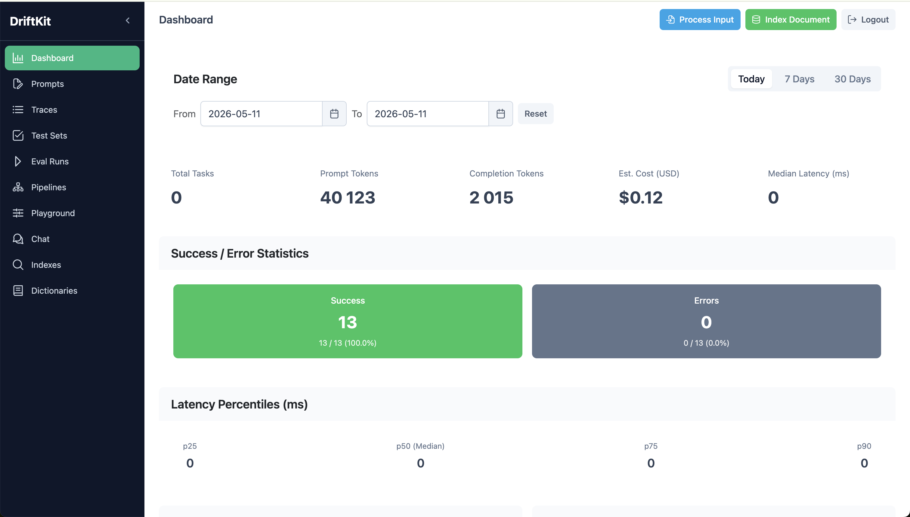
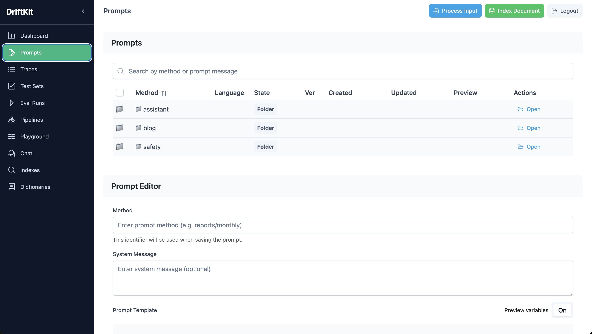
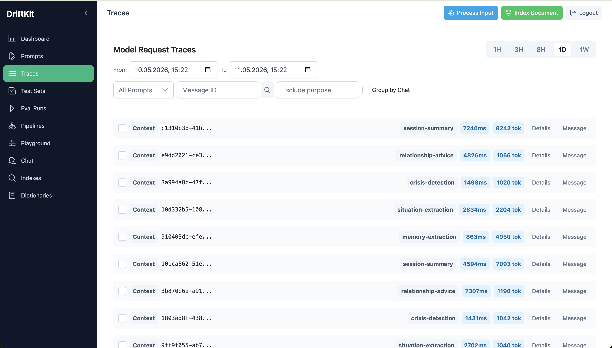
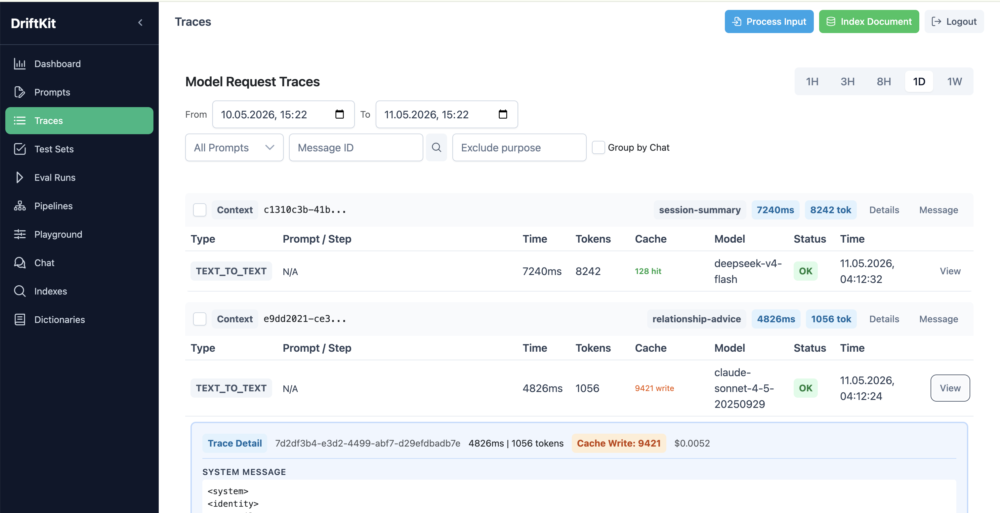
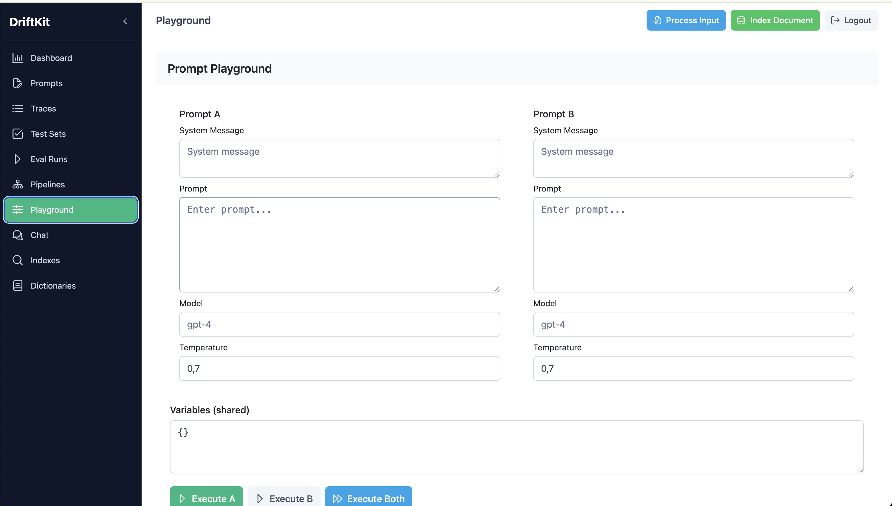

# DriftKit Framework

A Java framework for LLM agents and workflows where prompt lifecycle management (versioning, testing, tracing) is built in rather than delegated to an external platform.

[](https://central.sonatype.com/search?q=g:ai.driftkit)
[](https://github.com/driftkit-ai/driftkit-framework/actions/workflows/ci.yml)
[](LICENSE)


## Requirements

- **Java 21**
- **Maven** (no wrapper is included; 3.8+ is known to work)
- **Spring Boot 3.3.x** for the `*-spring-boot-starter` modules. `driftkit-common`, `driftkit-clients-*`, `driftkit-vector-core` and `driftkit-workflow-engine-*` do not start a Spring context and can be used from plain Java. On the published 0.9.0, `driftkit-workflow-engine-agents` still pulls Spring Boot, Spring Data MongoDB and Apache Tika onto the classpath transitively; that dependency is removed in the repository for the next release.
- **MongoDB** for the Context Engineering platform (`driftkit-context-engineering-spring-boot-starter`). It stores traces, test sets, evaluation runs, audit log and environments in MongoDB; only the prompt store itself can be switched to `in-memory` or `filesystem`. PostgreSQL is not supported yet.
- **Node.js is NOT required** to consume the published artifacts. Building the repository from source downloads Node automatically for the Vue frontend (see [Building from source](#building-from-source)).
- License: Apache 2.0

All modules are published to Maven Central under the `ai.driftkit` group. Current release: **0.9.0** (June 2026).

## Quick start

### Option A — an agent without a Spring context

```xml
<dependency>
    <groupId>ai.driftkit</groupId>
    <artifactId>driftkit-workflow-engine-agents</artifactId>
    <version>0.9.0</version>
</dependency>
<dependency>
    <groupId>ai.driftkit</groupId>
    <artifactId>driftkit-clients-openai</artifactId>   <!-- or driftkit-clients-gemini / -claude / -deepseek -->
    <version>0.9.0</version>
</dependency>
```

```java
import ai.driftkit.clients.core.ModelClientFactory;
import ai.driftkit.common.domain.client.ModelClient;
import ai.driftkit.config.EtlConfig.VaultConfig;
import ai.driftkit.workflow.engine.agent.LLMAgent;

public class Main {
    public static void main(String[] args) {
        VaultConfig config = new VaultConfig();
        config.setName("openai");                          // provider id: openai | gemini | claude | deepseek (see "Model clients")
        config.setApiKey(System.getenv("OPENAI_API_KEY"));
        config.setModel("gpt-4o");                         // any model id the provider accepts

        ModelClient<?> client = ModelClientFactory.fromConfig(config);

        LLMAgent agent = LLMAgent.builder()
                .modelClient(client)
                .systemMessage("You are a helpful assistant")
                .build();

        System.out.println(agent.executeText("Say hello in one sentence").getText());
    }
}
```

### Option B — Spring Boot with the prompt engineering UI

```xml
<dependency>
    <groupId>ai.driftkit</groupId>
    <artifactId>driftkit-context-engineering-spring-boot-starter</artifactId>
    <version>0.9.0</version>
</dependency>
<dependency>
    <groupId>ai.driftkit</groupId>
    <artifactId>driftkit-clients-openai</artifactId>
    <version>0.9.0</version>
</dependency>
```

```yaml
# application.yml
spring:
  data:
    mongodb:
      uri: mongodb://localhost:27017/driftkit

driftkit:
  vault:
    - name: openai                 # provider id: openai | gemini | claude | deepseek
      api-key: ${OPENAI_API_KEY}
      model: gpt-4o
      tracing: true                # record every call in the Traces page
  promptService:
    name: mongodb                  # mongodb | filesystem | in-memory
```

```java
@SpringBootApplication
public class MyApp {
    public static void main(String[] args) {
        SpringApplication.run(MyApp.class, args);
    }
}
```

Start MongoDB, run the app and open **http://localhost:8080/prompt-engineering**. The UI shows a login form, but there is no built-in authentication: the username is only used for the audit log. Put the application behind your own security layer in production. `driftkit.promptService.name` is mandatory; the application refuses to start without it rather than silently using a non-persistent store.

Known limitation of the published 0.9.0: `driftkit-clients-spring-boot-starter` registered its auto-configuration only in `spring.factories`, which Spring Boot 3 ignores, so no `primaryModelClient` bean is created from `driftkit.vault` in 0.9.0. The platform itself still works because it reads the vault directly. Fixed in the repository for the next release.

Prompts, traces, test sets and evaluations are then available through the UI and through the REST API under `/data/v1.0/admin/`.




## Where DriftKit fits

Every framework in the table below can call a model, get structured output, call tools, compute embeddings and talk to a vector store. That is parity, not a differentiator, so those rows are omitted. What is left is where the projects actually differ (checked against Spring AI 2.0.x, LangChain4j 1.19.x and Google ADK for Java, September 2026):

| | DriftKit | Spring AI | LangChain4j | Google ADK (Java) |
|---|---|---|---|---|
| Prompt lifecycle with state machine (DRAFT → AUTO_TESTING → MANUAL_TESTING → CURRENT → REPLACED), versioning, audit log | ✅ | ❌ | ❌ | ❌ |
| Visual prompt IDE: editor, traces, playground, dashboards | ✅ | ❌ | ❌ | ❌ (dev UI for agents, not prompts) |
| Test sets + evaluation runs + scheduled regression detection, driven from the UI | ✅ | ⚠️ `Evaluator` API only (RelevancyEvaluator, FactCheckingEvaluator) | ⚠️ code-level test helpers only | ❌ |
| Prompt cache usage normalised into one `CacheUsage` (hit / write / miss) across Claude, OpenAI, DeepSeek, shown per trace | ✅ | ⚠️ per provider, via native usage objects | ⚠️ per provider | ❌ |
| Multi-agent patterns | ✅ Loop, Sequential, agent-as-tool | ❌ (no orchestration module) | ✅ `langchain4j-agentic` (sequential, parallel, loop, conditional, supervisor; marked experimental) | ✅ |
| Audio: voice activity detection + transcription (AssemblyAI, Deepgram) | ✅ | ⚠️ transcription only (OpenAI) | ❌ | ❌ |
| Use DriftKit prompts and tracing from Spring AI `ChatClient` | ✅ | native | ❌ | ❌ |
| Text-to-speech | ❌ | ✅ | ❌ | ❌ |

### When not to use DriftKit

- You only need model calls, tool calling and RAG in code. Spring AI or LangChain4j are larger communities with broader provider coverage.
- You cannot run MongoDB. The Context Engineering platform has no other persistent backend yet.
- You need a framework with multiple maintainers and a release cadence you can plan around (see below).

DriftKit makes sense when prompts live outside the code, are edited and tested by people other than the developers, and you want traces and cache metrics per prompt version without buying a separate observability product.

### Project maturity (September 2026)

- Version 0.9.x. The API is still evolving; 1.0 is not scheduled.
- Releases: 0.9.0 (June 2026), 0.8.7 (January 2026). Releases are published to Maven Central, without GitHub Releases or a changelog.
- One maintainer. Used in production in two applications built by the maintainer; no known external production users.
- Documentation: this README plus per-module READMEs. There is no documentation site.
- Pinned platform versions: Spring Boot 3.3.1, Spring AI 1.0.1. Newer Spring Boot/Spring AI versions have not been verified.

## Modules

| Module | Purpose | Notes |
|--------|---------|-------|
| [driftkit-common](driftkit-common/README.md) | Shared domain objects, `ModelClient` abstraction, `EtlConfig`, JSON utilities, document splitting, cost calculator | No Spring dependency |
| [driftkit-clients](driftkit-clients/README.md) | Model clients: OpenAI, Gemini (API key or Vertex AI), Claude, DeepSeek, Spring AI adapter | Unified `CacheUsage`; reasoning effort mapped for OpenAI, Gemini, DeepSeek |
| [driftkit-embedding](driftkit-embedding/README.md) | Embedding models: OpenAI, Cohere, local ONNX/BERT, Spring AI adapter | |
| [driftkit-vector](driftkit-vector/README.md) | Vector stores: in-memory, file-based, Pinecone, Spring AI adapter; document parsing (Tika, HTML, images, YouTube subtitles) | No tests yet |
| [driftkit-rag](driftkit-rag/README.md) | Fluent ingestion / retrieval pipelines: loaders, splitters, retrievers, rerankers | |
| [driftkit-workflows](driftkit-workflows/README.md) | Workflow engine (`@Workflow`/`@Step`, `WorkflowBuilder`, suspend/resume, async steps), `LLMAgent`, `LoopAgent`, `SequentialAgent`, test framework | `driftkit-workflows-core` and `driftkit-workflows-spring-boot-starter` are the previous-generation engine kept for compatibility |
| [driftkit-context-engineering](driftkit-context-engineering/README.md) | Prompt management platform: storage backends, template engine, Vue UI, test sets, traces, regression detection, Spring AI bridge | Requires MongoDB |
| [driftkit-audio](driftkit-audio/README.md) | Audio conversion, VAD, batch and streaming transcription | Starter is opt-in: `audio.processing.enabled=true` plus a provider API key |
| [driftkit-chat-assistant-framework](driftkit-chat-assistant-framework/README.md) | Annotation-driven chat assistant sessions on top of MongoDB | No tests yet |
| [driftkit-workflows-examples](driftkit-workflows-examples/README.md) | Reference workflows (chat, reasoning, RAG search / modify, router) | Built on the previous-generation engine; no tests |

### Module layout

```
driftkit-framework/
├── driftkit-common/
├── driftkit-clients/
│   ├── driftkit-clients-core/                    # ModelClientFactory, tracing decorator
│   ├── driftkit-clients-openai/
│   ├── driftkit-clients-gemini/
│   ├── driftkit-clients-claude/
│   ├── driftkit-clients-deepseek/
│   ├── driftkit-clients-spring-ai/               # Spring AI ChatModel as a DriftKit ModelClient
│   ├── driftkit-clients-spring-ai-starter/
│   └── driftkit-clients-spring-boot-starter/     # EtlConfig + primary ModelClient beans
├── driftkit-embedding/
│   ├── driftkit-embedding-core/
│   ├── driftkit-embedding-spring-ai/
│   ├── driftkit-embedding-spring-ai-starter/
│   └── driftkit-embedding-spring-boot-starter/
├── driftkit-vector/
│   ├── driftkit-vector-core/
│   ├── driftkit-vector-spring-ai/
│   ├── driftkit-vector-spring-ai-starter/
│   └── driftkit-vector-spring-boot-starter/      # REST API + document parsers
├── driftkit-rag/
│   ├── driftkit-rag-core/
│   └── driftkit-rag-spring-boot-starter/
├── driftkit-workflows/
│   ├── driftkit-workflow-engine-core/            # current engine
│   ├── driftkit-workflow-engine-agents/          # LLMAgent, LoopAgent, SequentialAgent, AgentAsTool
│   ├── driftkit-workflow-engine-spring-boot-starter/
│   ├── driftkit-workflow-test-framework/
│   ├── driftkit-workflow-controllers/            # REST controllers for workflow operations
│   ├── driftkit-workflows-core/                  # previous-generation engine
│   └── driftkit-workflows-spring-boot-starter/   # previous-generation engine starter
├── driftkit-context-engineering/
│   ├── driftkit-context-engineering-core/        # PromptService, TemplateEngine, overrides, environments
│   ├── driftkit-context-engineering-services/    # MongoDB prompt service, Spring adapter
│   ├── driftkit-context-engineering-spring-boot-starter/   # REST API + Vue UI (/prompt-engineering)
│   ├── driftkit-context-engineering-spring-ai/   # DriftKitChatClient, DriftKitPromptProvider
│   └── driftkit-context-engineering-spring-ai-starter/
├── driftkit-audio/
│   ├── driftkit-audio-core/
│   └── driftkit-audio-spring-boot-starter/
├── driftkit-chat-assistant-framework/
├── driftkit-workflows-examples/
│   ├── driftkit-workflows-examples-core/
│   └── driftkit-workflows-examples-spring-boot-starter/
└── driftkit-bom/                                 # Bill of Materials (published from the next release)
```

## Code examples

All snippets below compile against 0.9.0 with imports from `ai.driftkit.workflow.engine.agent.*` (agents), `ai.driftkit.workflow.engine.core.*` / `ai.driftkit.workflow.engine.annotations.*` (workflow engine) and `ai.driftkit.common.*` (domain classes); checked exceptions are shown where the API declares them.

### Tool calling and structured output

```java
import ai.driftkit.common.tools.Tool;

public class WeatherTools {
    @Tool(description = "Get weather for a city")
    public WeatherInfo getWeather(String city) {
        return new WeatherInfo(city, 22.5, "Sunny");
    }
}

LLMAgent agent = LLMAgent.builder()
        .modelClient(modelClient)
        .systemMessage("You are a helpful assistant")
        .build();

// register a method of an object as a tool (tools are executed automatically by default)
agent.registerTool("getWeather", new WeatherTools());

AgentResponse<List<ToolExecutionResult>> response = agent.executeWithTools("What's the weather in Paris?");
WeatherInfo weather = response.getToolResults().get(0).getTypedResult(WeatherInfo.class);

// structured output straight into a POJO
Person person = agent.executeStructured("Extract: John Doe, 30 years old, engineer", Person.class)
        .getStructuredData();
```

Other `LLMAgent` entry points: `executeText`, `executeForToolCalls` (manual tool execution), `executeWithPrompt` (prompt template by id from a `PromptService`), `executeWithImages`, `executeStructuredWithImage/Video/PDF`, `executeStreaming`, `executeAgentic` (tool loop with optional human approval).

### Multi-agent patterns

```java
// Loop: a worker produces, an evaluator decides when to stop
LoopAgent travelLoop = LoopAgent.builder()
        .worker(planner)                       // Agent
        .evaluator(validator)                  // Agent returning CONTINUE / COMPLETE / REVISE / RETRY / FAILED
        .stopCondition(LoopStatus.COMPLETE)
        .maxIterations(5)
        .build();
String plan = travelLoop.execute("Plan my Paris trip");

// Sequential: output of one agent is the input of the next
SequentialAgent pipeline = SequentialAgent.builder()
        .agent(researcher)
        .agent(analyzer)
        .agent(summarizer)
        .build();
String report = pipeline.execute("Quantum computing trends");

// Agent as a tool of another agent
LLMAgent orchestrator = LLMAgent.builder()
        .modelClient(modelClient)
        .systemMessage("Plan complete trips")
        .addTool(AgentAsTool.create("searchFlights", "Find flights for the given route and dates", flightAgent))
        .build();
```

There is no dedicated "hierarchical agent" class: hierarchy is built with `AgentAsTool`. Every `LLMAgent` in these examples needs a `modelClient`; the builder does not validate it and a missing client fails at execution time.

### Workflow with human-in-the-loop

```java
@Workflow(id = "customer-support", version = "1.0")
public class CustomerSupportWorkflow {

    @InitialStep
    public StepResult<SupportMenu> greet(String userMessage, WorkflowContext context) {
        SupportMenu menu = new SupportMenu("Hello! How can I help you today?",
                List.of("Account Help", "Technical Support", "Billing"));
        // suspend and wait for a CustomerChoice from the user
        return StepResult.suspend(menu, CustomerChoice.class);
    }

    @Step
    public StepResult<?> handleChoice(CustomerChoice choice, WorkflowContext context) {
        if ("Billing".equals(choice.getSelection())) {
            return StepResult.suspend(new BillingForm("Please provide details:"), BillingDetails.class);
        }
        return StepResult.finish(generateHelp(choice.getSelection()));
    }

    @Step
    public StepResult<Resolution> processBilling(BillingDetails details, WorkflowContext context) {
        return StepResult.finish(resolveBillingIssue(details));
    }
}
```

```java
WorkflowEngine engine = new WorkflowEngine();          // or the auto-configured bean from the Spring Boot starter
engine.register(new CustomerSupportWorkflow());

WorkflowEngine.WorkflowExecution<?> run = engine.execute("customer-support", "hi");
// ... later, when the user answers:
engine.resume(run.getRunId(), new CustomerChoice("Billing"));
```

`StepResult` is a sealed interface with `continueWith`, `suspend`, `branch`, `async`, `finish` and `fail`. Steps can also be composed programmatically with `WorkflowBuilder.define(...)`. To call another workflow from a step, inject the `WorkflowEngine` and call `execute` on it; there is no special step result for that.

### Spring AI: use DriftKit prompts from `ChatClient`

```xml
<dependency>
    <groupId>ai.driftkit</groupId>
    <artifactId>driftkit-context-engineering-spring-ai-starter</artifactId>
    <version>0.9.0</version>
</dependency>
```

```java
@Component
public class CustomerService {
    private final DriftKitChatClient chatClient;      // auto-configured bean

    public String analyzeSentiment(String review) {
        return chatClient.promptById("sentiment.analysis")   // prompt managed in the DriftKit UI
                .withVariable("review", review)
                .withLanguage(Language.ENGLISH)
                .call()
                .content();                                   // traced like any DriftKit call
    }

    public ProductInfo extractProductInfo(String description) {
        return chatClient.promptById("product.extraction")
                .withVariable("description", description)
                .call()
                .entity(ProductInfo.class);
    }
}

// or resolve the prompt yourself and use a plain Spring AI ChatClient
@Component
public class AIService {
    private final ChatClient chatClient;
    private final DriftKitPromptProvider promptProvider;

    public String generate(Map<String, Object> variables) {
        var config = promptProvider.getPrompt("content.generation", Language.ENGLISH);
        return chatClient.prompt()
                .system(config.getSystemMessage())
                .user(u -> u.text(config.getUserMessage()).params(variables))
                .options(opt -> opt.temperature(config.getTemperature()))
                .call()
                .content();
    }
}
```

```yaml
driftkit:
  spring-ai:
    application-name: "my-app"
    tracing:
      enabled: true          # default true
    memory:
      enabled: false         # conversation memory advisor
    logging:
      enabled: false         # request/response logging advisor
    chat-client:
      enabled: true          # DriftKitChatClient bean
    enhanced-chat-client:
      enabled: false         # plain ChatClient bean with the DriftKit advisors attached
    default-system-message: "You are a helpful assistant"
```

The other direction also works: a Spring AI `ChatModel` can be wrapped as a DriftKit `ModelClient` (`driftkit-clients-spring-ai`), a Spring AI `EmbeddingModel` as a DriftKit embedding model (`driftkit-embedding-spring-ai`) and any Spring AI `VectorStore` as a DriftKit vector store (`driftkit-vector-spring-ai`, `SpringAiVectorStoreAdapter`). On the published 0.9.0 `SpringAIModelClient.streamTextToText` returns the full response as one chunk; real token streaming through `ChatModel.stream` is in the repository for the next release.

### Structured output without an agent

```java
Person extract(ModelClient<?> modelClient, List<ModelContentMessage> messages) throws JsonProcessingException {
    ResponseFormat format = ResponseFormat.jsonSchema(Person.class);   // schema generated from the class

    ModelTextResponse response = modelClient.textToText(
            ModelTextRequest.builder()
                    .messages(messages)
                    .responseFormat(format)
                    .build());

    // JsonUtils.fromJson declares Jackson's checked JsonProcessingException
    return JsonUtils.fromJson(response.getChoices().get(0).getMessage().getContent(), Person.class);
}
```

Annotate a class with `@JsonSchemaStrict` to mark all of its fields as required and forbid additional properties in the generated schema.

## Context Engineering platform





- **Prompt storage**: `in-memory`, `filesystem` (`promptsFilePath`), `mongodb`, selected with `driftkit.promptService.name`.
- **State machine**: DRAFT → AUTO_TESTING → MANUAL_TESTING → CURRENT → REPLACED, with an audit log of who changed what.
- **Templates**: `{{variable}}`, `{{#if condition}}...{{/if}}`, `{{#list items as item}}...{{/list}}`; dictionary values are injected with `dict-markers:<itemId>` / `dict-samples:<itemId>` variable values.
- **Environments**: prompt versions per environment name (for example dev / staging / production). The active environment is a thread-local string your code sets through `PromptEnvironmentResolver`; nothing sets it automatically.
- **Prompt overrides**: `PromptOverrideContext` (ThreadLocal) lets a pipeline test run substitute prompts without touching production traffic.
- **Traces**: every model call with tokens, latency, estimated USD cost (`CostCalculator`) and cache hit / write / miss counts for Claude, OpenAI and DeepSeek.
- **Test sets and evaluation runs**: run a prompt version against a dataset, compare with the previous run; `RegressionDetectionService` runs on a schedule (`driftkit.regression.cron`).
- **Playground**: two prompts against the same variables, dataset sweeps and pipeline runs with prompt overrides. This is manual side-by-side comparison; there is no traffic splitting.
- **Frontend**: Vue 3 + PrimeVue + Vite, 13 routes (dashboard, prompts, traces, test sets, evaluation runs, run results, pipelines, playground, chat, indexes, dictionaries, checklists, login).

## Model clients

| Provider | Module | Text | Vision | Image generation | Streaming | Reasoning control | Cache metrics |
|---|---|---|---|---|---|---|---|
| OpenAI | `driftkit-clients-openai` | ✅ | ✅ | ✅ (DALL-E, gpt-image) | ✅ | `reasoning_effort` for o-series / gpt-5 | ✅ automatic cache |
| Gemini | `driftkit-clients-gemini` | ✅ | ✅ | ✅ | ✅ | `thinkingBudget` | — |
| Claude | `driftkit-clients-claude` | ✅ | ✅ | ❌ | ✅ | not mapped yet | ✅ `cache_control` (manual breakpoints or `CachePolicy.AUTO`) |
| DeepSeek | `driftkit-clients-deepseek` | ✅ | ❌ | ❌ | ✅ | `thinking` | ✅ prefix cache |
| Spring AI | `driftkit-clients-spring-ai` | ✅ | ✅ | ❌ | ✅ (next release; single chunk on 0.9.0) | — | — |

Clients are discovered through `ServiceLoader`. A vault entry's `type` selects the provider (`openai`, `gemini`, `claude`, `deepseek`); when `type` is absent the `name` is used instead, and a name that contains the provider id (`primary-openai`) also works. On the published 0.9.0 only the `name` is honoured, so keep `name` equal to the provider id if you need to stay compatible with it.

Model ids are plain strings passed through to the provider, so new models work without a framework release. `CostCalculator` prices the models listed in its table and prefix-matches unknown ids to the closest listed one (`gemini-2.5-flash-lite` is priced as `gemini-2.5-flash`), so the estimated cost for a new model variant is approximate; ids with no listed prefix report zero cost.

## Building from source

```bash
git clone https://github.com/driftkit-ai/driftkit-framework.git
cd driftkit-framework
mvn -B install                      # full build with tests (~2 min after dependencies are cached)
mvn -B install -DskipTests          # without tests
mvn -B install -Dskip.frontend=true # skip the Node/Vue build of the prompt engineering UI
```

The `driftkit-context-engineering-spring-boot-starter` build downloads Node v18 and runs `npm install` / `npm run build` through `frontend-maven-plugin`, so the first build needs network access. Unit tests do not need API keys.

## Roadmap

- **PostgreSQL backend** for the Context Engineering platform (currently MongoDB only)
- **Claude extended thinking** mapping for `ReasoningEffort` (OpenAI, Gemini and DeepSeek are mapped today)
- **BOM** published to Maven Central (`driftkit-bom`, in the repository, ships with the next release)
- **Additional providers**: Mistral AI, Grok
- **Vector stores without Spring**: Weaviate, Qdrant, Redis, Elasticsearch
- **Test coverage** for `driftkit-vector`, `driftkit-chat-assistant-framework` and `driftkit-workflows-examples`, which currently have none
- **Documentation site**, CHANGELOG and GitHub Releases
- **Text-to-speech**, **OpenTelemetry** export, Docker image for the platform

Issues and pull requests: https://github.com/driftkit-ai/driftkit-framework/issues

## License

Apache License 2.0 — see [LICENSE](LICENSE).

Copyright 2024–2026 DriftKit Contributors.
