# Structured Outputs Implementation Guide

## Обзор

Данный документ описывает имплементацию Structured Outputs (структурированных выходов) для AI клиентов Claude и Gemini в фреймворке DriftKit. Structured Outputs позволяют гарантировать, что ответы языковых моделей соответствуют заданной JSON схеме.

## Содержание

1. [Архитектура](#архитектура)
2. [Claude Structured Outputs](#claude-structured-outputs)
3. [Gemini Structured Outputs](#gemini-structured-outputs)
4. [Общая модель данных](#общая-модель-данных)
5. [Примеры использования](#примеры-использования)
6. [Сравнение провайдеров](#сравнение-провайдеров)

---

## Архитектура

### Общая архитектура Structured Outputs

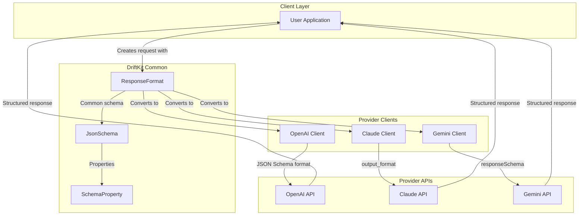

### Поток данных для Structured Outputs

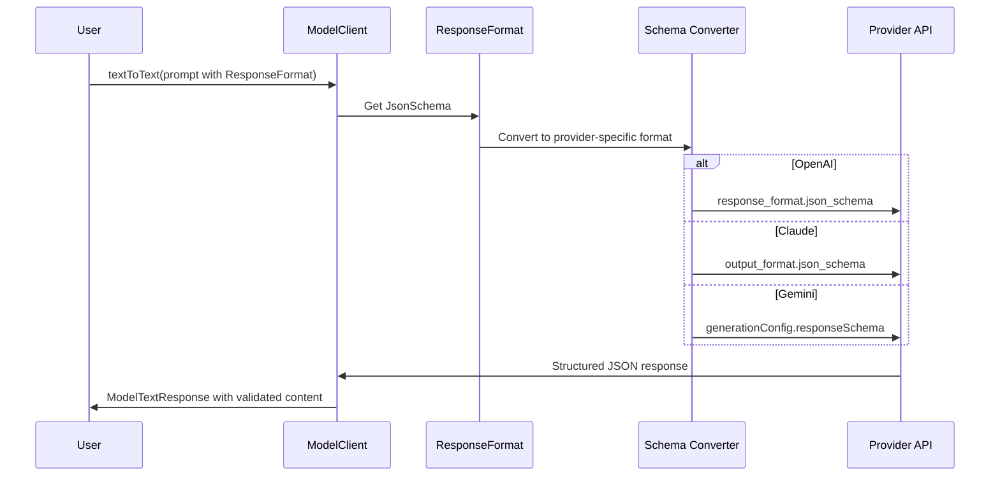

---

## Claude Structured Outputs

### Обзор Claude API

Claude поддерживает два режима structured outputs:
1. **JSON Output Mode** - через параметр `output_format`
2. **Strict Tool Use** - через флаг `strict: true` в определении инструментов

### Архитектура Claude Structured Outputs

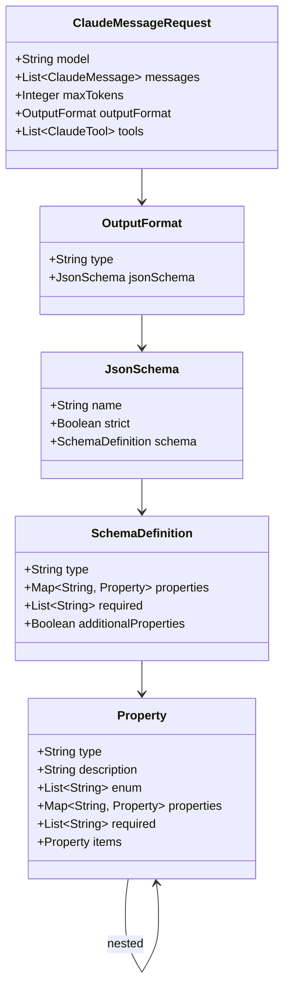

### Процесс конверсии схемы для Claude

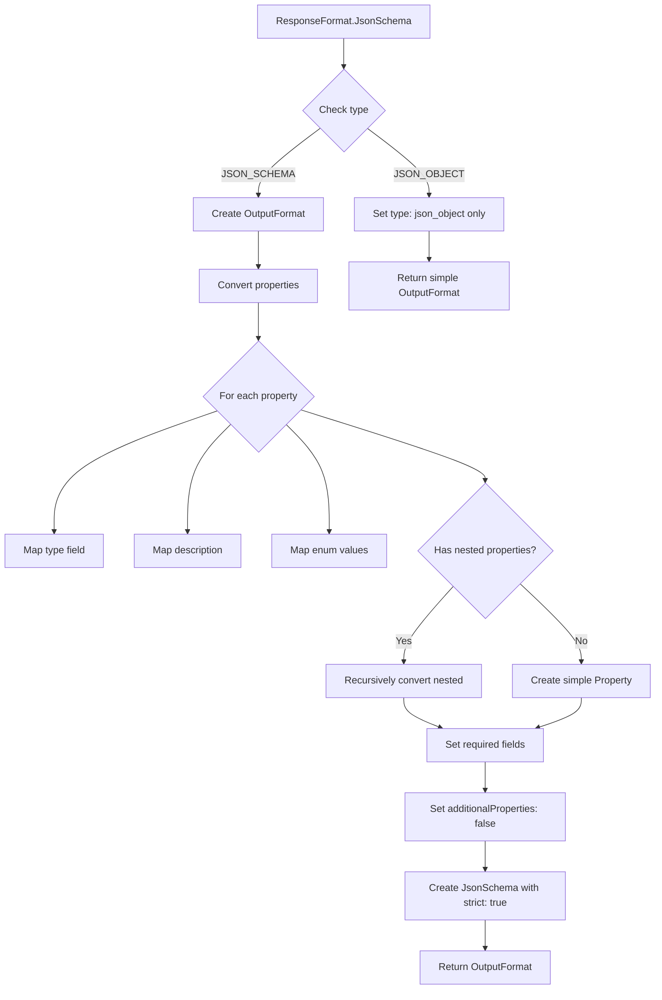

### Особенности Claude Structured Outputs

#### Требования API

- **Beta Header**: Требуется заголовок `anthropic-beta: structured-outputs-2025-11-13`
- **Supported Models**:
  - Claude Sonnet 4.5
  - Claude Opus 4.1
- **Strict Mode**: По умолчанию включен (`strict: true`)

#### Поддерживаемые JSON Schema конструкции

✅ **Поддерживаются:**
- Стандартные типы: `object`, `array`, `string`, `number`, `boolean`, `null`
- `required` - обязательные поля
- `enum` - перечисления
- Вложенные объекты и массивы
- `description` для полей

❌ **НЕ поддерживаются:**
- `minimum`, `maximum` - добавляются SDK в description
- `minLength`, `maxLength` - добавляются SDK в description
- Циклические и чрезмерно рекурсивные определения
- Сложные regex patterns

#### Обработка ошибок

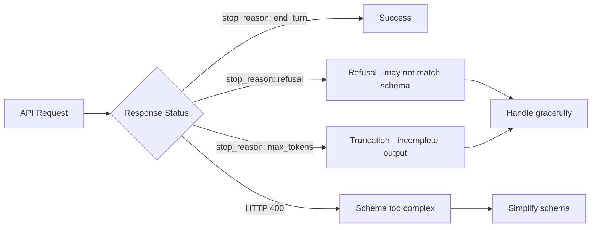

### Производительность и кэширование

```mermaid
gantt
    title Claude Structured Outputs - Performance Timeline
    dateFormat X
    axisFormat %s

    section First Request
    Grammar Compilation :a1, 0, 2000
    Model Processing :a2, 2000, 5000

    section Cached Requests (24h)
    Direct Processing :b1, 0, 3000
```

---

## Gemini Structured Outputs

### Обзор Gemini API

Gemini использует два параметра в `generationConfig`:
- `responseMimeType`: `"application/json"`
- `responseSchema`: JSON Schema объект

### Архитектура Gemini Structured Outputs

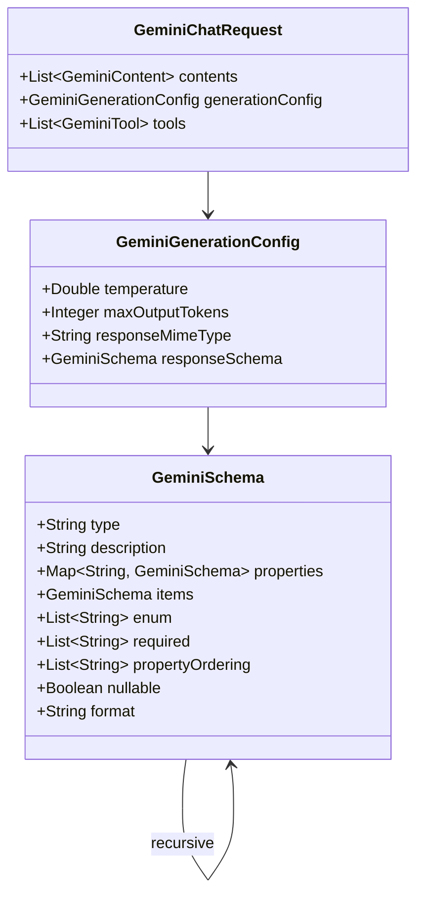

### Процесс конверсии схемы для Gemini

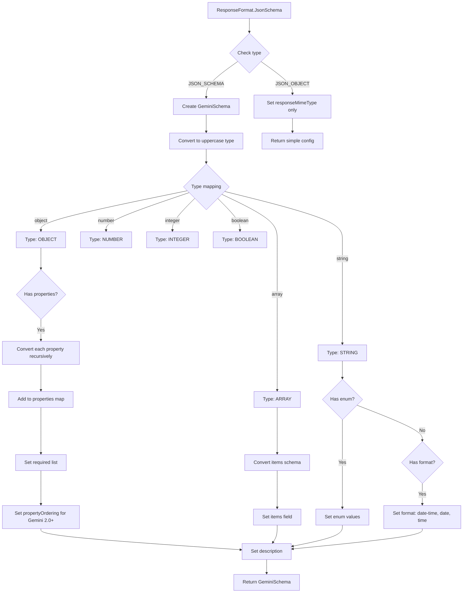

### Особенности Gemini Structured Outputs

#### Поддерживаемые модели

- ✅ Gemini 3 Pro Preview
- ✅ Gemini 2.5 Pro
- ✅ Gemini 2.5 Flash
- ✅ Gemini 2.5 Flash-Lite
- ✅ Gemini 2.0 Flash (требует `propertyOrdering`)

#### Поддерживаемые типы и ограничения

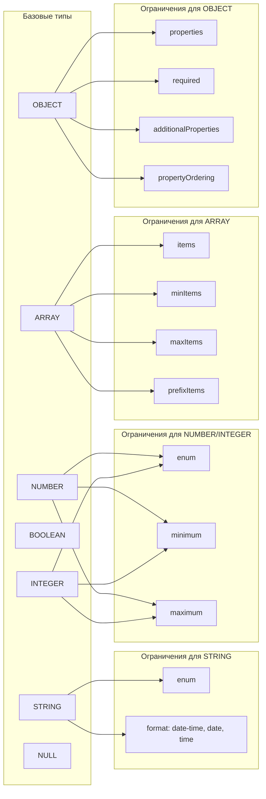

#### Дескриптивные свойства

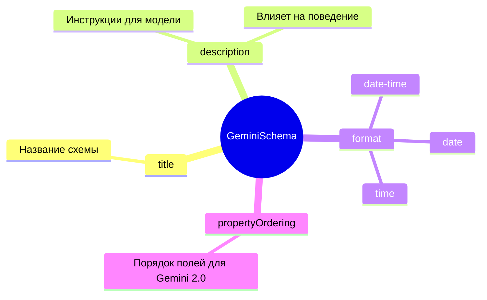

### Интеграция с инструментами Gemini 3

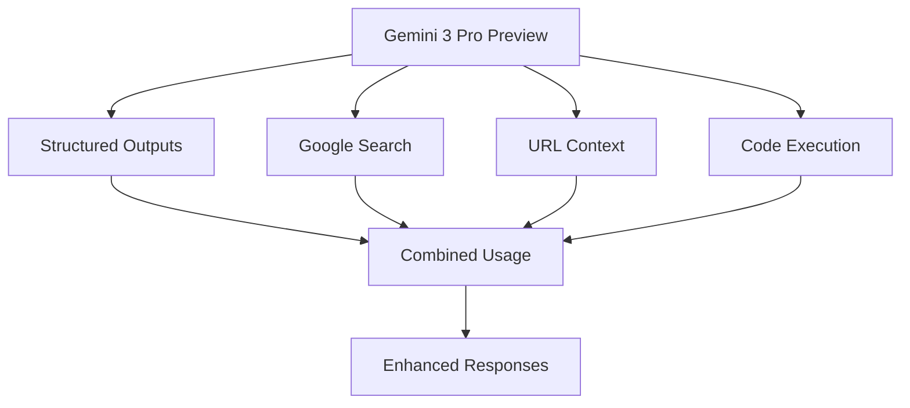

---

## Общая модель данных

### ResponseFormat - Унифицированная модель

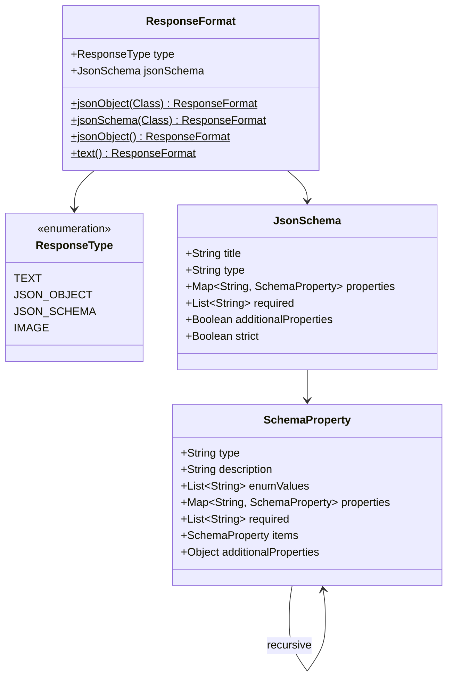

### Маппинг между провайдерами

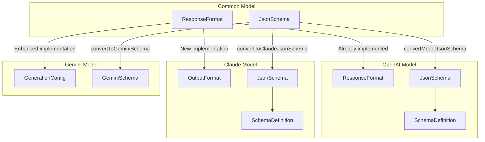

---

## Примеры использования

### Пример 1: Простая структура данных

#### Определение Java класса

```java
public class UserProfile {
    private String name;
    private int age;
    private String email;

    // getters, setters, constructors
}
```

#### Использование с разными провайдерами

```java
// Создание request с structured output
ModelTextRequest request = ModelTextRequest.builder()
    .messages(messages)
    .responseFormat(ResponseFormat.jsonSchema(UserProfile.class))
    .build();

// OpenAI
OpenAIModelClient openAIClient = new OpenAIModelClient();
ModelTextResponse openAIResponse = openAIClient.textToText(request);

// Claude
ClaudeModelClient claudeClient = new ClaudeModelClient();
ModelTextResponse claudeResponse = claudeClient.textToText(request);

// Gemini
GeminiModelClient geminiClient = new GeminiModelClient();
ModelTextResponse geminiResponse = geminiClient.textToText(request);
```

#### Генерируемые схемы

**Common Schema:**
```json
{
  "type": "object",
  "title": "UserProfile",
  "properties": {
    "name": {"type": "string", "description": "User name"},
    "age": {"type": "integer", "description": "User age"},
    "email": {"type": "string", "description": "User email"}
  },
  "required": ["name", "age", "email"],
  "additionalProperties": false
}
```

**Claude Format:**
```json
{
  "type": "json_schema",
  "json_schema": {
    "name": "UserProfile",
    "strict": true,
    "schema": {
      "type": "object",
      "properties": {
        "name": {"type": "string", "description": "User name"},
        "age": {"type": "number", "description": "User age"},
        "email": {"type": "string", "description": "User email"}
      },
      "required": ["name", "age", "email"],
      "additionalProperties": false
    }
  }
}
```

**Gemini Format:**
```json
{
  "responseMimeType": "application/json",
  "responseSchema": {
    "type": "OBJECT",
    "properties": {
      "name": {"type": "STRING", "description": "User name"},
      "age": {"type": "INTEGER", "description": "User age"},
      "email": {"type": "STRING", "description": "User email"}
    },
    "required": ["name", "age", "email"],
    "propertyOrdering": ["name", "age", "email"]
  }
}
```

### Пример 2: Сложная вложенная структура

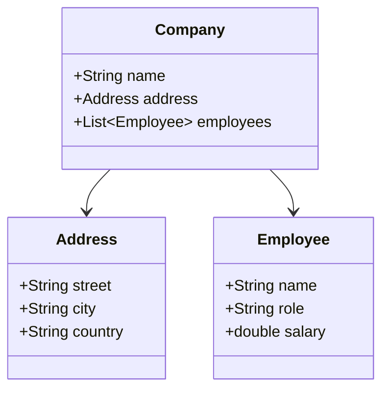

```java
public class Company {
    private String name;
    private Address address;
    private List<Employee> employees;
}

public class Address {
    private String street;
    private String city;
    private String country;
}

public class Employee {
    private String name;
    private String role;
    private double salary;
}

// Usage
ResponseFormat format = ResponseFormat.jsonSchema(Company.class);
```

### Пример 3: Enum и ограничения

```java
public class OrderStatus {
    public enum Status {
        PENDING, PROCESSING, SHIPPED, DELIVERED, CANCELLED
    }

    private String orderId;
    private Status status;
    private LocalDateTime timestamp;
}

// Генерируется схема с enum
{
  "properties": {
    "orderId": {"type": "string"},
    "status": {
      "type": "string",
      "enum": ["PENDING", "PROCESSING", "SHIPPED", "DELIVERED", "CANCELLED"]
    },
    "timestamp": {
      "type": "string",
      "format": "date-time"
    }
  }
}
```

---

## Сравнение провайдеров

### Таблица возможностей

| Возможность | OpenAI | Claude | Gemini |
|------------|--------|--------|--------|
| JSON Object Mode | ✅ | ✅ | ✅ |
| JSON Schema Mode | ✅ | ✅ | ✅ |
| Strict Mode | ✅ | ✅ (default) | ⚠️ (implicit) |
| Nested Objects | ✅ | ✅ | ✅ |
| Arrays | ✅ | ✅ | ✅ |
| Enums | ✅ | ✅ | ✅ |
| Format (date-time, etc.) | ⚠️ | ⚠️ | ✅ |
| Min/Max constraints | ⚠️ | ❌ | ✅ |
| Pattern/Regex | ⚠️ | ❌ | ⚠️ |
| Nullable fields | ✅ | ✅ | ✅ |
| Property ordering | ❌ | ❌ | ✅ (Gemini 2.0+) |
| Streaming support | ✅ | ✅ | ✅ |
| Tool use + Structured | ✅ | ✅ | ✅ |
| Caching | ✅ | ✅ (24h) | ✅ |

### Производительность

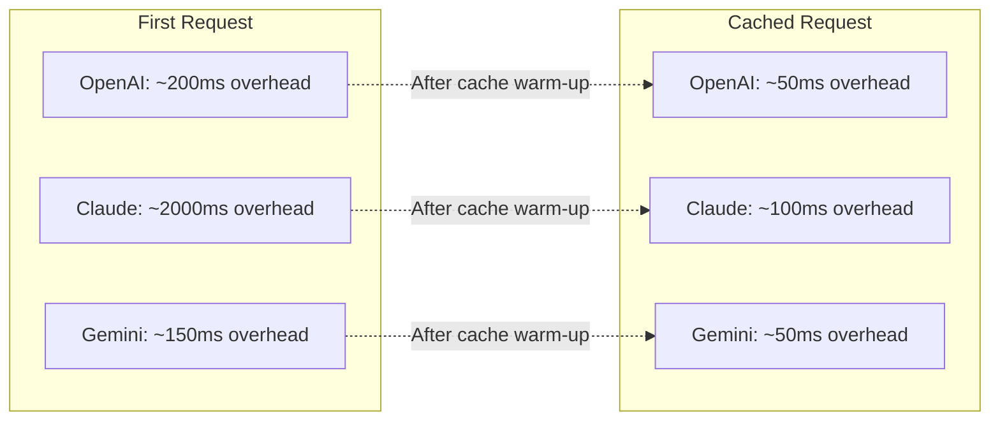

### Рекомендации по выбору

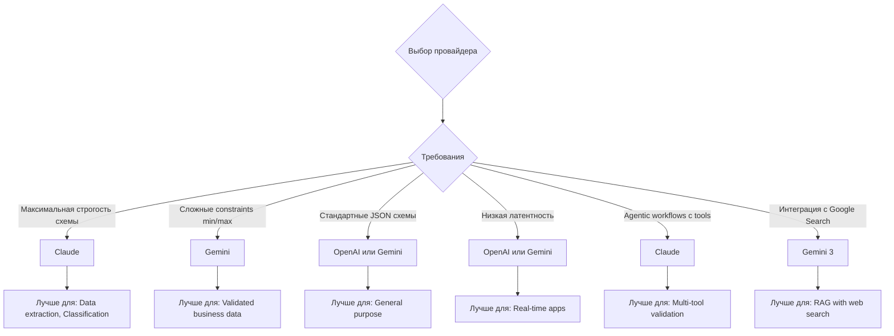

### Стоимость токенов

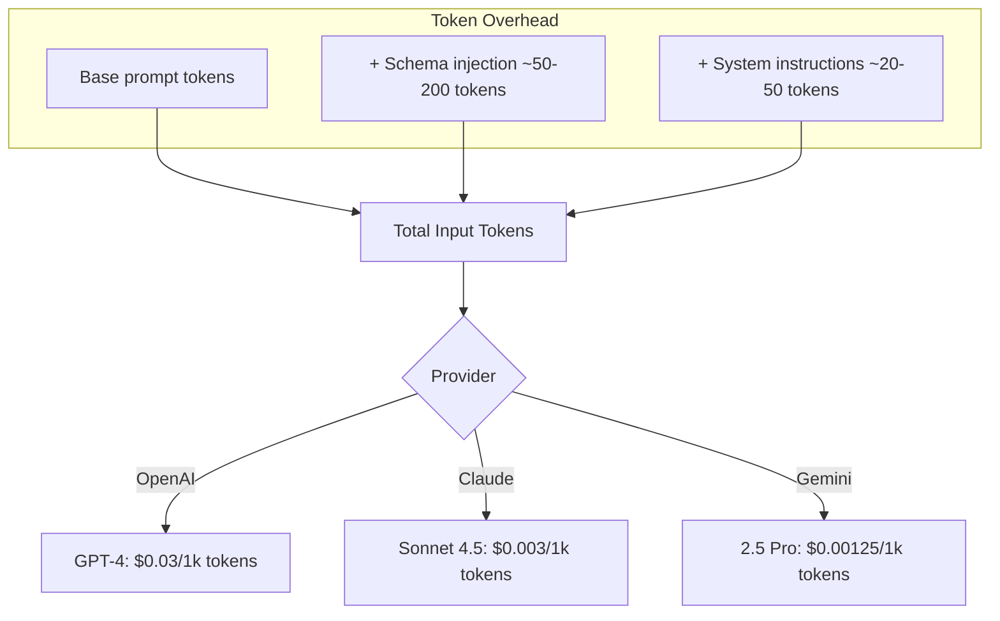

---

## Лучшие практики

### 1. Дизайн схем

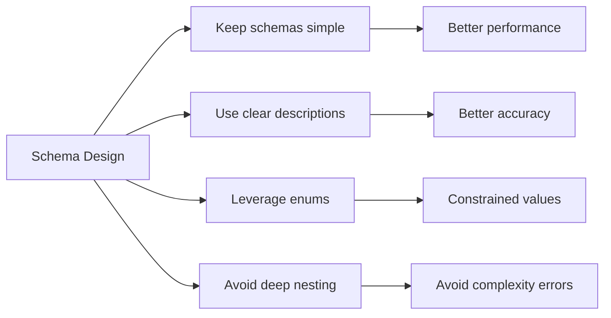

### 2. Обработка ошибок

```java
try {
    ModelTextResponse response = client.textToText(request);

    // Проверка finish_reason
    if ("refusal".equals(response.getChoices().get(0).getFinishReason())) {
        // Модель отказалась отвечать - может не соответствовать схеме
        log.warn("Model refused to respond");
    } else if ("length".equals(response.getChoices().get(0).getFinishReason())) {
        // Ответ обрезан - неполный JSON
        log.warn("Response truncated - increase max_tokens");
    }

    // Парсинг и валидация
    String content = response.getChoices().get(0).getMessage().getContent();
    UserProfile profile = objectMapper.readValue(content, UserProfile.class);

} catch (JsonProcessingException e) {
    log.error("Failed to parse structured output", e);
    // Fallback logic
}
```

### 3. Оптимизация производительности

- Переиспользуйте одинаковые схемы для кэширования
- Упрощайте схемы где возможно
- Используйте `additionalProperties: false` для строгости
- Для Claude: первый запрос медленнее из-за компиляции грамматики

### 4. Валидация на стороне клиента

```java
// Дополнительная валидация после получения ответа
public <T> T validateAndParse(String jsonContent, Class<T> clazz) {
    // 1. JSON validation
    if (!JsonUtils.isValidJSON(jsonContent)) {
        jsonContent = JsonUtils.fixIncompleteJSON(jsonContent);
    }

    // 2. Schema validation
    T object = objectMapper.readValue(jsonContent, clazz);

    // 3. Business logic validation
    validateBusinessRules(object);

    return object;
}
```

---

## Миграция и обратная совместимость

### Поддержка legacy кода

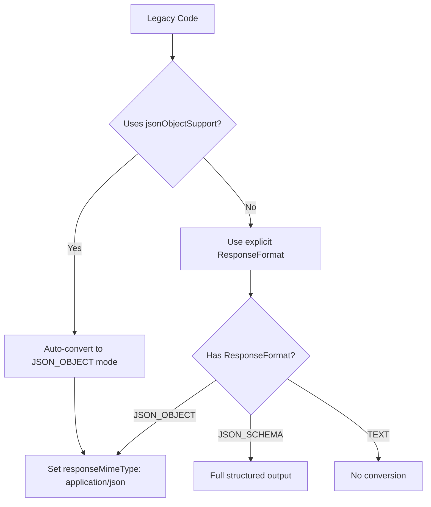

### Пример миграции

```java
// Old approach (still supported)
ModelClient client = new ClaudeModelClient();
client.setJsonObjectSupport(true);

// New approach (recommended)
ModelTextRequest request = ModelTextRequest.builder()
    .responseFormat(ResponseFormat.jsonSchema(MyClass.class))
    .build();
```

---

## Заключение

Structured Outputs - мощный инструмент для обеспечения надежности и предсказуемости ответов AI моделей. Реализация в DriftKit обеспечивает:

✅ Унифицированный API для всех провайдеров
✅ Автоматическую конверсию схем
✅ Валидацию и обработку ошибок
✅ Обратную совместимость
✅ Production-ready решение

### Дальнейшее развитие

- [ ] Поддержка дополнительных JSON Schema constraints
- [ ] Кэширование скомпилированных схем
- [ ] Метрики и мониторинг использования
- [ ] A/B тестирование разных провайдеров
- [ ] Автоматическая генерация документации из схем
