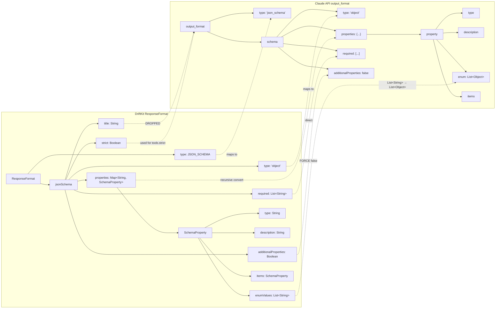
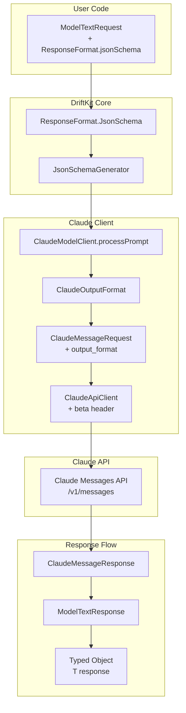
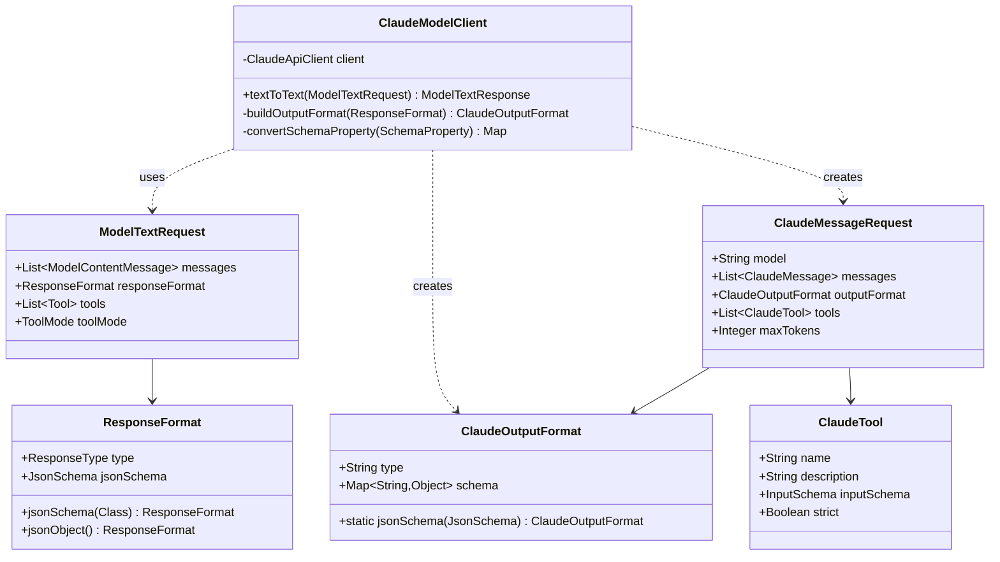
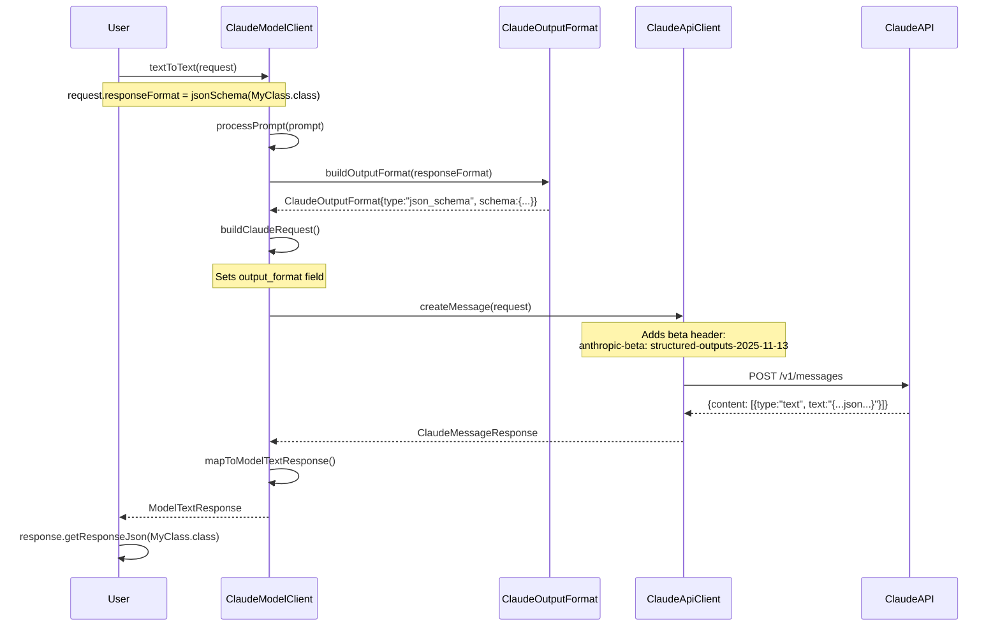
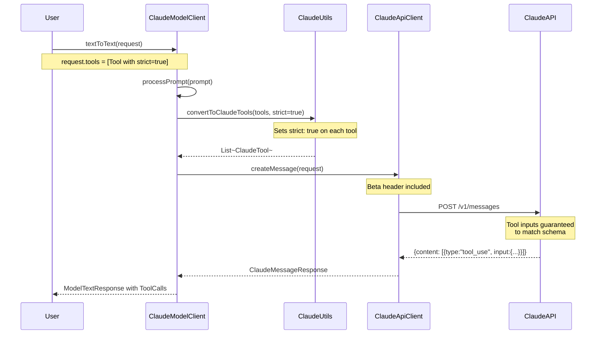
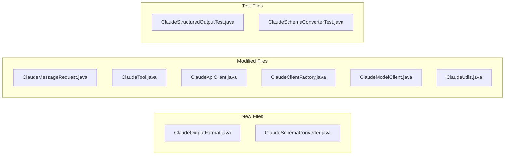

# Claude Structured Outputs Implementation Plan

## Overview

This document describes the implementation of **Claude API Structured Outputs** feature for the `driftkit-clients-claude` module. The implementation follows the [Claude API Structured Outputs Documentation](https://platform.claude.com/docs/en/build-with-claude/structured-outputs).

## Feature Summary

Claude Structured Outputs provides two complementary features:

1. **JSON Outputs** (`output_format`) - Control Claude's response format to return valid JSON matching a schema
2. **Strict Tool Use** (`strict: true`) - Guarantee schema validation on tool names and inputs

Both features require the beta header: `anthropic-beta: structured-outputs-2025-11-13`

## Current State Analysis

### Existing Implementation

```
driftkit-clients-claude/
├── client/
│   ├── ClaudeModelClient.java      # Main client - NO structured output support
│   ├── ClaudeClientFactory.java    # Feign factory - NO beta header
│   └── ClaudeApiClient.java        # Feign interface - NO beta header
├── domain/
│   ├── ClaudeMessageRequest.java   # Request DTO - MISSING output_format field
│   ├── ClaudeTool.java             # Tool definition - MISSING strict field
│   └── ...
└── utils/
    └── ClaudeUtils.java            # Utilities - NO schema conversion
```

### Current Gaps

| Feature | Current State | Required |
|---------|--------------|----------|
| `output_format` field | Not implemented | Add to ClaudeMessageRequest |
| `strict` flag on tools | Not implemented | Add to ClaudeTool |
| Beta header | Not present | Add `anthropic-beta: structured-outputs-2025-11-13` |
| ResponseFormat mapping | Not implemented | Map DriftKit ResponseFormat to Claude format |
| Typed response parsing | Not implemented | Deserialize JSON to target class |
| Schema conversion | Partial (tools only) | Full JSON Schema support |

---

## Format Mapping (DriftKit → Claude API)



### Key Transformations

| Source (DriftKit) | Target (Claude) | Transformation |
|-------------------|-----------------|----------------|
| `ResponseFormat.type = JSON_SCHEMA` | `output_format.type = "json_schema"` | Enum to string |
| `JsonSchema.title` | *(dropped)* | Claude doesn't use title |
| `JsonSchema.type` | `schema.type` | Direct copy |
| `JsonSchema.properties` | `schema.properties` | Recursive SchemaProperty conversion |
| `JsonSchema.required` | `schema.required` | Direct copy |
| `JsonSchema.additionalProperties` | `schema.additionalProperties = false` | **Always forced to false** |
| `JsonSchema.strict` | `tool.strict` | Used for tools, not output_format |
| `SchemaProperty.enumValues` (List\<String\>) | `enum` (List\<Object\>) | Upcast (compatible) |
| `SchemaProperty.additionalProperties` | `additionalProperties = false` | **Always forced to false** |

---

## Architecture Design

### High-Level Flow



### Component Diagram



### Sequence Diagram - JSON Schema Request



### Sequence Diagram - Strict Tool Use



---

## Implementation Details

### 1. New Class: ClaudeOutputFormat

**File:** `domain/ClaudeOutputFormat.java`

```java
package ai.driftkit.clients.claude.domain;

import com.fasterxml.jackson.annotation.JsonInclude;
import com.fasterxml.jackson.annotation.JsonProperty;
import lombok.AllArgsConstructor;
import lombok.Builder;
import lombok.Data;
import lombok.NoArgsConstructor;

import java.util.List;
import java.util.Map;

/**
 * Represents Claude's output_format parameter for structured outputs.
 *
 * @see <a href="https://platform.claude.com/docs/en/build-with-claude/structured-outputs">
 *      Claude Structured Outputs Documentation</a>
 */
@Data
@Builder
@NoArgsConstructor
@AllArgsConstructor
@JsonInclude(JsonInclude.Include.NON_NULL)
public class ClaudeOutputFormat {

    /**
     * The type of output format.
     * Currently only "json_schema" is supported for structured outputs.
     */
    @JsonProperty("type")
    private String type;

    /**
     * The JSON Schema that the response must conform to.
     * Uses standard JSON Schema format with some limitations.
     */
    @JsonProperty("schema")
    private JsonSchemaDefinition schema;

    /**
     * Creates a JSON schema output format from a schema definition.
     */
    public static ClaudeOutputFormat jsonSchema(JsonSchemaDefinition schema) {
        return ClaudeOutputFormat.builder()
                .type("json_schema")
                .schema(schema)
                .build();
    }

    /**
     * JSON Schema definition compatible with Claude's structured outputs.
     */
    @Data
    @Builder
    @NoArgsConstructor
    @AllArgsConstructor
    @JsonInclude(JsonInclude.Include.NON_NULL)
    public static class JsonSchemaDefinition {

        @JsonProperty("type")
        private String type;

        @JsonProperty("properties")
        private Map<String, SchemaProperty> properties;

        @JsonProperty("required")
        private List<String> required;

        /**
         * Must be set to false for Claude structured outputs.
         */
        @JsonProperty("additionalProperties")
        private Boolean additionalProperties;

        @JsonProperty("items")
        private SchemaProperty items;

        @JsonProperty("enum")
        private List<Object> enumValues;

        @JsonProperty("const")
        private Object constValue;

        @JsonProperty("anyOf")
        private List<JsonSchemaDefinition> anyOf;

        @JsonProperty("allOf")
        private List<JsonSchemaDefinition> allOf;

        @JsonProperty("$ref")
        private String ref;

        @JsonProperty("$defs")
        private Map<String, JsonSchemaDefinition> defs;

        @JsonProperty("definitions")
        private Map<String, JsonSchemaDefinition> definitions;

        @JsonProperty("default")
        private Object defaultValue;

        @JsonProperty("format")
        private String format;

        @JsonProperty("minItems")
        private Integer minItems;

        @JsonProperty("description")
        private String description;
    }

    /**
     * Schema property definition for nested objects.
     */
    @Data
    @Builder
    @NoArgsConstructor
    @AllArgsConstructor
    @JsonInclude(JsonInclude.Include.NON_NULL)
    public static class SchemaProperty {

        @JsonProperty("type")
        private String type;

        @JsonProperty("description")
        private String description;

        @JsonProperty("enum")
        private List<Object> enumValues;

        @JsonProperty("const")
        private Object constValue;

        @JsonProperty("properties")
        private Map<String, SchemaProperty> properties;

        @JsonProperty("required")
        private List<String> required;

        @JsonProperty("additionalProperties")
        private Boolean additionalProperties;

        @JsonProperty("items")
        private SchemaProperty items;

        @JsonProperty("anyOf")
        private List<SchemaProperty> anyOf;

        @JsonProperty("allOf")
        private List<SchemaProperty> allOf;

        @JsonProperty("default")
        private Object defaultValue;

        @JsonProperty("format")
        private String format;

        @JsonProperty("minItems")
        private Integer minItems;
    }
}
```

### 2. Update ClaudeMessageRequest

**File:** `domain/ClaudeMessageRequest.java`

**Changes:**
```java
// Add new field
@JsonProperty("output_format")
private ClaudeOutputFormat outputFormat;
```

### 3. Update ClaudeTool

**File:** `domain/ClaudeTool.java`

**Changes:**
```java
// Add strict field for strict tool use
@JsonProperty("strict")
private Boolean strict;

// Update InputSchema to include additionalProperties
@Data
@Builder
@NoArgsConstructor
@AllArgsConstructor
@JsonInclude(JsonInclude.Include.NON_NULL)
public static class InputSchema {
    @JsonProperty("type")
    private String type;

    @JsonProperty("properties")
    private Map<String, SchemaProperty> properties;

    @JsonProperty("required")
    private String[] required;

    // NEW: Required for strict mode
    @JsonProperty("additionalProperties")
    private Boolean additionalProperties;
}
```

### 4. Update ClaudeApiClient

**File:** `client/ClaudeApiClient.java`

**Changes:**
```java
public interface ClaudeApiClient {

    @RequestLine("POST /v1/messages")
    @Headers({
        "Content-Type: application/json",
        "Accept: application/json",
        "anthropic-version: 2023-06-01",
        "anthropic-beta: structured-outputs-2025-11-13"  // NEW
    })
    ClaudeMessageResponse createMessage(ClaudeMessageRequest request);
}
```

### 5. Update ClaudeClientFactory

**File:** `client/ClaudeClientFactory.java`

**Design Decision:** The beta header should always be included when using Claude 4.x models, as it doesn't affect non-structured-output requests but is required when structured outputs are used.

**Changes:**
```java
private static class ClaudeRequestInterceptor implements RequestInterceptor {
    private final String apiKey;

    public ClaudeRequestInterceptor(String apiKey) {
        this.apiKey = apiKey;
    }

    @Override
    public void apply(RequestTemplate template) {
        template.header("x-api-key", apiKey);
        // Always include beta header - it's ignored for non-structured requests
        // but required when output_format or strict tools are used
        template.header("anthropic-beta", "structured-outputs-2025-11-13");
    }
}
```

> **Alternative:** If you need backward compatibility with older API behavior, you could make this configurable via `VaultConfig`, but the simpler approach is to always include the header since it has no effect on non-structured requests.

### 6. New Utility: ClaudeSchemaConverter

**File:** `utils/ClaudeSchemaConverter.java`

> **IMPORTANT: Format Mapping Analysis**
>
> | DriftKit Field | Claude Field | Conversion Notes |
> |----------------|--------------|------------------|
> | `ResponseFormat.type` | `output_format.type` | JSON_SCHEMA → "json_schema" |
> | `JsonSchema.title` | (ignored) | Claude doesn't use title |
> | `JsonSchema.type` | `schema.type` | Direct mapping |
> | `JsonSchema.properties` | `schema.properties` | Recursive conversion |
> | `JsonSchema.required` | `schema.required` | Direct mapping |
> | `JsonSchema.additionalProperties` | `schema.additionalProperties` | **Force to `false`** |
> | `JsonSchema.strict` | (not used here) | Used for tool.strict only |
> | `SchemaProperty.enumValues` (List\<String\>) | `enum` (List\<Object\>) | Strings are compatible subset |

```java
package ai.driftkit.clients.claude.utils;

import ai.driftkit.clients.claude.domain.ClaudeOutputFormat;
import ai.driftkit.clients.claude.domain.ClaudeOutputFormat.JsonSchemaDefinition;
import ai.driftkit.clients.claude.domain.ClaudeOutputFormat.SchemaProperty;
import ai.driftkit.common.domain.client.ResponseFormat;
import lombok.experimental.UtilityClass;
import lombok.extern.slf4j.Slf4j;

import java.util.*;

/**
 * Converts DriftKit ResponseFormat to Claude's output_format.
 *
 * <h3>Format Mapping:</h3>
 * <pre>
 * DriftKit:                          Claude API:
 * ResponseFormat                     output_format
 * ├─ type: JSON_SCHEMA        →     ├─ type: "json_schema"
 * └─ jsonSchema                      └─ schema
 *    ├─ title (ignored)                 ├─ type
 *    ├─ type                            ├─ properties
 *    ├─ properties                      ├─ required
 *    ├─ required                        └─ additionalProperties: false (forced)
 *    ├─ additionalProperties
 *    └─ strict (used for tools)
 * </pre>
 */
@Slf4j
@UtilityClass
public class ClaudeSchemaConverter {

    /**
     * Converts DriftKit ResponseFormat to Claude's ClaudeOutputFormat.
     *
     * @param responseFormat DriftKit response format configuration
     * @return ClaudeOutputFormat or null if not applicable
     */
    public static ClaudeOutputFormat convert(ResponseFormat responseFormat) {
        if (responseFormat == null) {
            return null;
        }

        switch (responseFormat.getType()) {
            case JSON_SCHEMA:
                return convertJsonSchema(responseFormat.getJsonSchema());
            case JSON_OBJECT:
                // Claude structured outputs don't support JSON_OBJECT mode directly
                // Claude requires explicit schema. For JSON_OBJECT behavior,
                // users should use prompting approach instead.
                log.warn("JSON_OBJECT mode is not supported by Claude structured outputs. " +
                         "Use JSON_SCHEMA with explicit schema or rely on prompting.");
                return null;
            default:
                return null;
        }
    }

    /**
     * Converts DriftKit JsonSchema to Claude's output_format structure.
     *
     * Key transformations:
     * - title field is dropped (Claude doesn't use it)
     * - additionalProperties is forced to false (Claude requirement)
     * - enumValues List<String> maps to Claude's List<Object> (compatible)
     */
    private static ClaudeOutputFormat convertJsonSchema(ResponseFormat.JsonSchema schema) {
        if (schema == null) {
            return null;
        }

        // Build the schema definition for Claude
        // Note: DriftKit's 'title' field is intentionally NOT mapped - Claude doesn't use it
        JsonSchemaDefinition definition = JsonSchemaDefinition.builder()
                .type(schema.getType())
                .properties(convertProperties(schema.getProperties()))
                .required(schema.getRequired())
                // CRITICAL: Claude structured outputs REQUIRE additionalProperties: false
                // We force this regardless of DriftKit's setting
                .additionalProperties(false)
                .build();

        return ClaudeOutputFormat.jsonSchema(definition);
    }

    /**
     * Converts property map from DriftKit format to Claude format.
     */
    private static Map<String, SchemaProperty> convertProperties(
            Map<String, ResponseFormat.SchemaProperty> properties) {
        if (properties == null || properties.isEmpty()) {
            return null;
        }

        Map<String, SchemaProperty> result = new LinkedHashMap<>();
        for (Map.Entry<String, ResponseFormat.SchemaProperty> entry : properties.entrySet()) {
            result.put(entry.getKey(), convertProperty(entry.getValue()));
        }
        return result;
    }

    /**
     * Converts a single property from DriftKit format to Claude format.
     *
     * Handles:
     * - Basic types (string, integer, number, boolean)
     * - Enums (List<String> → List<Object>, compatible conversion)
     * - Nested objects (recursive, with additionalProperties: false)
     * - Arrays with items schema
     */
    private static SchemaProperty convertProperty(ResponseFormat.SchemaProperty property) {
        if (property == null) {
            return null;
        }

        SchemaProperty.SchemaPropertyBuilder builder = SchemaProperty.builder()
                .type(property.getType())
                .description(property.getDescription());

        // Handle enum values
        // DriftKit uses List<String>, Claude accepts List<Object> (strings, numbers, bools, nulls)
        // String list is a valid subset, so direct conversion works
        if (property.getEnumValues() != null && !property.getEnumValues().isEmpty()) {
            // Convert List<String> to List<Object> for Claude compatibility
            builder.enumValues(new ArrayList<>(property.getEnumValues()));
        }

        // Handle nested object properties
        if (property.getProperties() != null && !property.getProperties().isEmpty()) {
            builder.properties(convertProperties(property.getProperties()));
            builder.required(property.getRequired());
            // CRITICAL: Nested objects also require additionalProperties: false
            builder.additionalProperties(false);
        }

        // Handle array items
        if (property.getItems() != null) {
            builder.items(convertProperty(property.getItems()));
        }

        return builder.build();
    }

    /**
     * Validates that a schema is compatible with Claude's structured outputs.
     *
     * Checks for:
     * - Recursive schemas (not supported)
     * - Complex enum types (only string/number/bool/null allowed)
     * - External $ref (not supported)
     * - additionalProperties != false (not supported)
     *
     * @param schema Schema to validate
     * @return List of validation errors, empty if valid
     */
    public static List<String> validateSchema(ResponseFormat.JsonSchema schema) {
        List<String> errors = new ArrayList<>();

        if (schema == null) {
            errors.add("Schema cannot be null");
            return errors;
        }

        // Check additionalProperties at root level
        if (schema.getAdditionalProperties() != null &&
            !Boolean.FALSE.equals(schema.getAdditionalProperties())) {
            errors.add("Root schema: additionalProperties must be false for Claude structured outputs");
        }

        // Validate properties recursively
        validateSchemaRecursive(schema.getProperties(), "", errors, new HashSet<>());

        return errors;
    }

    private static void validateSchemaRecursive(
            Map<String, ResponseFormat.SchemaProperty> properties,
            String path,
            List<String> errors,
            Set<String> visitedTypes) {
        if (properties == null) {
            return;
        }

        for (Map.Entry<String, ResponseFormat.SchemaProperty> entry : properties.entrySet()) {
            String propertyPath = path.isEmpty() ? entry.getKey() : path + "." + entry.getKey();
            ResponseFormat.SchemaProperty prop = entry.getValue();

            // Check for additionalProperties on nested objects
            if (prop.getAdditionalProperties() != null) {
                if (prop.getAdditionalProperties() instanceof Boolean) {
                    if (!Boolean.FALSE.equals(prop.getAdditionalProperties())) {
                        errors.add(propertyPath + ": additionalProperties must be false");
                    }
                } else {
                    errors.add(propertyPath + ": additionalProperties must be false (not a schema)");
                }
            }

            // Recursively validate nested properties
            if (prop.getProperties() != null) {
                validateSchemaRecursive(prop.getProperties(), propertyPath, errors, visitedTypes);
            }

            // Validate array items
            if (prop.getItems() != null && prop.getItems().getProperties() != null) {
                validateSchemaRecursive(prop.getItems().getProperties(), propertyPath + "[]", errors, visitedTypes);
            }
        }
    }
}
```

### 7. Update ClaudeModelClient

**File:** `client/ClaudeModelClient.java`

**Key Changes:**

```java
private ModelTextResponse processPrompt(ModelTextRequest prompt) {
    // ... existing code ...

    ClaudeMessageRequest.ClaudeMessageRequestBuilder requestBuilder = ClaudeMessageRequest.builder()
            .model(model)
            .messages(messages)
            .maxTokens(maxTokens)
            .temperature(Optional.ofNullable(prompt.getTemperature()).orElse(getTemperature()))
            .topP(getTopP())
            .stopSequences(getStop())
            .system(systemPrompt);

    // NEW: Handle structured outputs
    if (prompt.getResponseFormat() != null) {
        // Validate model supports structured outputs
        if (!ClaudeUtils.supportsStructuredOutputs(model)) {
            log.warn("Model {} does not support structured outputs, feature will be ignored", model);
        } else {
            ClaudeOutputFormat outputFormat = ClaudeSchemaConverter.convert(prompt.getResponseFormat());
            if (outputFormat != null) {
                requestBuilder.outputFormat(outputFormat);
            }
        }
    }

    // Handle tools/functions with strict mode
    if (prompt.getToolMode() != ToolMode.none) {
        List<Tool> modelTools = CollectionUtils.isNotEmpty(prompt.getTools())
            ? prompt.getTools() : getTools();
        if (CollectionUtils.isNotEmpty(modelTools)) {
            // NEW: Pass strict flag based on ResponseFormat
            boolean strictMode = prompt.getResponseFormat() != null
                && prompt.getResponseFormat().getJsonSchema() != null
                && Boolean.TRUE.equals(prompt.getResponseFormat().getJsonSchema().getStrict());
            requestBuilder.tools(ClaudeUtils.convertToClaudeTools(modelTools, strictMode));

            if (prompt.getToolMode() == ToolMode.auto) {
                requestBuilder.toolChoice(ToolChoice.builder()
                        .type("auto")
                        .build());
            }
        }
    }

    // ... rest of existing code ...
}
```

### 8. Update ClaudeUtils

**File:** `utils/ClaudeUtils.java`

**Changes:**

> **Important:** Current model constants in ClaudeUtils.java may need updating:
> - `CLAUDE_HAIKU_3_5` → Consider adding `CLAUDE_HAIKU_4_5` for structured outputs support
> - Add `CLAUDE_OPUS_4_1` constant for Opus 4.1 model

```java
// Add new model constants for structured outputs compatibility
public static final String CLAUDE_OPUS_4_1 = "claude-opus-4-1-20250414";
public static final String CLAUDE_HAIKU_4_5 = "claude-haiku-4-5-20251201";

// Models that support structured outputs
public static final Set<String> STRUCTURED_OUTPUT_MODELS = Set.of(
    CLAUDE_OPUS_4,
    CLAUDE_OPUS_4_1,
    CLAUDE_SONNET_4,
    CLAUDE_HAIKU_4_5
);

/**
 * Checks if the model supports structured outputs.
 */
public static boolean supportsStructuredOutputs(String model) {
    return STRUCTURED_OUTPUT_MODELS.stream()
        .anyMatch(m -> model != null && model.startsWith(m.substring(0, m.lastIndexOf('-'))));
}

/**
 * Converts DriftKit tools to Claude tools with optional strict mode.
 */
public static List<ClaudeTool> convertToClaudeTools(List<ModelClient.Tool> tools, boolean strictMode) {
    if (tools == null || tools.isEmpty()) {
        return null;
    }

    return tools.stream()
            .filter(tool -> tool.getType() == ModelClient.ResponseFormatType.function)
            .map(tool -> {
                ModelClient.ToolFunction function = tool.getFunction();
                return ClaudeTool.builder()
                        .name(function.getName())
                        .description(function.getDescription())
                        .inputSchema(convertToInputSchema(function.getParameters(), strictMode))
                        .strict(strictMode ? true : null) // Only set if strict mode
                        .build();
            })
            .collect(Collectors.toList());
}

private static ClaudeTool.InputSchema convertToInputSchema(
        ModelClient.ToolFunction.FunctionParameters params,
        boolean strictMode) {
    if (params == null) {
        return null;
    }

    Map<String, ClaudeTool.SchemaProperty> properties = new HashMap<>();
    if (params.getProperties() != null) {
        params.getProperties().forEach((key, value) -> {
            properties.put(key, convertToSchemaProperty(value, strictMode));
        });
    }

    return ClaudeTool.InputSchema.builder()
            .type("object")
            .properties(properties)
            .required(params.getRequired() != null ? params.getRequired().toArray(new String[0]) : null)
            .additionalProperties(strictMode ? false : null) // Required for strict mode
            .build();
}

// Overload for backward compatibility
public static List<ClaudeTool> convertToClaudeTools(List<ModelClient.Tool> tools) {
    return convertToClaudeTools(tools, false);
}
```

---

## File Changes Summary



### Detailed Change Matrix

| File | Change Type | Description |
|------|-------------|-------------|
| `ClaudeOutputFormat.java` | **NEW** | Claude output_format domain object with JsonSchemaDefinition |
| `ClaudeSchemaConverter.java` | **NEW** | Converts ResponseFormat to ClaudeOutputFormat |
| `ClaudeMessageRequest.java` | MODIFY | Add `outputFormat` field |
| `ClaudeTool.java` | MODIFY | Add `strict` field, `additionalProperties` to InputSchema |
| `ClaudeApiClient.java` | MODIFY | Add beta header annotation |
| `ClaudeClientFactory.java` | MODIFY | Add configurable beta header support |
| `ClaudeModelClient.java` | MODIFY | Integrate structured outputs in processPrompt() |
| `ClaudeUtils.java` | MODIFY | Add strictMode parameter to tool conversion |
| `ClaudeStructuredOutputTest.java` | **NEW** | Integration tests for structured outputs |
| `ClaudeSchemaConverterTest.java` | **NEW** | Unit tests for schema conversion |

---

## JSON Schema Support

### Supported Features

| Feature | Support | Notes |
|---------|---------|-------|
| Basic types: object, array, string, integer, number, boolean, null | Yes | Full support |
| `enum` (strings, numbers, bools, nulls) | Yes | No complex types in enums |
| `const` | Yes | Constant values |
| `anyOf`, `allOf` | Partial | `allOf` with `$ref` not supported |
| `$ref`, `$defs`, `definitions` | Yes | Local refs only, no external refs |
| `default` | Yes | Default values for properties |
| `required` | Yes | Required field list |
| `additionalProperties: false` | Required | Must be false for objects |
| String formats | Partial | date-time, time, date, duration, email, hostname, uri, ipv4, ipv6, uuid |
| `minItems` (0 or 1 only) | Yes | Array minimum items |

### Not Supported Features

| Feature | Workaround |
|---------|------------|
| Recursive schemas | Flatten the structure |
| Complex types in enums | Use string enum + validation |
| External `$ref` | Inline the schema |
| `minimum`, `maximum`, `multipleOf` | Add to description |
| `minLength`, `maxLength` | Add to description |
| Array constraints (except minItems 0/1) | Add to description |
| Regex backreferences, lookahead | Use simpler patterns |

### Pattern/Regex Support

**Supported regex features:**
- Full matching (`^...$`) and partial matching
- Quantifiers: `*`, `+`, `?`, simple `{n,m}` cases
- Character classes: `[]`, `.`, `\d`, `\w`, `\s`
- Groups: `(...)`

**NOT supported:**
- Backreferences to groups (e.g., `\1`, `\2`)
- Lookahead/lookbehind assertions (e.g., `(?=...)`, `(?!...)`)
- Word boundaries: `\b`, `\B`
- Complex `{n,m}` quantifiers with large ranges

> Simple regex patterns work well. Complex patterns may result in 400 errors.

---

## Usage Examples

### Basic JSON Schema Output

```java
// Define response structure
@Data
public class ContactInfo {
    @JsonProperty("name")
    private String name;

    @JsonProperty("email")
    private String email;

    @JsonProperty("plan_interest")
    private String planInterest;

    @JsonProperty("demo_requested")
    private boolean demoRequested;
}

// Use with DriftKit
ModelTextRequest request = ModelTextRequest.builder()
    .model("claude-sonnet-4-5-20250929")
    .messages(List.of(
        ModelContentMessage.create(Role.user, "Extract info from: John Smith (john@example.com) wants Enterprise plan demo")
    ))
    .responseFormat(ResponseFormat.jsonSchema(ContactInfo.class))
    .build();

ModelTextResponse response = claudeClient.textToText(request);

// Parse response
ContactInfo contact = response.getResponseJson(ContactInfo.class);
```

### Strict Tool Use

```java
// Define tool with strict validation
ModelClient.Tool weatherTool = ModelClient.Tool.builder()
    .type(ModelClient.ResponseFormatType.function)
    .function(ModelClient.ToolFunction.builder()
        .name("get_weather")
        .description("Get current weather")
        .parameters(ModelClient.ToolFunction.FunctionParameters.builder()
            .type("object")
            .properties(Map.of(
                "location", ModelClient.Property.builder()
                    .type(ModelClient.ResponseFormatType.String)
                    .description("City name")
                    .build(),
                "unit", ModelClient.Property.builder()
                    .type(ModelClient.ResponseFormatType.Enum)
                    .enumValues(List.of("celsius", "fahrenheit"))
                    .build()
            ))
            .required(List.of("location"))
            .build())
        .build())
    .build();

// Enable strict mode via ResponseFormat
ModelTextRequest request = ModelTextRequest.builder()
    .model("claude-sonnet-4-5-20250929")
    .messages(List.of(
        ModelContentMessage.create(Role.user, "What's the weather in Tokyo?")
    ))
    .tools(List.of(weatherTool))
    .toolMode(ToolMode.auto)
    .responseFormat(ResponseFormat.builder()
        .type(ResponseFormat.ResponseType.JSON_SCHEMA)
        .jsonSchema(ResponseFormat.JsonSchema.builder()
            .strict(true) // Enable strict tool validation
            .build())
        .build())
    .build();

ModelTextResponse response = claudeClient.textToText(request);
List<ToolCall> toolCalls = response.getChoices().get(0).getMessage().getToolCalls();
// Tool inputs are guaranteed to match schema
```

### Combined JSON Output + Strict Tools

```java
@Data
public class TripPlan {
    private String summary;
    private List<String> nextSteps;
}

ModelTextRequest request = ModelTextRequest.builder()
    .model("claude-sonnet-4-5-20250929")
    .messages(List.of(
        ModelContentMessage.create(Role.user, "Help me plan a trip to Paris")
    ))
    .responseFormat(ResponseFormat.jsonSchema(TripPlan.class))
    .tools(List.of(flightSearchTool, hotelSearchTool))
    .toolMode(ToolMode.auto)
    .build();

// Both response format AND tool inputs are validated
ModelTextResponse response = claudeClient.textToText(request);
```

---

## Testing Strategy

### Unit Tests

```java
@Test
void shouldConvertSimpleSchema() {
    ResponseFormat format = ResponseFormat.jsonSchema(ContactInfo.class);
    ClaudeOutputFormat output = ClaudeSchemaConverter.convert(format);

    assertThat(output.getType()).isEqualTo("json_schema");
    assertThat(output.getSchema().getType()).isEqualTo("object");
    assertThat(output.getSchema().getAdditionalProperties()).isFalse();
}

@Test
void shouldSetStrictOnTools() {
    List<ClaudeTool> tools = ClaudeUtils.convertToClaudeTools(modelTools, true);

    assertThat(tools).allMatch(t -> t.getStrict() == true);
    assertThat(tools).allMatch(t -> t.getInputSchema().getAdditionalProperties() == false);
}
```

### Integration Tests

```java
@Test
@EnabledIfEnvironmentVariable(named = "CLAUDE_API_KEY", matches = ".+")
void shouldReturnValidJsonMatchingSchema() {
    ModelTextRequest request = ModelTextRequest.builder()
        .model(ClaudeUtils.CLAUDE_SONNET_4)
        .messages(List.of(
            ModelContentMessage.create(Role.user,
                "Extract: John Smith, john@example.com, wants Enterprise")
        ))
        .responseFormat(ResponseFormat.jsonSchema(ContactInfo.class))
        .build();

    ModelTextResponse response = client.textToText(request);

    // Should parse without errors
    ContactInfo contact = response.getResponseJson(ContactInfo.class);
    assertThat(contact.getName()).isNotEmpty();
    assertThat(contact.getEmail()).contains("@");
}
```

---

## Migration Guide

### For Existing Users

1. **No Breaking Changes** - All existing code continues to work
2. **Opt-in Feature** - Structured outputs only activate when `responseFormat` is set
3. **Backward Compatible** - Tool conversion without strict mode unchanged

### Enabling Structured Outputs

```java
// Before (no structured output)
ModelTextRequest request = ModelTextRequest.builder()
    .messages(messages)
    .build();

// After (with structured output)
ModelTextRequest request = ModelTextRequest.builder()
    .messages(messages)
    .responseFormat(ResponseFormat.jsonSchema(MyResponse.class))
    .build();
```

---

## Performance Considerations

### Grammar Compilation Caching

- First request with a new schema has additional latency for grammar compilation
- Compiled grammars cached for 24 hours
- Cache invalidated when schema structure changes
- Changing only `name` or `description` does not invalidate cache

### Token Costs

- Structured outputs add a small system prompt overhead
- Input token count slightly higher
- Changing `output_format` invalidates prompt cache

### Recommendations

1. **Reuse schemas** - Define schemas once, reuse across requests
2. **Keep schemas simple** - Complex schemas increase compilation time
3. **Limit strict tools** - Only mark critical tools as strict

---

## Error Handling

### Possible Errors

| Error | Cause | Solution |
|-------|-------|----------|
| 400: Too many recursive definitions | Schema has cycles | Flatten schema |
| 400: Schema is too complex | Too many nested levels | Simplify structure |
| 400: Unsupported feature | Using unsupported JSON Schema feature | See supported features |
| `stop_reason: "refusal"` | Claude refused for safety | Handle as normal refusal |
| `stop_reason: "max_tokens"` | Output truncated | Increase maxTokens |

### Handling in Code

```java
ModelTextResponse response = client.textToText(request);

String stopReason = response.getChoices().get(0).getFinishReason();
if ("refusal".equals(stopReason)) {
    // Handle refusal - output may not match schema
    log.warn("Claude refused request, output may be non-conformant");
}

if ("max_tokens".equals(stopReason)) {
    // Output may be incomplete JSON
    throw new IncompleteResponseException("Response truncated");
}

// Safe to parse
MyResponse result = response.getResponseJson(MyResponse.class);
```

---

## Compatibility Matrix

| Claude Model | Model ID | JSON Outputs | Strict Tool Use |
|--------------|----------|--------------|-----------------|
| Claude Opus 4.5 | claude-opus-4-5-20251101 | Yes | Yes |
| Claude Opus 4.1 | claude-opus-4-1-20250414 | Yes | Yes |
| Claude Sonnet 4.5 | claude-sonnet-4-5-20250929 | Yes | Yes |
| Claude Haiku 4.5 | claude-haiku-4-5-20251201 | Yes | Yes |
| Claude 3.5 Sonnet | claude-3-5-sonnet-20241022 | No | No |
| Claude 3.5 Haiku | claude-3-5-haiku-20241022 | No | No |
| Claude 3 Opus | claude-3-opus-* | No | No |

> **Note:** Structured outputs require the beta header and are only available for Claude 4.x models.

### Feature Compatibility

| Feature | Structured Outputs |
|---------|-------------------|
| Streaming | Yes |
| Batch Processing | Yes |
| Token Counting | Yes |
| Citations | No (conflict) |
| Message Prefilling | No (conflict) |
| Extended Thinking | Yes (grammar resets) |

---

## Appendix: API Request/Response Examples

### Request with JSON Schema

```json
{
  "model": "claude-sonnet-4-5-20250929",
  "max_tokens": 1024,
  "messages": [
    {
      "role": "user",
      "content": "Extract: John Smith (john@example.com) wants Enterprise plan"
    }
  ],
  "output_format": {
    "type": "json_schema",
    "schema": {
      "type": "object",
      "properties": {
        "name": {"type": "string"},
        "email": {"type": "string"},
        "plan_interest": {"type": "string"},
        "demo_requested": {"type": "boolean"}
      },
      "required": ["name", "email", "plan_interest", "demo_requested"],
      "additionalProperties": false
    }
  }
}
```

### Response

```json
{
  "id": "msg_01XYZ...",
  "type": "message",
  "role": "assistant",
  "model": "claude-sonnet-4-5-20250929",
  "content": [
    {
      "type": "text",
      "text": "{\"name\":\"John Smith\",\"email\":\"john@example.com\",\"plan_interest\":\"Enterprise\",\"demo_requested\":true}"
    }
  ],
  "stop_reason": "end_turn",
  "usage": {
    "input_tokens": 52,
    "output_tokens": 35
  }
}
```

### Request with Strict Tool

```json
{
  "model": "claude-sonnet-4-5-20250929",
  "max_tokens": 1024,
  "messages": [
    {"role": "user", "content": "What's the weather in San Francisco?"}
  ],
  "tools": [
    {
      "name": "get_weather",
      "description": "Get current weather",
      "strict": true,
      "input_schema": {
        "type": "object",
        "properties": {
          "location": {"type": "string", "description": "City name"},
          "unit": {"type": "string", "enum": ["celsius", "fahrenheit"]}
        },
        "required": ["location"],
        "additionalProperties": false
      }
    }
  ]
}
```

---

## Checklist

### New Files
- [x] Create `ClaudeOutputFormat.java` - domain class for output_format parameter
- [x] Create `ClaudeSchemaConverter.java` - ResponseFormat to ClaudeOutputFormat converter

### Modified Files
- [x] Update `ClaudeMessageRequest.java` - add `outputFormat` field with `@JsonProperty("output_format")`
- [x] Update `ClaudeTool.java` - add `strict` field, add `additionalProperties` to InputSchema
- [x] Update `ClaudeApiClient.java` - add `anthropic-beta: structured-outputs-2025-11-13` header
- [x] Update `ClaudeClientFactory.java` - update RequestInterceptor to include beta header
- [x] Update `ClaudeModelClient.java` - integrate structured outputs in processPrompt()
- [x] Update `ClaudeUtils.java`:
  - [x] Add strictMode parameter to `convertToClaudeTools()`

### Tests
- [ ] Create `ClaudeStructuredOutputTest.java` - integration tests (requires API key)
- [x] Create `ClaudeSchemaConverterTest.java` - unit tests for converter
- [x] Update existing tests to verify backward compatibility

### Documentation
- [x] Implementation documented in this file
- [x] Add Javadoc to new classes and methods

### Validation
- [x] Run `mvn clean compile -pl driftkit-clients/driftkit-clients-claude`
- [x] Unit tests pass
- [ ] Verify with live Claude API (requires CLAUDE_API_KEY)
- [ ] Test with different model versions
- [ ] Test error handling for unsupported models
