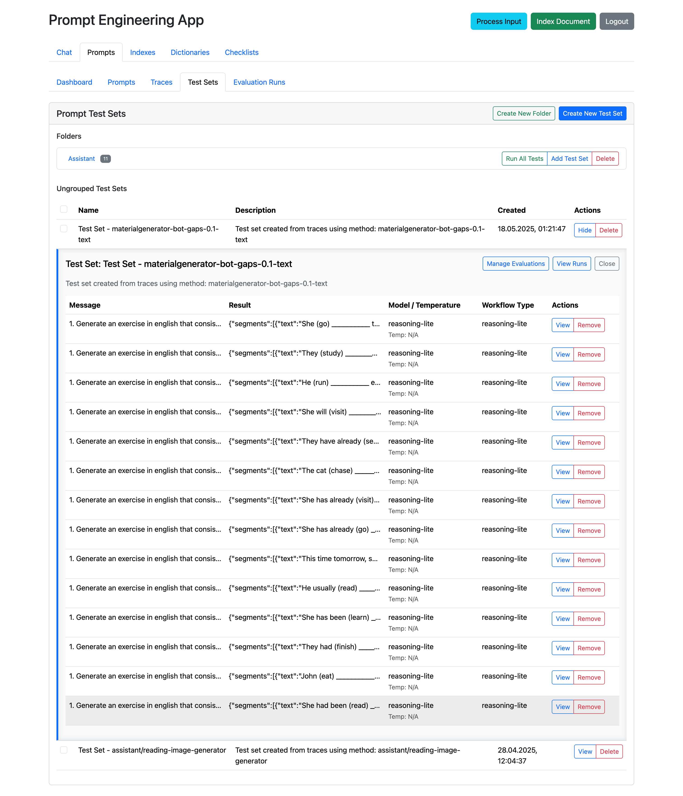

# DriftKit Context Engineering Module

## Overview

The `driftkit-context-engineering` module provides a comprehensive prompt management and engineering platform for AI applications. It features advanced template processing, multiple storage backends, sophisticated testing frameworks, and a modern Vue.js frontend for prompt development and evaluation.

## Spring Boot Initialization

To use the context engineering module in your Spring Boot application:

```java
@SpringBootApplication
@Import({PromptServiceAutoConfiguration.class, ContextEngineeringConfig.class})
@ComponentScan(basePackages = {"ai.driftkit.context"}) // Scan context components
@EnableMongoRepositories(basePackages = "ai.driftkit.context.repository") // For MongoDB repositories
public class YourApplication {
    public static void main(String[] args) {
        SpringApplication.run(YourApplication.class, args);
    }
}
```

The module provides:
- **Auto-configuration**: `PromptServiceAutoConfiguration` - Automatically registers PromptService beans
- **Configuration**: `ContextEngineeringConfig` - Provides `EtlConfig` bean
- **Services**: Multiple prompt storage implementations (filesystem, in-memory, MongoDB)
- **REST Controllers**: Comprehensive prompt management APIs
- **Frontend**: Vue.js application served at `/prompt-engineering`

## Architecture

### Module Structure

```
driftkit-context-engineering/
├── driftkit-context-engineering-core/     # Core prompt management
│   ├── domain/                            # Domain objects
│   ├── service/                           # Core services and abstractions
│   └── util/                              # Utility classes
├── driftkit-context-engineering-spring-boot-starter/ # Spring Boot integration
│   ├── config/                            # Configuration classes
│   ├── controller/                        # REST API endpoints
│   ├── repository/                        # Data access layer
│   ├── service/                           # Spring-specific services
│   └── frontend/                          # Vue.js frontend application
│       ├── src/components/                # Vue components
│       ├── src/views/                     # Application views
│       └── package.json                   # Frontend dependencies
└── pom.xml                               # Parent module configuration
```

### Key Dependencies

- **Vue.js 3** - Modern frontend framework with TypeScript
- **Spring Boot** - Web framework and auto-configuration
- **MongoDB** - Document persistence for production use
- **Apache Commons JEXL** - Expression language for templates
- **Jackson** - JSON processing and serialization
- **Chart.js** - Data visualization for analytics
- **CodeMirror** - Code editing with syntax highlighting

## Core Abstractions

### PromptServiceBase Interface

The central abstraction for prompt management across different storage backends. It provides configuration support, CRUD operations, and advanced retrieval methods with language and state filtering.

### TemplateEngine Class

Advanced template processing engine with AST-based parsing and caching. It supports dot notation for nested object access, reflection-based field access for POJOs, template and reflection caching for performance, and complex condition evaluation with boolean operators.

**Template Features:**
- **Variable Substitution** - `{{variable}}` with dot notation support
- **Conditional Rendering** - `{{#if condition}}...{{/if}}`
- **List Iteration** - `{{#list collection as item}}...{{/list}}`
- **Boolean Logic** - Complex conditions with `&&` and `||`
- **Comparison Operators** - `>`, `<`, `>=`, `<=`, `==`, `!=`
- **Size Comparisons** - `{{#if collection.size > 0}}`
- **Performance Optimization** - Template and reflection caching

## Storage Implementations

### InMemoryPromptService

In-memory storage implementation for development and testing environments.

**Key Features:**
- **Thread-Safe** - ConcurrentHashMap for concurrent access
- **Fast Access** - No I/O operations
- **Method Indexing** - Optimized retrieval by method name
- **Automatic ID Generation** - UUID-based unique identifiers

### FileSystemPromptService

JSON file-based persistence with thread safety:

```java
public class FileSystemPromptService implements PromptServiceBase {
    private final ObjectMapper objectMapper = new ObjectMapper()
        .configure(SerializationFeature.INDENT_OUTPUT, true);
    
    private String promptsFilePath;
    private final Map<String, Prompt> prompts = new ConcurrentHashMap<>();
    
    @Override
    public boolean supportsName(String name) {
        return "filesystem".equals(name);
    }
    
    @Override
    public void configure(Map<String, String> config) {
        this.promptsFilePath = config.get("promptsFilePath");
        loadFromFile();
    }
    
    @Override
    public synchronized Prompt savePrompt(Prompt prompt) {
        if (prompt.getId() == null) {
            prompt.setId(UUID.randomUUID().toString());
        }
        
        prompt.setUpdatedTime(System.currentTimeMillis());
        prompts.put(prompt.getId(), prompt);
        
        saveToFile();
        return prompt;
    }
    
    private synchronized void loadFromFile() {
        try {
            File file = new File(promptsFilePath);
            if (file.exists()) {
                CollectionType listType = objectMapper.getTypeFactory()
                    .constructCollectionType(List.class, Prompt.class);
                List<Prompt> promptList = objectMapper.readValue(file, listType);
                
                prompts.clear();
                promptList.forEach(prompt -> prompts.put(prompt.getId(), prompt));
            }
        } catch (Exception e) {
            log.error("Failed to load prompts from file: {}", promptsFilePath, e);
        }
    }
    
    private synchronized void saveToFile() {
        try {
            File file = new File(promptsFilePath);
            file.getParentFile().mkdirs();
            
            List<Prompt> promptList = new ArrayList<>(prompts.values());
            objectMapper.writeValue(file, promptList);
        } catch (Exception e) {
            log.error("Failed to save prompts to file: {}", promptsFilePath, e);
        }
    }
}
```

**Configuration Example:**
```yaml
driftkit:
  promptServices:
    - name: "file-prompts"
      type: "filesystem"
      promptsFilePath: "/data/prompts/prompts.json"
```

### MongodbPromptService

Production-ready MongoDB integration with Spring Data:

```java
@Component
public class MongodbPromptService implements PromptServiceBase {
    
    @Override
    public boolean supportsName(String name) {
        return "mongodb".equals(name);
    }
    
    @Override
    public Prompt savePrompt(Prompt prompt) {
        PromptRepository repository = getRepository();
        
        if (prompt.getId() == null) {
            prompt.setId(UUID.randomUUID().toString());
            prompt.setCreatedTime(System.currentTimeMillis());
        }
        
        // Handle state transitions for version control
        if (prompt.getState() == State.CURRENT) {
            // Mark existing current prompts as replaced
            List<Prompt> existing = repository.findByMethodAndState(prompt.getMethod(), State.CURRENT);
            existing.forEach(p -> {
                p.setState(State.REPLACED);
                repository.save(p);
            });
        }
        
        prompt.setUpdatedTime(System.currentTimeMillis());
        return repository.save(prompt);
    }
    
    @Override
    public List<Prompt> getPromptsByMethodsAndState(List<String> methods, State state) {
        PromptRepository repository = getRepository();
        return repository.findByMethodIsInAndState(methods, state);
    }
    
    private PromptRepository getRepository() {
        ApplicationContext context = ApplicationContextProvider.getApplicationContext();
        return context.getBean(PromptRepository.class);
    }
}
```

**Advanced Features:**
- **Version Control** - Automatic state management (CURRENT/REPLACED)
- **Spring Integration** - Uses ApplicationContext for bean access
- **Query Optimization** - Custom repository methods for efficient retrieval
- **State Management** - Complex workflow states for prompt lifecycle

## Domain Objects

### Prompt Entity

Comprehensive prompt representation with metadata and lifecycle management:

```java
@Data
@Document(collection = "prompts")
public class Prompt {
    @Id
    private String id;
    private String method;           // Logical grouping identifier
    private String message;          // Main prompt template
    private String systemMessage;    // System context
    private String modelId;          // Target AI model
    private String workflow;         // Associated workflow
    
    // State management
    private State state = State.MODERATION;
    private ResolveStrategy resolveStrategy = ResolveStrategy.CURRENT;
    private Language language = Language.GENERAL;
    
    // Model parameters
    private Double temperature;
    private boolean jsonRequest = false;
    private boolean jsonResponse = false;
    private Boolean logprobs;
    private Integer topLogprobs;
    
    // Lifecycle timestamps
    private long createdTime;
    private long updatedTime;
    private long approvedTime;
    
    // Template processing
    public String applyVariables(Map<String, Object> variables) {
        String processedMessage = TemplateEngine.renderTemplate(this.message, variables);
        String processedSystemMessage = TemplateEngine.renderTemplate(this.systemMessage, variables);
        
        // Create a copy with processed templates
        Prompt processed = new Prompt();
        BeanUtils.copyProperties(this, processed);
        processed.setMessage(processedMessage);
        processed.setSystemMessage(processedSystemMessage);
        
        return processed;
    }
    
    public enum State {
        MODERATION,      // Under review
        MANUAL_TESTING,  // Manual testing phase
        AUTO_TESTING,    // Automated testing phase
        CURRENT,         // Active production prompt
        REPLACED         // Superseded by newer version
    }
    
    public enum ResolveStrategy {
        LAST_VERSION,    // Use most recent version
        CURRENT          // Use currently active version
    }
}
```

### PromptRequest

Comprehensive request structure for prompt execution:

```java
@Data
@AllArgsConstructor
@NoArgsConstructor
public class PromptRequest {
    private String chatId;
    private String workflow;
    private String modelId;
    private String checkerPrompt;      // Validation prompt
    private String purpose;            // Request purpose/description
    private String imageMimeType;      // For image-based requests
    
    private List<PromptIdRequest> promptIds;  // Multiple prompt execution
    private Map<String, Object> variables;    // Template variables
    private Language language = Language.GENERAL;
    
    // Model parameters
    private Boolean logprobs;
    private Integer topLogprobs;
    
    // Features
    private boolean savePrompt = false;       // Whether to save this as a prompt
    private List<String> imageBase64;         // Base64-encoded images
    
    @Data
    @AllArgsConstructor
    @NoArgsConstructor
    public static class PromptIdRequest {
        private String promptId;
        private Map<String, Object> variables;
    }
}
```

### DictionaryItem

Enhanced metadata structure for reusable content:

```java
@Data
@Document(collection = "dictionary_items")
public class DictionaryItem {
    @Id
    private String id;
    private String groupId;          // Logical grouping
    private String name;             // Display name
    private int index;               // Ordering within group
    private Language language;       // Language specificity
    
    private List<String> markers;    // Key indicators/tags
    private List<String> samples;    // Example content
    
    // Dictionary integration in templates
    // Usage: dict:itemId-markers: or dict:itemId-samples:
}
```

## Vue.js Frontend Application

### Main Application Structure

The frontend provides a comprehensive prompt engineering interface:

```typescript
// App.vue - Main application component
export default {
  data() {
    return {
      authenticated: false,
      username: '',
      password: '',
      activeTab: 'chat',
      globalModals: {
        documentProcessing: false,
        indexingTask: false
      }
    }
  },
  
  methods: {
    async authenticate() {
      try {
        const credentials = btoa(`${this.username}:${this.password}`);
        const response = await axios.get('/api/auth/check', {
          headers: { 'Authorization': `Basic ${credentials}` }
        });
        
        if (response.status === 200) {
          this.authenticated = true;
          this.setupAxiosInterceptors(credentials);
        }
      } catch (error) {
        this.showError('Authentication failed');
      }
    }
  }
}
```

### Prompts Management Interface

Advanced prompt editing and management interface with the following features:
- Search and filter prompts by language and state
- Folder-based organization
- Version control and history
- Visual prompt editor with syntax highlighting
- Test panel for prompt validation
- Variable detection and management
- Model settings and temperature control
- Promote to production workflow


### Test Sets Management

Comprehensive testing framework with multiple evaluation types:
- Create and manage test sets for prompts
- Multiple evaluation types: JSON Schema, Keywords, Exact Match, LLM Evaluation, Manual Review, Regex, Field Value, Array Length
- Batch test execution with pass/fail statistics
- Test case management with variables and expected results
- Test run history and reporting
- Visual test results with evaluation details




        
### Dashboard Overview

The main dashboard provides a centralized view of the prompt engineering platform:
- System health monitoring
- Recent activity tracking  
- Quick access to prompts and test sets
- Performance metrics and statistics


### Test Set Evaluation Results

Detailed evaluation results with comprehensive metrics:


## Spring Boot Integration

### REST API Controller

Comprehensive prompt management endpoints with full CRUD operations, prompt execution, and version management.
    

### Configuration Classes

#### ContextEngineeringConfig

Spring Boot configuration for prompt services with automatic service discovery and conditional bean creation.

#### ApplicationContextProvider

Utility for accessing Spring context in non-Spring managed classes, enabling service discovery across the application.

## Advanced Features

### Dictionary Integration

Dynamic content integration in templates with support for reusable content markers and samples through dictionary items.

### Prompt Versioning and State Management

Advanced lifecycle management with automatic state transitions, version history tracking, and rollback capabilities.

## Demo Examples

### 1. Customer Support Prompt Management

This example demonstrates managing prompts for a multi-language customer support system.

```java
@Service
public class CustomerSupportPrompts {
    
    private final PromptService promptService;
    
    public CustomerSupportPrompts() throws Exception {
        Map<String, String> config = Map.of(
            "type", "mongodb",
            "database", "customer-support",
            "collection", "prompts"
        );
        this.promptService = PromptServiceFactory.fromConfig(
            new PromptServiceConfig("support-prompts", config)
        );
    }
    
    public void initializeSupportPrompts() {
        // Create greeting prompt
        Prompt greetingPrompt = new Prompt();
        greetingPrompt.setMethod("customer.greeting");
        greetingPrompt.setMessage("Hello {{customerName}}! How can I assist you today?");
        greetingPrompt.setSystemMessage("You are a helpful customer support agent.");
        greetingPrompt.setState(State.CURRENT);
        greetingPrompt.setLanguage(Language.ENGLISH);
        greetingPrompt.setTemperature(0.7);
        promptService.savePrompt(greetingPrompt);
        
        // Create order inquiry prompt
        Prompt orderPrompt = new Prompt();
        orderPrompt.setMethod("customer.order_inquiry");
        orderPrompt.setMessage("""
            I'll help you check your order {{orderId}}.
            
            {{#if order.status}}
            Current status: {{order.status}}
            {{/if}}
            
            {{#if order.trackingNumber}}
            Tracking number: {{order.trackingNumber}}
            {{/if}}
            """);
        orderPrompt.setState(State.CURRENT);
        orderPrompt.setLanguage(Language.ENGLISH);
        promptService.savePrompt(orderPrompt);
    }
    
    public String handleCustomerInquiry(String customerId, String orderId) throws Exception {
        Map<String, Object> variables = Map.of(
            "customerName", getCustomerName(customerId),
            "orderId", orderId,
            "order", getOrderDetails(orderId)
        );
        
        Prompt prompt = promptService.getCurrentPromptOrThrow(
            "customer.order_inquiry", 
            Language.ENGLISH
        );
        
        return prompt.applyVariables(variables).getMessage();
    }
}
```

### 2. Dynamic Email Template System

This example shows how to use the template engine for dynamic email generation.

```java
@Service
public class EmailTemplateService {
    
    private final PromptService promptService;
    private final DictionaryItemRepository dictionaryRepo;
    
    public void createMarketingEmailTemplate() {
        // Create dictionary items for reusable content
        DictionaryItem features = new DictionaryItem();
        features.setId("product-features");
        features.setGroupId("marketing");
        features.setName("Product Features");
        features.setMarkers(List.of(
            "Advanced AI capabilities",
            "Real-time processing",
            "Enterprise security"
        ));
        dictionaryRepo.save(features);
        
        // Create email template with dictionary integration
        Prompt emailPrompt = new Prompt();
        emailPrompt.setMethod("marketing.product_announcement");
        emailPrompt.setMessage("""
            Subject: Introducing {{productName}} - Transform Your Business
            
            Hi {{recipient.firstName}},
            
            We're excited to announce {{productName}}!
            
            Key Features:
            dict:product-features-markers:
            
            {{#if recipient.isPremiumCustomer}}
            As a valued premium customer, you get:
            - 30% early bird discount
            - Priority support
            - Extended trial period
            {{/if}}
            
            {{#list specialOffers as offer}}
            Special Offer: {{offer.description}} - Save {{offer.discount}}%
            {{/list}}
            
            Best regards,
            {{companyName}} Team
            """);
        emailPrompt.setState(State.CURRENT);
        promptService.savePrompt(emailPrompt);
    }
    
    public String generateEmail(EmailRecipient recipient, Product product) throws Exception {
        Map<String, Object> variables = Map.of(
            "recipient", recipient,
            "productName", product.getName(),
            "specialOffers", product.getOffers(),
            "companyName", "TechCorp"
        );
        
        Prompt prompt = promptService.getCurrentPromptOrThrow(
            "marketing.product_announcement",
            Language.ENGLISH
        );
        
        return prompt.applyVariables(variables).getMessage();
    }
}
```

### 3. A/B Testing Prompt Variations

This example demonstrates testing different prompt variations for optimization.

```java
@Service
public class PromptABTestingService {
    
    private final PromptService promptService;
    private final TestSetService testSetService;
    
    public void createABTestVariations() {
        String baseMethod = "chatbot.product_recommendation";
        
        // Variation A - Friendly approach
        Prompt variantA = new Prompt();
        variantA.setMethod(baseMethod + ".variant_a");
        variantA.setMessage("""
            Based on your interests in {{userInterests}}, 
            I think you'd love {{productName}}! 
            It's perfect for {{userCase}}.
            """);
        variantA.setSystemMessage("Be friendly and enthusiastic");
        variantA.setState(State.AUTO_TESTING);
        variantA.setTemperature(0.8);
        promptService.savePrompt(variantA);
        
        // Variation B - Professional approach  
        Prompt variantB = new Prompt();
        variantB.setMethod(baseMethod + ".variant_b");
        variantB.setMessage("""
            Analysis of your requirements ({{userInterests}}) 
            indicates that {{productName}} would be optimal 
            for your use case: {{userCase}}.
            """);
        variantB.setSystemMessage("Be professional and data-driven");
        variantB.setState(State.AUTO_TESTING);
        variantB.setTemperature(0.3);
        promptService.savePrompt(variantB);
        
        // Create test set
        TestSet testSet = new TestSet();
        testSet.setName("Product Recommendation A/B Test");
        testSet.setPromptMethods(List.of(
            baseMethod + ".variant_a",
            baseMethod + ".variant_b"
        ));
        testSet.setEvaluationType(EvaluationType.LLM_EVALUATION);
        testSet.setEvaluationPrompt("""
            Rate the recommendation on:
            1. Relevance (0-10)
            2. Persuasiveness (0-10)
            3. Clarity (0-10)
            Return JSON: {"relevance": X, "persuasiveness": Y, "clarity": Z}
            """);
        
        // Add test cases
        testSet.addTestCase(
            Map.of(
                "userInterests", "photography and travel",
                "productName", "ProCamera X1",
                "userCase", "capturing stunning travel moments"
            ),
            "Should recommend camera enthusiastically"
        );
        
        testSetService.save(testSet);
    }
    
    public PromptTestResults runABTest() throws Exception {
        TestSet testSet = testSetService.findByName("Product Recommendation A/B Test");
        return testSetService.executeTests(testSet);
    }
}
```

### 4. Multi-Stage Workflow Prompts

This example shows managing prompts for complex multi-stage workflows.

```java
@Service  
public class DocumentAnalysisWorkflow {
    
    private final PromptService promptService;
    
    public void setupDocumentAnalysisPrompts() {
        // Stage 1: Initial classification
        Prompt classificationPrompt = new Prompt();
        classificationPrompt.setMethod("doc_analysis.classify");
        classificationPrompt.setMessage("""
            Analyze this document and classify it:
            
            Document: {{documentContent}}
            
            Categories: {{#list categories as cat}}{{cat}}, {{/list}}
            
            Return the most appropriate category.
            """);
        classificationPrompt.setJsonResponse(true);
        classificationPrompt.setState(State.CURRENT);
        promptService.savePrompt(classificationPrompt);
        
        // Stage 2: Extract key information
        Prompt extractionPrompt = new Prompt();
        extractionPrompt.setMethod("doc_analysis.extract");
        extractionPrompt.setMessage("""
            Extract key information from this {{documentType}} document:
            
            {{documentContent}}
            
            Focus on:
            {{#list extractionFields as field}}
            - {{field}}
            {{/list}}
            """);
        extractionPrompt.setJsonResponse(true);
        extractionPrompt.setState(State.CURRENT);
        promptService.savePrompt(extractionPrompt);
        
        // Stage 3: Generate summary
        Prompt summaryPrompt = new Prompt();
        summaryPrompt.setMethod("doc_analysis.summarize");
        summaryPrompt.setMessage("""
            Create a {{summaryLength}}-word summary of this {{documentType}}:
            
            Key points extracted:
            {{#list keyPoints as point}}
            - {{point.field}}: {{point.value}}
            {{/list}}
            
            Original document: {{documentContent}}
            """);
        summaryPrompt.setState(State.CURRENT);
        promptService.savePrompt(summaryPrompt);
    }
    
    public DocumentAnalysisResult analyzeDocument(String content) throws Exception {
        // Stage 1: Classify
        Prompt classifyPrompt = promptService.getCurrentPromptOrThrow(
            "doc_analysis.classify", Language.GENERAL
        );
        String docType = executeClassification(classifyPrompt, content);
        
        // Stage 2: Extract based on type
        List<String> fields = getFieldsForType(docType);
        Prompt extractPrompt = promptService.getCurrentPromptOrThrow(
            "doc_analysis.extract", Language.GENERAL
        );
        Map<String, Object> extracted = executeExtraction(
            extractPrompt, content, docType, fields
        );
        
        // Stage 3: Summarize
        Prompt summaryPrompt = promptService.getCurrentPromptOrThrow(
            "doc_analysis.summarize", Language.GENERAL
        );
        String summary = executeSummary(
            summaryPrompt, content, docType, extracted
        );
        
        return new DocumentAnalysisResult(docType, extracted, summary);
    }
}
```

### 5. Prompt Performance Monitoring

This example demonstrates tracking and optimizing prompt performance.

```java
@Service
public class PromptPerformanceMonitor {
    
    private final PromptService promptService;
    private final MetricsService metricsService;
    
    public void trackPromptExecution(String promptId, ExecutionMetrics metrics) {
        PromptMetrics promptMetrics = new PromptMetrics();
        promptMetrics.setPromptId(promptId);
        promptMetrics.setExecutionTime(metrics.getDuration());
        promptMetrics.setTokensUsed(metrics.getTokenCount());
        promptMetrics.setCost(calculateCost(metrics));
        promptMetrics.setSuccess(metrics.isSuccess());
        promptMetrics.setTimestamp(System.currentTimeMillis());
        
        metricsService.record(promptMetrics);
        
        // Check if optimization needed
        if (shouldOptimize(promptId)) {
            optimizePrompt(promptId);
        }
    }
    
    private boolean shouldOptimize(String promptId) {
        PromptStats stats = metricsService.getStats(promptId, 24); // Last 24 hours
        
        return stats.getAverageTokens() > 1000 || 
               stats.getSuccessRate() < 0.9 ||
               stats.getAverageDuration() > 5000; // 5 seconds
    }
    
    private void optimizePrompt(String promptId) throws Exception {
        Prompt prompt = promptService.getPromptById(promptId).orElseThrow();
        
        // Create optimized version
        Prompt optimized = new Prompt();
        optimized.setMethod(prompt.getMethod());
        optimized.setMessage(compressPrompt(prompt.getMessage()));
        optimized.setSystemMessage(prompt.getSystemMessage());
        optimized.setState(State.AUTO_TESTING);
        optimized.setTemperature(prompt.getTemperature() - 0.1); // Reduce randomness
        
        promptService.savePrompt(optimized);
        
        // Schedule A/B test
        scheduleABTest(prompt.getId(), optimized.getId());
    }
    
    private String compressPrompt(String message) {
        // Remove redundant instructions
        // Simplify complex sentences
        // Use more concise language
        return message; // Simplified version
    }
    
    public PromptHealthReport generateHealthReport() {
        List<Prompt> activePrompts = promptService.getPromptsByMethodsAndState(
            null, State.CURRENT
        );
        
        Map<String, PromptHealth> health = new HashMap<>();
        
        for (Prompt prompt : activePrompts) {
            PromptStats stats = metricsService.getStats(prompt.getId(), 168); // Week
            
            PromptHealth promptHealth = new PromptHealth();
            promptHealth.setPromptId(prompt.getId());
            promptHealth.setMethod(prompt.getMethod());
            promptHealth.setExecutions(stats.getTotalExecutions());
            promptHealth.setSuccessRate(stats.getSuccessRate());
            promptHealth.setAverageLatency(stats.getAverageDuration());
            promptHealth.setAverageTokens(stats.getAverageTokens());
            promptHealth.setHealthScore(calculateHealthScore(stats));
            
            health.put(prompt.getId(), promptHealth);
        }
        
        return new PromptHealthReport(health);
    }
}
```

## Configuration

### Application Configuration

```yaml
driftkit:
  promptServices:
    - name: "primary"
      type: "mongodb"
      database: "driftkit"
      collection: "prompts"
      
  dictionaryServices:
    - name: "primary"
      type: "mongodb"
      database: "driftkit"
      collection: "dictionary_items"
      
spring:
  data:
    mongodb:
      uri: "${MONGODB_URI}"
      database: "driftkit"
      
  web:
    resources:
      static-locations: classpath:/static/
      
server:
  port: 8080
  servlet:
    context-path: /
```

### Frontend Build Configuration

```xml
<!-- pom.xml frontend build integration -->
<plugin>
  <groupId>com.github.eirslett</groupId>
  <artifactId>frontend-maven-plugin</artifactId>
  <version>1.12.1</version>
  <configuration>
    <workingDirectory>src/main/frontend</workingDirectory>
    <installDirectory>target</installDirectory>
  </configuration>
  <executions>
    <execution>
      <id>install node and npm</id>
      <goals>
        <goal>install-node-and-npm</goal>
      </goals>
      <configuration>
        <nodeVersion>v18.16.0</nodeVersion>
        <npmVersion>9.5.1</npmVersion>
      </configuration>
    </execution>
    <execution>
      <id>npm install</id>
      <goals>
        <goal>npm</goal>
      </goals>
      <configuration>
        <arguments>install</arguments>
      </configuration>
    </execution>
    <execution>
      <id>npm run build</id>
      <goals>
        <goal>npm</goal>
      </goals>
      <configuration>
        <arguments>run build</arguments>
      </configuration>
    </execution>
  </executions>
</plugin>
```

## Summary

The driftkit-context-engineering module provides a comprehensive prompt engineering platform with:
- Multiple storage backends (MongoDB, filesystem, in-memory)
- Advanced template engine with conditionals and loops
- Version control and state management
- A/B testing capabilities
- Performance monitoring and optimization
- Visual management interface with test automation
- Dictionary-based content reuse
- Multi-language support

This comprehensive documentation covers all aspects of the driftkit-context-engineering module, providing detailed information about prompt management, template processing, multi-storage backends, advanced testing frameworks, and the modern Vue.js frontend interface. The module offers a complete solution for prompt engineering in AI applications with sophisticated versioning, testing, and evaluation capabilities.