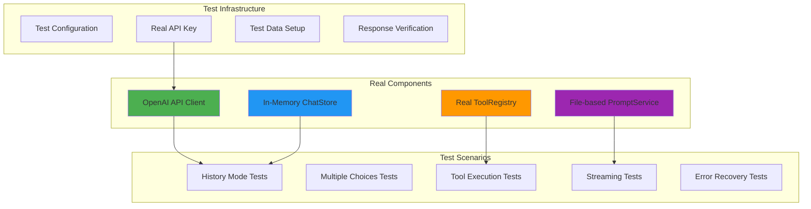

# LLMAgent Real Integration Tests

## Test Architecture - NO MOCKS!



## Real Test Cases

### 1. Critical Bug Verification - Messages Always Added

```java
@Test
void realTest_CriticalBugFix_MessagesAlwaysInRequest() {
    // Test with REAL OpenAI API
    // Case 1: With ChatStore + WorkflowId (STATELESS - was broken)
    // Case 2: With ChatStore, no WorkflowId (HISTORY mode)
    // Case 3: No ChatStore at all
    // Verify all 3 cases get real responses from OpenAI
}
```

### 2. History Accumulation Test

```java
@Test
void realTest_HistoryAccumulation_MultiTurnConversation() {
    // Real multi-turn conversation
    // 1. "What is 2+2?"
    // 2. "Multiply that by 3"
    // 3. "What was my first question?"
    // Verify AI remembers context in history mode
}
```

### 3. Multiple Choices Test

```java
@Test
void realTest_MultipleChoices_AllProcessed() {
    // Request with n=3 parameter
    // Verify all 3 choices are returned and concatenated
}
```

### 4. Tool Execution Test

```java
@Test
void realTest_ToolExecution_Calculator() {
    // Implement real calculator tool
    // Ask "What is 15 * 23 + 47?"
    // Verify tool is called and result is correct
}
```

### 5. Streaming Test

```java
@Test
void realTest_Streaming_ReceivesChunks() {
    // Real streaming request
    // Collect chunks
    // Verify complete response matches non-streaming
}
```

### 6. Token Limit Test

```java
@Test
void realTest_TokenLimit_RespectsMaxTokens() {
    // Create large history
    // Verify only recent messages within token limit are sent
}
```

### 7. Structured Output Test

```java
@Test
void realTest_StructuredOutput_ExtractsJSON() {
    // Define a data class
    // Ask for structured data
    // Verify JSON is correctly parsed
}
```

### 8. Prompt Service Integration

```java
@Test
void realTest_PromptService_LoadsAndExecutes() {
    // Create real prompt file
    // Execute with prompt ID
    // Verify prompt is used correctly
}
```

### 9. Image Analysis Test (if Vision API available)

```java
@Test
void realTest_ImageAnalysis_DescribesImage() {
    // Load test image
    // Ask for description
    // Verify description is relevant
}
```

### 10. Error Recovery Test

```java
@Test
void realTest_ErrorRecovery_HandlesAPIErrors() {
    // Trigger rate limit or invalid request
    // Verify graceful error handling
}
```

## Test Data Classes

```java
public class TestCalculatorTool implements Tool {
    @Override
    public String name() { return "calculator"; }
    
    @Override
    public Object execute(Map<String, Object> args) {
        String expression = (String) args.get("expression");
        // Real calculation logic
        return evaluate(expression);
    }
}

public class TestWeatherTool implements Tool {
    @Override
    public String name() { return "get_weather"; }
    
    @Override
    public Object execute(Map<String, Object> args) {
        String city = (String) args.get("city");
        // Return mock weather but through real tool execution
        return Map.of(
            "city", city,
            "temperature", 22,
            "condition", "sunny"
        );
    }
}
```

## Test Configuration

```properties
# test/resources/application-test.properties
openai.api.key=${OPENAI_API_KEY}
openai.model=gpt-3.5-turbo
openai.temperature=0.7
openai.max.tokens=1000

# For testing multiple choices
test.choices.count=3

# For streaming tests
test.streaming.enabled=true

# Token limits for history tests
test.history.max.tokens=2048
```

## Assertions Strategy

```java
// Don't assert exact text (AI responses vary)
// Assert structure and presence

assertThat(response)
    .isNotNull()
    .extracting(AgentResponse::getData)
    .asString()
    .isNotEmpty()
    .containsIgnoringCase("expected_keyword");

// For tool calls
assertThat(toolCalls)
    .isNotEmpty()
    .extracting(ToolCall::getName)
    .contains("calculator");

// For history
assertThat(chatStore.getAll(sessionId))
    .hasSize(expectedSize)
    .extracting(ChatMessage::getType)
    .containsExactly(USER, AI, USER, AI);
```

## Performance Benchmarks

```java
@Test
void realTest_Performance_Latency() {
    long start = System.currentTimeMillis();
    agent.executeText("Hello");
    long duration = System.currentTimeMillis() - start;
    
    assertThat(duration)
        .as("Response time should be under 5 seconds")
        .isLessThan(5000);
}

@Test
void realTest_Performance_TokenUsage() {
    // Track token usage
    // Verify efficient use of context window
}
```

## Environment Setup

```bash
# Required environment variables
export OPENAI_API_KEY="sk-..."

# Run tests
mvn test -Dtest=LLMAgentIntegrationTest -DargLine="-Dopenai.api.key=$OPENAI_API_KEY"
```

## Expected Test Output

```
[INFO] Running LLMAgentIntegrationTest
[INFO] Test 1: Critical bug fix verification...
[INFO]   - Stateless mode: ✓ Response received
[INFO]   - History mode: ✓ Response received with context
[INFO]   - No store mode: ✓ Response received
[INFO] Test 2: History accumulation...
[INFO]   - Turn 1: "4"
[INFO]   - Turn 2: "12" (remembered context)
[INFO]   - Turn 3: "What is 2+2?" (recalled first question)
[INFO] Test 3: Multiple choices (n=3)...
[INFO]   - Choice 1: "Response variant A"
[INFO]   - Choice 2: "Response variant B"  
[INFO]   - Choice 3: "Response variant C"
[INFO]   - All concatenated: ✓
```