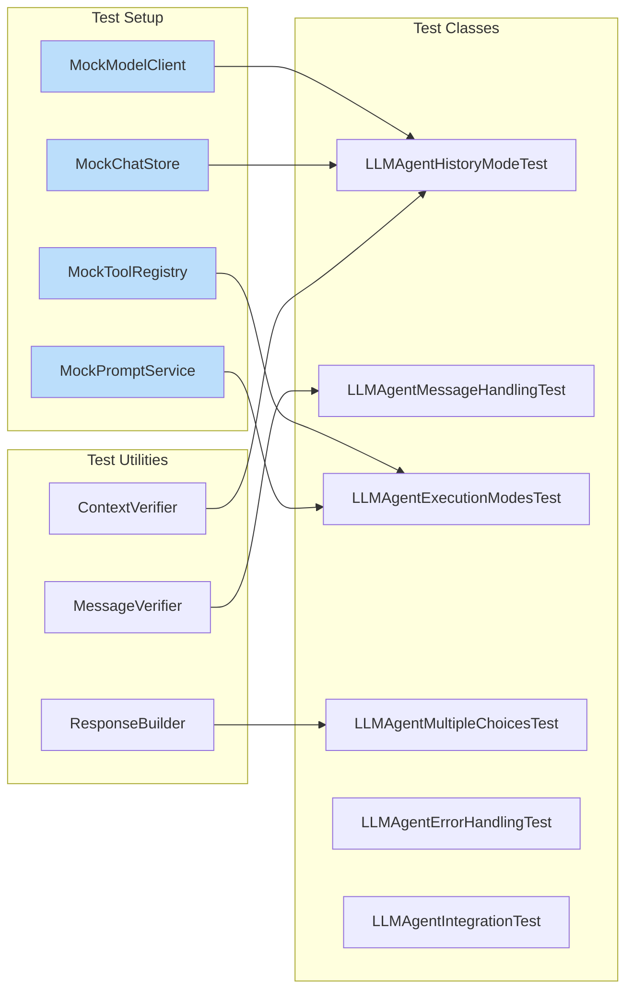

# LLMAgent Comprehensive Test Plan

## Test Coverage Overview

```mermaid
graph TB
    subgraph "Test Categories"
        TC1[History Mode Tests]
        TC2[Message Handling Tests]
        TC3[Execution Mode Tests]
        TC4[Multiple Choices Tests]
        TC5[Tool Execution Tests]
        TC6[Error Handling Tests]
    end
    
    subgraph "History Mode Tests"
        HM1[With ChatStore + No WorkflowId]
        HM2[With ChatStore + With WorkflowId]
        HM3[No ChatStore]
        
        HM1 --> HMS1[✓ Messages saved to store]
        HM1 --> HMS2[✓ History loaded from store]
        HM1 --> HMS3[✓ Token limit respected]
        
        HM2 --> HMN1[✓ Messages NOT saved to store]
        HM2 --> HMN2[✓ Messages added to request]
        
        HM3 --> HMN3[✓ No crashes]
        HM3 --> HMN4[✓ Messages added to request]
    end
    
    subgraph "Message Handling Tests"
        MH1[User Messages]
        MH2[Assistant Messages]
        MH3[System Messages]
        MH4[Tool Results]
        
        MH1 --> MHT1[✓ ChatRequest with getMessage()]
        MH1 --> MHT2[✓ Properties as JSON]
        MH1 --> MHT3[✓ Empty properties]
        
        MH2 --> MHT4[✓ Saved correctly]
        MH2 --> MHT5[✓ Added to context]
        
        MH3 --> MHT6[✓ Added at beginning]
        MH3 --> MHT7[✓ System vs prompt system]
    end
    
    subgraph "Execution Mode Tests"
        EM1[executeText]
        EM2[executeForToolCalls]
        EM3[executeWithTools]
        EM4[executeStructured]
        EM5[executeWithPrompt]
        EM6[executeStreaming]
        EM7[executeWithImages]
        
        EM1 --> EMT1[✓ Simple text]
        EM1 --> EMT2[✓ With variables]
        
        EM3 --> EMT3[✓ Tool execution]
        EM3 --> EMT4[✓ Follow-up request]
        
        EM4 --> EMT5[✓ JSON schema]
        EM4 --> EMT6[✓ Structured extraction]
        
        EM6 --> EMT7[✓ Streaming callbacks]
        EM6 --> EMT8[✓ Complete response saved]
    end
    
    subgraph "Multiple Choices Tests"
        MC1[Single Choice]
        MC2[Multiple Choices]
        
        MC1 --> MCT1[✓ Text extraction]
        MC1 --> MCT2[✓ Tool calls extraction]
        
        MC2 --> MCT3[✓ All texts concatenated]
        MC2 --> MCT4[✓ All tool calls collected]
        MC2 --> MCT5[✓ Separator between choices]
    end
    
    style TC1 fill:#e1f5fe
    style TC2 fill:#e8f5e9
    style TC3 fill:#fff3e0
    style TC4 fill:#f3e5f5
    style TC5 fill:#fce4ec
    style TC6 fill:#ffebee
```

## Detailed Test Cases

### 1. History Mode Tests

#### Test 1.1: WITH_HISTORY Mode (chatStore exists, workflowId is blank)
```java
@Test
void testWithHistoryMode_SavesAndLoadsMessages()
```
- **Setup**: Create LLMAgent with ChatStore, no workflowId
- **Action**: Execute multiple messages
- **Verify**: 
  - Messages saved to ChatStore
  - History loaded on next request
  - Previous messages included in API request
  - Token limit respected (getRecentWithinTokens)

#### Test 1.2: STATELESS Mode (chatStore exists, workflowId is NOT blank)
```java
@Test
void testStatelessModeWithWorkflowId_DoesNotSaveMessages()
```
- **Setup**: Create LLMAgent with ChatStore AND workflowId
- **Action**: Execute multiple messages
- **Verify**:
  - Messages NOT saved to ChatStore
  - Messages still added to current request
  - No history loaded from store

#### Test 1.3: STATELESS Mode (no chatStore)
```java
@Test
void testStatelessModeNoChatStore_WorksCorrectly()
```
- **Setup**: Create LLMAgent with null ChatStore
- **Action**: Execute messages
- **Verify**:
  - No NullPointerException
  - Messages added to request
  - Response returned correctly

### 2. Message Content Handling Tests

#### Test 2.1: ChatRequest with getMessage()
```java
@Test
void testChatRequestWithGetMessage_ExtractsCorrectly()
```
- **Setup**: ChatMessage that is ChatRequest with message property
- **Action**: Convert to ModelMessage
- **Verify**: getMessage() content extracted correctly

#### Test 2.2: ChatMessage with Properties Map
```java
@Test
void testChatMessageWithProperties_ConvertsToJson()
```
- **Setup**: ChatMessage with multiple properties, no PROPERTY_MESSAGE
- **Action**: Convert to ModelMessage
- **Verify**: Properties converted to JSON string

#### Test 2.3: Empty Properties
```java
@Test
void testEmptyProperties_ReturnsEmptyString()
```
- **Setup**: ChatMessage with empty properties
- **Action**: Convert to ModelMessage
- **Verify**: Returns empty string, no errors

### 3. Execution Mode Tests

#### Test 3.1: Basic Text Execution
```java
@Test
void testExecuteText_BasicFlow()
```
- **Setup**: Mock ModelClient
- **Action**: executeText("test message")
- **Verify**:
  - ConversationContext created
  - User message added
  - Response text extracted
  - Assistant message saved (if history mode)

#### Test 3.2: Execute with Variables
```java
@Test
void testExecuteTextWithVariables_SubstitutesCorrectly()
```
- **Setup**: Message template with variables
- **Action**: executeText with variables map
- **Verify**: Variables substituted in message

#### Test 3.3: Tool Calls Execution
```java
@Test
void testExecuteForToolCalls_ReturnsToolCalls()
```
- **Setup**: Mock response with tool calls
- **Action**: executeForToolCalls
- **Verify**: Tool calls extracted and returned

#### Test 3.4: Execute With Tools (Auto-execution)
```java
@Test
void testExecuteWithTools_ExecutesAndFollowsUp()
```
- **Setup**: Mock tool registry and tool execution
- **Action**: executeWithTools
- **Verify**:
  - Tools executed
  - Tool results added to context
  - Follow-up request made
  - Final response saved

#### Test 3.5: Structured Output
```java
@Test
void testExecuteStructured_ExtractsTypedResponse()
```
- **Setup**: Define target class
- **Action**: executeStructured with target class
- **Verify**: JSON parsed to target type

#### Test 3.6: Execute with Prompt
```java
@Test
void testExecuteWithPrompt_UsesPromptService()
```
- **Setup**: Mock PromptService
- **Action**: executeWithPrompt
- **Verify**:
  - Prompt loaded
  - System message from prompt used
  - Variables applied

#### Test 3.7: Streaming Execution
```java
@Test
void testExecuteStreaming_CallbacksInvoked()
```
- **Setup**: Mock streaming response
- **Action**: executeStreaming with callback
- **Verify**:
  - Callbacks invoked for chunks
  - Complete response saved
  - Context updated

#### Test 3.8: Image Processing
```java
@Test
void testExecuteWithImages_HandlesMultimodal()
```
- **Setup**: Image data
- **Action**: executeWithImages
- **Verify**: Multimodal message created correctly

### 4. Multiple Choices Tests

#### Test 4.1: Single Choice Response
```java
@Test
void testSingleChoice_ExtractsCorrectly()
```
- **Setup**: Response with 1 choice
- **Action**: Extract response text
- **Verify**: Single response extracted

#### Test 4.2: Multiple Choices - Text
```java
@Test
void testMultipleChoices_ConcatenatesText()
```
- **Setup**: Response with 3 choices
- **Action**: Extract response text
- **Verify**: All texts concatenated with separators

#### Test 4.3: Multiple Choices - Tool Calls
```java
@Test
void testMultipleChoices_CollectsAllToolCalls()
```
- **Setup**: Response with multiple choices, each with tool calls
- **Action**: Extract tool calls
- **Verify**: All tool calls from all choices collected

#### Test 4.4: Mixed Choices
```java
@Test
void testMixedChoices_HandlesNullsCorrectly()
```
- **Setup**: Some choices with content, some without
- **Action**: Extract content
- **Verify**: Only non-null content included

### 5. Edge Cases and Error Tests

#### Test 5.1: Null Response Handling
```java
@Test
void testNullResponse_ReturnsEmptyString()
```
- **Verify**: No NullPointerException, returns empty string

#### Test 5.2: Empty Choices
```java
@Test
void testEmptyChoices_ReturnsEmptyString()
```
- **Verify**: No errors, returns empty string

#### Test 5.3: Tool Execution Failure
```java
@Test
void testToolExecutionFailure_HandlesGracefully()
```
- **Setup**: Tool that throws exception
- **Verify**: Error captured in result, flow continues

#### Test 5.4: Context Refresh
```java
@Test
void testContextRefresh_ReloadsFromStore()
```
- **Action**: Call context.refresh()
- **Verify**: Messages reloaded from store

### 6. Integration Tests

#### Test 6.1: Full Workflow with History
```java
@Test
void testFullWorkflowWithHistory_EndToEnd()
```
- Multiple messages
- Tool calls
- History accumulation
- Token limit handling

#### Test 6.2: Full Workflow Stateless
```java
@Test
void testFullWorkflowStateless_EndToEnd()
```
- Multiple executions
- No history pollution
- Each request independent

## Test Implementation Structure



## Test Execution Matrix

| Test Category | Critical Bug Coverage | New Feature Coverage | Regression Coverage |
|--------------|----------------------|---------------------|-------------------|
| History Mode | ✅ Message always added to request | ✅ ConversationContext | ✅ Old behavior preserved |
| Message Handling | ✅ Properties as JSON | ✅ ChatRequest.getMessage() | ✅ Standard messages |
| Multiple Choices | ❌ Not part of bug | ✅ All choices processed | ✅ Single choice works |
| Tool Execution | ✅ Follow-up context | ✅ Tool results in context | ✅ Tool calls extracted |
| Streaming | ✅ Context usage | ✅ History saved | ✅ Callbacks work |
| Error Handling | ✅ Null safety | ✅ Graceful degradation | ✅ No crashes |

## Key Assertions for Bug Fix Verification

```java
// CRITICAL: Verify messages ALWAYS added to request
@Test
void verifyCriticalBugFix_MessagesAlwaysAddedToRequest() {
    // Case 1: With history mode
    LLMAgent agentWithHistory = createAgentWithHistory();
    verify(modelClient).textToText(argThat(request -> 
        request.getMessages().size() > 0 && 
        containsUserMessage(request.getMessages(), "test")));
    
    // Case 2: Without history mode (THE BUG CASE)
    LLMAgent agentStateless = createAgentWithWorkflowId();
    verify(modelClient).textToText(argThat(request -> 
        request.getMessages().size() > 0 && 
        containsUserMessage(request.getMessages(), "test")));
        
    // Case 3: No chat store at all
    LLMAgent agentNoStore = createAgentWithoutStore();
    verify(modelClient).textToText(argThat(request -> 
        request.getMessages().size() > 0 && 
        containsUserMessage(request.getMessages(), "test")));
}
```

## Performance Tests

```java
@Test
void testPerformance_LargeHistory() {
    // Test with 1000 messages in history
    // Verify getRecentWithinTokens limits correctly
}

@Test
void testPerformance_MultipleChoices() {
    // Test with 20 choices
    // Verify all processed efficiently
}
```

## Mock Data Builders

```java
class TestDataBuilder {
    static ModelTextResponse singleChoice(String text) { ... }
    static ModelTextResponse multipleChoices(String... texts) { ... }
    static ModelTextResponse withToolCalls(ToolCall... calls) { ... }
    static ChatMessage userMessage(String content) { ... }
    static ChatMessage assistantMessage(String content) { ... }
    static ChatRequest withProperties(Map<String, String> props) { ... }
}
```