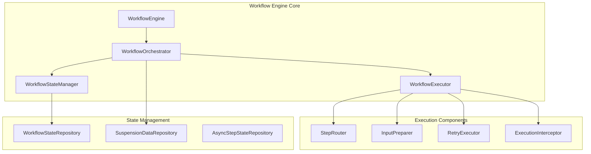
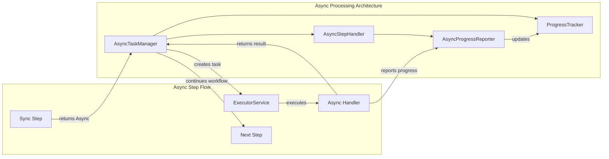
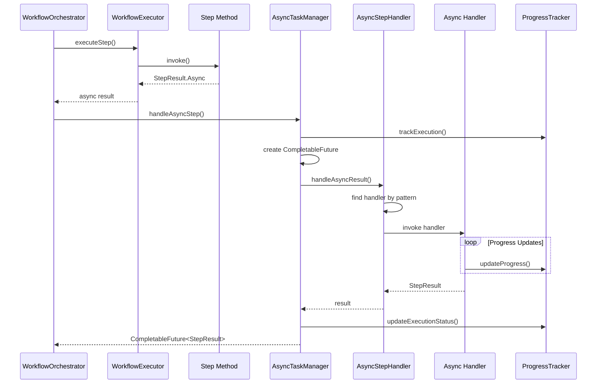
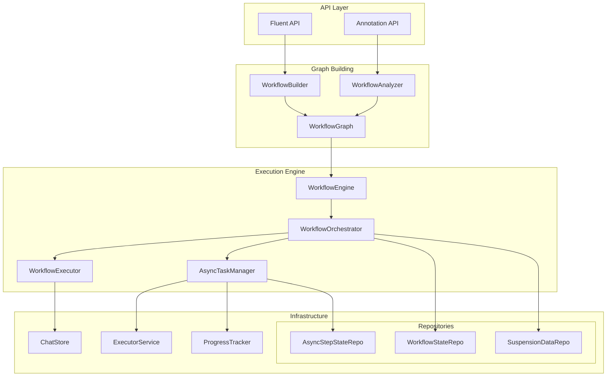
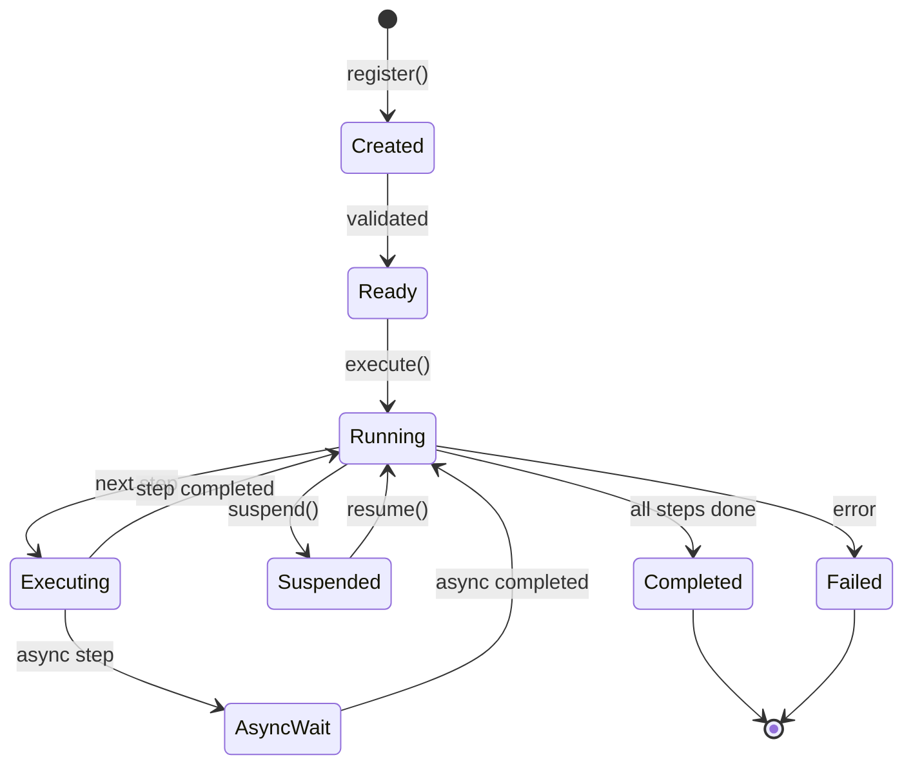
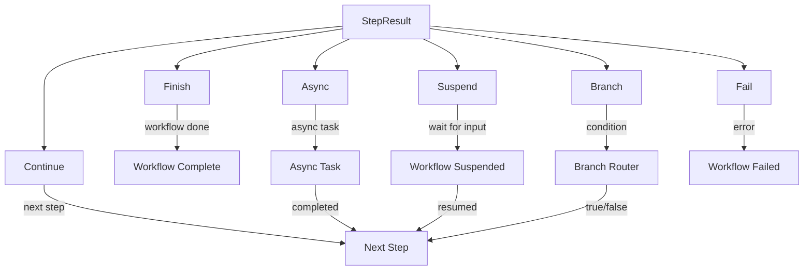

# DriftKit Workflow Engine - Подробный анализ архитектуры асинхронной обработки

## Оглавление
1. [Обзор архитектуры](#обзор-архитектуры)
2. [Компоненты системы](#компоненты-системы)
3. [Асинхронная обработка](#асинхронная-обработка)
4. [Сравнение подходов: Fluent API vs Annotations](#сравнение-подходов-fluent-api-vs-annotations)
5. [Диаграммы архитектуры](#диаграммы-архитектуры)
6. [Возможности упрощения и улучшения](#возможности-упрощения-и-улучшения)

## Обзор архитектуры

Workflow Engine Core представляет собой модульную систему для создания и выполнения рабочих процессов с поддержкой:
- Синхронного и асинхронного выполнения шагов
- Двух подходов к определению workflow: аннотации и Fluent API
- Персистентности состояния
- Отслеживания прогресса
- Обработки ошибок и retry-логики
- Human-in-the-loop через suspension/resumption

## Компоненты системы

### 1. Ядро выполнения (Core Execution)



#### Описание компонентов:

**WorkflowEngine**: Главная точка входа
- Регистрация workflow
- Запуск выполнения
- Управление жизненным циклом

**WorkflowOrchestrator**: Оркестратор выполнения
- Координация выполнения шагов
- Управление переходами между шагами
- Обработка suspension/resumption

**WorkflowExecutor**: Исполнитель шагов
- Подготовка входных данных
- Вызов логики шага
- Обработка результатов
- Интеграция с retry-логикой

**WorkflowStateManager**: Управление состоянием
- Сохранение/загрузка состояния workflow
- Отслеживание выполнения шагов

### 2. Асинхронная обработка



#### Ключевые компоненты асинхронной обработки:

**AsyncTaskManager**:
- Управляет выполнением асинхронных задач
- Создает CompletableFuture для async операций
- Отслеживает состояние async задач
- Обрабатывает результаты и ошибки

**AsyncStepHandler**:
- Регистрирует async обработчики (как annotation, так и fluent)
- Сопоставляет taskId с обработчиками через pattern matching
- Поддерживает wildcard patterns ("*", "prefix-*")
- Вызывает соответствующие обработчики

**AsyncProgressReporter**:
- Интерфейс для отчета о прогрессе
- Поддерживает отмену операций
- Обновляет состояние выполнения

### 3. Детальная схема выполнения асинхронного шага



## Сравнение подходов: Fluent API vs Annotations

### Annotation-based подход

```java
@Workflow(id = "document-processing")
public class DocumentWorkflow {
    
    @InitialStep
    public StepResult<ExtractedText> validateAndExtract(DocumentRequest request) {
        // Возвращает async результат
        return StepResult.async("extractTextAsync", 30000L, taskArgs, immediateData);
    }
    
    @AsyncStep(value = "extractTextAsync")
    public StepResult<ExtractedText> extractTextAsync(Map<String, Object> taskArgs, 
                                                      WorkflowContext context,
                                                      AsyncProgressReporter progress) {
        // Асинхронная обработка
        return StepResult.continueWith(extractedText);
    }
    
    @Step(id = "analyzeText")
    public StepResult<AnalysisResult> analyzeText(ExtractedText text, WorkflowContext context) {
        // Следующий шаг
        return StepResult.finish(result);
    }
}
```

### Fluent API подход

```java
WorkflowGraph<DocumentRequest, ProcessingReport> workflow = WorkflowBuilder
    .define("document-processing", DocumentRequest.class, ProcessingReport.class)
    .withAsyncHandler("extractTextAsync", this::extractTextAsync)
    .then(this::validateAndExtract)
    .then(this::analyzeText)
    .then(this::generateReport)
    .build();
```

### Сравнительная таблица

| Аспект | Annotation-based | Fluent API |
|--------|------------------|------------|
| **Определение workflow** | Декларативное через аннотации | Программное через builder |
| **Async handlers** | @AsyncStep методы в классе | withAsyncHandler() регистрация |
| **Гибкость** | Ограничена структурой класса | Высокая, динамическая композиция |
| **Type safety** | Compile-time через reflection | Runtime с генериками |
| **Читаемость** | Высокая для простых случаев | Высокая для сложных flows |
| **Тестируемость** | Требует полного класса | Можно тестировать отдельные шаги |
| **Переиспользование** | Наследование классов | Композиция функций |

### Архитектурные различия в обработке async

```mermaid
graph TB
    subgraph "Annotation-based Async"
        AC[Annotated Class]
        AM[@AsyncStep Methods]
        WA[WorkflowAnalyzer]
        
        AC --> AM
        WA -->|scans| AC
        WA -->|registers| ASH1[AsyncStepHandler]
    end
    
    subgraph "Fluent API Async"
        WB[WorkflowBuilder]
        AHR[Async Handler Registration]
        FAM[FluentApiAsyncStepMetadata]
        
        WB -->|withAsyncHandler| AHR
        AHR -->|creates| FAM
        FAM -->|registers| ASH2[AsyncStepHandler]
    end
    
    subgraph "Common Processing"
        ASH1 --> CP[Common Pattern Matching]
        ASH2 --> CP
        CP --> AE[Async Execution]
    end
```

## Диаграммы архитектуры

### 1. Полная архитектура системы



### 2. Жизненный цикл выполнения workflow



### 3. Обработка различных типов StepResult



## Возможности упрощения и улучшения

### 1. Упрощение AsyncStepHandler

**Проблема**: Сложная логика pattern matching и двойная регистрация (annotation + fluent)

**Решение**:
```java
// Унифицированный интерфейс для async handlers
interface AsyncHandler {
    String pattern();
    StepResult<?> handle(Map<String, Object> args, WorkflowContext ctx, AsyncProgressReporter reporter);
}

// Упрощенная регистрация
class SimplifiedAsyncRegistry {
    private final List<AsyncHandler> handlers = new ArrayList<>();
    
    public void register(String pattern, AsyncHandler handler) {
        handlers.add(handler);
    }
    
    public Optional<AsyncHandler> findHandler(String taskId) {
        return handlers.stream()
            .filter(h -> matches(h.pattern(), taskId))
            .findFirst();
    }
}
```

### 2. Унификация API

**Проблема**: Два разных способа определения workflow создают дублирование

**Решение**: Создать единый внутренний DSL
```java
// Единый builder с поддержкой обоих стилей
WorkflowDefinition.create("workflow-id")
    .input(InputType.class)
    .output(OutputType.class)
    // Annotation style
    .fromClass(AnnotatedWorkflow.class)
    // OR Fluent style
    .step("step1", this::processStep1)
    .asyncStep("async1", this::handleAsync1)
    .build();
```

### 3. Улучшение type safety для Fluent API

**Проблема**: Потеря типов при цепочке вызовов

**Решение**: Использовать phantom types
```java
public class TypedWorkflowBuilder<In, Out, Current> {
    public <Next> TypedWorkflowBuilder<In, Out, Next> then(
        Function<Current, StepResult<Next>> step) {
        // Type-safe chaining
    }
}
```

### 4. Упрощение AsyncTaskManager

**Проблема**: Смешивание CompletableFuture и custom async handling

**Решение**: Единообразная обработка через CompletableFuture
```java
public CompletableFuture<StepResult<?>> handleAsync(StepResult.Async<?> async) {
    return CompletableFuture
        .supplyAsync(() -> executeAsyncHandler(async), executor)
        .orTimeout(async.estimatedDurationMs(), TimeUnit.MILLISECONDS);
}
```

### 5. Улучшение отслеживания прогресса

**Проблема**: ProgressTracker и AsyncProgressReporter дублируют функциональность

**Решение**: Единый механизм событий
```java
interface WorkflowEventBus {
    void publish(WorkflowEvent event);
    Observable<WorkflowEvent> events();
    Observable<WorkflowEvent> eventsForTask(String taskId);
}
```

### 6. Упрощение retry логики

**Проблема**: Сложная конфигурация через аннотации и builders

**Решение**: Функциональный подход
```java
RetryPolicy defaultPolicy = RetryPolicy.exponentialBackoff()
    .maxAttempts(3)
    .onRetry((attempt, error) -> log.warn("Retry {} due to {}", attempt, error));

// Применение
.then(step.withRetry(defaultPolicy))
```

### 7. Улучшение тестируемости

**Проблема**: Сложно тестировать workflow в изоляции

**Решение**: Test kit
```java
WorkflowTestKit.create()
    .mockStep("externalCall", mockResult)
    .mockAsync("asyncTask", completedFuture(result))
    .execute(workflow, input)
    .assertCompleted()
    .assertStepExecuted("step1")
    .assertResult(expectedOutput);
```

## Заключение

Архитектура workflow engine хорошо продумана и модульна, но есть возможности для упрощения:

1. **Унификация API** - объединить лучшее из обоих подходов
2. **Упрощение async handling** - сделать более единообразным
3. **Улучшение type safety** - особенно для Fluent API
4. **Оптимизация компонентов** - убрать дублирование функциональности
5. **Улучшение тестируемости** - предоставить удобные инструменты для тестирования

Эти улучшения сделают фреймворк более простым в использовании и поддержке, сохранив при этом его мощность и гибкость.