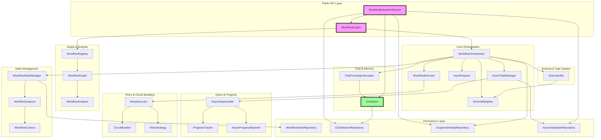
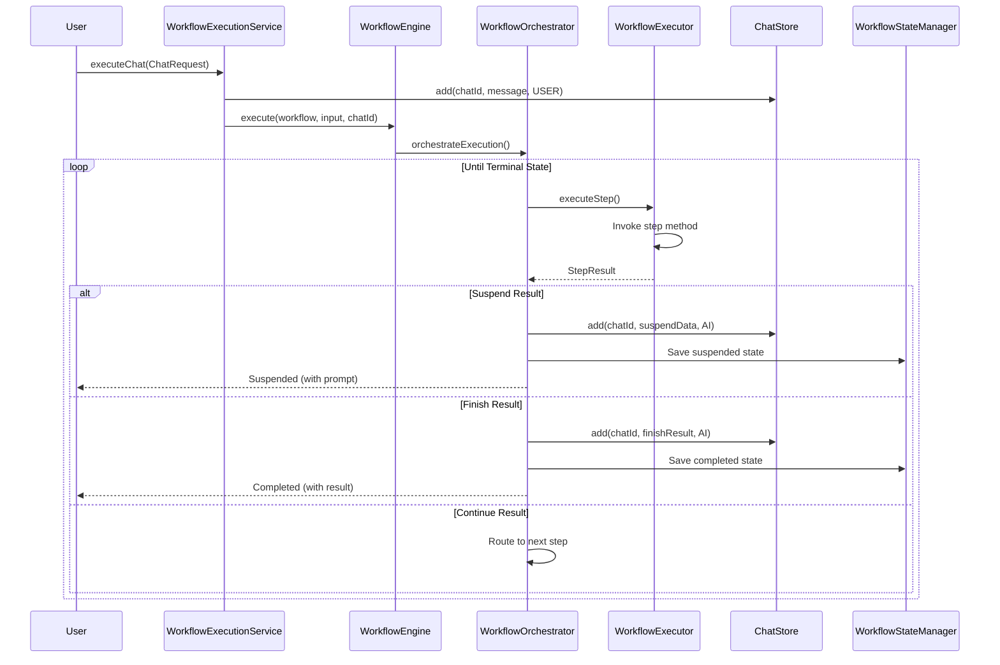

# DriftKit Chat Architecture: From Chaos to Simplicity

## Executive Summary

This document presents a radical simplification of DriftKit's chat architecture, replacing 8+ overlapping classes with a single `ChatStore` concept that unifies:
- Chat history storage
- Token-based memory management  
- Model API conversions
- Automatic message tracking

The new architecture works seamlessly across workflows, agents, and direct chat APIs without configuration.

## Current Problem: Too Many Overlapping Concepts

```
┌─────────────────────────── CURRENT MESS ───────────────────────────┐
│                                                                     │
│  ChatMemory ←→ ChatMemoryStore ←→ ChatHistoryMemoryStoreAdapter   │
│       ↑                                      ↓                      │
│    Message                           ChatHistoryRepository         │
│       ↑                                      ↓                      │
│  LLMAgent                            MemoryManagementService       │
│                                              ↓                      │
│                                   DefaultWorkflowExecutionService   │
│                                              ↓                      │
│                                      WorkflowOrchestrator          │
│                                                                     │
│  Result: 8+ classes doing essentially the same thing!              │
└─────────────────────────────────────────────────────────────────────┘
```

### The Core Issues:

1. **Message Type Duplication**:
   - `Message` (driftkit-common) - 15+ fields
   - `ChatMessage` (workflow-engine) - Properties-based
   - `ModelContentMessage` (clients) - API format

2. **Storage Duplication**:
   - `ChatHistoryRepository` - Basic storage
   - `ChatMemoryStore` - Same thing, different interface
   - `MemoryManagementService` - Wrapper around both

3. **Conversion Overhead**:
   ```
   ChatMessage → JSON → Message → ModelContentMessage
   ```

4. **Manual Tracking**: Developers must remember to save messages

## The Solution: ONE ChatStore

```
┌──────────────────────────────────────────────────────────────────────┐
│                            ChatStore                                 │
│                    (Single Source of Truth)                          │
│                                                                      │
│  ┌─────────────┐  ┌─────────────┐  ┌─────────────┐                │
│  │   Storage   │  │   Memory    │  │    API      │                │
│  │             │  │             │  │             │                │
│  │ • add()     │  │ • getRecent │  │ • toModel() │                │
│  │ • get()     │  │   WithTokens│  │ • fromProps │                │
│  │ • delete()  │  │ • prune()   │  │             │                │
│  └─────────────┘  └─────────────┘  └─────────────┘                │
└────────────────────────────┬────────────────────────────────────────┘
                             │
         ┌───────────────────┼───────────────────┐
         │                   │                   │
    ┌────▼─────┐      ┌──────▼──────┐     ┌──────▼─────┐
    │ Workflow │      │   Agent     │     │    Chat    │
    │          │      │             │     │  Service   │
    └──────────┘      └─────────────┘     └────────────┘
```

### What ChatStore Replaces:

| Old Component | What it did | How ChatStore does it |
|---------------|-------------|----------------------|
| ChatMemory | Token management | Built-in `getRecentWithinTokens()` |
| ChatMemoryStore | Storage interface | Direct storage methods |
| ChatHistoryRepository | Message persistence | Unified repository |
| ChatHistoryMemoryStoreAdapter | Convert between APIs | No conversion needed |
| MemoryManagementService | Coordinate everything | Single component |
| Message (15+ fields) | Overloaded entity | Simple ChatMessage |
| Multiple orchestrators | Complex coordination | Auto-tracking in engine |

## Core Implementation: ChatStore

```java
@Component
public class ChatStore {
    private final Repository repository;  // Any storage backend
    private final Tokenizer tokenizer;
    private final int defaultMaxTokens = 4096;
    
    // ===== Core Storage =====
    
    public void add(String chatId, String content, MessageType type) {
        ChatMessage msg = new ChatMessage();
        msg.setId(UUID.randomUUID().toString());
        msg.setChatId(chatId);
        msg.setType(type);
        msg.updateOrAddProperty("message", content);
        msg.setTimestamp(System.currentTimeMillis());
        
        repository.save(msg);
        pruneIfNeeded(chatId);
    }
    
    public void add(String chatId, Map<String, String> properties, MessageType type) {
        ChatMessage msg = new ChatMessage();
        msg.setId(UUID.randomUUID().toString());
        msg.setChatId(chatId);
        msg.setType(type);
        msg.setPropertiesMap(properties);
        msg.setTimestamp(System.currentTimeMillis());
        
        repository.save(msg);
        pruneIfNeeded(chatId);
    }
    
    // ===== Memory Management =====
    
    public List<ChatMessage> getRecentWithinTokens(String chatId, int maxTokens) {
        List<ChatMessage> all = repository.findByChatId(chatId);
        
        // Token window logic built-in
        List<ChatMessage> result = new ArrayList<>();
        int tokens = 0;
        
        for (int i = all.size() - 1; i >= 0; i--) {
            ChatMessage msg = all.get(i);
            int msgTokens = estimateTokens(msg);
            
            if (tokens + msgTokens > maxTokens) break;
            
            result.add(0, msg);
            tokens += msgTokens;
        }
        
        return result;
    }
    
    // ===== API Conversions =====
    
    public List<ModelContentMessage> toModelMessages(String chatId) {
        return getRecent(chatId).stream()
            .map(this::toModelMessage)
            .collect(toList());
    }
    
    private ModelContentMessage toModelMessage(ChatMessage msg) {
        Role role = switch(msg.getType()) {
            case USER -> Role.user;
            case AI -> Role.assistant;
            case SYSTEM -> Role.system;
        };
        
        String content = msg.getPropertiesMap().get("message");
        if (content == null) {
            content = JsonUtils.toJson(msg.getPropertiesMap());
        }
        
        return ModelContentMessage.create(role, content);
    }
}
```

### Key Features:

1. **Unified Storage**: Single `add()` method for all message types
2. **Built-in Memory**: Token management without separate ChatMemory
3. **Direct API Support**: `toModelMessages()` without adapters
4. **Auto-pruning**: Maintains token limits automatically
5. **Properties Support**: Works with both strings and property maps

## Integration Pattern 1: WorkflowEngine Auto-Tracking

```java
public class WorkflowEngine {
    private final ChatStore chatStore;  // Injected
    
    @Override
    protected void processStepResult(StepResult<?> result, WorkflowInstance instance) {
        // Auto-save to chat if chatId exists
        String chatId = instance.getContext().get("chatId", String.class);
        
        if (chatId != null) {
            switch (result) {
                case StepResult.Suspend<?> susp -> {
                    saveToChat(chatId, susp.promptToUser(), MessageType.AI);
                }
                case StepResult.Finish<?> finish -> {
                    saveToChat(chatId, finish.result(), MessageType.AI);
                }
                case StepResult.Async<?> async -> {
                    if (async.immediateData() != null) {
                        saveToChat(chatId, async.immediateData(), MessageType.AI);
                    }
                }
            }
        }
        
        super.processStepResult(result, instance);
    }
    
    @Override
    public WorkflowExecution resume(String instanceId, Object userInput) {
        WorkflowInstance instance = loadInstance(instanceId);
        String chatId = instance.getContext().get("chatId", String.class);
        
        if (chatId != null) {
            saveToChat(chatId, userInput, MessageType.USER);
        }
        
        return super.resume(instanceId, userInput);
    }
    
    private void saveToChat(String chatId, Object data, MessageType type) {
        if (data instanceof String) {
            chatStore.add(chatId, (String) data, type);
        } else if (data instanceof Map) {
            chatStore.add(chatId, (Map<String, String>) data, type);
        } else {
            // Convert object to properties
            Map<String, String> props = objectToProperties(data);
            chatStore.add(chatId, props, type);
        }
    }
}
```

### Benefits:
- **Zero configuration**: Just set chatId in context
- **Automatic tracking**: All Suspend/Finish/Async messages saved
- **Type flexible**: Works with any object type
- **No manual saving**: Developers don't need to remember

## Integration Pattern 2: Simplified LLMAgent

```java
public class LLMAgent {
    private final ChatStore chatStore;  // Instead of ChatMemory!
    private final String chatId;
    private final ModelClient modelClient;
    
    public AgentResponse<String> executeText(String message) {
        // Add user message
        chatStore.add(chatId, message, MessageType.USER);
        
        // Get history with automatic token management
        List<ModelContentMessage> messages = chatStore.toModelMessages(chatId);
        
        // Execute
        ModelTextResponse response = modelClient.textToText(
            ModelTextRequest.builder()
                .messages(messages)
                .build()
        );
        
        // Add assistant response
        String responseText = response.getChoices().get(0).getMessage().getContent();
        chatStore.add(chatId, responseText, MessageType.AI);
        
        return AgentResponse.text(responseText);
    }
}
```

### What Changed:
- **Before**: ChatMemory → ChatMemoryStore → Adapter → Repository
- **After**: Direct ChatStore usage
- **Result**: 4 classes → 1 class

## Usage Examples: Clean and Simple

### 1. Workflow (Auto-tracked)
```java
@Workflow
public class SimpleWorkflow {
    // No ChatStore injection needed! Engine handles it
    
    @Step
    public StepResult<Info> analyze(Request req, WorkflowContext ctx) {
        // Just work with domain objects
        Info info = doAnalysis(req);
        return StepResult.continueWith(info);
    }
    
    @Step  
    public StepResult<Prompt> suspend(Info info) {
        // This auto-saves to ChatStore!
        return StepResult.suspend(
            new Prompt("Need more info about: " + info.getTopic()),
            UserInput.class
        );
    }
}

// Usage
engine.execute("simple-workflow", initialData, chatId);
```

### 2. Agent (Direct)
```java
@Service
public class AgentService {
    private final ChatStore chatStore;
    private final ModelClient modelClient;
    
    public String chat(String chatId, String message) {
        LLMAgent agent = new LLMAgent(chatStore, modelClient, chatId);
        return agent.executeText(message).getText();
    }
}
```

### 3. Chat API (Direct)
```java
@RestController
public class ChatController {
    private final ChatStore chatStore;
    
    @PostMapping("/chat/{chatId}")
    public ChatResponse chat(@PathVariable String chatId, @RequestBody String message) {
        // Direct usage
        chatStore.add(chatId, message, MessageType.USER);
        
        String response = processMessage(message);
        chatStore.add(chatId, response, MessageType.AI);
        
        return new ChatResponse(response);
    }
    
    @GetMapping("/chat/{chatId}/history")
    public List<ChatMessage> getHistory(@PathVariable String chatId) {
        return chatStore.getRecent(chatId);
    }
}
```

## Migration Path: From Complex to Simple

### Phase 1: Create ChatStore
```java
// New unified component
@Component
public class ChatStore {
    // Replaces all the complexity
}
```

### Phase 2: Update WorkflowEngine
```java
// Add auto-tracking to existing engine
public class WorkflowEngine {
    @Autowired ChatStore chatStore;
    // Add processStepResult override
}
```

### Phase 3: Simplify LLMAgent
```java
// Remove ChatMemory, use ChatStore directly
public class LLMAgent {
    private final ChatStore chatStore;
    // Remove all conversion logic
}
```

### Phase 4: Deprecate Old Components
- ❌ ChatMemory
- ❌ ChatMemoryStore  
- ❌ ChatHistoryMemoryStoreAdapter
- ❌ MemoryManagementService
- ❌ DefaultWorkflowExecutionService (chat parts)
- ❌ Complex orchestrators

## Final Architecture: Benefits

### What We Achieved:

1. **ONE Concept**: ChatStore replaces 8+ classes
2. **Auto-tracking**: All messages saved automatically
3. **No Adapters**: Direct usage everywhere
4. **Token Management**: Built-in, automatic
5. **Simple API**: `add()`, `getRecent()`, `toModelMessages()`
6. **Universal**: Works for workflows, agents, and direct APIs

### Comparison:

| Aspect | Before | After |
|--------|--------|-------|
| Classes | 8+ overlapping | 1 ChatStore |
| Manual saving | Required | Automatic |
| Token management | Separate ChatMemory | Built-in |
| API conversions | Multiple adapters | Direct method |
| Configuration | Complex | Zero-config |
| Learning curve | Steep | Simple |

### Result:

```
BEFORE: Developer confusion, complex integration, manual work
AFTER:  It just works™
```

## ChatMemory vs ChatHistory: Why Both?

### Current Conceptual Overlap

Right now we have two overlapping concepts:

1. **ChatHistory** (workflow-engine-core)
   - Stores messages in repository
   - Retrieves by chatId
   - No token management
   - Just storage/retrieval

2. **ChatMemory** (driftkit-common)
   - Also stores/retrieves messages
   - Adds token window management
   - Automatic truncation when exceeding limits
   - Uses ChatMemoryStore interface (implemented by ChatHistoryMemoryStoreAdapter)

### The Problem: Redundant Abstraction

```
┌─────────────┐     ┌──────────────────────────┐     ┌─────────────────┐
│   LLMAgent  │────▶│      ChatMemory          │────▶│ ChatMemoryStore │
└─────────────┘     │  (Token Management)      │     └────────┬────────┘
                    └──────────────────────────┘              │
                                                              ▼
┌─────────────┐     ┌──────────────────────────┐     ┌─────────────────┐
│  Workflow   │────▶│   ChatHistoryRepository  │◀────│     Adapter     │
└─────────────┘     │      (Storage Only)      │     └─────────────────┘
                    └──────────────────────────┘
```

We're essentially doing:
- ChatHistory → Adapter → ChatMemoryStore → ChatMemory
- Two interfaces for the same thing!

### Unified Approach: Single Concept

#### Option 1: Make ChatHistory Token-Aware

```java
public interface TokenAwareChatHistory extends ChatHistoryRepository {
    // Existing methods
    void addMessage(String chatId, ChatMessage message);
    List<ChatMessage> findRecentByChatId(String chatId, int limit);
    
    // New token-aware methods
    List<ChatMessage> findWithinTokenLimit(String chatId, int maxTokens, Tokenizer tokenizer);
    void pruneToTokenLimit(String chatId, int maxTokens, Tokenizer tokenizer);
}

// Implementation
public class TokenAwareChatHistoryImpl implements TokenAwareChatHistory {
    private final ChatHistoryRepository delegate;
    private final Tokenizer tokenizer;
    
    @Override
    public List<ChatMessage> findWithinTokenLimit(String chatId, int maxTokens, Tokenizer tokenizer) {
        List<ChatMessage> allMessages = delegate.findRecentByChatId(chatId, 1000);
        
        // Same logic as TokenWindowChatMemory
        List<ChatMessage> result = new ArrayList<>();
        int totalTokens = 0;
        
        for (int i = allMessages.size() - 1; i >= 0; i--) {
            ChatMessage msg = allMessages.get(i);
            int tokens = estimateTokens(msg, tokenizer);
            
            if (totalTokens + tokens > maxTokens) break;
            
            result.add(0, msg);
            totalTokens += tokens;
        }
        
        return result;
    }
}
```

#### Option 2: Eliminate ChatMemory - Use ChatHistory Directly

```java
// Instead of ChatMemory, use ChatHistory with token configuration
public class LLMAgent {
    private final TokenAwareChatHistory chatHistory;
    private final String chatId;
    private final int maxTokens;
    private final Tokenizer tokenizer;
    
    public void addUserMessage(String content) {
        ChatRequest request = new ChatRequest();
        request.setId(UUID.randomUUID().toString());
        request.setChatId(chatId);
        request.updateOrAddProperty("message", content);
        
        chatHistory.addMessage(chatId, request);
        
        // Auto-prune if needed
        chatHistory.pruneToTokenLimit(chatId, maxTokens, tokenizer);
    }
    
    private List<ModelContentMessage> getConversationHistory() {
        // Get messages within token limit
        List<ChatMessage> messages = chatHistory.findWithinTokenLimit(
            chatId, maxTokens, tokenizer
        );
        
        return messages.stream()
            .map(this::convertToModelMessage)
            .collect(toList());
    }
}
```

#### Option 3: Full Unification - ChatSession

```java
// Single unified concept that combines storage + memory management
public interface ChatSession {
    // Message management
    void addUserMessage(String content);
    void addUserMessage(Map<String, String> properties);
    void addAssistantMessage(String content);
    void addAssistantMessage(Map<String, String> properties);
    
    // Retrieval with automatic token management
    List<ChatMessage> getRecentMessages(int limit);
    List<ChatMessage> getMessagesWithinTokens(int maxTokens);
    
    // Direct model API support
    List<ModelContentMessage> getModelMessages();
    
    // Session info
    String getChatId();
    String getUserId();
    long getMessageCount();
    int getCurrentTokenCount();
}

// Single implementation
@Component
public class UnifiedChatSession implements ChatSession {
    private final ChatHistoryRepository repository;
    private final Tokenizer tokenizer;
    private final int maxTokens;
    private final String chatId;
    
    @Override
    public void addUserMessage(String content) {
        ChatRequest request = new ChatRequest();
        request.updateOrAddProperty("message", content);
        repository.addMessage(chatId, request);
        
        // Auto-prune old messages
        pruneIfNeeded();
    }
    
    @Override
    public List<ModelContentMessage> getModelMessages() {
        return getMessagesWithinTokens(maxTokens).stream()
            .map(this::directConvertToModel)
            .collect(toList());
    }
}
```

### Recommended Approach: Unified ChatSession

1. **Single Concept**: No more ChatMemory vs ChatHistory confusion
2. **Token Management Built-in**: No need for adapters
3. **Direct Model Support**: Convert to ModelContentMessage internally
4. **Cleaner API**: One interface for all chat operations

```java
// Usage in Workflow
@Step
public StepResult processChat(ChatRequest request, WorkflowContext ctx) {
    ChatSession session = sessionFactory.getSession(request.getChatId());
    session.addUserMessage(request.getPropertiesMap());
    
    // Use with agent
    LLMAgent agent = LLMAgent.builder()
        .chatSession(session)  // Instead of chatMemory
        .build();
    
    AgentResponse response = agent.executeText();
    session.addAssistantMessage(response.getText());
    
    return StepResult.finish(response);
}

// Usage standalone
public String chat(String chatId, String message) {
    ChatSession session = sessionFactory.getSession(chatId);
    
    LLMAgent agent = LLMAgent.builder()
        .chatSession(session)
        .build();
    
    return agent.executeText(message).getText();
}
```

### Migration Path

1. **Phase 1**: Create ChatSession interface and implementation
2. **Phase 2**: Add chatSession support to LLMAgent (alongside chatMemory)
3. **Phase 3**: Migrate workflows to use ChatSession
4. **Phase 4**: Deprecate ChatMemory and ChatHistoryMemoryStoreAdapter
5. **Phase 5**: Remove old abstractions

### Benefits

1. **Conceptual Clarity**: One concept instead of two
2. **No Adapters**: Direct implementation, no conversion overhead
3. **Unified API**: Same interface for workflows and agents
4. **Token Management**: Built-in, not bolted on
5. **Simpler Testing**: One thing to mock/test

## Critical Insights from Analysis

### 1. ChatRequest/Response Are NOT Workflow Input Types!

From the tests and examples:
```java
// ChatRequest is used ONLY for initial context extraction
@InitialStep
public StepResult<IntentAnalysis> processInitialRequest(
        WorkflowContext context, 
        ChatRequest request) {
    // Extract context
    ChatContextHelper.setChatId(context, request.getChatId());
    
    // Convert to domain object
    IntentAnalysis analysis = analyzeIntent(request.getMessage());
    
    // Continue with domain object, NOT ChatRequest
    return StepResult.continueWith(analysis);
}

// User provides custom types when resuming
UserChatMessage userMessage = new UserChatMessage();
engine.resume(runId, userMessage);  // NOT ChatRequest!
```

**Key Point**: ChatRequest/Response are just property bags for initial data transfer, not the actual workflow types.

### 2. Chat Saving EXISTS But Only Through Service Layer!

Found in `DefaultWorkflowExecutionService`:
```java
@Override
public ChatResponse executeChat(ChatRequest request) {
    // Store the request in chat history
    memoryService.storeChatRequest(request);
    
    // Execute workflow
    var execution = engine.execute(workflowId, request, request.getChatId());
    
    // ... workflow runs ...
    
    // Create response from workflow state
    ChatResponse response = createChatResponseFromWorkflowState(...);
    
    // Update chat history with response
    memoryService.storeChatResponse(response);
    
    return response;
}
```

**Key Points**:
- Chat saving IS implemented but at the SERVICE layer, not in core engine
- Only saves initial ChatRequest and final ChatResponse
- Does NOT save intermediate Suspend/Async messages automatically
- MemoryManagementService handles both ChatHistory and ChatMemory

### 3. User Can Send Properties Too

ChatRequest supports properties just like ChatResponse:
```java
new ChatRequest(
    "chat-123",
    Map.of(
        "message", "What is quantum computing?",
        "context", "educational",
        "detail_level", "beginner"
    ),
    Language.ENGLISH
);
```

## Revised Unified Approach

### Core Concept: WorkflowChatSession

```java
public interface WorkflowChatSession {
    // Automatic tracking on workflow events
    void onWorkflowSuspend(Object promptData, Class<?> expectedInput);
    void onWorkflowResume(Object userInput);
    void onWorkflowFinish(Object result);
    void onAsyncStart(String taskId, Object immediateData);
    void onAsyncComplete(String taskId, Object result);
    
    // Manual tracking for intermediate steps
    void addIntermediateMessage(Map<String, String> properties, MessageType type);
    
    // Retrieval with token management
    List<ChatMessage> getMessagesWithinTokens(int maxTokens);
    List<ModelContentMessage> getModelMessages();
    
    // Session info
    String getChatId();
    String getUserId();
}
```

### Integration with WorkflowEngine

```java
// Enhanced WorkflowOrchestrator
public class ChatAwareWorkflowOrchestrator extends WorkflowOrchestrator {
    private final ChatSessionManager sessionManager;
    
    @Override
    protected void processStepResult(StepResult<?> result, WorkflowInstance instance) {
        WorkflowChatSession session = sessionManager.getSession(instance);
        
        switch (result) {
            case StepResult.Suspend<?> susp -> {
                // Auto-save assistant message
                session.onWorkflowSuspend(susp.promptToUser(), susp.nextInputClass());
                super.processStepResult(result, instance);
            }
            
            case StepResult.Finish<?> finish -> {
                // Auto-save final response
                session.onWorkflowFinish(finish.result());
                super.processStepResult(result, instance);
            }
            
            case StepResult.Async<?> async -> {
                // Track async start
                session.onAsyncStart(async.taskId(), async.immediateData());
                super.processStepResult(result, instance);
            }
        }
    }
    
    @Override
    public WorkflowExecution<?> resume(String runId, Object userInput) {
        WorkflowInstance instance = stateManager.loadInstance(runId);
        WorkflowChatSession session = sessionManager.getSession(instance);
        
        // Auto-save user input
        session.onWorkflowResume(userInput);
        
        return super.resume(runId, userInput);
    }
}
```

### Implementation Details

```java
@Component
public class DefaultWorkflowChatSession implements WorkflowChatSession {
    private final ChatHistoryRepository historyRepo;
    private final String chatId;
    private final Tokenizer tokenizer;
    private final int maxTokens;
    
    @Override
    public void onWorkflowSuspend(Object promptData, Class<?> expectedInput) {
        ChatResponse response = new ChatResponse();
        response.setId(UUID.randomUUID().toString());
        response.setChatId(chatId);
        response.setType(MessageType.AI);
        
        // Handle different data types
        if (promptData instanceof Map) {
            response.setPropertiesMap((Map<String, String>) promptData);
        } else if (promptData instanceof String) {
            response.updateOrAddProperty("message", (String) promptData);
        } else {
            // Convert complex objects to properties
            response.setPropertiesMap(extractProperties(promptData));
        }
        
        historyRepo.addMessage(chatId, response);
    }
    
    @Override
    public void onWorkflowResume(Object userInput) {
        ChatRequest request = new ChatRequest();
        request.setId(UUID.randomUUID().toString());
        request.setChatId(chatId);
        request.setType(MessageType.USER);
        
        // Extract properties from user input
        if (userInput instanceof Map) {
            request.setPropertiesMap((Map<String, String>) userInput);
        } else {
            Map<String, String> props = extractProperties(userInput);
            request.setPropertiesMap(props);
        }
        
        historyRepo.addMessage(chatId, request);
    }
    
    private Map<String, String> extractProperties(Object obj) {
        // Use reflection or Jackson to extract fields as properties
        // This preserves the flexibility of properties while supporting typed objects
    }
}
```

### Usage Pattern

```java
@Workflow(id = "auto-tracking-workflow")
public class AutoTrackingWorkflow {
    
    @InitialStep
    public StepResult<Analysis> analyze(ChatRequest initial, WorkflowContext ctx) {
        // Extract what we need
        String chatId = initial.getChatId();
        Map<String, String> props = initial.getPropertiesMap();
        
        // Work with domain objects
        Analysis analysis = performAnalysis(props);
        
        return StepResult.continueWith(analysis);
    }
    
    @Step
    public StepResult<Prompt> processAnalysis(Analysis analysis, WorkflowContext ctx) {
        if (analysis.needsMoreInfo()) {
            Prompt prompt = new Prompt(
                "I need more information about: " + analysis.getMissingInfo(),
                "Please provide details"
            );
            
            // This will auto-save to chat history!
            return StepResult.suspend(prompt, UserDetails.class);
        }
        
        // Continue processing
        return StepResult.continueWith(new Result(analysis));
    }
    
    @Step 
    public StepResult<FinalResult> complete(Result result, WorkflowContext ctx) {
        FinalResult finalResult = new FinalResult();
        finalResult.setSummary(result.getSummary());
        finalResult.setRecommendations(result.getRecommendations());
        
        // This will auto-save to chat history!
        return StepResult.finish(finalResult);
    }
}
```

### Key Benefits of This Approach

1. **Automatic Tracking**: No manual saving needed in workflows
2. **Properties Preserved**: Both user and assistant can use property maps
3. **Type Flexibility**: Works with any object type, not just ChatRequest/Response
4. **Unified Storage**: Single ChatHistory for both workflows and agents
5. **Token Management**: Built into the session
6. **Clean Separation**: Workflow logic doesn't know about chat storage

## Current State vs Ideal State

### Current State (What Exists)

1. **Service Layer Chat Saving**:
   ```java
   // DefaultWorkflowExecutionService
   executeChat(ChatRequest) {
       memoryService.storeChatRequest(request);     // Save initial
       engine.execute(workflow, request);
       memoryService.storeChatResponse(response);   // Save final
   }
   ```

2. **MemoryManagementService** - Central hub for:
   - Chat history persistence
   - ChatMemory integration  
   - Session management
   ```java
   public class MemoryManagementService {
       void storeChatRequest(ChatRequest request) {
           historyRepository.addMessage(chatId, request);
           addRequestToMemory(request);  // Also to ChatMemory
       }
   }
   ```

3. **Manual Saving in Workflows**:
   ```java
   // In workflow steps - must manually save
   @Step
   public StepResult process(Input input, WorkflowContext ctx) {
       // Manual tracking if needed
       ChatRequest req = new ChatRequest();
       historyRepository.addMessage(chatId, req);
   }
   ```

### Issues with Current Approach

1. **Incomplete History**: Only saves initial request and final response
2. **No Intermediate Tracking**: Suspend/Async messages not saved
3. **Manual Work Required**: Developers must remember to save
4. **Service Layer Dependency**: Chat saving tied to specific service

### Integration Examples

#### Example 1: Current Workflow WITHOUT Agents
```java
@Workflow(id = "chat-workflow")
public class CurrentChatWorkflow {
    private final ChatHistoryRepository historyRepo;
    
    @InitialStep
    public StepResult<Analysis> start(ChatRequest request, WorkflowContext ctx) {
        // Context extracted from ChatRequest
        ChatContextHelper.setChatId(ctx, request.getChatId());
        
        // Convert to domain object
        Analysis analysis = analyze(request.getPropertiesMap());
        return StepResult.continueWith(analysis);
    }
    
    @Step
    public StepResult<PromptData> needMoreInfo(Analysis analysis, WorkflowContext ctx) {
        PromptData prompt = new PromptData("Need more details about: " + analysis.getTopic());
        
        // MANUAL SAVE - Developer must remember!
        String chatId = ChatContextHelper.getChatId(ctx);
        ChatResponse response = new ChatResponse();
        response.setChatId(chatId);
        response.updateOrAddProperty("message", prompt.getMessage());
        historyRepo.addMessage(chatId, response);  // Manual!
        
        return StepResult.suspend(prompt, UserDetails.class);
    }
}

// Usage
ChatResponse response = workflowService.executeChat(chatRequest);
// Only initial request and final response are auto-saved
```

#### Example 2: Current Workflow WITH Agents
```java
@Workflow(id = "agent-workflow")
public class CurrentAgentWorkflow {
    private final ChatHistoryRepository historyRepo;
    private final ModelClient modelClient;
    
    @Step
    public StepResult<String> processWithAgent(UserQuery query, WorkflowContext ctx) {
        String chatId = ChatContextHelper.getChatId(ctx);
        
        // Create agent with workflow-backed memory
        ChatMemoryStore store = new ChatHistoryMemoryStoreAdapter(historyRepo);
        ChatMemory memory = TokenWindowChatMemory.withMaxTokens(chatId, 4096, tokenizer, store);
        
        LLMAgent agent = LLMAgent.builder()
            .chatMemory(memory)
            .modelClient(modelClient)
            .build();
        
        // Agent tracks in ChatMemory, which uses ChatHistory
        AgentResponse<String> response = agent.executeText(query.getText());
        
        // But Suspend messages still need manual saving!
        if (needsMoreInfo(response)) {
            ChatResponse chatResp = new ChatResponse();
            chatResp.updateOrAddProperty("message", "Need clarification");
            historyRepo.addMessage(chatId, chatResp);  // Manual!
            
            return StepResult.suspend(chatResp, Clarification.class);
        }
        
        return StepResult.finish(response.getText());
    }
}
```

#### Example 3: Standalone Agent (No Workflow)
```java
@Service  
public class StandaloneAgentService {
    private final ChatHistoryRepository historyRepo;
    private final ModelClient modelClient;
    
    public String chat(String chatId, String message) {
        // Create agent with history-backed memory
        ChatMemoryStore store = new ChatHistoryMemoryStoreAdapter(historyRepo);
        ChatMemory memory = TokenWindowChatMemory.withMaxTokens(chatId, 4096, tokenizer, store);
        
        LLMAgent agent = LLMAgent.builder()
            .chatMemory(memory)
            .modelClient(modelClient)
            .build();
        
        // Agent automatically tracks in ChatMemory/ChatHistory
        return agent.executeText(message).getText();
    }
}
```

### Proposed Enhancement: Auto-Tracking Orchestrator

```java
// Enhanced orchestrator that auto-saves to chat history
public class ChatAwareWorkflowOrchestrator extends WorkflowOrchestrator {
    private final MemoryManagementService memoryService;
    
    @Override
    protected void processStepResult(StepResult<?> result, WorkflowInstance instance) {
        String chatId = instance.getContext().get(Keys.CHAT_ID, String.class);
        
        if (chatId != null) {
            switch (result) {
                case StepResult.Suspend<?> susp -> {
                    // Auto-save suspend message
                    ChatResponse response = createChatResponse(susp.promptToUser());
                    memoryService.storeChatResponse(response);
                }
                
                case StepResult.Async<?> async -> {
                    // Auto-save immediate data if present
                    if (async.immediateData() != null) {
                        ChatResponse response = createChatResponse(async.immediateData());
                        memoryService.storeChatResponse(response);
                    }
                }
            }
        }
        
        super.processStepResult(result, instance);
    }
}
```

This would make ALL chat messages auto-save, not just initial/final!

## SIMPLIFIED UNIFIED ARCHITECTURE

### The Problem: Too Many Layers!

Current mess:
- WorkflowOrchestrator
- DefaultWorkflowExecutionService  
- MemoryManagementService
- ChatHistoryRepository
- ChatMemoryStore
- ChatHistoryMemoryStoreAdapter
- ChatMemory
- LLMAgent with its own memory

### The Solution: ONE ChatStore for Everything

```
┌─────────────────────────────────────────────────────────────────────┐
│                            ChatStore                                 │
│                    (Single Source of Truth)                          │
│                                                                      │
│  ┌─────────────┐  ┌─────────────┐  ┌─────────────┐                │
│  │   Storage   │  │   Memory    │  │    API      │                │
│  │             │  │             │  │             │                │
│  │ • add()     │  │ • getRecent │  │ • toModel() │                │
│  │ • get()     │  │   WithTokens│  │ • fromProps │                │
│  │ • delete()  │  │ • prune()   │  │             │                │
│  └─────────────┘  └─────────────┘  └─────────────┘                │
└────────────────────────────┬────────────────────────────────────────┘
                             │
         ┌───────────────────┼───────────────────┐
         │                   │                   │
    ┌────▼─────┐      ┌─────▼──────┐     ┌─────▼─────┐
    │ Workflow │      │   Agent    │     │    Chat   │
    │          │      │            │     │  Service  │
    └──────────┘      └────────────┘     └───────────┘
```

### Core Design: ChatStore

```java
@Component
public class ChatStore {
    private final Repository repository;  // Any storage backend
    private final Tokenizer tokenizer;
    private final int defaultMaxTokens = 4096;
    
    // ===== Core Storage =====
    
    public void add(String chatId, String content, MessageType type) {
        ChatMessage msg = new ChatMessage();
        msg.setId(UUID.randomUUID().toString());
        msg.setChatId(chatId);
        msg.setType(type);
        msg.updateOrAddProperty("message", content);
        msg.setTimestamp(System.currentTimeMillis());
        
        repository.save(msg);
        pruneIfNeeded(chatId);
    }
    
    public void add(String chatId, Map<String, String> properties, MessageType type) {
        ChatMessage msg = new ChatMessage();
        msg.setId(UUID.randomUUID().toString());
        msg.setChatId(chatId);
        msg.setType(type);
        msg.setPropertiesMap(properties);
        msg.setTimestamp(System.currentTimeMillis());
        
        repository.save(msg);
        pruneIfNeeded(chatId);
    }
    
    // ===== Memory Management =====
    
    public List<ChatMessage> getRecentWithinTokens(String chatId, int maxTokens) {
        List<ChatMessage> all = repository.findByChatId(chatId);
        
        // Same logic as TokenWindowChatMemory but built-in
        List<ChatMessage> result = new ArrayList<>();
        int tokens = 0;
        
        for (int i = all.size() - 1; i >= 0; i--) {
            ChatMessage msg = all.get(i);
            int msgTokens = estimateTokens(msg);
            
            if (tokens + msgTokens > maxTokens) break;
            
            result.add(0, msg);
            tokens += msgTokens;
        }
        
        return result;
    }
    
    public List<ChatMessage> getRecent(String chatId) {
        return getRecentWithinTokens(chatId, defaultMaxTokens);
    }
    
    // ===== API Conversions =====
    
    public List<ModelContentMessage> toModelMessages(String chatId) {
        return getRecent(chatId).stream()
            .map(this::toModelMessage)
            .collect(toList());
    }
    
    private ModelContentMessage toModelMessage(ChatMessage msg) {
        Role role = switch(msg.getType()) {
            case USER -> Role.user;
            case AI -> Role.assistant;
            case SYSTEM -> Role.system;
        };
        
        String content = msg.getPropertiesMap().get("message");
        if (content == null) {
            content = JsonUtils.toJson(msg.getPropertiesMap());
        }
        
        return ModelContentMessage.create(role, content);
    }
    
    // ===== Auto-pruning =====
    
    private void pruneIfNeeded(String chatId) {
        List<ChatMessage> all = repository.findByChatId(chatId);
        int totalTokens = all.stream().mapToInt(this::estimateTokens).sum();
        
        while (totalTokens > defaultMaxTokens && !all.isEmpty()) {
            ChatMessage oldest = all.remove(0);
            repository.delete(oldest.getId());
            totalTokens -= estimateTokens(oldest);
        }
    }
}
```

### Integration: WorkflowEngine

```java
public class WorkflowEngine {
    private final ChatStore chatStore;  // Injected
    
    @Override
    protected void processStepResult(StepResult<?> result, WorkflowInstance instance) {
        // Auto-save to chat if chatId exists
        String chatId = instance.getContext().get("chatId", String.class);
        
        if (chatId != null) {
            switch (result) {
                case StepResult.Suspend<?> susp -> {
                    saveToChat(chatId, susp.promptToUser(), MessageType.AI);
                }
                case StepResult.Finish<?> finish -> {
                    saveToChat(chatId, finish.result(), MessageType.AI);
                }
                case StepResult.Async<?> async -> {
                    if (async.immediateData() != null) {
                        saveToChat(chatId, async.immediateData(), MessageType.AI);
                    }
                }
            }
        }
        
        // Continue normal processing
        super.processStepResult(result, instance);
    }
    
    @Override
    public WorkflowExecution resume(String instanceId, Object userInput) {
        WorkflowInstance instance = loadInstance(instanceId);
        String chatId = instance.getContext().get("chatId", String.class);
        
        if (chatId != null) {
            saveToChat(chatId, userInput, MessageType.USER);
        }
        
        return super.resume(instanceId, userInput);
    }
    
    private void saveToChat(String chatId, Object data, MessageType type) {
        if (data instanceof String) {
            chatStore.add(chatId, (String) data, type);
        } else if (data instanceof Map) {
            chatStore.add(chatId, (Map<String, String>) data, type);
        } else {
            // Convert object to properties
            Map<String, String> props = objectToProperties(data);
            chatStore.add(chatId, props, type);
        }
    }
}
```

### Integration: LLMAgent

```java
public class LLMAgent {
    private final ChatStore chatStore;  // Instead of ChatMemory!
    private final String chatId;
    
    public AgentResponse<String> executeText(String message) {
        // Add user message
        chatStore.add(chatId, message, MessageType.USER);
        
        // Get history with token management
        List<ModelContentMessage> messages = chatStore.toModelMessages(chatId);
        
        // Execute
        ModelTextResponse response = modelClient.textToText(
            ModelTextRequest.builder()
                .messages(messages)
                .build()
        );
        
        // Add assistant response
        String responseText = response.getChoices().get(0).getMessage().getContent();
        chatStore.add(chatId, responseText, MessageType.AI);
        
        return AgentResponse.text(responseText);
    }
}
```

### Usage Examples

#### 1. Workflow (Auto-tracked)
```java
@Workflow
public class SimpleWorkflow {
    // No injection needed! Engine handles it
    
    @Step
    public StepResult<Info> analyze(Request req, WorkflowContext ctx) {
        // Just work with domain objects
        Info info = doAnalysis(req);
        return StepResult.continueWith(info);
    }
    
    @Step  
    public StepResult<Prompt> suspend(Info info) {
        // This auto-saves to ChatStore!
        return StepResult.suspend(
            new Prompt("Need more info about: " + info.getTopic()),
            UserInput.class
        );
    }
}
```

#### 2. Agent (Simple)
```java
@Service
public class AgentService {
    private final ChatStore chatStore;
    private final ModelClient modelClient;
    
    public String chat(String chatId, String message) {
        LLMAgent agent = new LLMAgent(chatStore, modelClient, chatId);
        return agent.executeText(message).getText();
    }
}
```

#### 3. Direct Chat API
```java
@RestController
public class ChatController {
    private final ChatStore chatStore;
    
    @PostMapping("/chat/{chatId}")
    public ChatResponse chat(@PathVariable String chatId, @RequestBody String message) {
        // Direct usage
        chatStore.add(chatId, message, MessageType.USER);
        
        String response = processMessage(message);
        chatStore.add(chatId, response, MessageType.AI);
        
        return new ChatResponse(response);
    }
    
    @GetMapping("/chat/{chatId}/history")
    public List<ChatMessage> getHistory(@PathVariable String chatId) {
        return chatStore.getRecent(chatId);
    }
}
```

### Benefits

1. **ONE concept**: ChatStore handles storage + memory + conversions
2. **Auto-tracking**: WorkflowEngine automatically saves all messages
3. **No adapters**: Direct usage everywhere
4. **Token management**: Built-in, automatic
5. **Simple API**: add(), getRecent(), toModelMessages()
6. **Works everywhere**: Workflows, Agents, Direct API

### Migration Path

1. Create ChatStore implementation
2. Update WorkflowEngine to use ChatStore
3. Update LLMAgent to use ChatStore instead of ChatMemory
4. Deprecate:
   - ChatMemory
   - ChatMemoryStore
   - ChatHistoryMemoryStoreAdapter
   - MemoryManagementService
   - Separate orchestrators

### Result: Clean Architecture

```
BEFORE: 8+ classes, adapters, complex flow
AFTER:  1 ChatStore + auto-tracking in engine
```

## Files to Remove (Phase 6 - Final Cleanup)

### Obsolete Classes to Delete:
1. **driftkit-common/src/main/java/ai/driftkit/common/utils/Tokenizer.java**
   - Old interface that works with Message objects
   - Replaced by TextTokenizer

2. **driftkit-common/src/main/java/ai/driftkit/common/utils/SimpleTokenizer.java**
   - Implementation of old Tokenizer
   - Replaced by SimpleTextTokenizer

3. **driftkit-common/src/main/java/ai/driftkit/common/service/TokenWindowChatMemory.java**
   - Old ChatMemory implementation
   - Functionality absorbed by ChatStore

4. **driftkit-common/src/main/java/ai/driftkit/common/service/ChatMemory.java**
   - Old interface
   - Replaced by ChatStore

5. **driftkit-common/src/main/java/ai/driftkit/common/service/ChatMemoryStore.java**
   - Old storage interface
   - Functionality merged into ChatStore

6. **driftkit-common/src/main/java/ai/driftkit/common/service/InMemoryChatMemoryStore.java**
   - Old implementation
   - Replaced by InMemoryChatStore

7. **driftkit-workflows/driftkit-workflow-engine-core/src/main/java/ai/driftkit/workflow/engine/persistence/ChatHistoryRepository.java**
   - Old repository interface
   - Replaced by ChatStore

8. **driftkit-workflows/driftkit-workflow-engine-core/src/main/java/ai/driftkit/workflow/engine/persistence/inmemory/InMemoryChatHistoryRepository.java**
   - Old implementation
   - Replaced by InMemoryChatStore

9. **driftkit-workflows/driftkit-workflow-engine-core/src/main/java/ai/driftkit/workflow/engine/memory/ChatHistoryMemoryStoreAdapter.java**
   - Adapter between old systems
   - No longer needed with unified ChatStore

### Files Already Updated:
- TraceableModelClient.java - Updated to use TextTokenizer
- ModelClientFactory.java - Updated to use TextTokenizer
- LLMAgent.java - Updated to use ChatStore
- WorkflowEngine.java - Added ChatTrackingInterceptor
- DefaultWorkflowExecutionService.java - Updated to use ChatStore
- MemoryManagementService.java - Simplified, removed ChatHistory dependencies

## Workflow Engine Core Architecture

### Service Components Overview



### Component Responsibilities

#### Public API Layer

**WorkflowExecutionService** (`DefaultWorkflowExecutionService`)
- High-level API for workflow execution
- Chat session management
- Workflow lifecycle (create, execute, resume, list)
- Direct integration with repositories (no MemoryManagementService)

**WorkflowEngine**
- Core engine for workflow execution
- Workflow registration and management
- Execution coordination
- Thread pool management
- Auto-tracking integration via ChatStore

#### Core Orchestration

**WorkflowOrchestrator**
- Main workflow execution logic
- Step result processing
- State transitions
- Auto-saves Suspend/Finish messages to ChatStore
- Coordinates between components

**WorkflowExecutor**
- Executes individual workflow steps
- Handles step method invocation
- Manages retry logic via RetryExecutor
- Circuit breaker integration

**StepRouter**
- Determines next step based on result type
- Handles branching logic
- Type-based routing for Continue results
- Resume routing for suspended workflows

**InputPreparer**
- Prepares input for step execution
- Handles initial workflow input
- Manages step output matching
- Resume input preparation

#### State Management

**WorkflowStateManager**
- Persists and loads workflow instances
- Manages instance lifecycle
- Handles state transitions
- Repository abstraction

**WorkflowInstance**
- Runtime state of workflow execution
- Current step tracking
- Status management (RUNNING, SUSPENDED, COMPLETED, FAILED)
- Error information

**WorkflowContext**
- Thread-safe context for workflow execution
- Step result storage
- Custom data storage
- Retry context management

#### Graph & Analysis

**WorkflowGraph**
- DAG representation of workflow
- Node and edge management
- Type information
- Path finding

**WorkflowAnalyzer**
- Static analysis of workflows
- Detects unreachable steps
- Validates step connections
- Type compatibility checking

**WorkflowRegistry**
- Central registry for all workflows
- Version management
- Workflow lookup
- Registration validation

#### Async & Progress

**AsyncTaskManager**
- Central manager for async tasks
- Delegates to AsyncStepHandler
- Manages async task lifecycle
- Progress tracking coordination

**AsyncStepHandler**
- Executes async step methods
- Progress reporting
- Completion handling
- State persistence

**ProgressTracker**
- Tracks progress of async operations
- Progress updates
- Completion status
- Event tracking

**AsyncProgressReporter**
- API for async steps to report progress
- Thread-safe progress updates
- Status messaging

#### Retry & Circuit Breaking

**RetryExecutor**
- Executes steps with retry logic
- Exponential backoff
- Custom retry strategies
- Metrics collection

**CircuitBreaker**
- Prevents cascading failures
- State management (CLOSED, OPEN, HALF_OPEN)
- Failure tracking
- Recovery logic

**RetryStrategy**
- Pluggable retry policies
- Conditional retry logic
- Delay calculation
- Abort conditions

#### Chat & Memory Integration

**ChatStore** (from common module)
- Unified chat message storage
- Token-based memory management
- Model API conversions
- Auto-pruning

**DefaultWorkflowExecutionService**
- Direct repository access
- Session management via ChatSessionRepository
- ChatStore integration for history
- Async state management via AsyncStepStateRepository

**ChatTrackingInterceptor** (internal to WorkflowOrchestrator)
- Auto-tracks workflow messages
- Suspend message tracking
- Finish message tracking
- User input tracking on resume

#### Persistence Layer

**WorkflowStateRepository**
- Workflow instance persistence
- State queries
- Update operations

**ChatSessionRepository**
- Chat session management
- User session queries
- Session lifecycle

**SuspensionDataRepository**
- Stores suspension data
- Resume data retrieval
- Type information persistence

**AsyncStepStateRepository**
- Async step state tracking
- Progress persistence
- Completion status

#### Schema & Type System

**SchemaUtils**
- Static utility for all schema operations
- JSON schema generation from classes
- Property extraction from objects
- Instance creation from property maps
- Schema caching for performance
- Type conversion utilities

**SchemaRegistry** (InMemorySchemaRegistry)
- Schema name to class mapping
- Registration of custom schemas
- Lookup by schema name

### Workflow Execution Flow



### Key Design Patterns

1. **Auto-Tracking Pattern**: WorkflowOrchestrator automatically saves chat messages without developer intervention
2. **Repository Pattern**: All persistence abstracted behind repository interfaces
3. **Strategy Pattern**: Pluggable retry and routing strategies
4. **Observer Pattern**: Progress tracking for async operations
5. **Circuit Breaker Pattern**: Fault tolerance for step execution
6. **Builder Pattern**: Fluent API for workflow definition

### Integration Points

1. **ChatStore Integration**: Automatic message tracking in WorkflowOrchestrator
2. **Spring Integration**: All components are Spring beans with dependency injection
3. **Async Support**: CompletableFuture-based async execution
4. **Schema Registry**: Automatic schema generation for workflow data types
5. **Monitoring**: Retry metrics and circuit breaker status