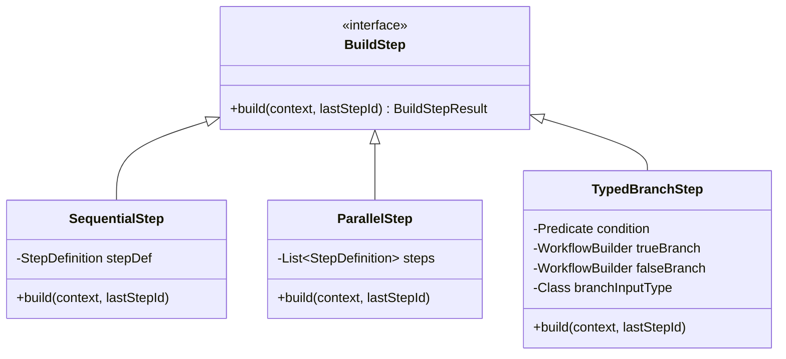
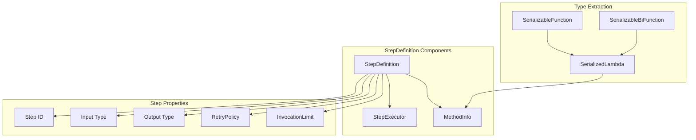
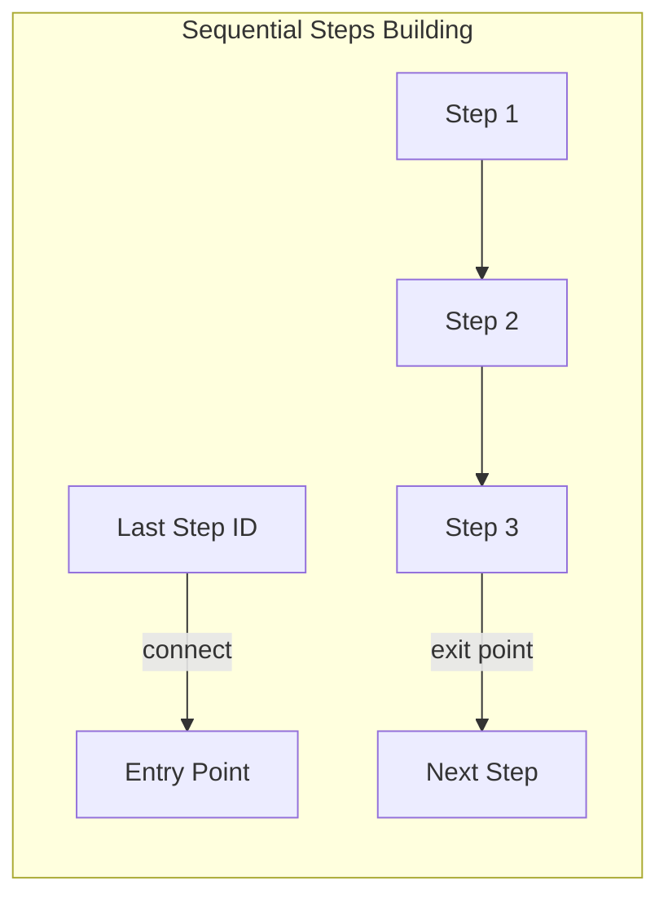
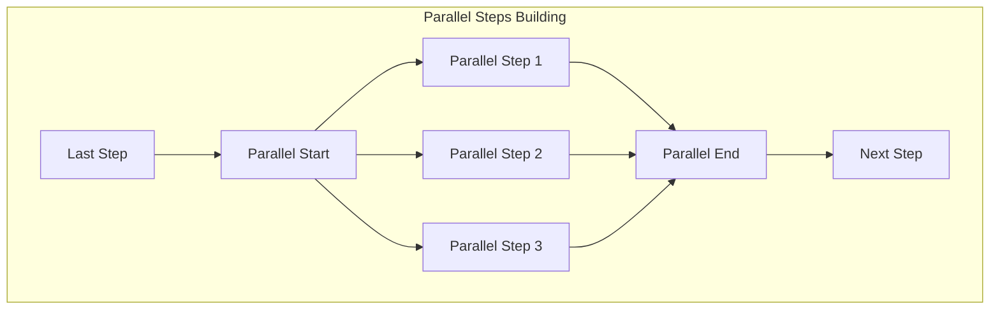
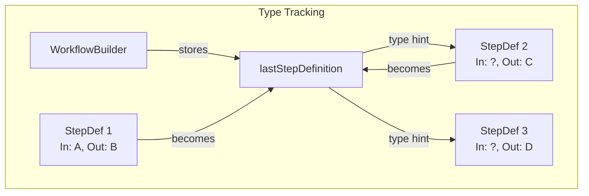
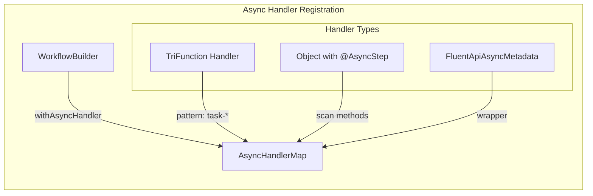
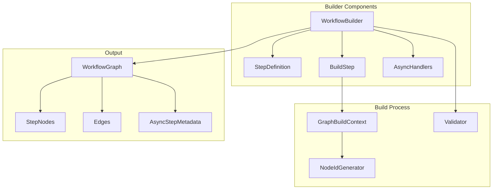
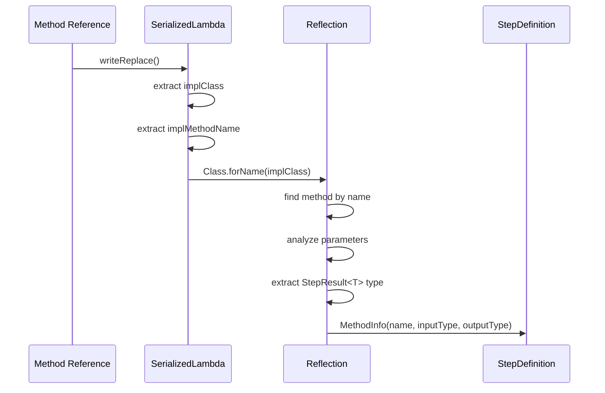
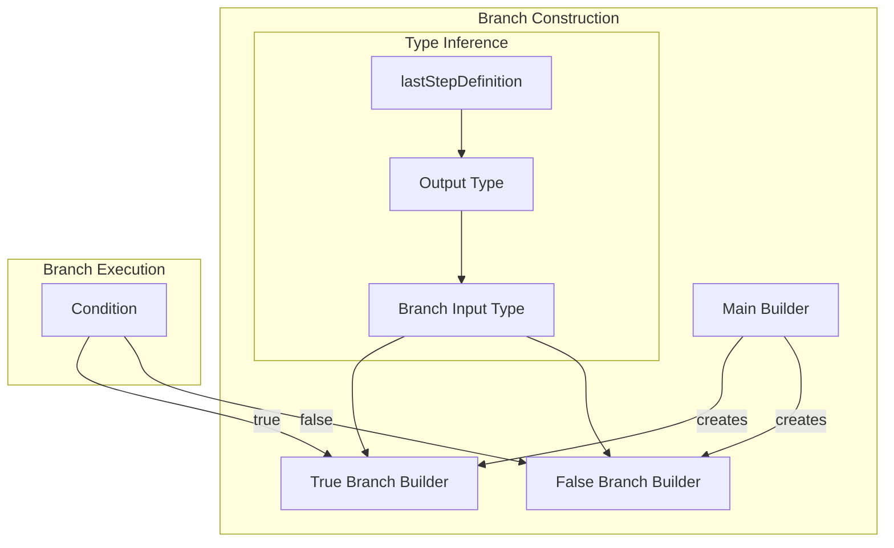

# WorkflowBuilder - Подробнейший анализ архитектуры и реализации

## Оглавление
1. [Обзор WorkflowBuilder](#обзор-workflowbuilder)
2. [Архитектура компонентов](#архитектура-компонентов)
3. [Механизм построения графа](#механизм-построения-графа)
4. [Type Flow и цепочка вызовов](#type-flow-и-цепочка-вызовов)
5. [Сравнение с Annotation-based подходом](#сравнение-с-annotation-based-подходом)
6. [Детальные диаграммы](#детальные-диаграммы)
7. [Проблемы и улучшения](#проблемы-и-улучшения)

## Обзор WorkflowBuilder

WorkflowBuilder представляет собой Fluent API для программного построения workflow. Основные характеристики:

- **Типобезопасность**: Использует генерики для отслеживания типов входа/выхода
- **Method references**: Автоматическое извлечение имен методов через SerializedLambda
- **Цепочка вызовов**: Fluent интерфейс для последовательного построения
- **Async поддержка**: Регистрация обработчиков через `withAsyncHandler`

### Ключевые компоненты

```java
public class WorkflowBuilder<T, R> {
    private final String id;
    private final Class<T> inputType;    // Тип входных данных workflow
    private final Class<R> outputType;   // Тип результата workflow
    private final List<BuildStep> buildSteps;  // Шаги построения
    private StepDefinition lastStepDefinition; // Для type flow
    private final Map<String, AsyncHandlerInfo> registeredAsyncHandlers;
}
```

## Архитектура компонентов

### 1. Иерархия BuildStep



### 2. StepDefinition - ядро определения шага



#### Механизм извлечения типов

```java
// 1. Method reference автоматически извлекает типы
StepDefinition.of(paymentService::processPayment)
// Извлекает: id="processPayment", input=PaymentRequest, output=PaymentResult

// 2. Lambda требует явного указания типов
StepDefinition.of("validate", 
    order -> StepResult.continueWith(validate(order)),
    Order.class, 
    ValidationResult.class)
```

## Механизм построения графа

### 1. Процесс построения

```mermaid
sequenceDiagram
    participant Client
    participant WB as WorkflowBuilder
    participant BS as BuildStep
    participant GBC as GraphBuildContext
    participant WG as WorkflowGraph
    
    Client->>WB: define(id, Input.class, Output.class)
    Client->>WB: then(step1)
    WB->>WB: create SequentialStep
    
    Client->>WB: then(step2)
    WB->>WB: create SequentialStep
    
    Client->>WB: build()
    
    loop For each BuildStep
        WB->>BS: build(context, lastStepId)
        BS->>GBC: generateNodeId()
        BS->>BS: create StepNode
        BS->>BS: create Edges
        BS-->>WB: BuildStepResult
    end
    
    WB->>WB: validate graph
    WB->>WG: create WorkflowGraph
    WG-->>Client: WorkflowGraph<Input, Output>
```



### 2. BuildStepResult структура

```java
record BuildStepResult(
    List<StepNode> nodes,        // Созданные узлы
    Map<String, List<Edge>> edges, // Связи между узлами
    List<String> entryPoints,     // Точки входа
    List<String> exitPoints       // Точки выхода
)
```

### 3. Построение последовательных шагов



### 4. Построение параллельных шагов



## Type Flow и цепочка вызовов

### 1. Проблема type flow

```java
// Текущая реализация теряет типы
WorkflowBuilder<OrderRequest, OrderResult> workflow = WorkflowBuilder
    .define("order-processing", OrderRequest.class, OrderResult.class)
    .then(this::validateOrder)      // Input: OrderRequest, Output: ValidatedOrder
    .then(this::calculatePricing)   // Input: ValidatedOrder?, Output: PricedOrder
    .then(this::processPayment)     // Input: PricedOrder?, Output: PaymentResult
    .build();

// Проблема: нет гарантии соответствия типов между шагами
```

### 2. Механизм lastStepDefinition



### 3. Async Handler Registration



## Сравнение с Annotation-based подходом

### 1. Определение Workflow

| Аспект | WorkflowBuilder (Fluent API) | Annotation-based |
|--------|------------------------------|-------------------|
| **Определение структуры** | Программное через цепочку вызовов | Декларативное через аннотации |
| **Место определения** | В любом месте кода | В классе workflow |
| **Гибкость композиции** | Высокая - динамическая | Низкая - статическая |
| **Переиспользование шагов** | Легко - любые методы | Сложнее - наследование |

### 2. Определение шагов

```java
// WorkflowBuilder подход
WorkflowBuilder
    .then(orderService::validate)  // Method reference
    .then(order -> {              // Lambda
        var result = process(order);
        return StepResult.continueWith(result);
    })
    .then(StepDefinition.of("notify",  // Explicit definition
        this::sendNotification,
        ProcessedOrder.class, 
        NotificationResult.class))

// Annotation подход
@Step(id = "validate")
public StepResult<ValidatedOrder> validate(Order order) {
    // implementation
}
```

### 3. Async обработка

```java
// WorkflowBuilder
.withAsyncHandler("process-*", (args, ctx, progress) -> {
    progress.updateProgress(50, "Processing");
    return StepResult.continueWith(result);
})

// Annotation
@AsyncStep(value = "process-*")
public StepResult<Result> handleAsync(Map<String, Object> args, 
                                     WorkflowContext ctx, 
                                     AsyncProgressReporter progress) {
    // implementation
}
```

## Детальные диаграммы

### 1. Полная архитектура WorkflowBuilder



### 2. Method Reference Type Extraction



### 3. Branch Building Process



## Проблемы и улучшения

### 1. Type Safety Issues

**Проблема**: Потеря типов между шагами
```java
// Компилятор не проверяет соответствие типов
.then(step1)  // Output: TypeA
.then(step2)  // Input: TypeB??? - нет проверки
```

**Решение**: Phantom types
```java
public class TypedWorkflowBuilder<TWorkflowIn, TWorkflowOut, TCurrentStep> {
    public <TNext> TypedWorkflowBuilder<TWorkflowIn, TWorkflowOut, TNext> 
        then(Function<TCurrentStep, StepResult<TNext>> step) {
        // Type-safe chaining
        return new TypedWorkflowBuilder<>(/*...*/);
    }
}
```

### 2. Lambda Type Inference

**Проблема**: Lambda требуют явного указания типов
```java
.then("process", order -> process(order), Order.class, Result.class)
```

**Решение**: Type witness методы
```java
public <I, O> WorkflowBuilder<T, R> then(
    String id, 
    Function<I, StepResult<O>> step) {
    // Использовать type inference из контекста
    Class<I> inputType = inferInputType();
    return then(id, step, inputType, inferOutputType(step));
}
```

### 3. Async Handler Complexity

**Проблема**: Сложная регистрация async handlers
```java
// Три разных способа регистрации
.withAsyncHandler("pattern", triFunction)
.withAsyncHandler(objectWithAnnotations)
.withAsyncHandler("*", (args, ctx, progress) -> {...})
```

**Решение**: Унифицированный API
```java
.asyncStep("pattern")
    .withHandler((args, ctx, progress) -> {...})
    .withTimeout(30000)
    .withRetry(retryPolicy)
```

### 4. Graph Building Complexity

**Проблема**: Сложная логика в build() методе

**Решение**: Builder pattern для графа
```java
class GraphBuilder {
    private final GraphNodes nodes = new GraphNodes();
    private final GraphEdges edges = new GraphEdges();
    
    public GraphBuilder addSequential(StepDefinition step, String previousId) {
        String nodeId = nodes.add(step);
        if (previousId != null) {
            edges.connect(previousId, nodeId);
        }
        return this;
    }
    
    public WorkflowGraph build() {
        return new WorkflowGraph(nodes.build(), edges.build());
    }
}
```

### 5. Validation and Error Messages

**Проблема**: Неинформативные ошибки при несоответствии типов

**Решение**: Улучшенная диагностика
```java
class TypeMismatchException extends RuntimeException {
    public TypeMismatchException(String stepId, Class<?> expected, Class<?> actual) {
        super(String.format(
            "Type mismatch at step '%s': expected %s but previous step outputs %s\n" +
            "Hint: Ensure step input type matches previous step output type",
            stepId, expected.getSimpleName(), actual.getSimpleName()
        ));
    }
}
```

### 6. Testing Support

**Проблема**: Сложно тестировать отдельные части workflow

**Решение**: Test builder
```java
WorkflowTestBuilder.from(workflow)
    .mockStep("externalCall", mockResult)
    .skipAsyncSteps()
    .withTimeout(5, TimeUnit.SECONDS)
    .execute(input)
    .assertSuccess()
    .assertStepExecuted("validate", "process", "complete");
```

## Рекомендации по улучшению

1. **Внедрить строгую типизацию** через phantom types
2. **Упростить API** для async handlers
3. **Добавить валидацию типов** на этапе построения
4. **Улучшить сообщения об ошибках** с подсказками
5. **Создать DSL** для более естественного синтаксиса:
   ```java
   workflow("order-processing") {
       input<OrderRequest>()
       output<OrderResult>()
       
       step("validate") { order: OrderRequest ->
           validate(order).continueWith()
       }
       
       asyncStep("process") { order: ValidatedOrder ->
           async("process-${order.id}") {
               processOrder(order)
           }
       }
       
       branch { ctx ->
           when (ctx.get<OrderType>("type")) {
               OrderType.EXPRESS -> step("expressShipping")
               else -> step("standardShipping")
           }
       }
   }
   ```

Эти улучшения сделают WorkflowBuilder более безопасным, простым в использовании и мощным инструментом для построения сложных workflow.